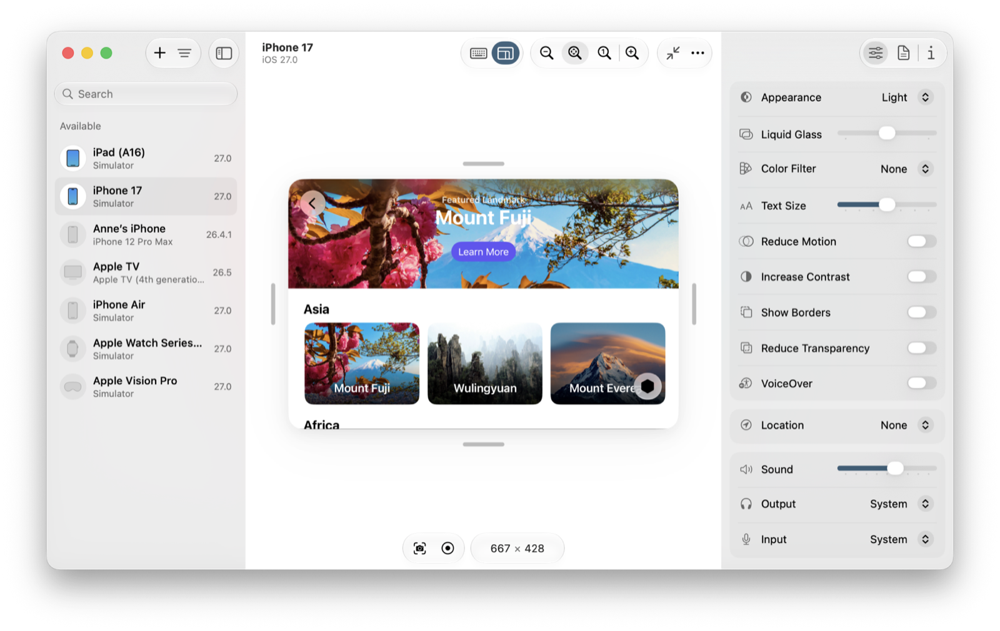

> Navigation: [Technologies](../technologies.md) · [Xcode](../xcode.md) · [Device Hub](device-hub.md)

# Configuring the environment of a simulated device

Article

Modify the settings of a simulated device.

## Overview

Test your app on a simulated device with different operating system settings, such as accessibility, appearance, location, audio, and orientation. To test how your app loads on a new device or after a restart, reset or restart a simulated device.

## Change environment settings

In Device Hub, select a simulated device in the sidebar, and if necessary, click Start in the canvas. In the Settings inspector, change the environment settings, such as Appearance, Liquid Glass, and Text Size. Then run your app on the simulator and observe whether your app adjusts accordingly.

To run your app in a simulator, see [Running your app on simulated or physical devices](running-your-app-on-simulated-or-physical-devices.md).

## Resize the canvas

In an expanded window, use the controls in the toolbar to resize the canvas. For example, scale the canvas to check alignment of controls, images, and colors used in your app.

- To change the canvas scale, click the Zoom Out or Zoom In buttons.
- To scale the device to the size of the canvas, click the Zoom to Fit button.
- To change the canvas size to the physical device’s screen size, click the Physical Size button.

For a compact window, click “Expand to view all controls” in the toolbar to expand the window and show the resize controls, or resize the compact window to change the canvas scale.

## Change the screen size of a simulated iPhone

To quickly verify that your interface adjusts for different device sizes, you can resize a simulated iPhone screen to an arbitrary size without running your app on multiple devices.

To enter resize mode, run your app on the simulator and click the “Enter resize mode” button in the canvas toolbar. Then drag a handle on the top, bottom, or sides of the simulator to resize the screen. Alternatively, enter dimensions for the screen below the simulator. Device Hub snaps the screen size to the nearest valid size. When you are done, click “Exit resize mode.”

A screenshot of the Device Hub showing an app running in an iPhone simulator with the resize mode enabled and the handles appearing around the sides of the device.

## Set the audio input and output

Set the audio input and audio output that simulated devices use.

- To adjust audio volume, choose Device \> Sound \> Increase Volume or Device \> Sound \> Decrease Volume.
- To set audio input, choose a device from the Device \> Sound \> Sound Input submenu. Choose System to use the same audio input as the Mac.
- To set audio output, choose a device from the Device \> Sound \> Sound Output submenu. Choose System to use the same audio output as the Mac.

Alternatively, use the Sound, Output, and Input controls in the Settings inspector to perform these actions.

Device Hub keeps track of the most recent selections for input and for output. Device Hub attempts to connect to the previously selected device when the currently selected device is disconnected.

> [!note] Note
> When you select Bluetooth headphones as the input source, playing or listening to audio in a simulator sets the headphones to phone call mode which lowers the quality of the audio. To hear sound at full quality, choose a different audio input source for a simulator.

## Restart or reset a simulated device

Restart a simulated device to simulate turning off and turning back on a device. Click the More button (…) in the toolbar above a simulator and choose Shut Down or Restart. Alternatively, Control-click a device in the sidebar and choose Shut Down or Restart from the contextual menu.

To reset a simulated device (erase all contents and settings), shut down the device and then choose Device \> Reset Content and Settings.

## See Also

### Device interactions

- [Interacting with your app in Device Hub](interacting-with-your-app-in-device-hub.md) — Use Device Hub to control interactions with your apps on simulated and physical devices.
- [Capturing screenshots and videos from devices](capturing-screenshots-and-videos-from-devices.md) — Record interactions and capture screenshots of your app for sharing, review, or App Store submission.
