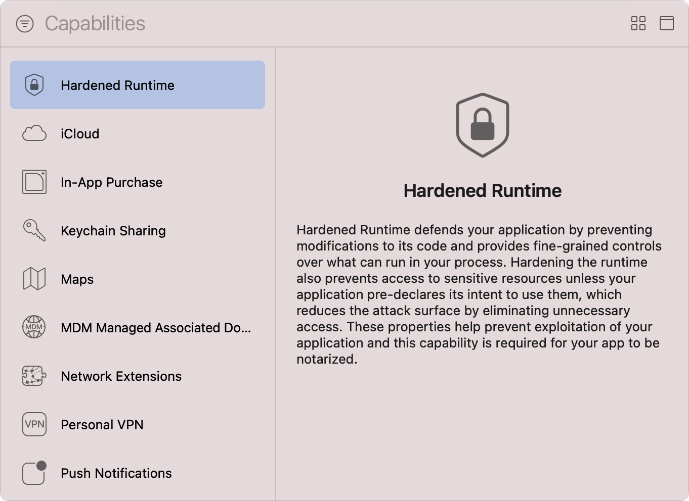
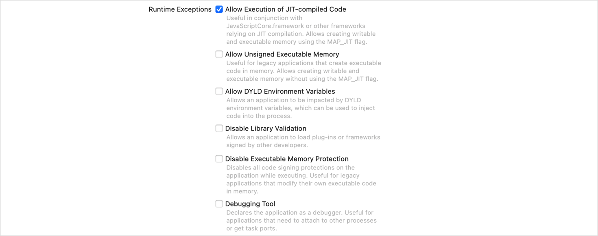

> Navigation: [Technologies](../technologies.md) · [Xcode](../xcode.md) · [Capabilities](capabilities.md)

# Configuring the hardened runtime

Article

Protect the runtime integrity of your macOS app by restricting access to sensitive resources and preventing common exploits.

## Overview

The _Hardened Runtime_ is a collection of system-enforced restrictions that disable a set of functional capabilities, such as loading third-party frameworks, and prohibit access to restricted resources, such as the device’s built-in camera, to prevent certain classes of exploits from compromising the runtime integrity of your macOS app. If your app relies on something the Hardened Runtime restricts, you remove that specific protection by adding an entitlement to your app’s entitlements file. Xcode’s Hardened Runtime capability provides an easy way to manage those entitlements.

Before you select the required runtime exceptions and access to restricted resources that your app requires, follow the steps in the [Add a capability](adding-capabilities-to-your-app.md#Add-a-capability) section of [Adding capabilities to your app](adding-capabilities-to-your-app.md) to add the Hardened Runtime capability to the target of your macOS app. If you create a new macOS app using a template, Xcode automatically adds the Hardened Runtime capability to your app.

> [!important] Important
> Apple only notarizes macOS apps that enable the Hardened Runtime capability. For more information, see [Notarizing macOS software before distribution](../security/notarizing-macos-software-before-distribution.md).

### Specify your app’s runtime exceptions

Before your app can perform functionality that depends upon one or more runtime exceptions, you must add the entitlements for those exceptions by performing the following:

1. Select your project in Xcode’s Project navigator.
2. Select the app’s target in the Targets list.
3. Click the Signing & Capabilities tab in the project editor.
4. Locate the Runtime Exceptions section of the Hardened Runtime capability.
5. Select one or more runtime exceptions by checking the corresponding checkboxes.

A screenshot of the runtime exceptions available in the Hardened Runtime capability. The Allow Execution of JIT-compiled Code exception is in an enabled state.

Xcode automatically updates your app’s entitlements file to include the entitlements that correspond to the selected runtime exceptions, and sets the value of those entitlements to `true`.

The following table describes the runtime exceptions the Hardened Runtime supports:

| Name | Functionality |
|---|---|
| Allow Execution of JIT-compiled Code | Create writable and executable memory using the `MAP_JIT` flag. For more information, see [Allow execution of JIT-compiled code entitlement](../bundleresources/entitlements/com.apple.security.cs.allow-jit.md). |
| Allow Unsigned Executable Memory | Create writable and executable memory without the imposed restrictions of the `MAP_JIT` flag. Useful for legacy apps. For more information, see [Allow Unsigned Executable Memory Entitlement](../bundleresources/entitlements/com.apple.security.cs.allow-unsigned-executable-memory.md). |
| Allow DYLD Environment Variables | Modify your app’s behavior at runtime using dynamic link variables. For more information, see [Allow DYLD environment variables entitlement](../bundleresources/entitlements/com.apple.security.cs.allow-dyld-environment-variables.md). |
| Disable Library Validation | Load frameworks and plug-ins that are written by third-party developers. For more information, see [Disable Library Validation Entitlement](../bundleresources/entitlements/com.apple.security.cs.disable-library-validation.md). |
| Disable Executable Memory Protection | Disable the protections that code-signing provides. For more information, see [Disable Executable Memory Protection Entitlement](../bundleresources/entitlements/com.apple.security.cs.disable-executable-page-protection.md). |
| Debugging Tool | Attach to other processes or get task ports by indicating to the system that your app’s a debugger. For more information, see [Debugging tool entitlement](../bundleresources/entitlements/com.apple.security.cs.debugger.md). |

> [!warning] Warning
> Specific runtime exceptions, such as Disable Executable Memory Protection, remove core security barriers from your app. Always apply caution when using runtime exceptions and opt for the narrowest set of entitlements that enable the required functionality.

### Specify the resource access your app requires

If your app accesses restricted or sensitive resources, such as the user’s photo library or address book, you must include the entitlements that provide access to those resources by following these steps:

1. Select your project in Xcode’s Project navigator.
2. Select the app’s target in the Targets list.
3. Click the Signing & Capabilities tab in the project editor.
4. Locate the Resource Access section of the Hardened Runtime capability.
5. Select access to one or more resources by checking the corresponding checkboxes.

A screenshot of the resource access options available in the Hardened Runtime capability. The Audio Input option is in an enabled state.

After you select the required resource access, Xcode updates the entitlements file of your app to include the corresponding entitlements and sets the value of those entitlements to `true`.

> [!important] Important
> Apps that contain the necessary entitlements must still seek the user’s explicit permission before they can access restricted resources such as the camera. See each resource’s corresponding framework documentation for specific requirements.

The following table describes the resource access entitlements the Hardened Runtime supports:

| Name | Functionality |
|---|---|
| Audio Input | Record audio using the built-in microphone and access audio input using the Core Audio APIs. For more information, see [Audio Input Entitlement](../bundleresources/entitlements/com.apple.security.device.audio-input.md). |
| Camera | Capture images and movies with the built-in and external cameras. For more information, see [Camera entitlement](../bundleresources/entitlements/com.apple.security.device.camera.md). |
| Location | Determine the user’s location using Location Services. For more information, see [Location entitlement](../bundleresources/entitlements/com.apple.security.personal-information.location.md). |
| Contacts | Enable read-write access to the user’s Contacts database. For more information, see [Address book entitlement](../bundleresources/entitlements/com.apple.security.personal-information.addressbook.md). |
| Calendar | Enable read-write access to the user’s calendar. For more information, see [Calendars entitlement](../bundleresources/entitlements/com.apple.security.personal-information.calendars.md). |
| Photos Library | Enable read-write access to the user’s photo library. For more information, see [Photos Library Entitlement](../bundleresources/entitlements/com.apple.security.personal-information.photos-library.md). |
| Apple Events | Post Apple Events to other apps and processes. For more information, see [Apple Events Entitlement](../bundleresources/entitlements/com.apple.security.automation.apple-events.md). |

## See Also

### Security

- [Configuring Family Controls](configuring-family-controls.md) — Add the Family Controls entitlement to enable parental control features in your app and its Screen Time API app extensions.
- [Configuring the macOS App Sandbox](configuring-the-macos-app-sandbox.md) — Protect system resources and user data from compromised apps by restricting access to the file system, network connections, and more.
- [Configuring keychain sharing](configuring-keychain-sharing.md) — Share keychain items between multiple apps belonging to the same developer.
- [Protecting local app data using containers on macOS](protecting-local-app-data-using-containers.md) — Secure your app’s local storage data from unauthorized access and modification.
- [Accessing app group containers in your existing macOS app](accessing-app-group-containers.md) — Ensure your app has app group container entitlements and macOS can authorize them.
