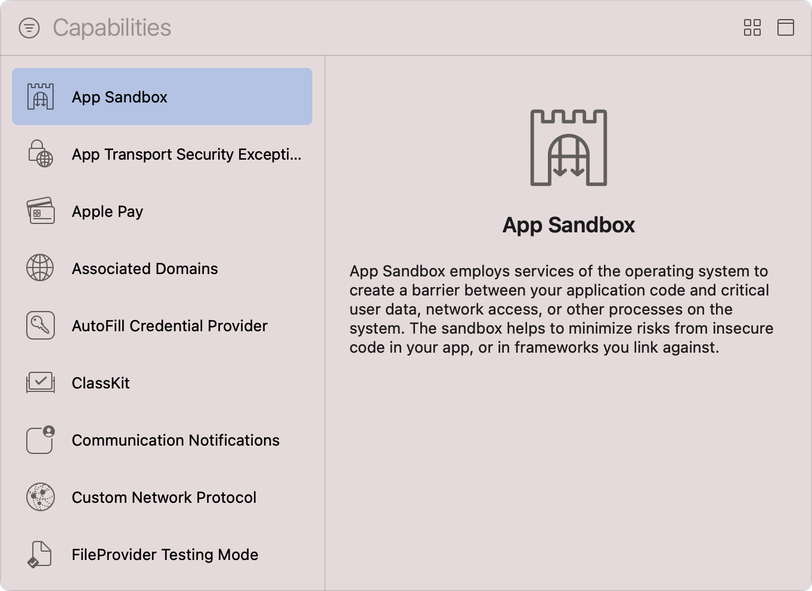

> Navigation: [Technologies](../technologies.md) · [Xcode](../xcode.md) · [Capabilities](capabilities.md)

# Configuring the macOS App Sandbox

Article

Protect system resources and user data from compromised apps by restricting access to the file system, network connections, and more.

## Overview

The _App Sandbox_ is an access control technology that macOS provides and enforces at the kernel level. The sandbox’s primary function is to contain damage to the system and the user’s data if the user executes a compromised app. While the sandbox doesn’t prevent attacks against your app, it does reduce the harm a successful attack can cause by restricting your app to the minimum set of privileges it requires to function properly.

A sandboxed app must explicitly state its intent to access a restricted resource or protected file location, otherwise the system prohibits any attempts it makes at runtime. Xcode’s App Sandbox capability allows you to state that intent by enabling the privileges that your app requires.

Before you can enable those privileges, follow the steps in the [Add a capability](adding-capabilities-to-your-app.md#Add-a-capability) section of [Adding capabilities to your app](adding-capabilities-to-your-app.md) to first add the App Sandbox capability to your macOS app’s target.

A screenshot of Xcode’s Capabilities library with a list of available capabilities on the left and an information pane on the right. The list shows a range of capabilities from App Sandbox to FileProvider Testing Mode, and the App Sandbox capability is in a selected state. The text on the information pane explains that the App Sandbox capability employs services of the operating system to create a barrier between the app’s code and critical user data, network access, or other processes on the system, and that the Sandbox helps to minimize risks from insecure code in your app and its linked frameworks.

After you add the App Sandbox capability, Xcode automatically updates the entitlements file of your macOS app to include the [App Sandbox Entitlement](../bundleresources/entitlements/com.apple.security.app-sandbox.md), which is an App Store requirement for any app that you submit to the Mac App Store for review.

To ensure the App Sandbox is in an enabled state, launch your macOS app using Xcode. Then, open `/Applications/Utilities/Activity Monitor.app` and choose View \> Columns \> Sandbox to display the Sandbox column. Find your app in the list of running processes and confirm the value in that column is Yes.

> [!note] Note
> When you use Mac Catalyst to enable your iPad app to run in macOS, Xcode automatically adds the App Sandbox and Hardened Runtime capabilities to the macOS target. For more information, see [Creating a Mac version of your iPad app](../uikit/creating-a-mac-version-of-your-ipad-app.md).

### Enable access to restricted resources

If your app requires access to restricted or sensitive system resources, such as network connections or connected Bluetooth devices, it must include the relevant entitlements that provide access to those resources. Follow these steps to add those entitlements:

1. Select your project in Xcode’s Project navigator.
2. Select the target of your macOS app in the Targets list.
3. Click the Signing & Capabilities tab in the project editor.
4. Locate the App Sandbox capability.
5. Enable access to one or more resources by checking the relevant checkboxes.

A screenshot of the various Network, Hardware, and App Data configuration options available in the App Sandbox capability. The Outgoing Connections (Client) and Camera options are in a selected state.

Xcode updates the entitlements file of your macOS app to include the necessary entitlements and sets the value of those entitlements to `true`.

> [!important] Important
> Entitlements inform the system of your app’s intent to access the related resources. In most cases, you must still seek the user’s explicit permission before the system grants that access. See the relevant framework documentation for specific requirements.

The following table describes the resource access entitlements the App Sandbox supports:

| Category | Name | Description |
|---|---|---|
| Network | Incoming Connections (Server) | Your app listens for incoming network connections. For more information, see the [com.apple.security.network.server](../bundleresources/entitlements/com.apple.security.network.server.md) entitlement. |
|  | Outgoing Connections (Client) | Your app connects to remote servers using outgoing network connections. For more information, see the [com.apple.security.network.client](../bundleresources/entitlements/com.apple.security.network.client.md) entitlement. |
| Hardware | Camera | Your app captures images and movies with the built-in and external cameras. For more information, see [Camera entitlement](../bundleresources/entitlements/com.apple.security.device.camera.md). |
|  | Audio Input | Your app captures audio with the built-in and external microphones. For more information, see the [com.apple.security.device.microphone](../bundleresources/entitlements/com.apple.security.device.microphone.md) entitlement. |
|  | USB | Your app communicates with connected USB devices. For more information, see the [com.apple.security.device.usb](../bundleresources/entitlements/com.apple.security.device.usb.md) entitlement. |
|  | Printing | Your app prints documents and media using the system’s configured printers. For more information, see the [com.apple.security.print](../bundleresources/entitlements/com.apple.security.print.md) entitlement. |
|  | Bluetooth | Your app communicates with connected Bluetooth devices. For more information, see the [com.apple.security.device.bluetooth](../bundleresources/entitlements/com.apple.security.device.bluetooth.md) entitlement. |
| App Data | Contacts | Your app requires read-write access to the user’s Contacts database. For more information, see [Address book entitlement](../bundleresources/entitlements/com.apple.security.personal-information.addressbook.md). |
|  | Location | Your app determines the user’s location using Location Services. For more information, see [Location entitlement](../bundleresources/entitlements/com.apple.security.personal-information.location.md). |
|  | Calendar | Your app requires read-write access to the user’s calendar. For more information, see [Calendars entitlement](../bundleresources/entitlements/com.apple.security.personal-information.calendars.md). |

### Enable managed file access

The first time the user launches your sandboxed app, the system creates its _container_ — a folder in `~/Library/Containers` that your app has exclusive read-write access to.

To minimize the risk to user data, the system restricts your app’s file system access to just its container, but that container does include a number of symbolic links that resolve to common user folders, such as `~/Downloads` and `~/Pictures`. However, the system considers those sensitive folders and requires that your app include certain entitlements before it grants access to the resolved locations of the symbolic links. An unauthorized attempt to access one of those folders results in an “Operation not permitted” error.

Follow these steps to add the required entitlements:

1. Select your project in Xcode’s Project navigator.
2. Select the target of your macOS app in the Targets list.
3. Click the Signing & Capabilities tab in the project editor.
4. Locate the App Sandbox capability.
5. Use each option’s drop-down menu to choose None, Read Only, or Read/Write, depending on your app’s requirements.

A screenshot of the File Access options available in the App Sandbox capability. The permissions and access for the user’s Pictures folder is set to read-only. The Downloads folder, Music folder, Movies folder, and user selected file options are each set to none.

> [!note] Note
> The User Selected File option enables access to arbitrary locations that the user chooses with AppKit’s [NSOpenPanel](../appkit/nsopenpanel.md) and [NSSavePanel](../appkit/nssavepanel.md).

After you configure the necessary file access, Xcode updates your app’s entitlements file to include the corresponding entitlements and sets the value of those entitlements to `true`.

## See Also

### Security

- [Configuring Family Controls](configuring-family-controls.md) — Add the Family Controls entitlement to enable parental control features in your app and its Screen Time API app extensions.
- [Configuring the hardened runtime](configuring-the-hardened-runtime.md) — Protect the runtime integrity of your macOS app by restricting access to sensitive resources and preventing common exploits.
- [Configuring keychain sharing](configuring-keychain-sharing.md) — Share keychain items between multiple apps belonging to the same developer.
- [Protecting local app data using containers on macOS](protecting-local-app-data-using-containers.md) — Secure your app’s local storage data from unauthorized access and modification.
- [Accessing app group containers in your existing macOS app](accessing-app-group-containers.md) — Ensure your app has app group container entitlements and macOS can authorize them.
