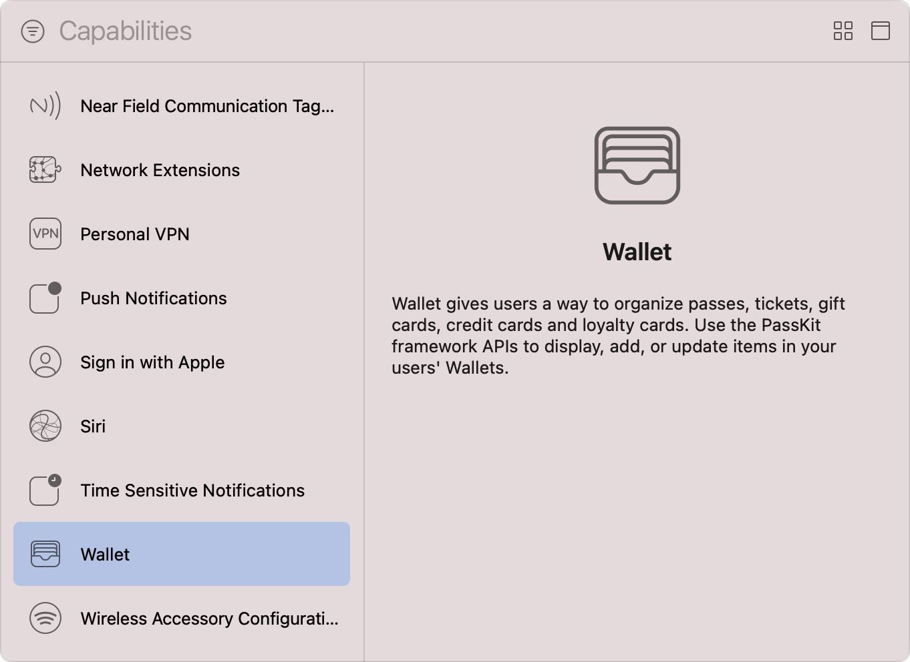

> Navigation: [Technologies](../technologies.md) · [Xcode](../xcode.md) · [Capabilities](capabilities.md)

# Configuring Wallet support

Article

Access the user’s Wallet to add, update, and display your app’s passes.

## Overview

The Wallet app on iOS and watchOS allows users to organize their _passes_ — tickets, gift cards, loyalty cards, boarding passes, and the payment cards they use with Apple Pay. By integrating with [PassKit (Apple Pay and Wallet)](../passkit.md), your app can access any related passes and allow the user to manage them.

To use Wallet in your app, add the capability by configuring your app’s target in Xcode and, optionally, specify which pass types your app supports. Follow the instructions in the [Add a capability](adding-capabilities-to-your-app.md#Add-a-capability) section of [Adding capabilities to your app](adding-capabilities-to-your-app.md). When you reach the Capabilities library, choose Wallet. For watchOS apps with separate WatchKit extensions, add the capability to the WatchKit Extension’s target. The capability isn’t available for macOS or tvOS.

A screenshot of Xcode’s Capabilities library. At the top is a filter button next to a search field that contains the placeholder text Capabilities. Below that, in the left pane, there’s a list of capabilities, such as Network Extensions, Siri, and Wallet. The Wallet capability is in a selected state. On the right, there’s an information pane that contains the text Wallet gives users a way to organize passes, tickets, gift cards, credit cards and loyalty cards. Use the PassKit framework APIs to display, add, or update items in your users’ Wallets.

After you add the Wallet capability, Xcode updates your target’s entitlements file to include the [Pass Type IDs Entitlement](../bundleresources/entitlements/com.apple.developer.pass-type-identifiers.md) — an array containing the single wildcard value `$(TeamIdentifierPrefix)*`. This value allows your app to access passes of every pass type that you define in your developer account; use the configuration options of the capability to narrow the scope of accessible pass types to only those your app requires.

> [!important] Important
> The capability fetches and displays the pass type identifiers you register in your developer account; Xcode doesn’t provide a way to register them locally. For more information, see [Create Wallet identifiers and certificates](https://developer.apple.com/help/account/configure-app-capabilities/create-wallet-identifiers-and-certificates).

### Restrict your app to a subset of pass types

To minimize potential security risks and help protect the user’s privacy, follow these steps to provide your app with access to only the pass type identifiers it requires to function properly:

1. Select your project in Xcode’s Project navigator.
2. Select the app’s target from the Targets list.
3. Click the Signing & Capabilities tab in the project editor.
4. Find the Wallet capability.
5. Select the “Enable subset of pass types” option.
6. Xcode enables all pass type identifiers by default; disable individual identifiers by unchecking their checkboxes.

A screenshot of the Wallet capability after you add it to an app’s target. The Allow subset of pass types option is in an enabled state, as are two of the three listed pass type identifiers.

Xcode updates the `com.apple.developer.pass-type-identifiers` array in the app’s entitlements file to include only the enabled pass type identifiers, and if present, removes the wildcard value.

After enabling the required pass type identifiers, use the [passes()](<../passkit/pkpasslibrary/passes().md>) method of [PKPassLibrary](../passkit/pkpasslibrary.md) to retrieve the passes accessible to your app, or [pass(withPassTypeIdentifier:serialNumber:)](<../passkit/pkpasslibrary/pass(withpasstypeidentifier_serialnumber_).md>) to fetch a specific pass. For more information on creating, distributing, and updating passes, see [Wallet Passes](../walletpasses.md).

## See Also

### Commerce

- [Configuring Apple Pay support](configuring-apple-pay-support.md) — Process payments in your app using the payment information the user stores on their device.
- [Configuring Sign in with Apple support](configuring-sign-in-with-apple.md) — Allow users to create an account and sign in to your app with their Apple Account.
