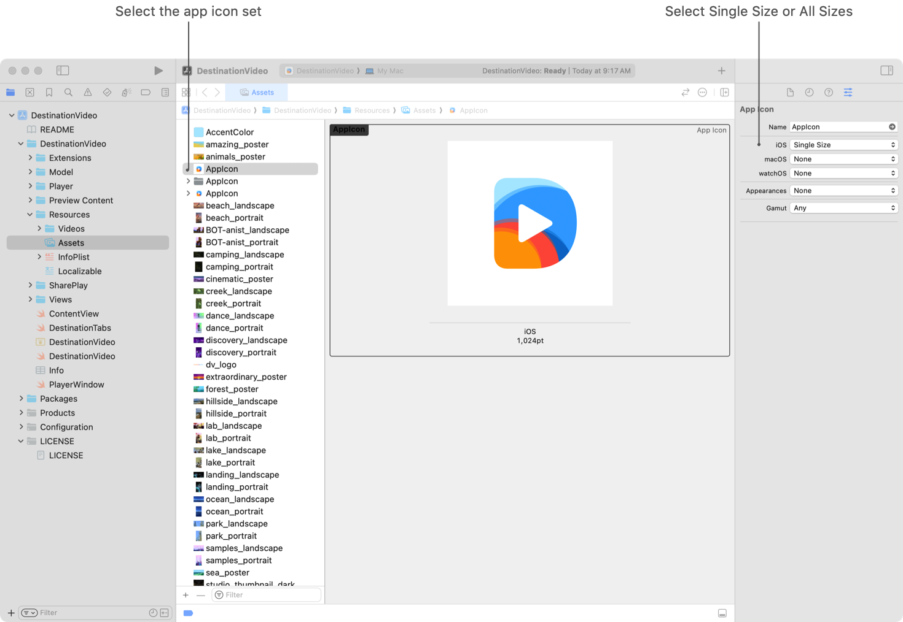
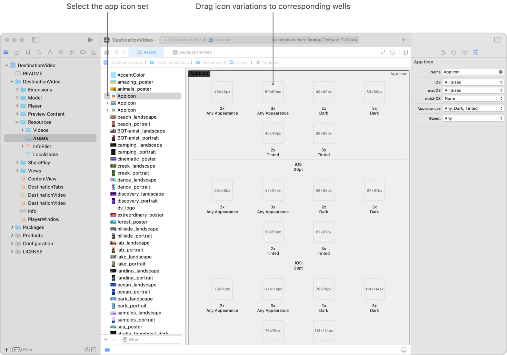
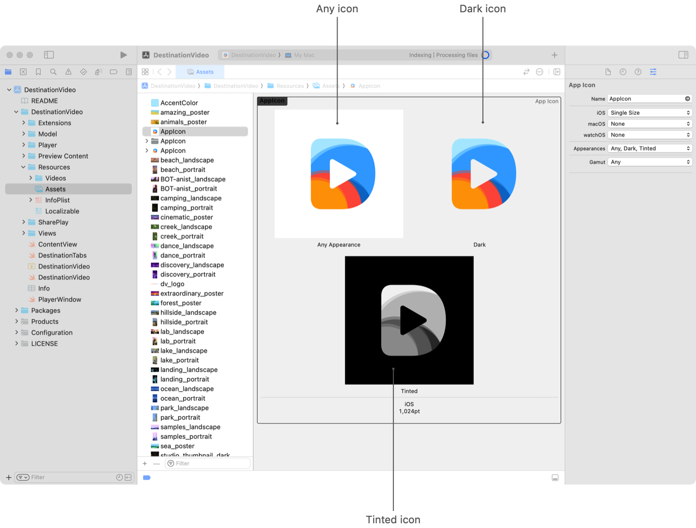
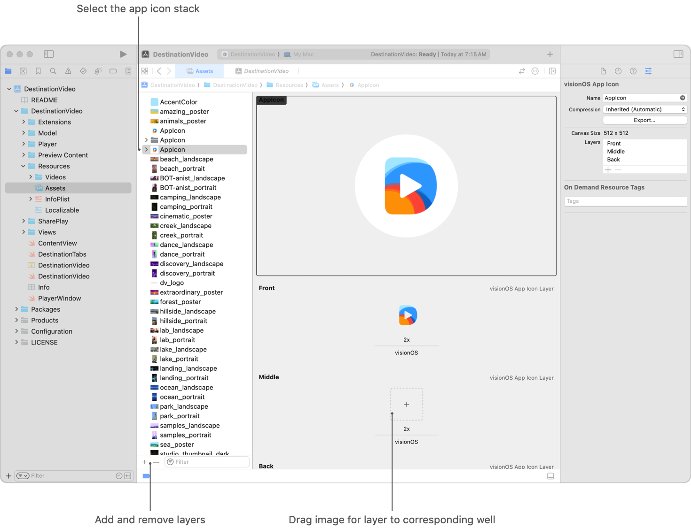
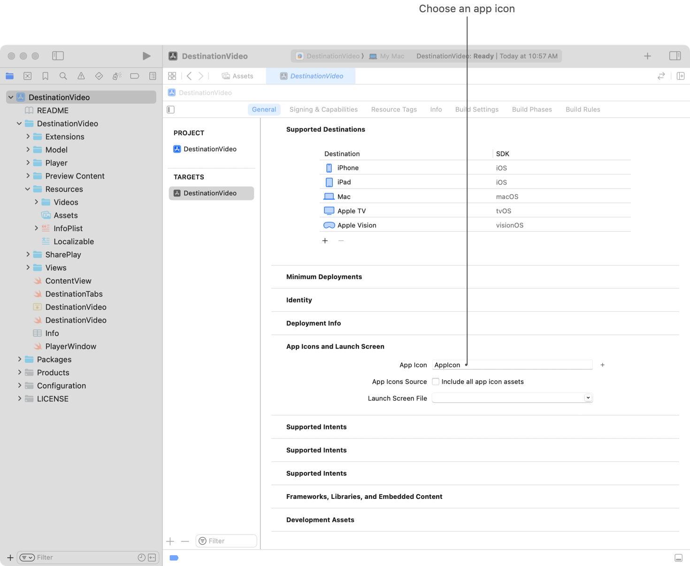

> Navigation: [Technologies](../technologies.md) · [Xcode](../xcode.md) · [Asset management](asset-management.md)

# Configuring your app icon using an asset catalog

Article

Add app icon variations to an asset catalog that represents your app in places such as the App Store, the Home Screen, Settings, and search results.

## Overview

> [!important] Important
> To create your app icon using Icon Composer for all variants, including different platforms and appearances, see [Creating your app icon using Icon Composer](creating-your-app-icon-using-icon-composer.md).

Every app has a distinct app icon that communicates the app’s purpose and makes it easy to recognize throughout the system. Apps require multiple variations of the app icon to look great in different contexts. Xcode can help generate these variations for you using a single high-resolution image, or you can configure your app icon variations by using an app icon’s image set in your project’s asset catalog. visionOS and tvOS app icons are made up of multiple stacked image layers you configure in your project’s asset catalog. iOS and iPadOS app icons support additional dark and tinted styles.

For design guidance on app icons, see [Human Interface Guidelines \> App icons](../design/human-interface-guidelines/app-icons.md).

### Create an app icon

When you create your project from a template, it automatically includes a default asset catalog (`Assets.xcassets`) that contains the `AppIcon`. If you don’t have a default asset catalog or existing `AppIcon` or you want to provide an alternate, you can add an app icon to an asset catalog manually:

1. In the Project navigator, select an asset catalog.
2. Click the Add button (+) at the bottom of the outline view.
3. In the pop-up menu, choose _OS variant_ \> _OS variant_ App Icon. Xcode creates a new app icon set or image stack with the name `AppIcon`.

### Specify app icon variations

Variations of your app icon appear throughout the system in places like the Home View, Settings, and search results:

- iOS, iPadOS, tvOS, and watchOS apps can auto-generate all icon variations from a single 1024×1024 pixel image. This is the default behavior when you create a new iOS, iPadOS, tvOS, and watchOS app, or a new icon in the asset catalog. If you have an existing project that provides multiple variants, consider providing a single size when that is all your icon requires. However, if you want to customize your app’s icon variants, such as to show more detail at a larger size, you can provide individual assets for the variations.
- For macOS and tvOS, you need to supply an asset for each size.
- For visionOS, you need to supply a single 1024x1024 pixel asset.

For each platform your app supports, choose between using a single size and providing all sizes in the Asset Catalog:

Screenshot of an asset catalog in Xcode. In the outline view, an app icon set with the name AppIcon is selected. The inspector area shows multiple image wells with labels that describe the required image dimensions, resolutions, and usages.

1. In the Project navigator, select an asset catalog.
2. In the Asset Catalog, select the icon.
3. To view and edit attributes, select Inspectors \> Attributes from Xcode’s View menu.
4. Select Single Size or All Sizes from the pop-up menu for the platform you want to change.

For each platform your app supports, add a single image that Xcode can use to generate your icon variations, or add an image for each icon variation of an icon set in the Asset Catalog:

Screenshot of an asset catalog in Xcode. In the outline view, an app icon set with the name AppIcon is selected. The detail area shows multiple image wells with labels that describe the required image dimensions, resolutions, and usages.

1. In the Project navigator, select an asset catalog.
2. In the Asset Catalog, select the icon.
3. From the Finder, drag image variations of the app icon to the image wells in the detail area of the Asset Catalog in Xcode that match their resolutions and use cases. visionOS and tvOS app icons combine a stack of multiple image layers to create a sense of depth. For tvOS apps, the asset catalog contains an App Icon & Top Shelf Image folder with the different app icon and launch image sets.

### Add dark and tinted icon variants to iOS and iPadOS

iOS and iPadOS support three stylistic variations for app icons: Light, Dark, and Tinted. You can create your own variations to ensure that each one looks exactly the way you way you want.

Screenshot of an asset catalog in Xcode. In the outline view, an app icon set with the name AppIcon is selected. The inspector area shows multiple image wells with labels that describe the Any, Dark, and Tinted icon appearances.

To add these icon variations to your app:

1. In the Project navigator, select an asset catalog.
2. In the Asset Catalog, select the icon.
3. Select View \> Inspectors \> Attributes from the Xcode menu.
4. Select Single Size from the iOS pop-up menu.
5. Then select Any, Dark, or Tinted from the Appearance pop-up menu.

After you select the Appearance from the pop-up menu, two image wells appear. Drag your dark and tinted app icons into the appropriate image well. Provide your tinted app icon as a grayscale image. Provide your dark app icon with a transparent background so the system-provided background can show through.

If you prefer, you can take advantage of the system’s automatically generated treatment that is applied to all app icons. It is crafted intelligently to preserve design intent and maintain legibility. This also helps maintain a consistent visual experience across the Home Screen.

For design guidance specific to iOS and iPadOS, see [Human Interface Guidelines \> App Icons](https://developer.apple.com/design/human-interface-guidelines/app-icons).

### Configure the layers of an image stack

By default, visionOS and tvOS app icons are constructed with three layers. This is the maximum number of layers visionOS icons support but you can use up to five layers when constructing tvOS icons. To add a layer, Click the Add button, choose _OS variant_ \> _OS variant_ App Icon Layer. To remove a layer, select the layer and click the Remove button (-).

Screenshot of an asset catalog in Xcode. In the outline view, an app icon stack with the name AppIcon is selected. The detail area shows image wells for each layer of the stack with labels.

Add images to each layer by dragging them from the Finder into the image wells in the detail area of the Asset Catalog in Xcode. For information on the use of layers, see App icons [visionOS](../design/human-interface-guidelines/app-icons.md#visionOS) and [tvOS](../design/human-interface-guidelines/app-icons.md#tvOS).

> [!note] Note
> You can use Parallax Previewer app or Parallax Exporter plug-in to create and preview Layer Source Representation (.lsr and .xlsr) files that you can import into your Asset Catalog in Xcode. Save your file in the LSR file format to import a tvOS icon into Xcode, and save in the XLSR file format to import a visionOS icon. Download these from the [Apple Design Resources](https://developer.apple.com/design/resources) site.

### Specify an App Store icon

If you distribute your app through the App Store, you must provide app icon imagery to use in the App Store. In the Project navigator, select an asset catalog and add icon images to the appropriate image wells in an app icon set or image stack. The App Store image well location varies by platform.

| Platform | App Store icon location |
|---|---|
| iOS | Drag an icon image to the iOS 1,024pt image well. |
| iMessage | For the iOS target, drag an icon image to the iOS 1,024pt image well in the `AppIcon` set. For the iMessage Extension target, drag an icon to the Messages App Store image well in the `iMessage App Icon` set. |
| Sticker Pack | Drag an icon image to the iOS 1,024pt image well and the Messages App Store image well. |
| macOS | Drag an icon image to the App Store - 2x image well. |
| tvOS | Drag images to the image wells for the layers of your App Icon - App Store stack in the App Icon & Top Shelf Image folder. The App Store generates an icon from the layers of the image stack. |
| visionOS | Drag images to the image wells for the layers of your visionOS App Icon stack. The App Store generates an icon from the layers of the image stack. |
| watchOS | For the iOS target, drag an icon image to the iOS 1,024pt image well. For the WatchKit App target, drag an icon image to the watchOS image well. |

### Change the default app icon set

If you don’t create your project from a template, or you want to change your default app icon set, specify which one to use in your target’s build settings.

1. In the Project navigator, select the project and in the project editor, select the target.
2. In the App Icons and Launch Screen section of the General pane, choose the app icon set from the App Icons Source pop-up menu.

Screenshot of target settings with the General tab selected. The App Icons and Launch Screen section shows a field with the name App Icons Source that lists the name of the app icon set to use from the asset catalog.

If you don’t select the Include all app icon assets option, Xcode only includes the app icon set you specify in the App Icons Source pop-up menu when it builds your app. You might leave this option unselected if you want to use a different icon for the Debug and Release builds of your app without including the Debug icon in your Release app bundle. You can specialize the app icon for the Debug and Release configurations by modifying the Primary App Icon Set Name build setting in the Build Settings tab.

Xcode also includes any additional app icon sets you specify under the Alternate App Icon Sets build setting. Include any icon sets your app can select using [setAlternateIconName(_:completionHandler:)](<../uikit/uiapplication/setalternateiconname(__completionhandler_).md>) or use in App Store product pages.

For information on configuring tests that use icons in App Store Connect, see [Product Page Optimization](https://developer.apple.com/app-store/product-page-optimization).

## See Also

### App icons and launch screen

- [Creating your app icon using Icon Composer](creating-your-app-icon-using-icon-composer.md) — Use Icon Composer to stylize your app icon for different platforms and appearances.
- [Configuring your app to use alternate app icons](configuring-your-app-to-use-alternate-app-icons.md) — Add alternate app icons to your app, and let people choose which icon to display.
- [Specifying your app’s launch screen](specifying-your-apps-launch-screen.md) — Make your iOS app launch experience faster and more responsive by customizing a launch screen.
