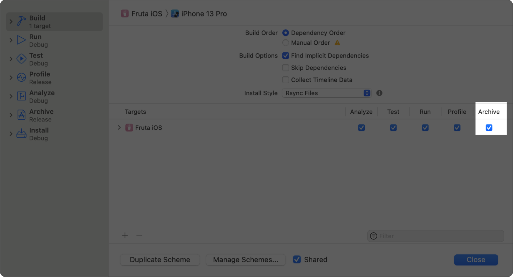
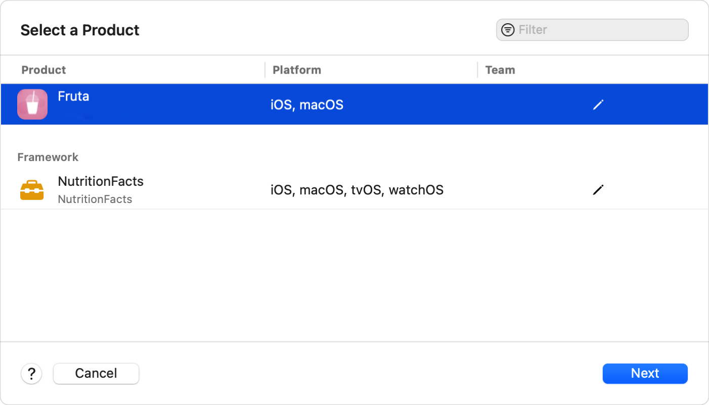
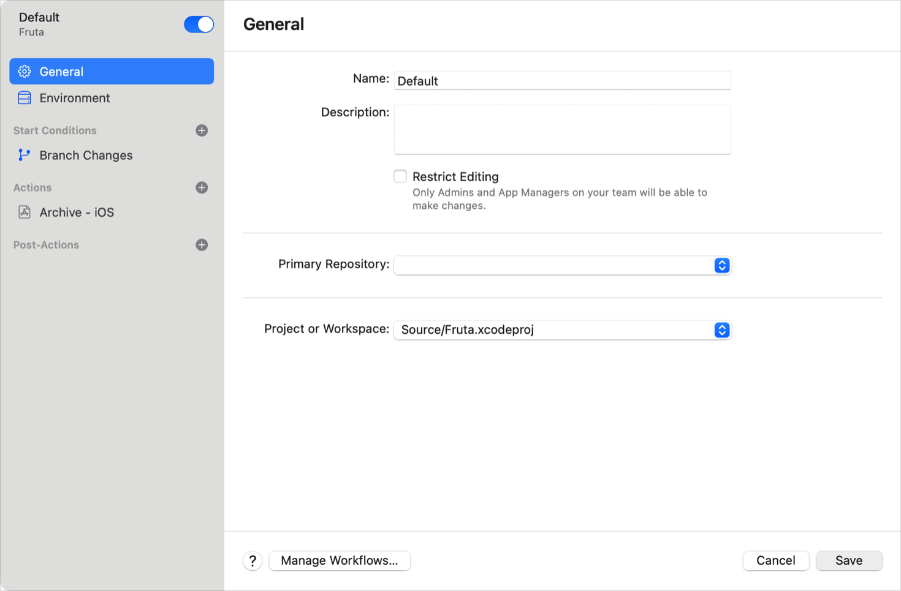
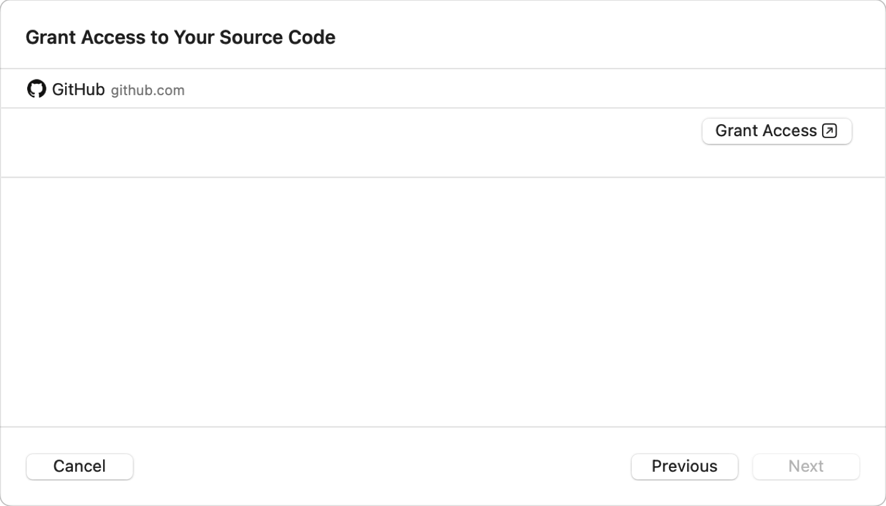
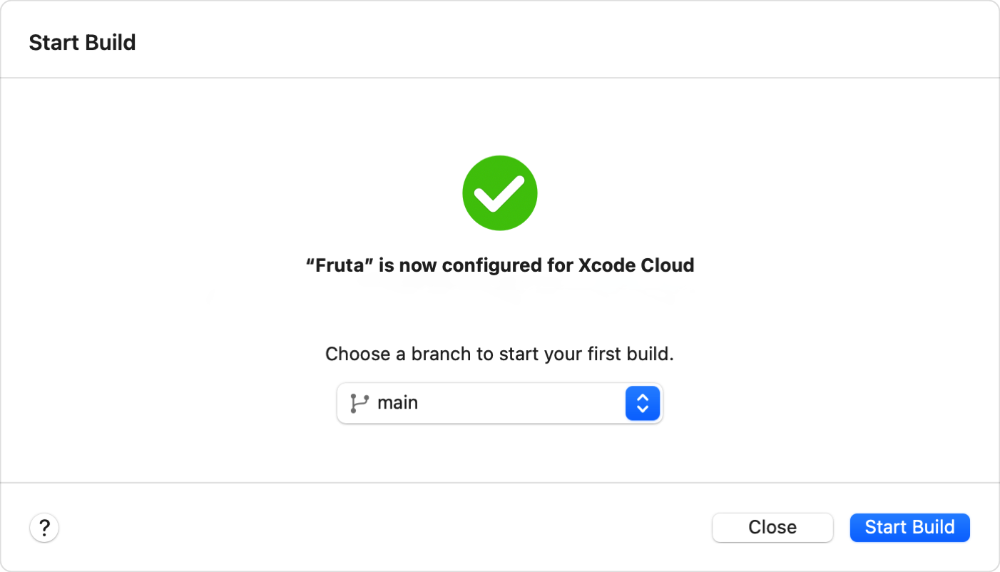
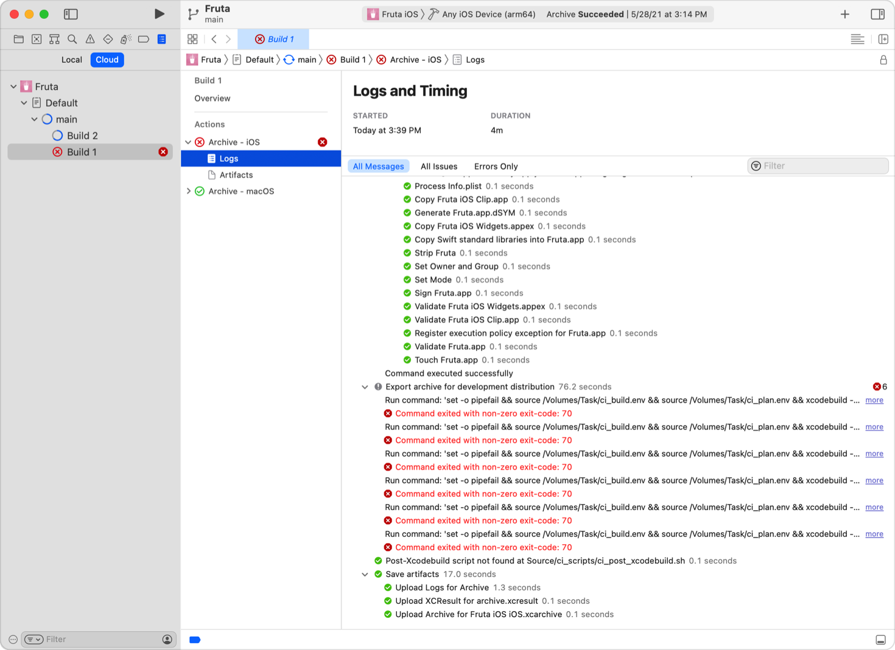

> Navigation: [Technologies](../technologies.md) · [Xcode](../xcode.md) · [Xcode Cloud](xcode-cloud.md)

# Configuring your first Xcode Cloud workflow

<sub>Article</sub>

Set up your project or workspace to use Xcode Cloud and adopt continuous integration and delivery.

## Overview

Xcode helps you configure your project or workspace to use Xcode Cloud. It analyzes your project, suggests a configuration to quickly build your app or framework with Xcode Cloud, and makes it easy to refine your continuous integration practice after you complete your first build.

For additional information about Xcode Cloud, see [Meet Xcode Cloud](https://developer.apple.com/wwdc21/10267), [Explore Xcode Cloud workflows](https://developer.apple.com/wwdc21/10268), [Customize your advanced Xcode Cloud workflows](https://developer.apple.com/wwdc21/10269), and [Get the most out of Xcode Cloud](https://developer.apple.com/videos/play/wwdc2022-110374).

> [!important] Important
> To avoid issues and save time when configuring your first workflow, review the requirements for using Xcode Cloud in [Setting up your project to use Xcode Cloud](setting-up-your-project-to-use-xcode-cloud.md) before you configure your project or workspace to use Xcode Cloud. Additionally, if your project requires dependencies, make sure they’re accessible to Xcode Cloud. To learn more, see [Making dependencies available to Xcode Cloud](making-dependencies-available-to-xcode-cloud.md).

### Review Xcode Cloud workflows

When you start configuring a project or workspace to use Xcode Cloud, Xcode analyzes your project to detect its settings and then creates a list of its apps and frameworks — referred to as _products_. After you select a product, Xcode suggests a first workflow for it. The workflow is the configuration for the steps you want Xcode Cloud to perform.

A workflow includes the following settings:

- General information, such as a name and a description of the workflow.
- Xcode and macOS versions of the temporary build environment. Note that Xcode Cloud may periodically update available macOS and Xcode versions and ask you to update your workflows so they continue to build successfully.
- Start conditions that define when Xcode Cloud runs a workflow.
- Actions that Xcode Cloud performs. You can configure several actions for a workflow. Available actions are: build, analyze, test, and archive.
- Postactions that Xcode Cloud performs. For example, you can configure custom notifications or distribute a new version of your app to testers in [TestFlight](https://developer.apple.com/testflight/).
- Custom build scripts that perform particular tasks, such as installing a third-party tool. For more information, see [Writing custom build scripts](writing-custom-build-scripts.md).

After reviewing the suggested workflow, you connect Xcode Cloud to your Git repository and run the workflow, referred to as a _build_.

> [!note] Note
> Xcode Cloud clones your repository in a private, isolated, and temporary build environment. It doesn’t store your source code, and securely handles any stored data, such as your derived data, and keeps it private. The temporary build environment that Xcode Cloud uses includes tools that are part of macOS and Xcode, like Python, as well as [Homebrew](https://brew.sh) to support installing third-party dependencies and tools. For more information, see [Making dependencies available to Xcode Cloud](making-dependencies-available-to-xcode-cloud.md).

When it completes a build, Xcode Cloud:

- Sends an email that contains information about the build, including links to the build report in Xcode and in [App Store Connect](https://appstoreconnect.apple.com).
- Stores the build’s _artifacts_ and makes them available for downloading in Xcode or in App Store Connect.

The artifacts that Xcode Cloud creates include:

- Detailed build logs
- The exported app archive, app binary, or framework
- A test result bundle, including screenshots you create in your automated user interface tests

> [!important] Important
> You can access build information and artifacts for 30 days from the moment Xcode Cloud completes a build. Always download and archive build artifacts for workflows that publish your app on the App Store. For more information, see [Download and archive build artifacts](configuring-your-first-xcode-cloud-workflow.md#Download-and-archive-build-artifacts) below.

Use Xcode to initially configure your project or workspace to use Xcode Cloud. After you complete your first build, use either Xcode or App Store Connect to configure additional workflows, access build information, and more. For more information, see [Create additional workflows in Xcode](configuring-your-first-xcode-cloud-workflow.md#Create-additional-workflows-in-Xcode).

> [!note] Note
> If you use `.xcconfig` files to set the bundle identifier or use them to automatically change the bundle identifier, you need to take extra steps to start using Xcode Cloud. First, set the bundle identifier for your app target in the Signing & Capabilities pane of your project or workspace. Then configure your first workflow as described below. Repeat this process for each bundle identifier. Note that you need to use App Store Connect to view your workflows and builds because Xcode relies on the explicitly set bundle identifier to show them.

### Select the archive action

For each app or framework that you want to build with Xcode Cloud, make sure its corresponding scheme uses the archive action. Choose Product \> Scheme \> Edit Scheme. In the sidebar, click Build and in the detail area, select the Archive checkbox for the target.



To find out which of your project’s schemes use the archive action, run the following command in Terminal:

```bash
xcodebuild -project Example.xcodeproj -describeAllArchivableProducts -json
```

Xcode uses the same command to find available products that you can build with Xcode Cloud.

### Select a product

To configure your project or workspace to use Xcode Cloud, open your project or workspace in Xcode. In the Report navigator, click the Cloud button, and then click Get Started.

> [!important] Important
> If you develop a WatchKit app and a watchOS app extension, you can configure Xcode Cloud workflows for them, but they may fail if you don’t register their bundle IDs in your developer account. To successfully build them with Xcode Cloud, sign in to your [developer account](http://developer.apple.com/account/), navigate to the Certificates, Identifiers & Profiles section, and add the bundle IDs for your WatchKit app and watchOS app extension manually before you configure Xcode Cloud workflows for them.

Xcode analyzes your project or workspace, and then creates a list in the Select a Product sheet for the products it finds. Select the product that matches your app or framework and click Next.



If your project contains targets that use the same bundle identifier, Xcode Cloud treats them as one product. Note that a product can only have one bundle ID, and a bundle ID always matches exactly one Xcode Cloud product. If your workspace or project contains several app targets:

- When possible, share the same bundle ID across versions of your app for each platform. For example, use the same bundle ID for the iOS, macOS, and watchOS versions of your app.
- If each version of your app uses a different bundle ID — for example, if the iOS version uses `com.example.myiosapp` and the macOS app uses `com.example.mymacapp` — Xcode detects more than one product. Select one of them when you create your first workflow, and later configure additional workflows for the other product.

You may be a member of more than one Apple Developer Program team. In this case, Xcode asks you to select a team. Select the team you intend to use for distribution to testers with TestFlight, and for publishing the app in the App Store.

### Review the suggested workflow

Based on the product you select, Xcode suggests a first workflow that:

- Starts a build for each change to your Git repository’s default branch, and for each pull request that targets your default branch
- Uses the latest released macOS and Xcode versions for its temporary build environment
- Uses the archive action
- Sends an email with information about the build, including links to the build report in Xcode and in App Store Connect

Before starting your first build, review the suggested workflow; for example, verify whether Xcode chooses the correct scheme.

To review the suggested workflow:

1. Click Edit Workflow in the Review Workflow sheet.
2. Make changes only if necessary in the sheet that displays the workflow information and save them.
3. In the Review Workflow sheet, click Next and follow the steps to grant Xcode Cloud access to your source code repository.



> [!tip] Tip
> Keep your first workflow simple and use the suggested settings, if possible. That way, you become familiar with Xcode Cloud without worrying about misconfiguring your first workflow. When Xcode Cloud successfully finishes your first build, edit the workflow to meet your requirements or create additional workflows to refine your CI/CD practice in either Xcode or App Store Connect.

### Grant Xcode Cloud access to your source code

Xcode Cloud requires access to the Git repository containing your code. It uses this access to build and test your code automatically when you make changes. When you configure your project or workspace to use Xcode Cloud, Xcode analyzes it to detect the source code management (SCM) provider you use. In the Grant Access to Your Source Code sheet, click Grant Access and let Xcode guide you through your SCM provider’s authorization process.

> [!important] Important
> Make sure you have the required permission or role to grant Xcode Cloud access to your Git repository. Additionally, if you use a self-hosted SCM provider — such as Bitbucket Server or GitHub Enterprise — make sure Xcode Cloud can access your Git repository. For information on required permissions, roles, and IP address ranges that Xcode Cloud uses, see [Use a remote source control repository](setting-up-your-project-to-use-xcode-cloud.md#Use-a-remote-source-control-repository).



After allowing Xcode Cloud to access your Git repository, Xcode indicates that it can access your source code. Click Next, and in the next sheet, click Complete.

> [!note] Note
> Building your project may require access to more than one instance of your self-hosted SCM provider — a common case for large teams. For example, you may use two different GitHub Enterprise instances where one hosts your app’s code and the other hosts your dependencies. If this scenario applies to you, finish the initial onboarding workflow for the project in Xcode and connect the instance that hosts your app’s code, then let the first build fail. After the build failure, Xcode suggests a fix to connect the other instance.

For additional guidance on granting Xcode Cloud access to your source code, see [Source code management setup](source-code-management-setup.md).

### Create an app record

Xcode Cloud combines Xcode, [TestFlight](https://developer.apple.com/testflight/), and App Store Connect into a powerful CI/CD system. As a result, you need an app record in App Store Connect for your app.

If you already have an app record in App Store Connect, Xcode Cloud uses it automatically. If you don’t have an app record, Xcode helps you create one after you grant Xcode Cloud access to your Git repository.

> [!note] Note
> You don’t need an app record to build a framework with Xcode Cloud.

To create an app record, you need to have the App Manager, Admin, or Account Holder role for your team. If you have the Developer role, you need the Create Apps permission. If you don’t have the required role or permission, see [Create an app record in App Store Connect](configuring-xcode-cloud-for-your-team.md#Create-an-app-record-in-App-Store-Connect).

### Start your first build

After granting Xcode Cloud access to your Git repository and, if applicable, creating an app record, you’re ready to start your first build. Choose a branch from the pop-up menu and click Start Build. Xcode Cloud checks out the branch and starts building your code.



To view information about the in-progress build in the Editor pane, select the build in the Report navigator. To see detailed build logs, expand an action in the report outline and click Logs. If the report outline isn’t visible, enable it using the Adjust Editor Options button in the top-right corner of the Editor pane.

When Xcode Cloud finishes building your project, it sends an email that contains information about the build, including the build’s status, the commit it used for the build, and links to the build report in Xcode or in App Store Connect.

> [!note] Note
> If you start using Xcode Cloud for an existing Mac app, you may need to configure Xcode Cloud to increment the build number starting with value other than `1`. For more information, see [Setting the next build number for Xcode Cloud builds](setting-the-next-build-number-for-xcode-cloud-builds.md).

### Understand why a build fails

There’s a chance that your first build might fail. This is especially likely for complex code bases and projects with many dependencies. To understand why a build failed, select a build in the Report navigator, expand a failed action in the report outline, and click Logs to see the build logs.



You can also click Artifacts and download the build report. For additional guidance, see [Resolving common configuration and build issues](resolving-common-configuration-and-build-issues.md).

In addition to viewing build logs in Xcode, you can explore build logs in App Store Connect by following these steps:

1. Sign in to App Store Connect and go to your app’s page.
2. Click the Xcode Cloud tab.
3. Click Builds in the sidebar.
4. Expand a workflow and select a build.
5. Expand an action in the sidebar and click Logs.

### Refine your continuous integration practice

After configuring your first workflow and successfully completing your first build, spend time planning next steps to refine your CI/CD process, and consider the following:

- Ask coworkers to start using Xcode Cloud as [Connect your personal SCM account to Xcode Cloud](configuring-xcode-cloud-for-your-team.md#Connect-your-personal-SCM-account-to-Xcode-Cloud) describes.
- Change your first workflow’s name and description.
- Add a test action to your first workflow that runs your unit tests.
- Change your first workflow’s start conditions to only start a build if you update a custom branch or add start conditions.
- Add a postaction to distribute a new version of your app to testers with [TestFlight](https://developer.apple.com/testflight/).
- Create additional workflows to perform advanced verifications that take more time to complete; for example, configure a workflow that runs your automated UI tests once per week.
- Create workflows for other products that Xcode detected when you created your first workflow.
- Share build configurations across workflows. For more information, see [Sharing macOS and Xcode versions across Xcode Cloud workflows](sharing-custom-aliases-across-xcode-cloud-workflows.md) and [Sharing environment variables across Xcode Cloud workflows](sharing-environment-variables-across-xcode-cloud-workflows.md).
- Receive build information in [Slack](https://slackhq.com), a popular collaboration tool. For more information, see [Connecting Xcode Cloud to Slack](connecting-xcode-cloud-to-slack.md).
- Require an Xcode Cloud build to succeed before it’s possible to merge a pull request. For more information, see [Configuring requirements for merging a pull request](configuring-requirements-for-merging-a-pull-request.md).

### Create additional workflows in Xcode

To configure and create additional workflows, or to make changes to an existing one in Xcode:

1. Click the Cloud button in the Report navigator.
2. Control-click your app’s name, or a workflow, and choose Manage Workflows.
3. In the Manage Workflows sheet, double-click a workflow to make changes to it, or add a new workflow using the Add button (+).

For more information on creating custom workflows, see [Developing a workflow strategy for Xcode Cloud](developing-a-workflow-strategy-for-xcode-cloud.md) and [Xcode Cloud workflow reference](xcode-cloud-workflow-reference.md).

### Edit and create workflows in App Store Connect

You need to configure your first Xcode Cloud workflow in Xcode. The deep integration of Xcode Cloud into Xcode enables an integrated development process where you write code, review changes, view build information, and configure workflows. However, teams may have dedicated infrastructure engineers or release managers who aren’t familiar with Xcode. To accommodate them, and to offer you an additional way to configure your workflows and view build information, App Store Connect also deeply integrates with Xcode Cloud.

To view, edit, or create workflows in App Store Connect:

1. Sign in to App Store Connect and go to your app’s page.
2. Click the Xcode Cloud tab.
3. Click Manage Workflows in the sidebar.
4. Click the Add button next to Manage Workflows to create a workflow, or click a workflow to view and edit its settings.

By clicking the More button (···) for a workflow, you can also edit, duplicate, deactivate, or delete a workflow.

### Download and archive build artifacts

When Xcode Cloud completes a build for a workflow, it creates a set of artifacts that includes build information, app binaries, symbol information, test results, and more. Xcode Cloud stores artifacts for up to 30 days after it completes a build.

Beyond the need to archive past builds, it’s especially important to download and archive build artifacts for a version of an app that you distribute on the App Store. This is because you may need the symbol information Xcode Cloud creates when it archives your app to diagnose issues using crash reports.

To download build information and artifacts, you can use Xcode or App Store Connect. Alternatively, use the App Store Connect API to automate the task of downloading the build artifacts.

For information on automating Xcode Cloud with the App Store Connect API, see [Xcode Cloud Workflows and Builds](../appstoreconnectapi/xcode-cloud-workflows-and-builds.md). For information on symbol information and crash reports, see [Diagnosing issues using crash reports and device logs](diagnosing-issues-using-crash-reports-and-device-logs.md).

## See Also

### Essentials

- [Getting started with Xcode Cloud](getting-started-with-xcode-cloud.md) — Use Xcode Cloud to build and test your app in the cloud during development.
- [Distributing your Xcode Cloud builds through TestFlight](distributing-your-xcode-cloud-builds-through-testflight.md) — Create a TestFlight distribution workflow for internal testers.
- [About continuous integration and delivery with Xcode Cloud](about-continuous-integration-and-delivery-with-xcode-cloud.md) — Learn how continuous integration and delivery with Xcode Cloud helps you create high-quality apps and frameworks.
- [Setting up your project to use Xcode Cloud](setting-up-your-project-to-use-xcode-cloud.md) — Review account, project, and source control requirements before configuring your project or workspace to use Xcode Cloud.
