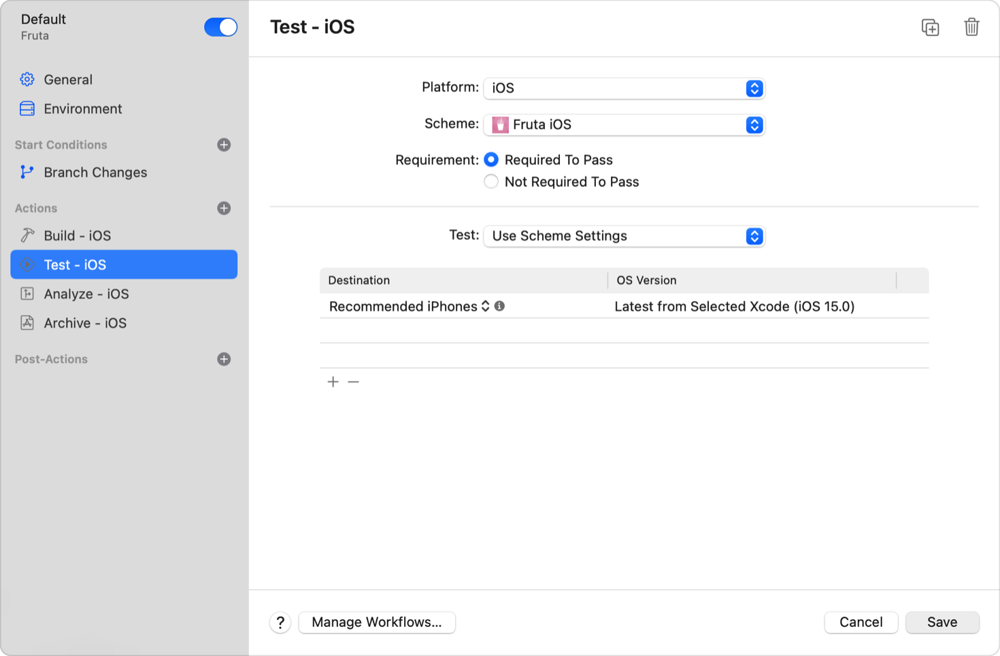
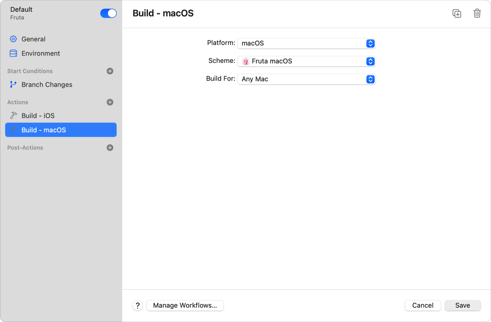
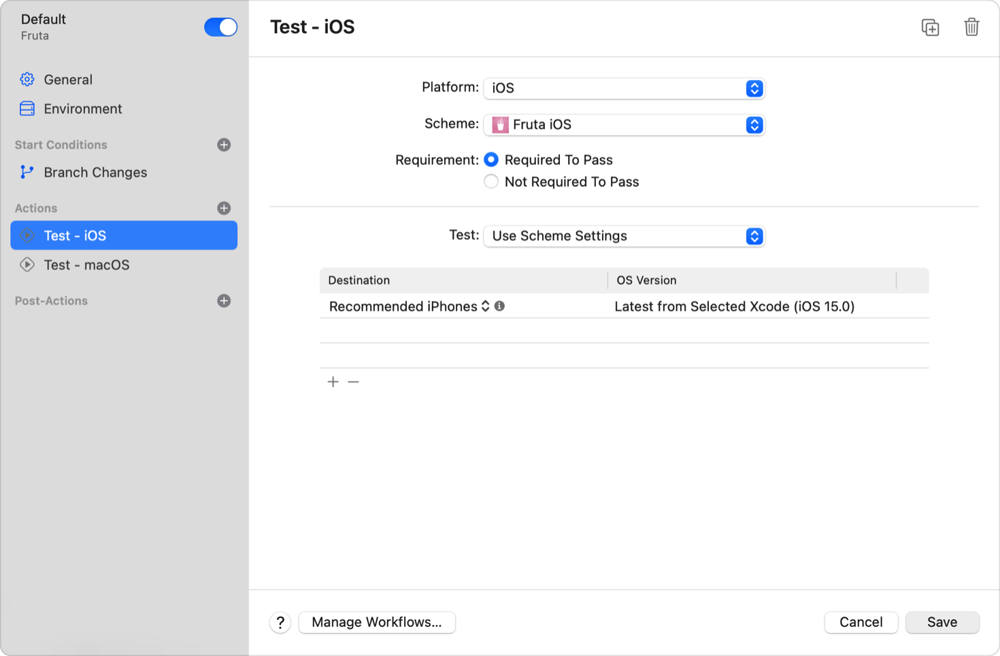

> Navigation: [Technologies](../technologies.md) · [Xcode](../xcode.md) · [Xcode Cloud](xcode-cloud.md) · [Xcode Cloud workflow reference](xcode-cloud-workflow-reference.md)

# Configuring your Xcode Cloud workflow’s actions

Article

Add actions to an Xcode Cloud workflow to build, test, analyze, and archive your app or framework when it performs a build.

## Overview

With Xcode Cloud, you can create custom workflows to adopt a flexible continuous integration and delivery (CI/CD) practice. For example, configure a workflow that verifies changes by building and testing your app or framework, a workflow that performs in-depth verifications, another workflow to regularly deliver a new version of your app to testers, and so on. At the core of each workflow are the actions Xcode Cloud performs during a build.

If you’re new to creating custom workflows, see [Developing a workflow strategy for Xcode Cloud](developing-a-workflow-strategy-for-xcode-cloud.md). For more information on other workflow settings, see [Xcode Cloud workflow reference](xcode-cloud-workflow-reference.md).

You need to use Xcode to initially configure your project or workspace to use Xcode Cloud. However, after you’ve started your first build, you can edit and create workflows in either Xcode or [App Store Connect](https://appstoreconnect.apple.com).

For additional information about Xcode Cloud workflows, see [Explore Xcode Cloud workflows](https://developer.apple.com/wwdc21/10268) and [Customize your advanced Xcode Cloud workflows](https://developer.apple.com/wwdc21/10269).

### Review actions

A workflow can perform one or many actions that match your project or workflow’s scheme actions. Choose from the following actions:

- Build
- Test
- Analyze
- Archive

For example, configure a workflow to perform the build, test, and archive actions for each platform.

A good practice to follow when using Xcode Cloud is to create a set of workflows with each performing different actions. For example, you could have one workflow for building and testing actions whenever there’s a change to a branch or pull request, and you could have a second workflow that performs build, test, analyze, and archive actions whenever you merge code into your `main` branch.

When Xcode Cloud performs an action, it:

- Creates a temporary build environment.
- Clones your source code from the connected repository.
- Resolves dependencies.
- Runs custom build scripts, if applicable, as described in [Writing custom build scripts](writing-custom-build-scripts.md).
- Performs the action.
- Saves artifacts.

> [!note] Note
> Xcode Cloud performs each action separately in a temporary build environment. As a result, an action’s artifacts might not be available to other actions. For example, a test action’s test result bundle isn’t available to other actions.

### Add an action to a workflow

To add an action to a workflow, first open or create a workflow in Xcode or in the Xcode Cloud tab on the [App Store Connect](https://appstoreconnect.apple.com) website. Click the Add button (+) next to Actions, choose an action, enter required information, choose from available settings, and save the workflow. Then, manually start a new build or wait for Xcode Cloud to start a new build.

The following screenshot shows Xcode’s Edit Workflow sheet for a workflow that performs all four available actions:

### Add a build action

Verifying that a change always compiles is one of the key tasks of a CI/CD. With Xcode Cloud, you can perform this verification automatically with a build action.

To configure a workflow’s build action to a workflow:

1. Open or create a workflow in Xcode or in the Xcode Cloud tab on the App Store Connect website.
2. Click the Add button next to Actions, and choose Build.
3. Choose a platform and a scheme; for example, choose macOS and your macOS app’s corresponding scheme to build your Mac app.
4. Choose whether you want to build the app for any device or any simulator destinations. For a Mac app, choose between building macOS and Mac Catalyst destinations.

The following screenshot shows an Xcode Cloud workflow for the [Fruta app](https://developer.apple.com/documentation/swiftui/fruta_building_a_feature-rich_app_with_swiftui). It includes two build actions: one action builds the iOS app, and the other action builds the macOS app:

A screenshot that shows a workflow in Xcode with two build actions: one build action for the macOS app and one build action for the iOS app.

When Xcode Cloud performs a build action, it accesses your source code and runs the `xcodebuild build` command to create the build product. Upon completion, Xcode Cloud makes the following artifacts available: the build product, build logs, and the result bundle.

### Add a test action

Verifying a change by running your tests is another key task of a CI/CD practice. While every project comes with its unique requirements, it usually makes sense to configure two workflows that perform a test action:

- A workflow that frequently runs basic, short running tests.
- A workflow that runs more extensive, long-running tests less frequently.

> [!note] Note
> Adding a test action builds your app or framework for testing. You don’t need to add a build action to run your tests.

To add a test action to a workflow:

1. Open or create a workflow in Xcode or in the Xcode Cloud tab on the [App Store Connect](https://appstoreconnect.apple.com) website.
2. Click the Add button next to Actions, and choose Test.
3. Choose a platform and a scheme for the test action.
4. Decide if you want a build to fail when the test action fails, then choose “Required To Pass” or “Not Required to Pass,” accordingly.
5. Choose Use Scheme Settings if you want the test action to use the selected scheme’s configuration. Alternatively, choose a test plan if you use them. For more information on test plans, see [Testing in Xcode](https://developer.apple.com/videos/play/wwdc2019/413/) and [Get your test results faster](https://developer.apple.com/videos/play/wwdc2020/10221/).
6. Add at least one destination by clicking the Add button. Available destinations depend on the workflow’s environment setting. A higher number of destinations increases the time it takes Xcode Cloud to complete a build.

The following screenshot shows an Xcode Cloud workflow for the [Fruta app](https://developer.apple.com/documentation/swiftui/fruta_building_a_feature-rich_app_with_swiftui). It includes two test actions: one action tests the iOS app, and the other action tests the macOS app.

A screenshot that shows a workflow in Xcode with two test actions: a test action for the iOS app and another test action for the macOS app.

A test action runs in two separate phases: In the first phase, Xcode Cloud accesses your source code and creates test products using the `xcodebuild build-for-testing` command. In the second phase, Xcode Cloud uses the test products it creates in the first phase to run your tests using the `xcodebuild test-without-building` command.

> [!note] Note
> The source code isn’t available when Xcode Cloud runs your tests in the second phase.

When Xcode Cloud completes the test action, it makes test products and the result bundle with the test results available as artifacts.

For additional information on using Xcode Cloud to run your tests, see [Author fast and reliable tests for Xcode Cloud](https://developer.apple.com/wwdc22/110361).

### Add an analyze action

In addition to building and testing your code, analyzing it with Xcode can help you verify that your code is free from memory leaks and other issues. However, because analyzing code takes time, you might not do it regularly, causing issues to accumulate. Adding an analyze action to an Xcode Cloud workflow ensures you regularly analyze your code to identify errors before they become issues.

To add an analyze action to a workflow:

1. Open or create a workflow in Xcode or in the Xcode Cloud tab on the [App Store Connect](https://appstoreconnect.apple.com) website.
2. Click the Add button next to Actions, and choose Analyze.
3. Choose a platform and a scheme for the analyze action.
4. Decide if you want a build to fail if the analyze action fails and choose Required To Pass or Not Required to Pass accordingly.

When Xcode Cloud performs the analyze action, it accesses your source code and runs the `xcodebuild analyze` command to perform static code analysis. Upon completion, Xcode Cloud makes the build logs available as artifacts.

### Add an archive action

When you’re ready to distribute your app or framework to testers or to release it, you typically archive your app or framework with Xcode. To automate this task, add the archive action to an Xcode Cloud workflow. In fact, the archive action is a requirement for distributing a new version of your app to testers with TestFlight or for release on the App Store.

If you configure a workflow to archive an app, the Deployment Preparation setting is a key setting. It determines how Xcode Cloud signs your app.

Choose from the following options:

- **None** — The exported app archive isn’t eligible for distribution with TestFlight or for release on the App Store. Use this setting if you don’t configure the workflow to distribute an app.
- **TestFlight (Internal Testing Only)** — The exported app archive is eligible for distribution to testers with TestFlight. Because the app archive isn’t eligible for release on the App Store, use this setting to prepare the exported app archive for distribution within your team or for distribution to internal testers with TestFlight. For example, choose it for nightly builds, pull requests, or development branches.
- **TestFlight and App Store** — The exported app archive is eligible for distribution to testers with TestFlight and for release on the App Store. Choose this option for builds you distribute to external testers and that you plan to make available on the App Store. Note that external testing is subject to beta app review.

To add an archive action to a workflow:

1. Open or create a workflow in Xcode or in the Xcode Cloud tab in [App Store Connect](https://appstoreconnect.apple.com).
2. Click the Add button next to Actions, and choose Archive.
3. Choose a platform and a scheme.
4. Choose the option for the Deployment Preparation setting that fits your needs.

When Xcode Cloud performs the archive action, it accesses your code and runs the `xcodebuild archive` command to create an exported app archive or framework bundle. Upon completion, Xcode Cloud makes the exported app archive or framework bundle and the build logs available as artifacts.
