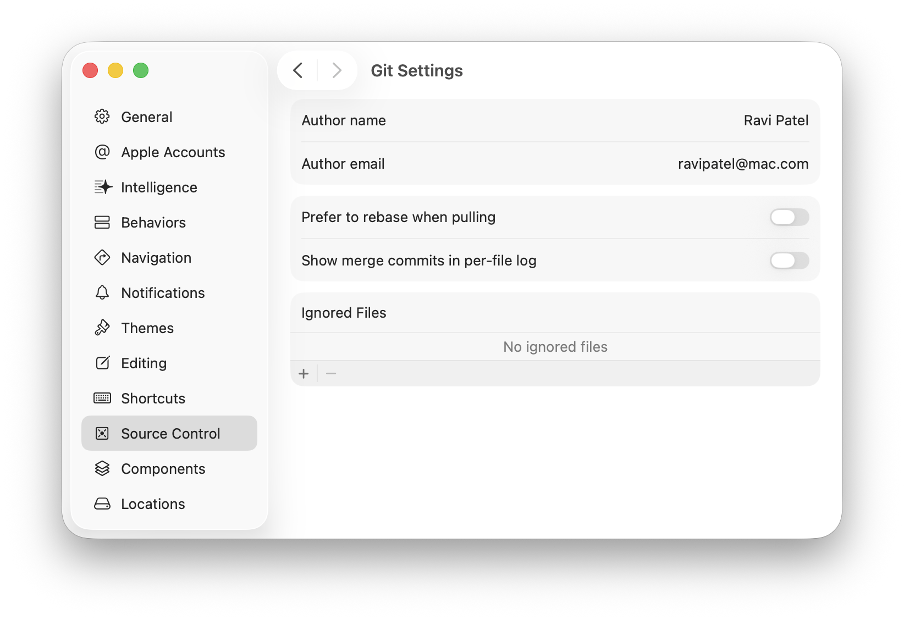
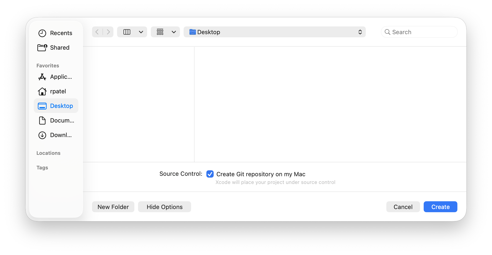
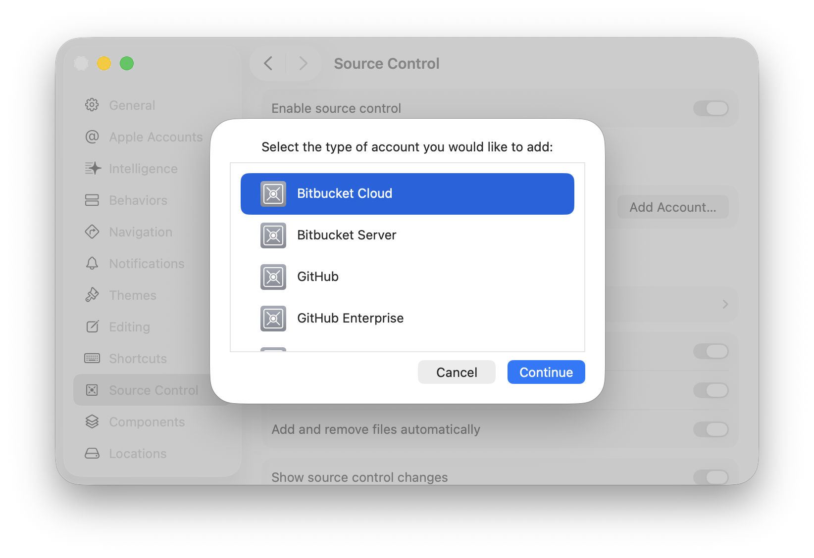
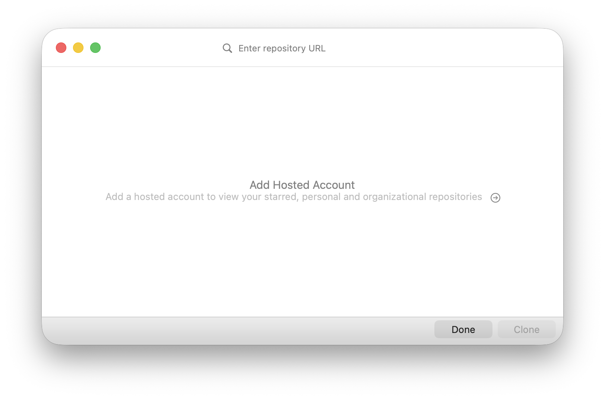
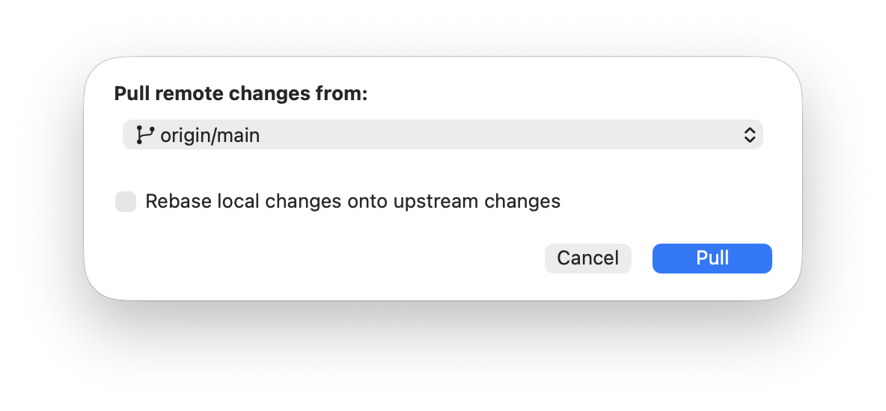

> Navigation: [Technologies](../technologies.md) · [Xcode](../xcode.md) · [Source control management](source-control-management.md)

# Configuring your Xcode project to use source control

Article

Sync code changes between team members and development computers by setting up your Xcode project to use Git source control.

## Overview

When you develop an app with a team, or by yourself using more than one Mac computer, use Xcode’s support for Git source control to share changes between team members and computers.

Xcode uses Git commands to manage your _source control repository_ that tracks a history of your project file changes. If you use a remote repository, Git syncs those changes across other devices. Set up your Xcode project to use Git by creating a new local repository, or by connecting it to an existing remote repository.

For more information on source control settings, see [Configuring source control in Xcode](configuring-source-control-in-xcode.md).

### Customize your author name and email

Before you set up a source control repository, enter your preferred name and email address that Xcode uses for all your projects.

Then when you make changes to your source code and commit them to your repository, Xcode includes your name and email address as the author in the source control history. People can Control-click a history entry to email the author.

To change your name and email address for source control, choose Xcode \> Settings, click Source Control in the sidebar, and on the right, toggle “Enable source control” on. Then click “Git settings” below and in the next sheet, enter your author name and email address in the corresponding text fields.

### Create a local repository for a new project

When you create a new Xcode project from a template, you can specify whether to create a local Git source code repository in the last sheet. Select “Create Git repository on my Mac” and then click Create.

A screenshot of the last dialog when creating a project from a template showing the “Create Git repository on my Mac” option and Create button.

Xcode creates the project folder, initializes a local Git source control repository, and commits all the files that it creates for your project. For more information, see [Creating an Xcode project for an app](creating-an-xcode-project-for-an-app.md).

### Clone a project from a remote repository

You can also create a local copy, or _clone_, of an existing remote Git repository that you can commit changes to using Xcode.

First, enter the account information in Xcode settings to access the remote repository. On the Xcode \> Settings \> Source Control pane, click Add Account. In the dialog, select the type of account and click Continue. For example, select Bitbucket Server or GitHub Enterprise.

In the next dialog, enter your credentials depending on the type of account, and click Sign In. If you need a token, click Create a Token on [_Account Type_] and follow the instructions on the account-specific webpage that appears in your browser.

To clone a remote repository while running Xcode, choose Integrate \> Clone or click Clone Git Repository on the Welcome to Xcode window that appears when you first launch Xcode. You can open this window anytime to see other options by choosing Window \> Welcome to Xcode.

If you add one or more source control accounts, Xcode shows a list of the projects that you can clone in the next window. In the search field at the top, enter the name of the repository to find it quickly, or paste the entire repository URL in the search field if it doesn’t appear in the list. Then select the repository and click Clone.

If the remote repository contains an Xcode project, Xcode scans the project and provides a list of branches available to clone. Select a branch to clone from the pop-up menu, and in the next dialog, provide a location for Xcode to save the local project. Xcode checks out the branch and opens the project.

### Connect to a remote repository to sync changes

You can also create a new remote repository for an existing local project or connect a local project to an existing remote repository. For example, do this if you create a local repository and later decide to use a remote repository, or if you download your project from a remote repository without cloning it and then want to create a new remote repository to store your changes.

In the Source Control navigator, click the Repositories tab. If necessary, expand the repository to show the Remotes folder.

- To create a new remote repository for an existing project, Control-click Remotes and choose New “[_project name_]” Remote from the pop-up menu. Enter the information about the remote repository in the dialog and click Create.
- To connect a local project to an existing remote repository, Control-click Remotes and choose Add Existing Remote from the pop-up menu. Enter a name and URL for the remote repository and click Add.

### Retrieve changes from a remote repository

Get changes from the remote repository by choosing Integrate \> Pull. In the dialog that appears, select the branch and click Pull.

A screenshot of the pull changes dialog, showing a pop-up menu for choosing a branch, an option to Rebase local changes onto upstream changes, and a Pull button.

If you have local changes that you want to keep, select the “Rebase local changes onto upstream changes” option before you click Pull. Otherwise, a dialog may appear that asks whether you want to stash your local changes before you pull remote changes.

Alternatively, choose Integrate \> Fetch Changes to download the changes from the remote repository without applying them to your local copy.

For example, if you commit changes from different computers or work on the same branch with team members, pull remote changes before making local changes to avoid conflicts.

## See Also

### Essentials

- [Tracking code changes in a source control repository](tracking-code-changes-in-a-source-control-repository.md) — Create a history of incremental changes to your project using commits and pushing to remote repositories.
