> Navigation: [Technologies](../technologies.md) · [Xcode](../xcode.md) · [Asset management](asset-management.md)

# Creating a SpriteKit particle emitter in Xcode

Article

Add particle effects to your app by creating repeatable particles.

## Overview

Use the SpriteKit particle emitter editor to experiment with SpriteKit particle effects and see the results immediately. The visual interface separates the task of designing particle effects from the programming, so artists can create effects independent of your code.

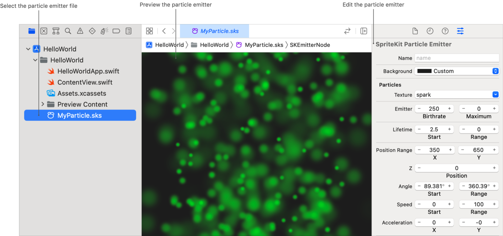

Screenshot of Xcode with a SpriteKit particle emitter file selected in the Project navigator. The editor area displays a preview of the particle emitter, and the Attributes inspector displays editable information about the particles.

The editor lets you modify many of the properties of a particle emitter, including:

- Where the emitter creates particles
- The number of particles the emitter creates
- The rotation, size, and movement of particles
- How each particle changes throughout its lifetime

### Add a particle emitter resource file to your project

1. Choose File \> New \> File from Template.
2. Choose Resource \> SpriteKit Particle File, and click Next.
3. Select one of the preinstalled particle emitter textures, and click Next.
4. In the next sheet, choose a location and enter a filename.
5. Select the checkbox associated with your project and click Create. Xcode creates a particle emitter file with the extension `.sks`.
6. Select the new particle emitter file in the Project navigator. Xcode opens the file in the particle emitter editor.

### Add a particle emitter to a scene

The SpriteKit particle emitter editor displays a preview of the emitter, but doesn’t add the emitter to your SpriteKit scene. Use code to add your particle emitter to a scene, or use the SpriteKit scene editor to create a reference node that points to your particle emitter file. When the scene is loaded, your particle emitter is rendered as child of the reference node.

To add a reference node for your particle emitter to a SpriteKit scene:

1. In the Project navigator, select the scene file.
2. Click the Library button (+) in the toolbar, then drag a reference node from the library to your scene.
3. Select the reference node and open the Attributes inspector.
4. Enter a name in the Name field.
5. In the Reference pop-up field, choose the particle emitter file.

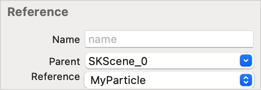

Screenshot of the Attributes inspector in a SpriteKit scene with the reference node selected. A section named Reference contains the fields Name, Parent, and Reference.

### Choose the shape of a particle

Choose the shape of your particle by selecting a texture. Each particle that the emitter creates is based on a texture image that can be a solid shape or a complex picture. You can use any image associated with the project as a particle texture. The system applies all the particle emitter’s modifications to the selected image.

In the Texture pop-up field, choose a particle texture. Keep in mind that the larger or more complex a particle image is, the more resources it uses. Use the smallest and least complex image possible for the desired effect.

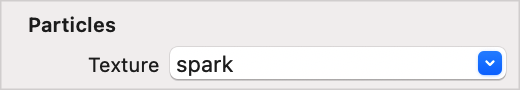

### Change the particle’s color

You can change the color of a particle throughout its lifetime and determine how a particle blends in with other images.

Use the _Color Blend_ fields to control how the particle blends its color with its texture’s inherent color.

In the Color Blend fields, click the minus (—) or plus (+) button, or double-click in the fields and enter the color blend values.

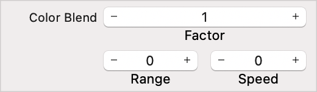

- **`Factor`** — The average starting value of the blend factor. This value corresponds to the particle emitter’s [particleColorBlendFactor](../spritekit/skemitternode/particlecolorblendfactor.md) property. The valid interval of values is from `0.0` up to and including `1.0`. A value above or below that interval is clamped to the minimum (`0.0`) if below or the maximum (`1.0`) if above. The default value is `0.0`, which means that the texture is used as is, ignoring the particle’s color. Otherwise, the texture is blended with the color.
- **`Range`** — The range value creating a random variance of the starting color blend for each particle. This value corresponds to the particle emitter’s [particleColorBlendFactorRange](../spritekit/skemitternode/particlecolorblendfactorrange.md) property.
- **`Speed`** — The rate at which to modify the color blend for each particle, measured in change per second. This value corresponds to the particle emitter’s [particleColorBlendFactorSpeed](../spritekit/skemitternode/particlecolorblendfactorspeed.md) property.

Use the _Color Ramp_ field to change the color of a particle throughout its life cycle. You can have a particle go through as many color changes as you want during a particle’s life cycle. The particle changes colors based on the space between color sliders.

In the Color Ramp field, click anywhere in the field to add a new color slider to the color ramp. To create an immediate change of color, place two color sliders on top of each other so there’s no space between them on the color ramp.

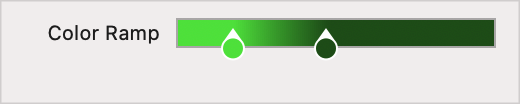

Use the _Blend Mode_ field to determine how each particle blends with other images in your app. This value corresponds to [SKBlendMode](../spritekit/skblendmode.md) enumeration. The default value is [SKBlendMode.alpha](../spritekit/skblendmode/alpha.md).

In the Blend Mode pop-up field, select one of the options.

Use the _Alpha_ fields to modify the particle’s transparency. The particle’s color is the result of multiplying the particle’s alpha value with the texture and color blending state. The particle color is then blended with the parent’s framebuffer before the particle is displayed.

In the Alpha fields, click the minus (—) or plus (+) button, or double-click in the fields and enter the alpha values.

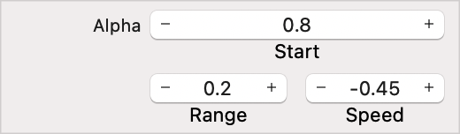

- **`Start`** — The average starting transparency value applied to each particle. This value corresponds to the particle emitter’s [particleAlpha](../spritekit/skemitternode/particlealpha.md) property. The default value is `1.0`.
- **`Range`** — The range of allowed random values for the particle’s starting alpha value. This value corresponds to the particle emitter’s [particleAlphaRange](../spritekit/skemitternode/particlealpharange.md) property. The default value is `0.0`.
- **`Speed`** — The rate at which the alpha value changes, measured in change per second. This value corresponds to the particle emitter’s [particleAlphaSpeed](../spritekit/skemitternode/particlealphaspeed.md) property.

Use the _Background_ field to change the background color shown in the Xcode preview to help you visualize how the emitter will look in different environments.

In the Background pop-up menu, choose a color. If the color you want to use isn’t listed, choose Other to bring up the color picker. To create an emitter with no background color, set the opacity in the color picker to `0`.

The color you pick for the background persists until you change it again. Xcode saves the background color when you build the app, but doesn’t use the color at runtime.

### Specify the movement and physics reactions

You can control different aspects of where a particle is created and the speed and angle at which the particle moves after creation.

The _Position Range_ fields define the area in which the emitter creates particles. Particles are created within the rectangle centered on the position defined in the scene and bounded by the position range values.

In the Position Range fields, click the minus (—) or plus (+) button, or double-click in the fields and enter a value.

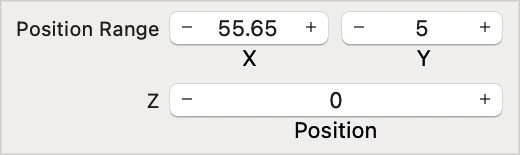

- **`X and Y`** — These values create the vector corresponding to the particle emitter’s [particlePositionRange](../spritekit/skemitternode/particlepositionrange.md) property. The default value is (`0.0`, `0.0`).
- **`Z position`** — The value corresponding to the [particleZPosition](../spritekit/skemitternode/particlezposition.md) property. The default value is `0.0`.

The _Angle_ fields control the direction, in degrees, that particles move away from the emitter. Entering `0` degrees moves the particles directly to the right. The degrees work on a counterclockwise rotation, so entering `90` in the Start field sends the particles to the top of the screen.

In the Angle fields, click the minus (—) or plus (+) button, or double-click in the fields and enter the angle values.

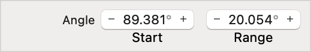

- **`Start`** — The average initial direction of a particle. This value corresponds to the particle emitter’s [emissionAngle](../spritekit/skemitternode/emissionangle.md) property.
- **`Range`** — The range of allowed random values for particle’s direction at birth. This value corresponds to the particle emitter’s [emissionAngleRange](../spritekit/skemitternode/emissionanglerange.md) property.

> [!tip] Tip
> Degrees versus radians — the particle emitter inspector displays degrees when presenting an angle to the user. However, these degrees are converted into radians to match the SpriteKit API when the app is built.

The _Speed_ fields define how fast the particle is moving, in points per second, at the instance of creation.

In the Speed fields, click the minus (—) or plus (+) buttons, or double-click in the fields and enter the speed values. The start and range values correspond to the particle emitter’s [particleSpeed](../spritekit/skemitternode/particlespeed.md) and [particleSpeedRange](../spritekit/skemitternode/particlespeedrange.md) properties.

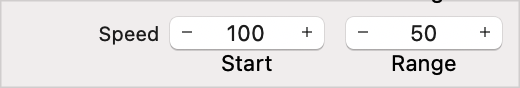

The _Acceleration_ fields modify the velocity of a particle after it is created. You can use this to simulate an overall gravity effect, wind blowing smoke from a fire, or other effects.

In the Acceleration fields, click the minus (—) or plus (+) button, or double-click in the fields and enter the acceleration values.

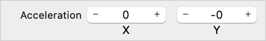

- **`X`** — Specifies acceleration along the horizontal axis. This value corresponds to the particle emitter’s [xAcceleration](../spritekit/skemitternode/xacceleration.md) property.
- **`Y`** — Specifies acceleration along the vertical axis. This value corresponds to the particle emitter’s [yAcceleration](../spritekit/skemitternode/yacceleration.md) property.

Use the _Field Mask_ field to specify the categories of physics fields that can exert forces on your particles. By default, particles are not affected by physics fields. The value you provide corresponds to the particle emitter’s [fieldBitMask](../spritekit/skemitternode/fieldbitmask.md) property.

In the Field Mask field, double-click in the field and enter a field mask value, or click the up or down arrow to change the value.

### Adjust the size and rotation of particles

You can adjust a particle’s size during its lifetime and control the speed and direction in which the particle rotates when the emitter creates it.

The _Scale_ fields manipulate the default size to determine the size of each particle at birth and whether the particle expands or shrinks during its lifetime. The default size of a particle is equal to the size of the particle’s texture, measured in points.

In the Scale fields, click the minus (—) or plus (+) button, or double-click in the fields and enter the values.

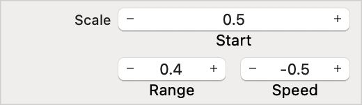

- **`Start`** — The average starting scale for each particle, corresponding to the particle emitter’s [particleScale](../spritekit/skemitternode/particlescale.md) property. The default value of `1.0` maintains the initial size of the particles. Values greater than `0.0` and less than `1.0` reduce the size of the particles, and values greater than `1.0` increase the size of the particles.
- **`Range`** — The range of allowed random values that modify the scale value. The range value corresponds to the particle emitter’s [particleScaleRange](../spritekit/skemitternode/particlescalerange.md) property. The default value of `0.0` has no effect on the scale value.
- **`Speed`** — The rate at which the scale factor changes per second, corresponding to the particle emitter’s [particleScaleSpeed](../spritekit/skemitternode/particlescalespeed.md) property. The default value of `0.0` has no effect on the scale value.

The _Rotation_ fields control the speed and direction that the particles rotate when rendered in a scene. You can use these fields to simulate falling leaves, spinning snowflakes, and any object that needs to rotate.

In the Rotation fields, click the minus (—) or plus (+) button, or double-click in the fields and enter the rotation values.

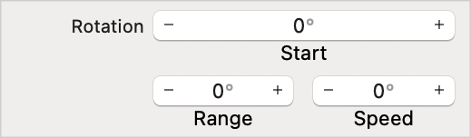

- **`Start`** — The average initial rotation of a particle, expressed as an angle in radians. This value corresponds to the particle emitter’s [particleRotation](../spritekit/skemitternode/particlerotation.md) property.
- **`Range`** — The range of allowed random values, expressed as an angle in radians. This value corresponds to the particle emitter’s [particleRotationRange](../spritekit/skemitternode/particlerotationrange.md) property.
- **`Speed`** — A particle’s rate of rotation, expressed in radians per second. This value corresponds to the [particleRotationSpeed](../spritekit/skemitternode/particlerotationspeed.md) property.

### Specify the life cycle for particles

You can manage how many particles are created, the maximum number of particles created, and the length of time that each particle is alive.

> [!important] Important
> The number of particles the emitter creates and how long they are onscreen directly affect the performance of your app.

The _Emitter_ fields control how often particles are created and the maximum number of particles created.

In the Emitter fields, the minus (—) or plus (+) button, or double-click in the fields and enter a value.

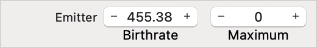

- **`Birthrate`** — The number of particles created per second. This value corresponds to the particle emitter’s [particleBirthRate](../spritekit/skemitternode/particlebirthrate.md) property. The default value is `0.0`.
- **`Maximum`** — The maximum number of particles created. The default value is `0`, which indicates that the emitter creates an endless stream of particles. The maximum value corresponds to the particle emitter’s [numParticlesToEmit](../spritekit/skemitternode/numparticlestoemit.md) property.

The _Lifetime_ fields control how long, in seconds, each individual particle is onscreen.

In the Lifetime fields, click the minus (—) or plus (+) button, or double-click in the fields and enter a value.

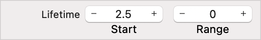

- **`Start`** — The average starting value, corresponding to the particle emitter’s [particleLifetime](../spritekit/skemitternode/particlelifetime.md) property.
- **`Range`** — The range of allowed random values for a particle’s lifetime, corresponding to the particle emitter’s [particleLifetimeRange](../spritekit/skemitternode/particlelifetimerange.md) property.
