> Navigation: [Technologies](../technologies.md) · [Xcode](../xcode.md) · [Asset management](asset-management.md)

# Creating your app icon using Icon Composer

Article

Use Icon Composer to stylize your app icon for different platforms and appearances.

## Overview

Use Icon Composer to create a single multilayer file that you can add to your Xcode project to represent your Liquid Glass app icon everywhere your app icon appears across iOS, iPadOS, macOS, watchOS, and the App Store. Use your favorite design tool to create the artwork for your app icon, but save some design decisions for Icon Composer, where you can refine the dynamic properties of [Liquid Glass](../technologyoverviews/liquid-glass.md) and customize variants of your app icon for different platforms and appearances.

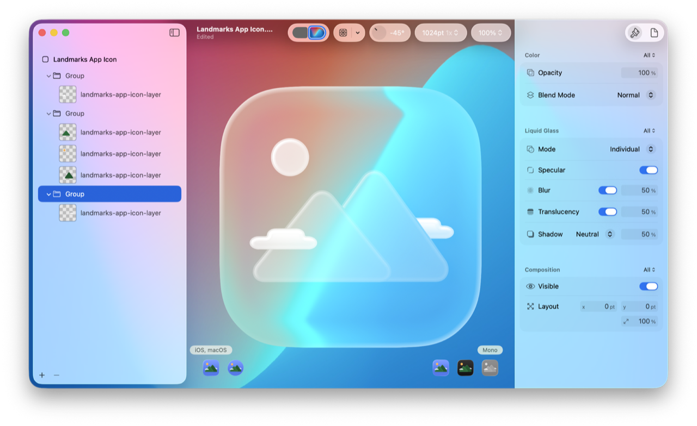

A screenshot of Icon Composer that shows a group selected in the sidebar, iOS, macOS platform and mono appearance selected in the canvas, and Liquid Glass settings in the Appearance inspector. The canvas shows the icon over a custom background image with 50% blur and translucency Liquid Glass settings.

Before building your app, add the Icon Composer file to your Xcode project to include it in your app’s bundle. The system automatically renders your app icon for the different platforms, appearances, and sizes from your single Icon Composer file. If your app supports previous releases (in the Minimum Deployments settings in the target’s General pane) that don’t have the same icon and widget style appearances and Liquid Glass material, Xcode automatically generates app icon images at build time for those releases from the Icon Composer file.

> [!important] Important
> If you add an Icon Composer file to your Xcode project, it replaces any existing icon asset catalog that you previously used to represent your app icon. Xcode automatically generates a similar-looking version of the Liquid Glass icon for previous releases. If you want your existing icon to appear in previous releases, continue to use asset catalogs to represent your app icon.

To learn more, see the following resources:

- For guidance on designing your app icon, see [Human Interface Guidelines \> Foundations \> App icons](../design/human-interface-guidelines/app-icons.md).
- For converting older app icons to use the Liquid Glass material, see [Adopting Liquid Glass \> App icons](../technologyoverviews/adopting-liquid-glass.md#App-icons).
- For more information on Liquid Glass and Icon Composer, watch [Say hello to the new look of app icons](https://developer.apple.com/videos/play/wwdc2025/220/) and [Create icons with Icon Composer](https://developer.apple.com/videos/play/wwdc2025/361/).
- For tvOS and visionOS targets that still use an `AppIcon` asset catalog, see [Configuring your app icon using an asset catalog](configuring-your-app-icon.md).

### Prepare your artwork for export

To design your Liquid Glass app icon, use a third-party vector graphics editor of your choice that exports your layers as graphic files in SVG or PNG format. To give you the most scalability, use vector graphics to draw shapes and export SVG files.

While you design your app icon and before you export layers, follow these guidelines for best results:

- Start with an app icon template that you download from [Apple Design Resources](https://developer.apple.com/design/resources/) that has the latest grid, shape, and canvas size.
- Otherwise, change the canvas size to match the size that you use in Icon Composer, such as 1024 x 1024 pixels for iPhone, iPad, and Mac, and 1088 x 1088 pixels for Apple Watch.
- Design your app icon in layers that the system renders in the z-plane from back to front.
- Separate colors, text, and any other graphics into layers that you want to modify for platforms and appearances in Icon Composer.
- Because SVG format doesn’t preserve fonts, convert text to outlines.
- Give the layers meaningful names that include numbers (increment from back to front) to help you organize them in Icon Composer.

In addition, wait to apply some effects in Icon Composer where you can preview and adjust them for Liquid Glass:

- Remove blurs and shadows, and specular, opacity, and translucency settings.
- Remove background colors and gradients.

When you’re ready to export layers from your third-party tool, choose the SVG format whenever possible. For layers that contain unsupported SVG features, choose PNG or another raster image format that Icon Composer supports. Don’t export the canvas mask because the system applies that automatically to ensure a perfect crop.

### Create your Icon Composer file

To launch Icon Composer in the latest version of Xcode, choose Xcode \> Open Developer Tool \> Icon Composer. If you don’t install Xcode, go to [Icon Composer](https://developer.apple.com/icon-composer) to download it instead.

Icon Composer shows a default app icon with a solid background color. Give the file a name that you want to use later in the Xcode project, such as `AppIcon`. Choose File \> Save and in the dialog that appears, enter the filename and click Save. Alternatively, click `Untitled` in the toolbar and change the name and location in the dialog that appears.

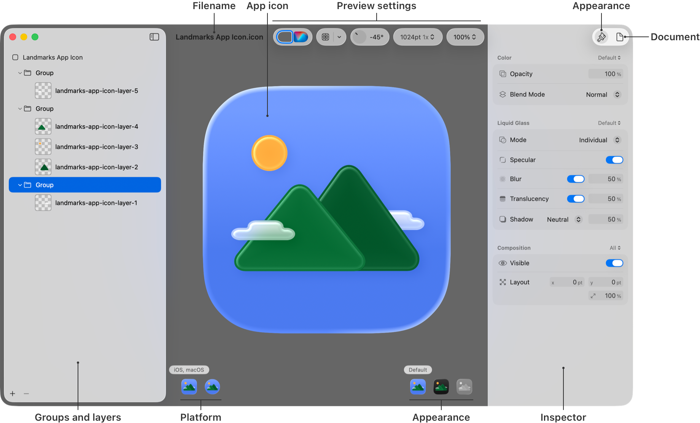

A screenshot of Icon Composer with callouts showing the groups and layers for the Landmarks sample app in the sidebar, the iOS, macOS platform and default appearance selected in the canvas, and the settings for a group in the Appearance inspector.

You use the sidebar on the left to organize layers into groups, the canvas in the middle to preview variants, and the inspectors on the right to modify appearances. In the canvas area, you use the controls at the bottom to select combinations of platforms and appearances, and the controls at the top to apply a grid or simulate device conditions.

You can continue using Icon Composer to fine-tune your app icon and add it to your Xcode project later. To add your app icon to an Xcode project and associate it with your app target, see [Add your Icon Composer file to an Xcode project](creating-your-app-icon-using-icon-composer.md#Add-your-Icon-Composer-file-to-an-Xcode-project).

If your Icon Composer file is in your Xcode project, you can select it in the Project navigator and see a preview in the canvas area. To open an Icon Composer file that’s in your Xcode project, click Open with Icon Composer under the preview, or Control-click the file in the Project navigator and choose Open with External Editor.

### Import your graphic files

After you export your artwork from your design tool, import the graphic files, in SVG or PNG format, into your Icon Composer file.

Drag one or more graphic files from the Finder to the sidebar and each becomes a layer in a default group that Icon Composer creates. Alternatively, drag folders containing graphic files to the sidebar. Then the folders become groups and the files in the folders become layers in those groups. Icon Composer organizes the groups and layers alphabetically using the same names as the folders and files.

Alternatively, click the Add button (+) under the sidebar and choose New Image from the pop-up menu. In the dialog that appears, select one or more files (use Command-click to select multiple files) and click Open.

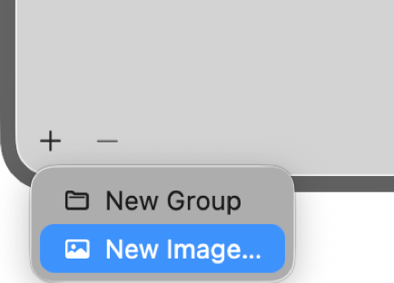

Later, if you want to change the graphic file associated with a layer, select the layer in the sidebar and choose Replace from the Image pop-up menu under Composition in the Appearance inspector. Then, from the dialog that appears, select the new graphic file.

### Organize layers into groups

After you import the graphic files, organize the layers that appear in the default group into a maximum of four groups to reduce complexity. The groups become the layers in the app icon image the platform renders to give the icon its depth. The system renders the layers in the z-plane from the bottom to the top as they appear in the sidebar. Groups also allow you to apply common settings to multiple layers.

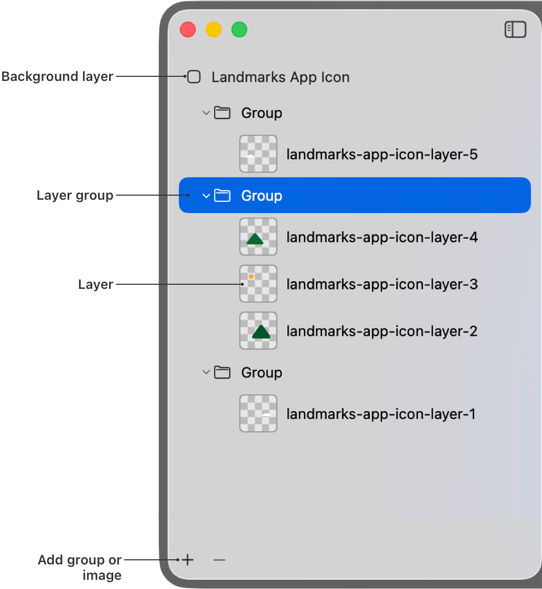

You can use the sidebar to make the following edits:

- To create a group, click the Add button at the bottom of the sidebar and choose New Group from the pop-up menu.
- To change the name of a group or layer, double-click it and enter a name.
- To move layers into groups, drag them to the groups you want them to be in.
- To change the order of a group or layer, drag them up or down. Alternatively, select a layer or group and choose Arrange \> Bring [Group | Layer] Forward or Arrange \> Send [Group | Layer] Backward (or similar) menu item.
- To add another layer, click the Add button and choose Image.

For more edits, Control-click a layer or group and choose an action from the contextual menu.

To collapse groups in the outline, click the disclosure triangle to the left of the group. To hide or show layers and groups in the canvas, click the eye icon to the right of the group or layer in the sidebar when you hold the pointer over it. Alternatively, hide or show layers and groups using the Visible toggle under Composition in the Appearance inspector.

To delete groups, layers, or graphics in a layer, select them in the sidebar or canvas, and press Delete. To revert your changes, choose Edit \> Undo Delete.

### Customize the Icon Composer interface

Before you begin previewing variants and adding effects to your app icon, consider customizing the Icon Composer interface to show only the platforms that your app supports. Click the Document button in the upper-right corner and choose the platforms from the Document inspector.

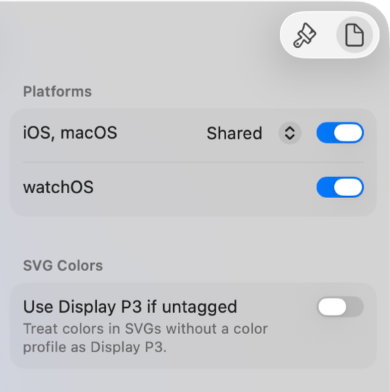

A screenshot of the Document inspector that shows the platform controls where you can select the platforms you support to reduce the complexity of the interface.

For example, if your app runs in iOS only, choose iOS Only from the iOS, macOS pop-up menu and toggle watchOS to off. Icon Composer hides the macOS and watchOS controls so that you can focus on the iOS app icon design.

### Preview variants of your app icon

Icon Composer shows you a preview of your app icon on different platforms (iOS, macOS, and watchOS) and, for iOS and macOS, different appearances (default, dark, and mono). For mono, you can preview clear and tinted variants as well. For watchOS, there are no appearances to preview.

Below the image of your icon in the canvas area, click a platform on the left and appearance on the right to preview or edit that variant. For example, to preview the dark appearance in iOS, select iOS on the left and Dark on the right.

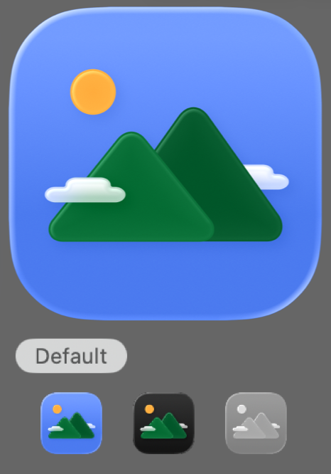

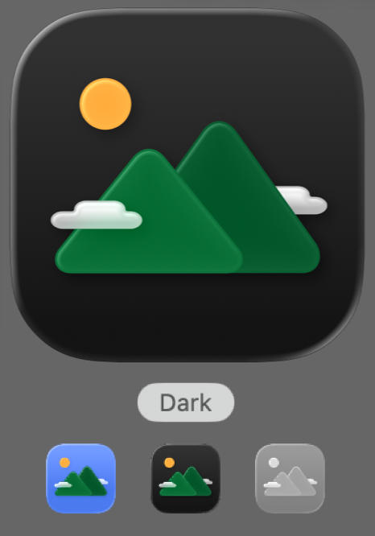

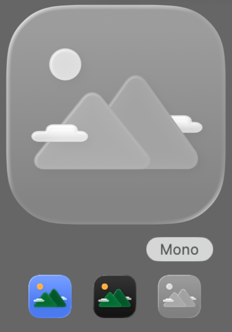

To preview clear and tinted variants, click Mono and then click Options. From the dialog, select Light or Dark, toggle Tinted on or off, and select a tint color using the sliders.

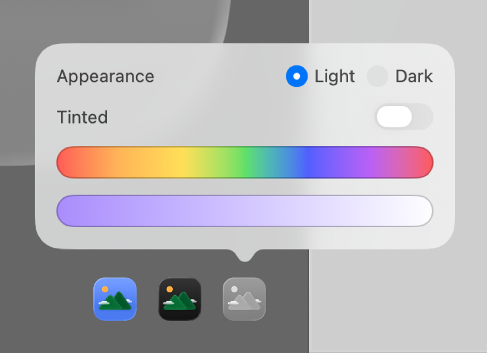

A screenshot that shows the Mono options settings with a toggle between light and dark appearance, a toggle for tinted, and color sliders.

### Simulate device backgrounds and lighting

To preview your app icon in a different context, use the controls in the toolbar above the canvas area. These controls only change the simulated device where your app icon appears; they don’t edit your app icon.

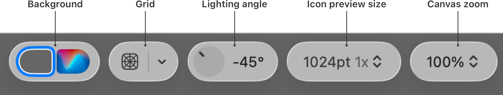

You can use the toolbar controls to set the following:

- To change the background color, choose a color from the color well on the left.
- To change the background image, choose a background image from the Background Image pop-up menu. To use your own image, click Add Background in the pop-up menu.
- To switch between the background color and image, click the background toggle.
- To add grid lines, choose Light or Dark from the Grid pop-up menu.
- To toggle the grid lines on or off, click the Grid button.
- To view the app icon in different lighting directions, rotate the lighting angle dial.
- To view a specific size of the app icon, choose the size from the “Select preview size” pop-up menu.
- To zoom in or out, choose a percentage from the “Change zoom level” pop-up menu.

You can use these controls to see the transparency in the clear and tinted modes using your own backgrounds. For example, to preview the clear dark variant over a sample image, select iOS or macOS as the platform and Mono as the appearance. From the Mono options dialog, toggle Tinted off. Then choose Add Background from the Background Image pop-up menu at the top of the canvas and select the screenshot in the dialog that appears.

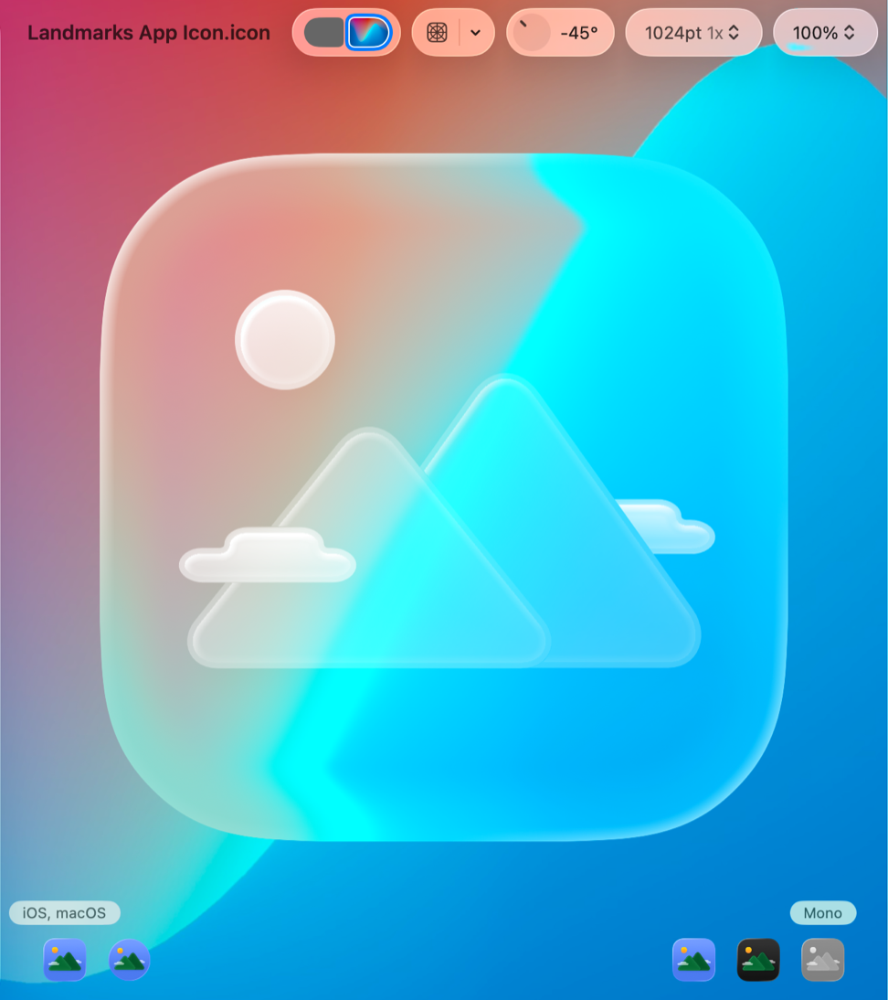

### Apply effects to the background, groups, and layers

As you preview the variants of your app icon on different platforms and device settings, apply effects and fix any problems you see using the Appearance inspector. Explore the different settings for groups and layers within a group.

In general, settings under Color are useful for creating variants for dark and mono appearances. For groups and layers, you customize the dynamic material under Liquid Glass. Then use the controls under Composition for varying your design on different platforms.

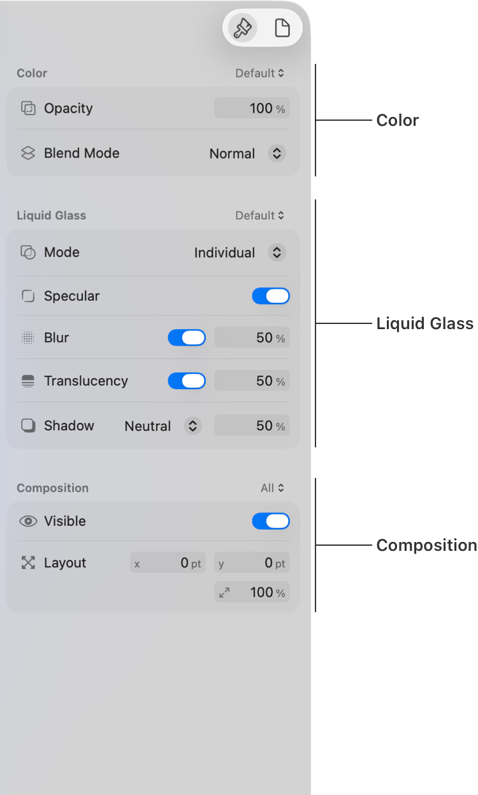

A screenshot of the Appearance inspector with callouts that show the Color, Liquid Glass, and Composition areas of the settings.

To quickly duplicate settings, you can Control-click an individual setting or a section, and choose Copy [Setting | Section] or Paste [Setting | Section] from the contextual menu. Alternatively, Control-click a layer or group in the sidebar and choose Copy Style or Paste Style from the contextual menu (Edit \> Copy Style and Edit \> Paste Style).

For any text fields where you enter numbers, you can enter an equation and Xcode calculates the value for you. For example, enter `35*3` or to double an existing value, `*2`.

To remove any changes you make in the Appearance inspector, choose Edit \> Undo.

### Apply a gradient fill and opacity

Under Color in the Appearance inspector, you can change a layer’s fill from the default value (Automatic) that Icon Composer gets from the graphic file. Select the layer in the sidebar, and from the Fill pop-up menu in the Appearance inspector, choose None, Solid, or Gradient.

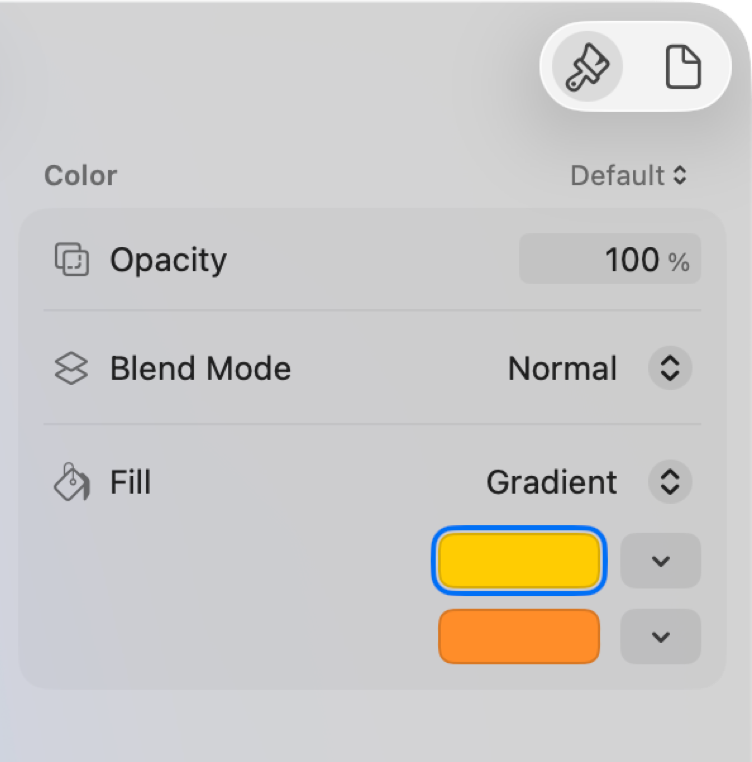

A screenshot of the Color settings for a layer that shows Fill set to Gradient with yellow as the “From” color and orange as the “To” color.

> [!tip] Tip
> To set an RGB value or hexadecimal (hex) color number for a color, use the RGB sliders in the Color Sliders inspector in the Color picker.

For example, apply a gradient to your app icon’s background following these steps:

1. In the sidebar, click the icon filename.
2. In the canvas, select a platform and, optionally, an appearance.
3. To show the settings, click the Appearance inspector in the upper-right corner of the window.
4. From the Color pop-up menu, choose All to change all variants.
5. From the Fill pop-up menu, choose Gradient.
6. From the two color wells that appear below, select the “From” and “To” colors.

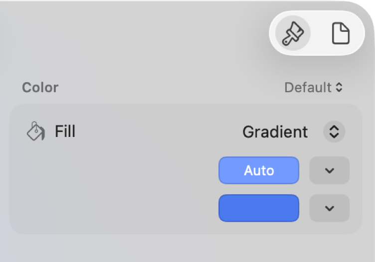

A screenshot of the Color settings for the app icon that shows Fill set to Gradient with Auto as the “From” color and blue as the “To” color.

To switch the colors, click the arrows to the left of the Gradient color wells when you hold the pointer over them. For layers, you can use the dots in the canvas that appear on the layer to change the “From” and “To” locations of the gradient.

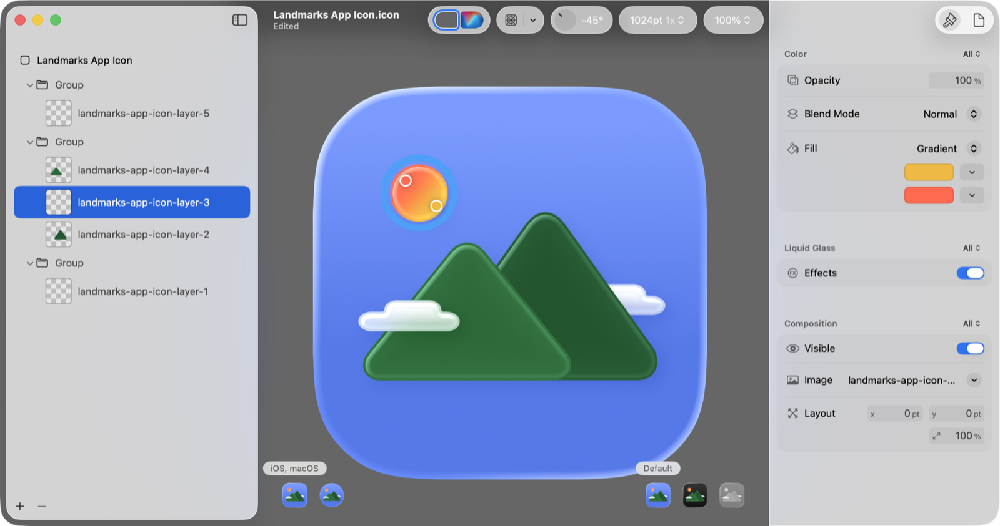

A screenshot that shows a layer selected in the sidebar on the left, the gradient dots on a shape in the canvas in the middle, and a from and to color set under Gradient on the right.

You can also make a group or layer transparent to reveal details behind using the Opacity setting under Color.

### Apply Liquid Glass effects to groups and layers

Icon Composer automatically adds the Liquid Glass material to layers when you import graphics files, and it applies other default Liquid Glass settings to groups when you create them.

For a group, you have all the options to customize the Liquid Glass material. Select a group in the sidebar and choose Individual or Combined from the Mode pop-up menu in the inspector. Individual applies the effect to every layer in the group separately. Combined applies the effect to the layers in the group as one object.

**Individual**

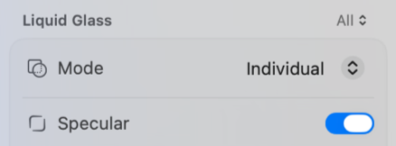

**Combined**

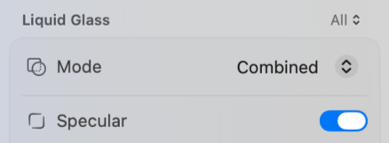

The specular material is on by default. If you toggle Specular off, the slight blur to the background and a light highlight around the edges disappears. The following screenshot shows a group that contains a sun and mountains with Specular off.

**Specular on**

**Specular off**

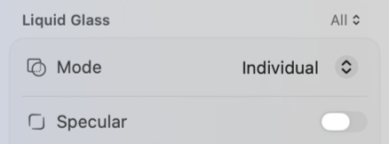

Below Specular, you can apply the rest of the Liquid Glass settings (Blur, Translucency, and Shadow) to the group.

To turn Liquid Glass off for an individual layer, select the layer in the sidebar, and in the inspector, toggle the Effects switch under Liquid Glass off.

**Effects on**

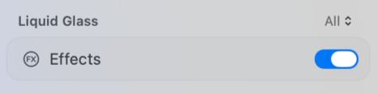

**Effects off**

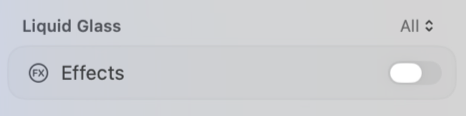

### Change the position and scale of graphics

You can reposition and scale graphics in your layers using Icon Composer. Just drag the graphics you want to move within the canvas area.

**Layer**

[A video that shows how to select a layer and drag it in the canvas to change its position.](https://docs-assets.developer.apple.com/published/840d3c68973f585d0c2433140d6b74df/icon-composer-individual-layer-move.mp4)

**Group**

[A video that shows how to select a group and drag it within the canvas to change its position.](https://docs-assets.developer.apple.com/published/c0f20a9da6e28f04c9d8600f2ab758fa/icon-composer-layer-group-move.mp4)

To move multiple groups, layers, or individual graphics, Command-click them in the sidebar or canvas first, or select them by dragging a bounding box in the canvas. Icon Composer highlights the selection in both the sidebar and canvas. To unselect all graphics, press the Escape key.

Use the guidelines that appear while dragging to align the selection with other graphics. To make more precise edits, you can enter an x, y, and scale in the Layout section of the Appearance inspector under Composition. To make single point changes, use the Up Arrow and Down Arrow keys

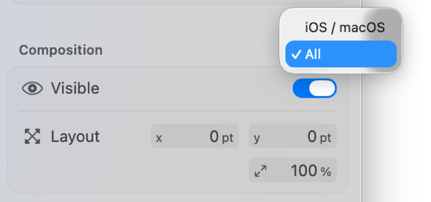

Optionally, turn the grid on so you can see where to place your graphics. In the toolbar, click the Grid button or choose Light or Dark from the Grid pop-up menu. Icon Composer overlays grid lines on the preview of your app icon in the color that you choose. To remove the grid lines, toggle Grid off.

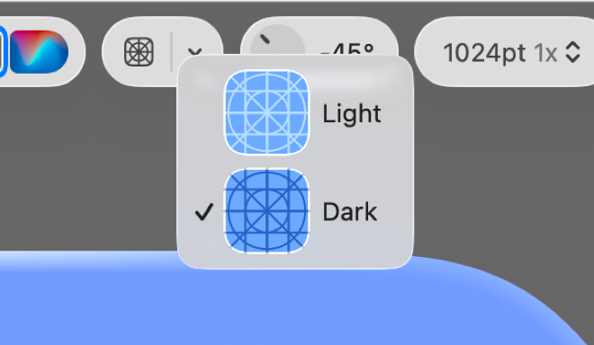

For other ways to reposition the selection, use the Arrange \> Align and Arrange \> Distribute menu items.

### Customize variants of your app icon

You can customize specific platform and appearance variants of your app icon using the Appearance inspector.

To see settings that you customize, select the icon, a group, or a layer in the sidebar and choose All from the Color, Liquid Glass, or Composition pop-up menu in the Appearance inspector. The custom settings appear below the main setting. For example, if you change the Blend Mode setting for the dark and mono appearances in iOS, then a Dark and Mono setting appears below the Blend Mode setting. The main setting applies to the variants that you don’t customize.

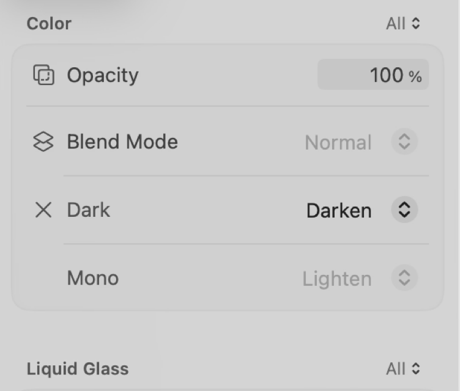

The Appearance inspector enables the controls for the platform or appearance that you select in the canvas. For example, to enable the Dark setting that appears below Blend Mode, select the dark appearance in the canvas.

To add another custom setting, select the platform or appearance in the canvas that you want to vary and in the Appearance inspector, click the icon next to the setting. Choose Vary for [appearance | platform] from the Add button pop-up menu. For example, select iOS / macOS and Default in the canvas and choose Vary for iOS / macOS from the Blur pop-up menu under Liquid Glass.

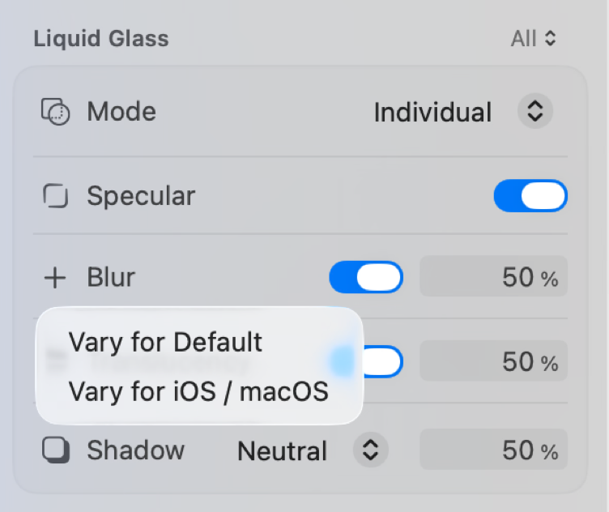

A screenshot that shows the Vary for pop-up menu under the Blur setting when you choose All from the Liquid Glass pop-up menu.

To remove custom settings, click the X next to the platform or appearance. For example, to remove the Dark setting under the Blend Mode setting, click the X next to Dark.

Alternatively, choose the appearance that you select in the canvas from the Color or Liquid Glass pop-up menu. Then the controls in that section only apply to that appearance. Similarly, choose the platform that you select in the canvas from the Composition pop-up menu and the controls in that section apply only to that platform. The controls behave in this way so that the appearance of your app icon remains consistent and only the geometry varies across platforms.

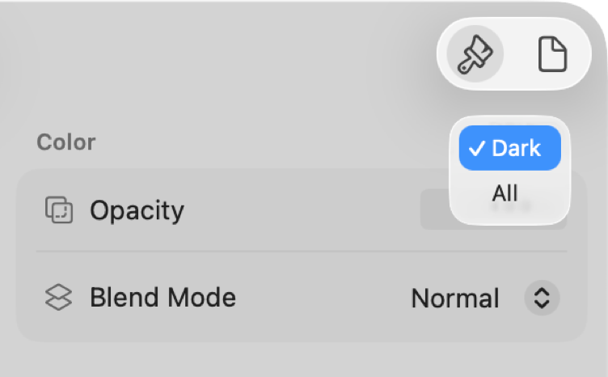

Then you can switch back to seeing all the custom settings you made for platforms and appearances in one place by choosing All from the Color, Liquid Glass, and Composition pop-up menus.

### Add your Icon Composer file to an Xcode project

If you create your Icon Composer file outside of Xcode, you can add it to your Xcode project anytime to view your icon in Simulator and on real devices.

Just drag the Icon Composer file from Finder to the Project navigator, and Xcode provides feedback on where to drop it in a target folder. Alternatively, choose Add Files from the Add button at the bottom of the Project navigator and select your Icon Composer file in the dialog that appears.

In the project editor, select the target and the General tab. Under App Icons and Launch Screen, ensure that the name in the App Icon text field matches the name of the Icon Composer file without the extension. You can have multiple Icon Composer files in your project but only one that matches the name in the App Icon text field.

> [!note] Note
> The latest version of Xcode uses the Icon Composer file instead of an existing `AppIcon` asset catalog in your project.

### Test your app icon on simulated and real devices

In Xcode, choose a simulated or real device from the run destination menu and click the Run button. Verify that your app icon appears correctly on different platforms and appearances. Use the Appearance system settings in Simulator or on a real device to test appearances.

For more information on running your app in Xcode, see [Running your app on simulated or physical devices](running-your-app-on-simulated-or-physical-devices.md).

## See Also

### App icons and launch screen

- [Configuring your app to use alternate app icons](configuring-your-app-to-use-alternate-app-icons.md) — Add alternate app icons to your app, and let people choose which icon to display.
- [Configuring your app icon using an asset catalog](configuring-your-app-icon.md) — Add app icon variations to an asset catalog that represents your app in places such as the App Store, the Home Screen, Settings, and search results.
- [Specifying your app’s launch screen](specifying-your-apps-launch-screen.md) — Make your iOS app launch experience faster and more responsive by customizing a launch screen.
