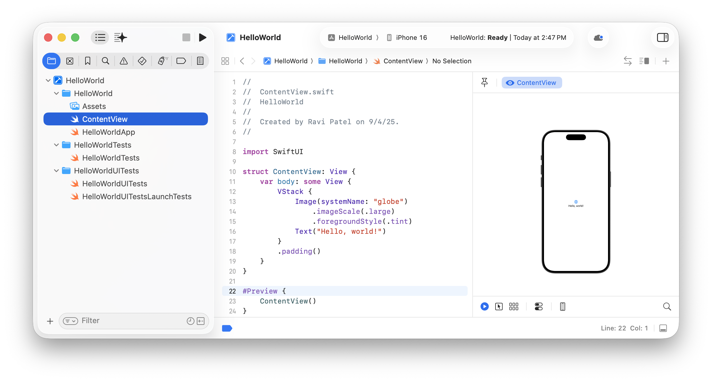
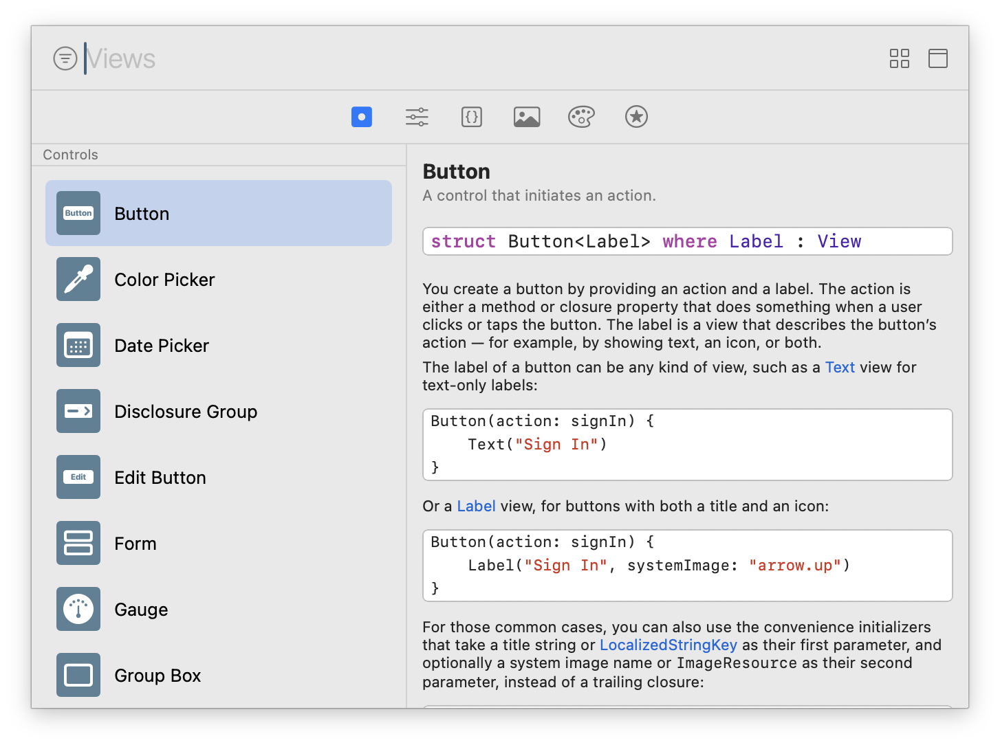
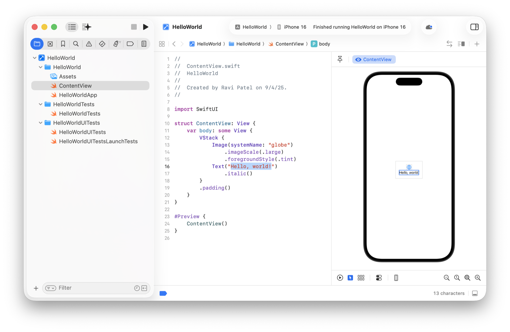

> Navigation: [Technologies](../technologies.md) · [Xcode](../xcode.md)

# Creating your app’s interface with SwiftUI

Article

Develop apps in SwiftUI with an interactive preview that keeps the code and layout in sync.

## Overview

If you choose the SwiftUI framework to develop your app, you can see an interactive preview in the canvas as you lay out your user interface. Xcode keeps the changes you make to the source code, the user interface layout, and the canvas in sync. For example, when you edit views in the source editor, Xcode updates the corresponding views in the canvas.

If you create your project from the Multiplatform template or choose SwiftUI as the interface when you select another template, Xcode adds default preview macros to the SwiftUI code for you. Otherwise, you can generate a preview using coding intelligence or add preview macros yourself.

For more information about Xcode templates, see [Creating an Xcode project for an app](creating-an-xcode-project-for-an-app.md). For more details about adding previews, see [Previewing your app’s interface in Xcode](previewing-your-apps-interface-in-xcode.md).

### Display the SwiftUI preview

To show the preview, select a file that contains a preview macro in the Project navigator and, if necessary, choose Editor \> Canvas to show the canvas. Then click the Resume button in the upper-right corner of the canvas to start the preview. Xcode builds and runs the code, displaying the results directly in the canvas.

Use the controls at the bottom of the canvas to switch between different preview modes, add variants for appearances, select device settings such as orientation, and change the device.

> [!note] Note
> If you add multiple preview and playground macros to a file, you can switch between them using the tabs that appear at the top of the canvas. To add playgrounds to your Swift code, see [Running code snippets using the playground macro](running-code-snippets-using-the-playground-macro.md).

### Add views and modifiers using the library

You can add views and modifiers to your code from the library, and Xcode keeps the preview in sync with your changes.

To open the library, choose View \> Show Library (press the Option key to open it as a window). Then click the Views or Modifiers button in the toolbar and drag user interface elements from the library to your source code. To find elements more quickly, begin entering the element’s name in the search field at the top of the Library.

### Edit user interface elements

Edit the user interface elements in your source code to see the changes in the preview. To highlight elements in the source code that appear in the preview, click the Selectable mode below the canvas and click the elements in the preview. Then go back to the default Live mode to test and interact with your views in the preview.

Screenshot showing an element selected in the preview on the right and the associated code highlighted in the source editor on the left.

Then use code completion, code intelligence, and the library of code snippets to help you write Swift and SwiftUI code. For more information, see [Editing source files in Xcode](editing-source-files-in-xcode.md) and [Writing code with intelligence in Xcode](writing-code-with-intelligence-in-xcode.md).

## See Also

### Essentials

- [Creating an Xcode project for an app](creating-an-xcode-project-for-an-app.md) — Start developing your app by creating an Xcode project from a template.
- [Previewing your app’s interface in Xcode](previewing-your-apps-interface-in-xcode.md) — Iterate designs quickly and preview your apps’ displays across different Apple devices.
- [Building and running an app](building-and-running-an-app.md) — Compile your source files and assemble an app bundle to run on a device or simulator.
- [Xcode updates](../updates/xcode.md) — Learn about important changes to Xcode.
