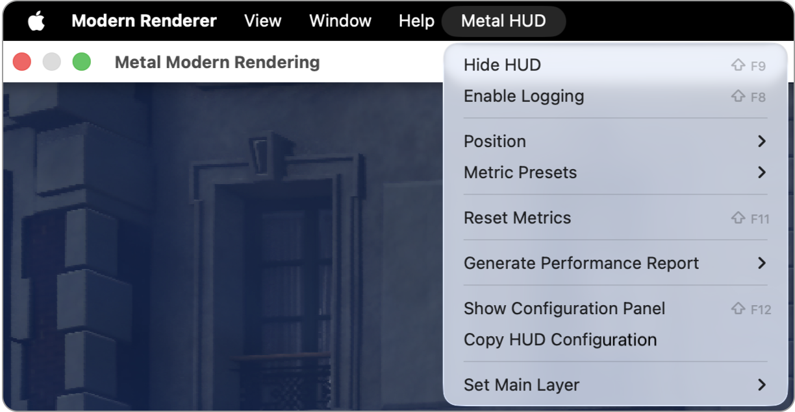
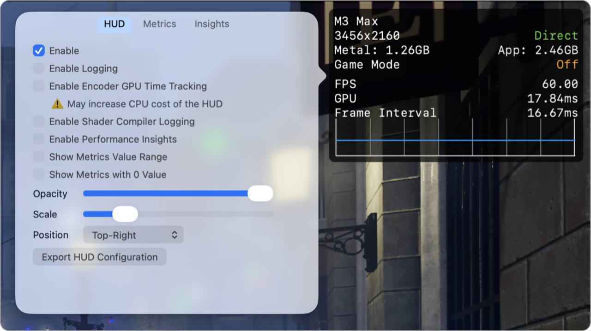
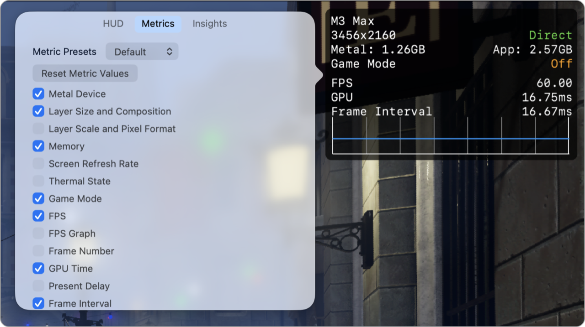
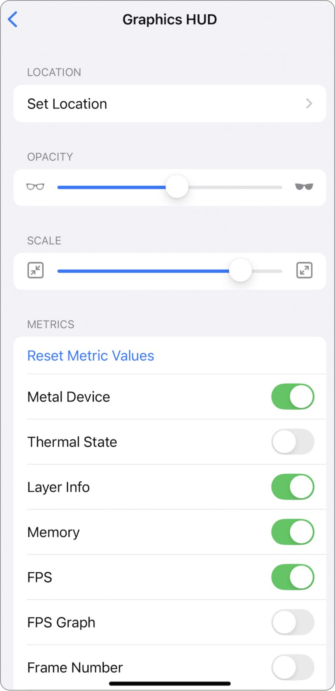
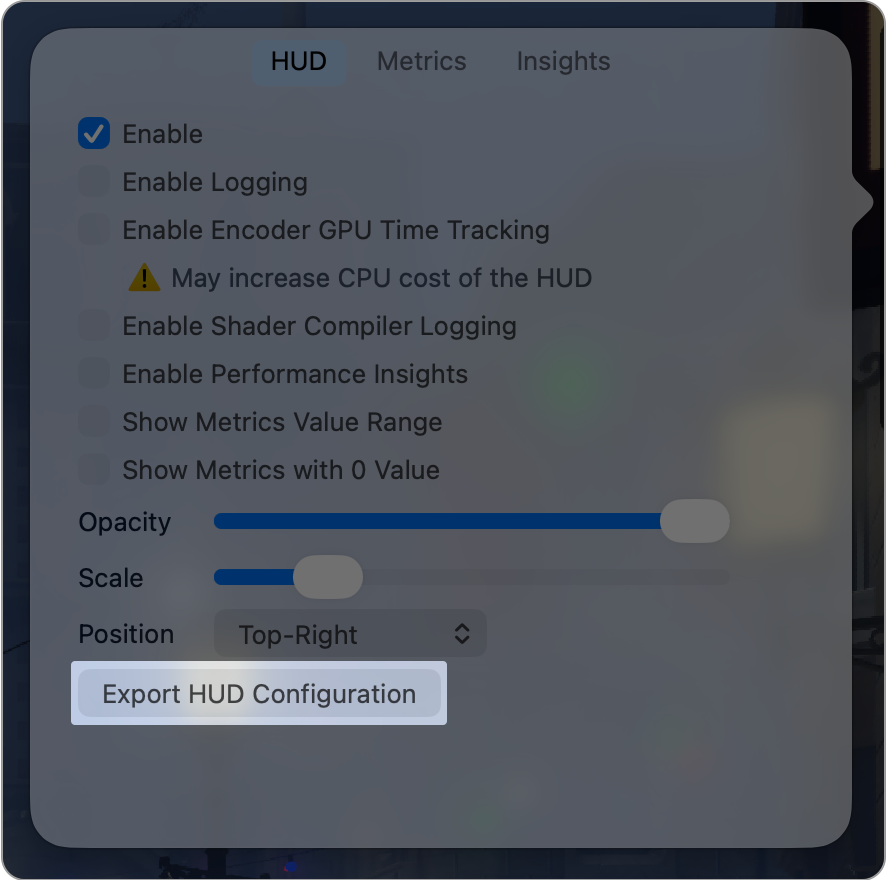
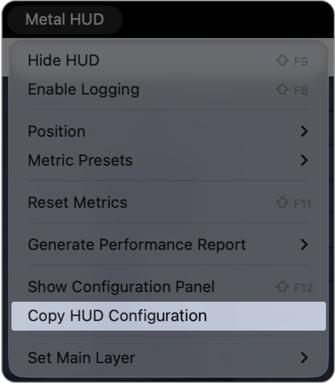

> Navigation: [Technologies](../technologies.md) · [Xcode](../xcode.md) · [Debugging](debugging.md) · [Metal developer workflows](metal-developer-workflows.md)

# Customizing the Metal Performance HUD

<sub>Article</sub>

Modify the appearance of your Metal heads-up display to monitor your graphics performance.

## Overview

You can customize the appearance of the Metal Performance HUD in a variety of ways, including its size and opacity, or change the metrics that appear in the overlay.

In macOS, you can export the HUD settings and apply them to your app at launch.

### Customize the Metal Performance HUD on macOS

When you enable the Metal Performance HUD in your app, the HUD adds a new Metal HUD menu to the menu bar.



The Metal HUD menu provides a quick way to configure the HUD, create performance reports (see  [Generating performance reports with the Metal Performance HUD](generating-performance-reports-with-metal-performance-hud.md)), and access the configuration panel.

> [!note] Note
> You can also open the configuration panel by triple-clicking the HUD overlay.

The configuration panel is where you can fully customize the HUD.

You can enable or disable various features in the `HUD` panel, such as encoder GPU time tracking (see [Monitoring your Metal app’s graphics performance](monitoring-your-metal-apps-graphics-performance.md)), or adjust the overlay’s opacity, scale, and position.



In the Metrics panel, you can see the list of available metrics in the overlay. To learn more about these metrics, see [Understanding the Metal Performance HUD metrics](understanding-metal-performance-hud-metrics.md).



In the Insights panel, enable the performance insights feature to help you find potential performance issues. This feature tracks the usage of the Metal API and highlights potential bottlenecks. To learn more, see [Gaining performance insights with the Metal Performance HUD](gaining-performance-insights-with-metal-performance-hud.md).


### Customize the Metal Performance HUD on a device

You can customize the Metal Performance HUD and logging on an iOS or iPadOS device in the Developer settings by following these steps:

1. Open the Settings app.
2. Select Developer.
3. Under Graphics HUD, click Graphics HUD to access the settings.

The following screenshot shows the options in iOS:



<sub>A screenshot of the Developer settings in iOS that highlights the toggles to enable the Metal Performance HUD overlay and logging.</sub>

> [!important] Important
> These settings apply to all apps that enable the Metal Performance HUD. You can use environment variables to override the settings when debugging from Xcode.

### Customize the Metal Performance HUD programmatically

You can customize the Metal Performance HUD programmatically by configuring the `CAMetalLayer` instance’s `developerHUDProperties` dictionary with the following:

```swift
myMetalLayer.developerHUDProperties = [
    "mode": "default",
    "logging": "default",
    "positionX": 0,
    "positionY": 0,
    // ...
]
```

| Key | Value | Discussion |
|---|---|---|
| mode | default, main, disabled | Enable or disable the Metal HUD for this layer. If your app uses multiple layers, you can set this value to `main` to make it the main layer. This is important because the system calculates certain metrics, such as GPU time, based on the presentation interval of the main layer. By default, the main layer is the first layer the app creates. |
| logging | default, disabled | Enable or disable HUD logging. |
| positionX | 0 - drawable width | The absolute X position of the Metal HUD in pixels. |
| positionY | 0 - drawable height | The absolute Y position of the Metal HUD in pixels. |

Additionally, you can add various effects by setting environment variables that the HUD supports in the dictionary, including:

- **`MTL_HUD_LOG_ENABLED=1`** — Turns on logging for per-frame statistics.
- **`MTL_HUD_LOG_SHADER_ENABLED=1`** — Turns on logging for shader compilation activities.
- **`MTL_HUD_CONFIG_FILE=<path>`** — Selects a configuration file the Metal HUD loads, which needs to be the file path the app can access.
- **`MTL_HUD_OPACITY=1.0`** — Configures the opacity of the overlay in the range `[0.0, 1.0]`. The default value is `1.0`.
- **`MTL_HUD_SCALE=0.2`** — Configures the scale of the overlay as a percentage of the drawable width in the range `[0.0, 1.0]`. The default scale is `0.2` with a minimum width of 300 pixels.
- **`MTL_HUD_ALIGNMENT=topright`** — Sets the position of the overlay. The default position is `topright`. Available options are `topleft`, `topcenter`, `topright`, `centerleft`, `centered`, `centerright`, `bottomright`, `bottomcenter`, and `bottomleft`.
- **`MTL_HUD_POSITION_X`, `MTL_HUD_POSITION_Y`** — Sets the absolute position of the overlay in pixels. Overrides `MTL_HUD_ALIGNMENT`.
- **`MTL_HUD_ELEMENTS`** — Specifies a comma-separated list of metrics that appears in the overlay. Available metric names are `device`, `rosetta`, `layersize`, `layerscale`, `memory`, `fps`, `frameinterval`, `gputime`, `thermal`, `frameintervalgraph`, `presentdelay`, `frameintervalhistogram`, `metalcpu`, `gputimeline`, `shaders`, `framenumber`, `disk`, `fpsgraph`, `toplabeledcommandbuffers`, and `toplabeledencoders`. See [Understanding the Metal Performance HUD metrics](understanding-metal-performance-hud-metrics.md) for more information.
- **`MTL_HUD_ENCODER_TIMING_ENABLED=1`** — Turns on encoder-based GPU time tracking. See [Understand encoder GPU time tracking](monitoring-your-metal-apps-graphics-performance.md#Understand-encoder-GPU-time-tracking) for more information.
- **`MTL_HUD_ENCODER_GPU_TIMELINE_FRAME_COUNT=6`** — Sets the maximum number of frames that appear in the GPU timeline.
- **`MTL_HUD_ENCODER_GPU_TIMELINE_SWAP_DELTA=1`** — Sets the update interval of the GPU timeline in seconds.
- **`MTL_HUD_SHOW_ZERO_METRICS=1`** — Makes the overlay show that metrics have a value of `0` since the app launched or since the last reset. The Metal Performance HUD enables this variable by default to hide metrics that may not be available or aren’t used in the current context.
- **`MTL_HUD_SHOW_METRICS_RANGE=1`** — Reports the range of metrics for the last 1200 frames. See [Display the value range of metrics](monitoring-your-metal-apps-graphics-performance.md#Display-the-value-range-of-metrics) for more information.
- **`MTL_HUD_INSIGHTS_ENABLED=1`** — Turns on the performance insights feature. See [Gaining performance insights with the Metal Performance HUD](gaining-performance-insights-with-metal-performance-hud.md) for more information.
- **`MTL_HUD_INSIGHT_TIMEOUT=10`** — Sets the performance insight timeout before it dissapears.
- **`MTL_HUD_INSIGHT_REPORT_INTERVAL=5`** — Sets the report interval of the performance insights in seconds. The Metal Performance HUD reports performance insights if half of the frames during this interval show a particular pattern.
- **`MTL_HUD_RUSAGE_UPDATE_INTERVAL=3`** — Sets the system resource usage update interval in seconds.
- **`MTL_HUD_METRIC_TIMEOUT=5`** — Sets the timeout of transient metrics in seconds. The Metal Performance HUD automatically hides transient metrics, such as MetalFX metrics, when you disable MetalFX.
- **`MTL_HUD_REPORT_URL=\<path>`** — Sets an app writable path where the system writes performance reports to. See [Generating performance reports with the Metal Performance HUD](generating-performance-reports-with-metal-performance-hud.md) for more information.
- **`MTL_HUD_DISABLE_MENU_BAR=1`** — Disables the Metal Performance HUD menu item.

### Save and load the Metal Performance HUD configuration

You can save your custom Metal Performance HUD configuration by clicking the Export HUD Configuration button in the configuration panel.



The configuration file is a property list file containing key-value pairs of environment variables, and you can pass it into the HUD by setting the `MTL_HUD_CONFIG_FILE` environment variable.

```
export MTL_HUD_CONFIG_FILE=<path>
```

Alternatively, you can use the Copy HUD Configuration option in the Metal HUD menu, which exports the current state of the HUD with a list of environment variables that you can pass to your app at launch.



## See Also

### Runtime diagnostics

- [Inspecting live resources at runtime](inspecting-live-resources-at-runtime.md) — Validate your resources by viewing the contents of your textures and buffers while debugging your Metal app.
- [Validating your app’s Metal API usage](validating-your-apps-metal-api-usage.md) — Catch runtime issues in your Metal app using API Validation.
- [Validating your app’s Metal shader usage](validating-your-apps-metal-shader-usage.md) — Catch common shader runtime issues using Shader Validation.
- [Monitoring your Metal app’s graphics performance](monitoring-your-metal-apps-graphics-performance.md) — Catch performance issues using the Metal Performance HUD while your app runs.
- [Understanding the Metal Performance HUD metrics](understanding-metal-performance-hud-metrics.md) — Learn what each of the metrics reported by the heads-up display indicates.
- [Gaining performance insights with the Metal Performance HUD](gaining-performance-insights-with-metal-performance-hud.md) — Catch potential performance issues while your app runs using the Metal heads-up display.
- [Generating performance reports with the Metal Performance HUD](generating-performance-reports-with-metal-performance-hud.md) — Record your app’s performance using the heads-up display.
