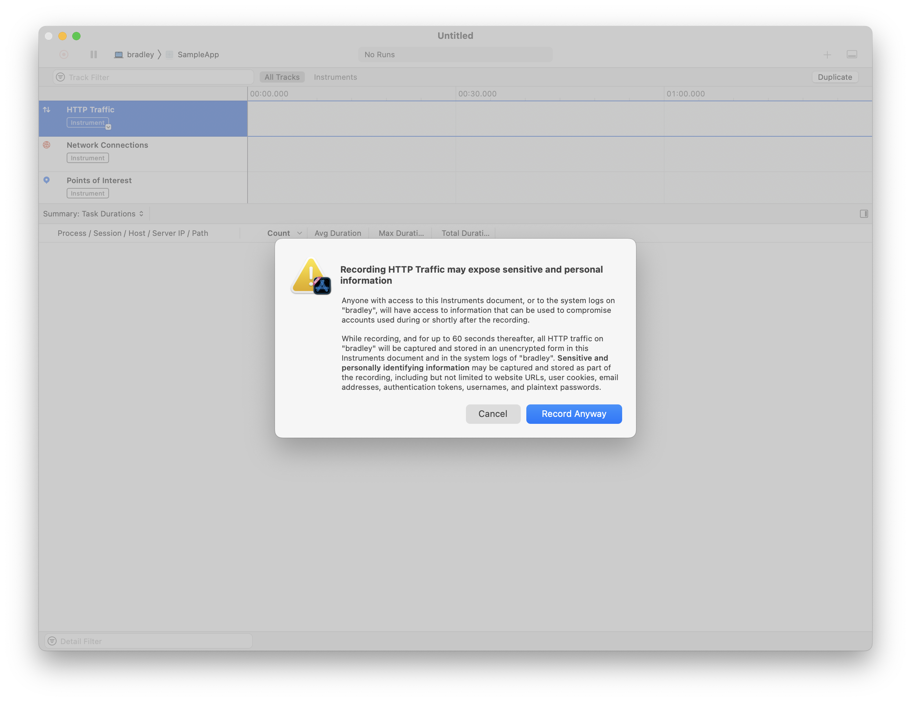
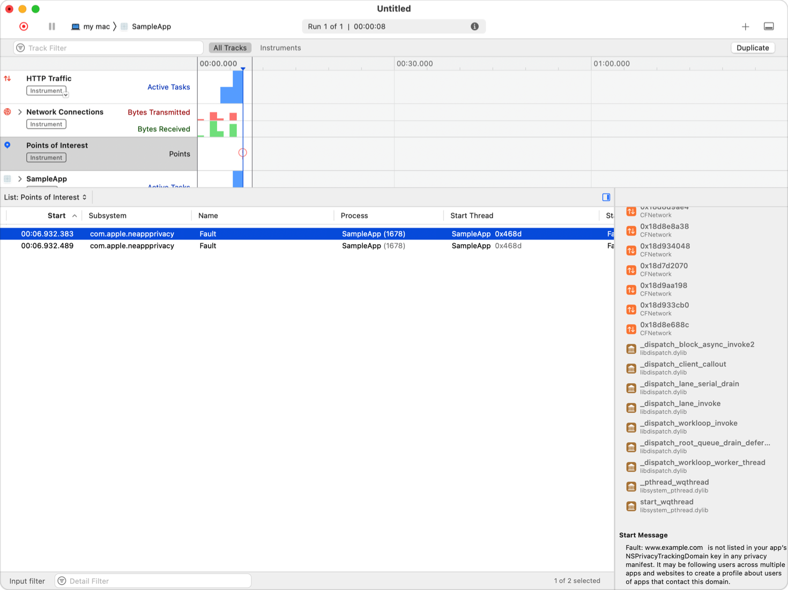

> Navigation: [Technologies](../technologies.md) · [Xcode](../xcode.md) · [Debugging](debugging.md)

# Detecting when your app contacts domains that may be profiling users

Article

Use Instruments to assess whether your app or its third-party SDKs connect to domains that may profile users.

## Overview

The operating system maintains a list of DNS domains that may be following people across multiple apps and websites to combine their activity into a profile. Use Instruments to discover whether your app contacts these domains — because of code you wrote or code that’s included in a third-party SDK your app links to — so that you can assess whether the domains are used for tracking as defined under the App Tracking Transparency framework. For more information, see [User Privacy and Data Use](https://developer.apple.com/app-store/user-privacy-and-data-use/).

### Analyze your app’s networking behavior

Xcode and Instruments provide the tools you need to analyze your app’s network connections. In particular, you use Instruments to record HTTP traffic to and from your app, and the later analyze that for any unexpected activity. Follow these steps:

1. Open your app project in Xcode.
2. Choose Product \> Profile. Xcode builds your app for profiling, and opens it in Instruments.
3. In Instruments, choose the Network template.
4. Click Record.
5. Instruments presents an alert, warning you that recording HTTP traffic may expose sensitive and personal information. If you accept this risk, click Record Anyway. Instruments launches your app, and begins profiling.
6. Exercise the features of your app.
7. When you’re done, switch back to Instruments and click Stop.

### Review your app’s connections to domains that may be profiling users

When your app makes an HTTP request to a domain on the operating system list of DNS domains that may be following people across multiple apps and websites to combine their activity into a profile, the Points of Interest instrument records the activity. A fault pin in the Points on Interest track in the timeline shows when your app made a request to the domain.

In Instruments, select the Points of Interest track. The Detail area shows a list of the occasions when your app made HTTP requests to these domains. Select the entry in the Start column for a point of interest to move the tracking head to that time. Instruments focuses on the time your app made the HTTP request, so you can explore other tracks to learn more about your app’s behavior when it made the request. For more information on using Instruments to analyze HTTP traffic, see [Analyzing HTTP traffic with Instruments](../foundation/analyzing-http-traffic-with-instruments.md).

A screenshot of Instruments, showing points of interest in the timeline where the app has contacted domains that may be following people across multiple apps and websites to combine their activity into a profile. A point of interest is selected in the detail view.

### Declare tracking domains in your app’s privacy manifest

If you determine that the domains your app connects to are using data sent from your app to track people, declare them in your privacy manifest and ask for permission to track under the App Tracking Transparency framework. For more information, see [User Privacy and Data Use](https://developer.apple.com/app-store/user-privacy-and-data-use/). The operating system blocks network requests to declared tracking domains when the user has not granted tracking permission.

If you are not expecting your app to track, consider removing the code or contacting the third-party SDK developer whose code is contacting the domain. If the third-party SDK has a privacy manifest, the manifest may also provide you with details about whether the third-party SDK is engaged in tracking. For more information, see [Describing data use in privacy manifests](../bundleresources/describing-data-use-in-privacy-manifests.md).

## See Also

### Debugging strategies

- [Diagnosing issues in the appearance of a running app](diagnosing-issues-in-the-appearance-of-your-running-app.md) — Inspect your running app to investigate issues in the appearance and placement of the content it displays.
- [Diagnosing memory, thread, and crash issues early](diagnosing-memory-thread-and-crash-issues-early.md) — Identify runtime crashes and undefined behaviors in your app during testing using Xcode’s sanitizer tools.
- [Analyzing HTTP traffic with Instruments](../foundation/analyzing-http-traffic-with-instruments.md) — Measure HTTP-based network performance and usage of your apps.
