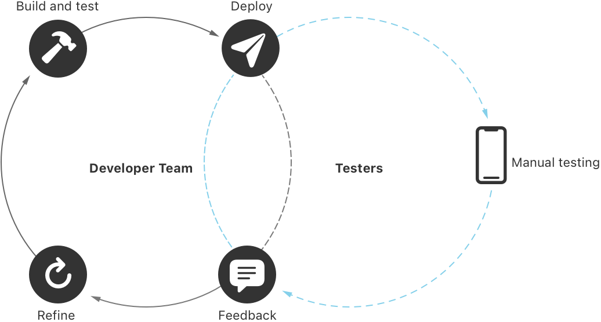
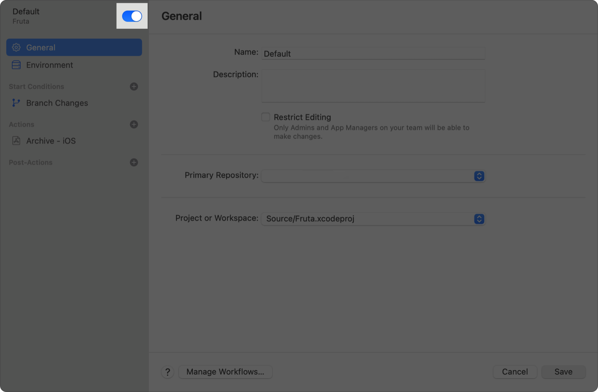
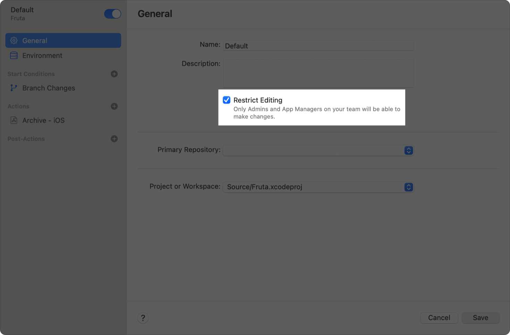

> Navigation: [Technologies](../technologies.md) · [Xcode](../xcode.md) · [Xcode Cloud](xcode-cloud.md)

# Developing a workflow strategy for Xcode Cloud

Article

Review how you can best create custom Xcode Cloud workflows to refine your continuous integration and delivery practice.

## Overview

With Xcode, you can configure your project or workspace to use Xcode Cloud, create a first workflow, and start your first build. After Xcode Cloud successfully completes the first build, review how you can best create custom Xcode Cloud workflows to practice continuous integration and delivery (CI/CD). Then, plan next steps for refining your CI/CD practice to make sure your app or framework is always in a releasable state.

A figure that shows the iterative continuous integration and delivery practice of building, testing, distributing, and gathering feedback to fix issues and verify changes.

If you’re new to CI/CD, see [About continuous integration and delivery with Xcode Cloud](about-continuous-integration-and-delivery-with-xcode-cloud.md) to learn how CI/CD with Xcode Cloud helps you create high-quality apps and frameworks. To learn more about creating your first workflow, see [Configuring your first Xcode Cloud workflow](configuring-your-first-xcode-cloud-workflow.md).

For additional information about Xcode Cloud workflows, see [Xcode Cloud workflow reference](xcode-cloud-workflow-reference.md), [Explore Xcode Cloud workflows](https://developer.apple.com/wwdc21/10268) and [Customize your advanced Xcode Cloud workflows](https://developer.apple.com/wwdc21/10269).

### Plan next steps

The number of Xcode Cloud workflows you create depends on factors like the complexity of your project and the size of your team. For example, consider a solo developer who works on an iOS app. They can create a workflow that builds their app and runs unit tests for every change to a branch. Additionally, they might create a second workflow that runs tests on other Apple devices in Simulator, archives the app, and distributes a new version to testers with [TestFlight](https://developer.apple.com/testflight/) each time they create a new Git tag.

In contrast, consider a team in a corporate context that develops an app that’s available on all Apple platforms. The team might create several workflows that:

- Build various projects in a workspace and run unit tests on one simulated device per platform
- Perform additional, long-running tests once a week
- Automatically distribute nightly builds to members of the development team
- Distribute new versions to the QA team every two weeks

Although there’s no one-size-fits-all approach to CI/CD, following these steps to adopt CI/CD over time is a good strategy to consider:

1. Identify what a comprehensive CI/CD practice looks like for you. For example, list all verifications you want Xcode Cloud to perform.
2. Translate your comprehensive CI/CD practice into Xcode Cloud workflows. For example, if you want to distribute a new version of your app to testers every week, that task can translate to one workflow.
3. Plan the necessary work as individual tasks and work on each workflow one by one until you have a comprehensive CI/CD practice in place.

### Edit and create workflows

By adopting CI/CD, managing Xcode Cloud workflows becomes part of your day-to-day app development. To help you stay focused and make using Xcode Cloud convenient, edit your Xcode Cloud workflows with Xcode.

To update an existing workflow in Xcode:

1. Choose Integrate \> Manage Workflows to open the Manage Workflows sheet.
2. Double-click to open the existing workflow.

Alternatively, Control-click a workflow in the Report navigator and choose Edit Workflow.

To create a workflow in Xcode, choose Integrate \> Create Workflow.

### Deactivate a workflow instead of deleting it

Eventually, you might want to stop using a certain workflow. One way to do this is to delete the workflow in the Manage Workflows sheet. However, deleting a workflow permanently deletes its build history and artifacts. Only delete a workflow when you’re confident that you don’t need that information anymore. Instead of deleting a workflow, deactivate it to preserve its build history and artifacts.

To deactivate a workflow:

1. Control-click the workflow in the Report navigator and choose Edit Workflow.
2. Toggle the switch next to the workflow’s name in the top-left corner of the sheet to the Off position and save your changes.

Alternatively, deactivate a workflow by Control-clicking it in the Manage Workflows sheet and choosing Deactivate, or by deactivating it in the Xcode Cloud tab on the App Store Connect website.

To start using a deactivated workflow again, reactivate it any time in the Manage Workflows sheet, or open the workflow and toggle the switch next to its name to the On position.

A screenshot of a workflow in Xcode with a highlighted area for the switch you can use to activate or deactivate the workflow.

### Duplicate a workflow before making significant changes

When you edit a workflow, a change might unintentionally cause the next build to fail. If this happens, you can undo your changes to the workflow as needed and start a build to verify whether it completes successfully. However, this can take a great deal of time if you make significant changes to a workflow.

To avoid costly mistakes and avoid impacting coworkers who may use a workflow, duplicate a workflow before you make significant changes to it. Then, use the duplicate to test a change without impacting coworkers.

To copy an existing workflow:

1. Open your project or workspace in Xcode, and then choose Integrate \> Manage Workflows to open the Manage Workflows sheet.
2. Control-click the workflow you want to change and choose Duplicate to open a copy.
3. Rename the copy to make sure you can distinguish it from the original.
4. Save the duplicated workflow.

> [!note] Note
> A new workflow is active by default. As a result, Xcode Cloud runs both the original workflow and the duplicate unless you deactivate one of them or change either workflow’s start conditions.

### Restrict who can edit a workflow

Depending on the complexity of your project, creating a workflow and making sure Xcode Cloud can successfully build your project can take a significant amount of time. To prevent team members from making unintentional changes to a workflow, restrict who can edit it using these steps:

1. Open the workflow in Xcode or on the [App Store Connect](https://appstoreconnect.apple.com) website.
2. Navigate to the General section, and select the Restrict Editing checkbox.

As a result, only members of your team with the Admin or App Manager role can make changes to that workflow.

A screenshot that shows a workflow in Xcode. The General section is visible and the checkbox next to Restrict Editing is selected.

### Manage workflows in App Store Connect

In some cases — especially for large teams and in a corporate context — a team member may be more familiar with [App Store Connect](https://appstoreconnect.apple.com). To address use cases like this, you can create and edit workflows in App Store Connect after you configure your Xcode project or workspace to use Xcode Cloud.

To manage workflows in App Store Connect:

1. Open your app’s page and click the Xcode Cloud tab.
2. Click Manage Workflows in the sidebar to display a list of your workflows.
3. Click the More Options button (…) next to a workflow and choose the action you want to perform. For example, choose Edit to make changes to a workflow.

## See Also

### Workflows

- [Xcode Cloud workflow reference](xcode-cloud-workflow-reference.md) — Configure metadata, start conditions, actions, post-actions, and more to create custom Xcode Cloud workflows.
- [Creating a workflow that builds your app for distribution](creating-a-workflow-that-builds-your-app-for-distribution.md) — Configure a workflow to build and sign your app for distribution to testers with TestFlight, in the App Store, or as a notarized app.
- [Understanding Xcode Cloud infrastructure validation builds](understanding-infrastructure-validation-builds.md) — Learn about infrastructure validation builds and whether you need to opt out.
