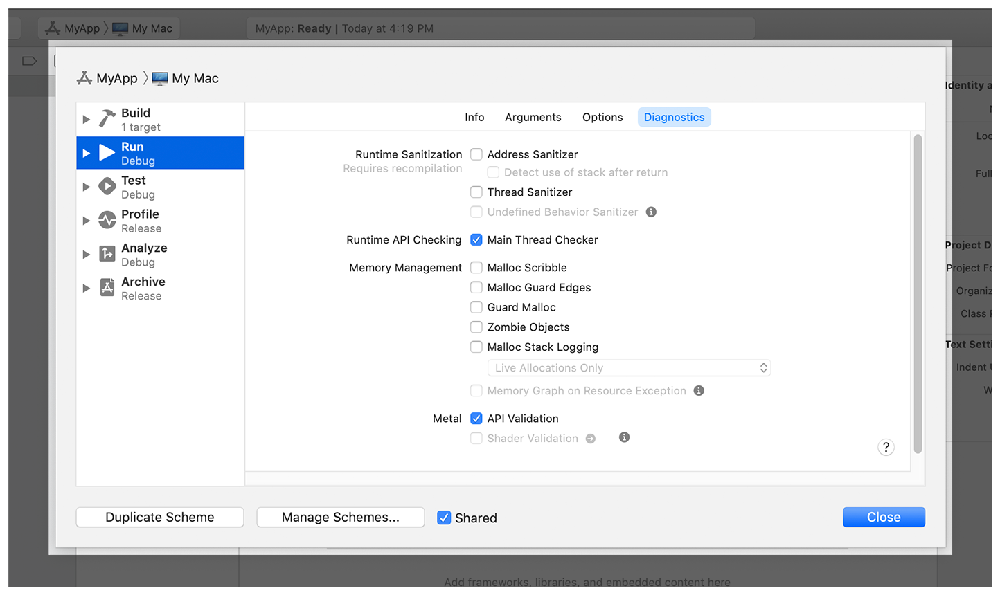

> Navigation: [Technologies](../technologies.md) · [Xcode](../xcode.md) · [Debugging](debugging.md)

# Diagnosing memory, thread, and crash issues early

Identify runtime crashes and undefined behaviors in your app during testing using Xcode’s sanitizer tools.

## Overview

Identifying potential issues during development saves testing time later and improves the stability of your code. Xcode provides several runtime tools to identify potential issues in your code:

- Address Sanitizer—The ASan tool identifies potential memory-related corruption issues.
- Thread Sanitizer—The TSan tool detects race conditions between threads.
- Main Thread Checker—This tool verifies that system APIs that must run on the main thread actually do run on that thread.
- Undefined Behavior Sanitizer—The UBSan tool detects divide-by-zero errors, attempts to access memory using a misaligned pointer, and other undefined behaviors.

These are LLVM-based tools that add specific checks to your code. You enable them at build time using the Xcode scheme editor. Select the appropriate scheme for your project and choose Product \> Scheme \> Edit Scheme to display the scheme editor. Select the Run or Test schemes, navigate to the Diagnostics section, and select the sanitizers you want to run.

> [!note] Note
> The sanitizer tools support all C-based languages. The tools also support the Swift language, with the exception of the Undefined Behavior Sanitizer tool, which supports only C-based languages.

Test your app with sanitizer tools enabled to catch otherwise difficult to catch bugs. Test your code using a comprehensive set of unit tests, and use additional integration and UI tests to exercise additional code at runtime. The `Address Sanitizer`, `Thread Sanitizer`, `Undefined Behavior Sanitizer`, and `Main Thread Checker` values of a test plan configuration enable these sanitizers during test runs, see [Improving code assessment by organizing tests into test plans](organizing-tests-to-improve-feedback.md).  For more information about testing your code, see [Testing](testing.md).

### Locate memory corruption issues in your code

Accessing memory improperly can introduce unexpected issues into your code, and even pose a security threat. The Address Sanitizer tool detects memory-access attempts that don’t belong to an allocated block. To enable this tool, select Address Sanitizer from the Diagnostics section of the appropriate scheme.


To enable ASan from the command line, use the following flags:

- `-fsanitize=address` (clang)
- `-sanitize=address` (swiftc)
- `-enableAddressSanitizer YES` (xcodebuild)

The Address Sanitizer tool replaces the `malloc(_:)` and `free(_:)` functions with custom implementations. The custom `malloc(_:)` function surrounds a requested memory block with special off-limits regions, and reports attempts to access those regions. The `free(_:)` function places a deallocated block into a special quarantine queue, and reports attempts to access that quarantined memory.

> [!important] Important
> Address Sanitizer doesn’t detect memory leaks, attempts to access uninitialized memory, or integer overflow errors. Use Instruments and the other sanitizer tools to find additional errors.

For most use cases, the overhead that Address Sanitizer adds to your code should be acceptable for daily development. Running your code with Address Sanitizer increases memory usage by two to three times, and also adds 2x to 5x slowdown of your code. To improve your code’s memory usage, compile your code with the `-O1` optimization.

### Detect data races among your app’s threads

Race conditions occur when multiple threads access the same memory without proper synchronization. Race conditions are difficult to detect during regular testing because they don’t occur consistently. However, fixing them is important because they cause your code to behave unpredictably, and may even lead to memory corruption.

To detect race conditions and other thread-related issues, enable the Thread Sanitizer tool from the Diagnostics section of the appropriate build scheme.


To enable TSan from the command line, use the following flags:

- `-fsanitize=thread` (clang)
- `-sanitize=thread` (swiftc)
- `-enableThreadSanitizer YES` (xcodebuild)

The Thread Sanitizer tool inserts diagnostics into your code to record each memory read or write operation. These diagnostics generate a timestamp for each operation, as well as its location in memory. The tool then reports any operations that occur at the same location at approximately the same time. The tool also detects other thread-related bugs, such as uninitialized mutexes and thread leaks.

> [!important] Important
> You can’t use Thread Sanitizer to diagnose iOS, iPadOS, tvOS, visionOS, and watchOS apps running on a device. Use Thread Sanitizer only on your 64-bit macOS app, or to diagnose your 64-bit iOS, iPadOS, tvOS, visionOS, or watchOS app running in Simulator.

Because Thread Sanitizer inserts diagnostics into your code, it increases memory usage by five to ten times. Running your code with these diagnostics also introduces a 2x to 20x slowdown of your app. To improve your code’s memory usage, compile your code with the `-O1` optimization.

### Detect improper UI updates on background threads

Some system frameworks contain APIs that you must only call from your app’s main thread. This requirement applies to most of the AppKit and UIKit user interface APIs, and also applies to some other system APIs. Calling these APIs from the main thread prevents race conditions by serializing the execution of the associated tasks. Failure to perform these operations on the main thread may result in visual defects, data corruption, or crashes.

The Main Thread Checker tool ensures that all calls that must occur on the main thread do so. To enable this tool, select Main Thread Checker from the Diagnostics section of the appropriate scheme.



The Main Thread Checker tool dynamically replaces system methods that must execute on the main thread with variants that check the current thread. The tool replaces only system APIs with well-known thread requirements, and doesn’t replace all system APIs. Because the replacements occur in system frameworks, Main Thread Checker doesn’t require you to recompile your app.

> [!note] Note
> Because Main Thread Checker doesn’t require you to recompile your code, you can run it on an existing macOS binary. Inject the dynamic library located at `/Applications/Xcode.app/Contents/Developer/usr/lib/libMainThreadChecker.dylib` into your executable.

To fix problems identified by Main Thread Checker, dispatch calls to your app’s main thread. The most common place where main thread errors occur is completion handler blocks. The following code wraps the text label modification with an asynchronous dispatch call to the main thread.

```swift
let task = URLSession.shared.dataTask(with: url) { (data, response, error) in
   if let data = data {
      // Redirect to the main thread.
      DispatchQueue.main.async {
         self.label.text = "\(data.count) bytes downloaded"
      }
   }
}
task.resume()

```

The performance impact of Main Thread Checker is minimal. The tool adds 1–2% CPU overhead to your process, and increases process launch time by no more than 100 milliseconds. Because of this minimal impact, Xcode enables Main Thread Checker by default for your development-related schemes.

### Detect operations with undefined semantics

Code that results in undefined behavior can lead to crashes or incorrect output. In some cases, the code may not result in any problems at all initially, making it even harder to diagnose the problem later when conditions are different. The Undefined Behavior Sanitizer tool checks C-based code for a variety of common runtime errors, including:

- Attempts to divide by zero
- Attempts to load memory from a misaligned pointer
- Attempts to dereference a `NULL` pointer
- Math operations that result in integer overflow

To enable this tool, select Undefined Behavior Sanitizer from the Diagnostics section of the appropriate scheme.


To enable UBSan from the command line, add the `-fsanitize=undefined` option in clang or the `enableUndefinedBehaviorSanitizer YES` option in xcodebuild. To enable individual sanitizer checks, use the following options:

| Compiler flag | UBSan check |
|---|---|
| `-fsanitize=alignment` | [Misaligned pointer](misaligned-pointer.md) |
| `-fsanitize=bool` | [Invalid Boolean value](invalid-boolean.md) |
| `-fsanitize=bounds` | [Out-of-bounds array access](out-of-bounds-array-access.md) |
| `-fsanitize=enum` | [Invalid enumeration value](invalid-enumeration-value.md) |
| `-fsanitize=vptr` | [Dynamic type violation](dynamic-type-violation.md) |
| `-fsanitize=integer-divide-by-zero` | [Division by zero](division-by-zero.md) |
| `-fsanitize=float-divide-by-zero` | [Division by zero](division-by-zero.md) |
| `-fsanitize=float-cast-overflow` | [Invalid float cast](invalid-float-cast.md) |
| `-fsanitize=nonnull-attribute` | [Nonnull argument violation](nonnull-argument-violation.md) |
| `-fsanitize=nullability-arg` | [Nonnull argument violation](nonnull-argument-violation.md) |
| `-fsanitize=nullability-assign` | [Nonnull variable assignment violation](nonnull-variable-assignment-violation.md) |
| `-fsanitize=returns-nonnull-attribute` | [Nonnull return value violation](nonnull-return-value-violation.md) |
| `-fsanitize-nullability-return` | [Nonnull return value violation](nonnull-return-value-violation.md) |
| `-fsanitize=null` | [Null reference creation and null pointer dereference](null-reference-creation-and-null-pointer-dereference.md) |
| `-fsanitize=object-size` | [Invalid object size](invalid-object-size.md) |
| `-fsanitize=shift` | [Invalid shift](invalid-shift.md) |
| `-fsanitize=signed-integer-overflow` | [Integer overflow](integer-overflow.md) |
| `-fsanitize=unreachable` | [Reaching of unreachable point](reaching-of-unreachable-point.md) |
| `-fsanitize=vla-bound` | [Invalid variable-length array](invalid-variable-length-array.md) |

The Undefined Behavior Sanitizer tool inserts diagnostics into your code at compile time. The nature of these checks differs according to the type of operation. For example, before performing a mathematical operation on an integer value, the tool adds a check to determine if the operation triggers an integer overflow.

The performance impact of Undefined Behavior Sanitizer is minimal. The tool adds an average of 20% CPU overhead to the debug version of your app.

## Topics

### Address Sanitizer

- [Use of deallocated memory](use-of-deallocated-memory.md) — Detects the use of deallocated memory.
- [Deallocation of deallocated memory](deallocation-of-deallocated-memory.md) — Detects attempts to free deallocated memory.
- [Deallocation of nonallocated memory](deallocation-of-nonallocated-memory.md) — Detects attempts to free nonallocated memory.
- [Use of stack memory after function return](use-of-stack-memory-after-function-return.md) — Detects when you access stack variable memory after its declaring function returns.
- [Use of out-of-scope stack memory](use-of-out-of-scope-stack-memory.md) — Detects access to variables outside of their declared scope.
- [Overflow and underflow of buffers](overflow-and-underflow-of-buffers.md) — Detects when you access memory outside of a buffer’s boundaries.
- [Overflow of C++ containers](overflow-of-c-containers.md) — Detects when you access a C++ container outside its bounds.

### Thread Sanitizer

- [Data races](data-races.md) — Detects unsynchronized access to mutable state across multiple threads.
- [Swift access races](swift-access-races.md) — Detects unsynchronized access to mutable state across multiple threads in Swift.
- [Races on collections and other APIs](races-on-collections-and-other-apis.md) — Detects when one thread accesses a mutable object while another thread is writing to it.
- [Uninitialized mutexes](uninitialized-mutexes.md) — Detects when you use an uninitialized mutex.
- [Thread leaks](thread-leaks.md) — Detects when you don’t close threads after use.

### Undefined Behavior Sanitizer

- [Misaligned pointer](misaligned-pointer.md) — Detects when code accesses a misaligned pointer or creates a misaligned reference.
- [Invalid Boolean value](invalid-boolean.md) — Detects when a program accesses a Boolean variable and its value isn’t true or false.
- [Out-of-bounds array access](out-of-bounds-array-access.md) — Detects out-of-bounds access of arrays.
- [Invalid enumeration value](invalid-enumeration-value.md) — Detects when an enumeration variable has an invalid value.
- [Reaching of unreachable point](reaching-of-unreachable-point.md) — Detects when a program reaches an unreachable point.
- [Dynamic type violation](dynamic-type-violation.md) — Detects when an object has the wrong dynamic type.
- [Invalid float cast](invalid-float-cast.md) — Detects out-of-range casts to, from, or between floating-point types.
- [Division by zero](division-by-zero.md) — Detects division where the divisor is zero.
- [Nonnull argument violation](nonnull-argument-violation.md) — Detects when an argument incorrectly receives a null value.
- [Nonnull return value violation](nonnull-return-value-violation.md) — Detects when a function incorrectly returns null.
- [Nonnull variable assignment violation](nonnull-variable-assignment-violation.md) — Detects when you incorrectly assign null to a variable.
- [Null reference creation and null pointer dereference](null-reference-creation-and-null-pointer-dereference.md) — Detects the creation of null references and null pointer dereferences.
- [Invalid object size](invalid-object-size.md) — Detects invalid pointer casts due to differences in the sizes of types.
- [Invalid shift](invalid-shift.md) — Detects invalid and overflowing shifts.
- [Integer overflow](integer-overflow.md) — Detects overflow in arithmetic.
- [Invalid variable-length array](invalid-variable-length-array.md) — Detects negative array bounds.

## See Also

### Debugging strategies

- [Diagnosing issues in the appearance of a running app](diagnosing-issues-in-the-appearance-of-your-running-app.md) — Inspect your running app to investigate issues in the appearance and placement of the content it displays.
- [Analyzing HTTP traffic with Instruments](../foundation/analyzing-http-traffic-with-instruments.md) — Measure HTTP-based network performance and usage of your apps.
- [Detecting when your app contacts domains that may be profiling users](detecting-when-your-app-contacts-domains-that-may-be-profiling-users.md) — Use Instruments to assess whether your app or its third-party SDKs connect to domains that may profile users.
