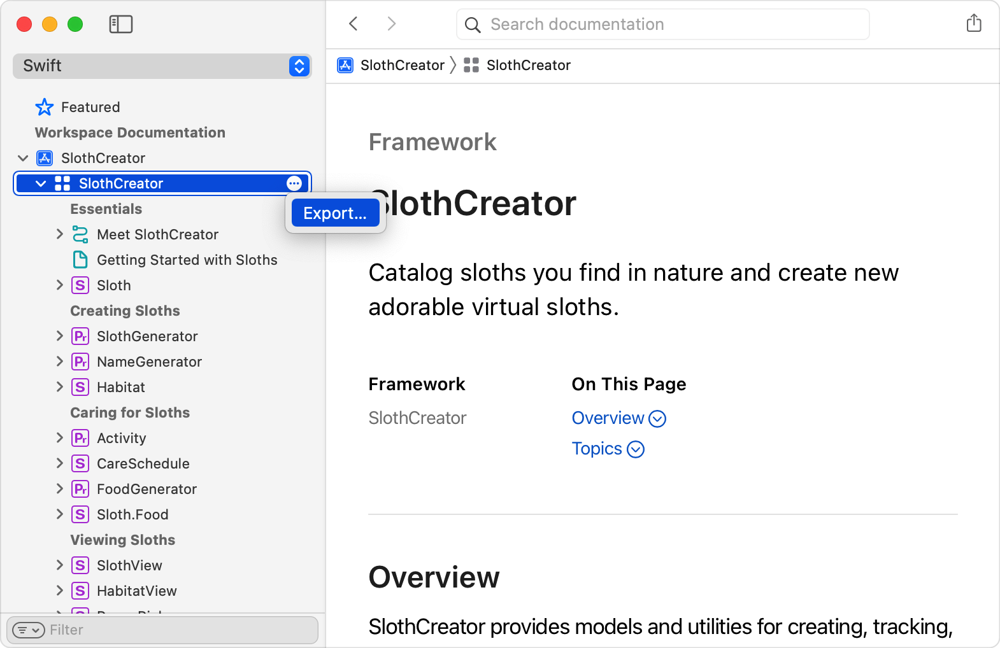
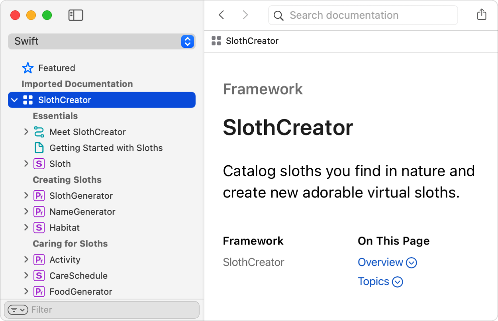

> Navigation: [Technologies](../technologies.md) · [Xcode](../xcode.md) · [Writing documentation](writing-documentation.md)

# Distributing documentation to other developers

<sub>Article</sub>

Share your documentation directly with Xcode users or host it on a web server.

## Overview

As soon as you create a project in Xcode, DocC is ready to generate structured documentation for the symbols in your project. Whether you only have documentation comments in your source files, or you craft a full learning experience that includes articles and tutorials, Xcode provides a convenient way to share the documentation in your project with other developers.

To share your documentation, you create a _documentation archive_, a self-contained bundle that has everything you need, including:

- Compiled documentation from in-source comments, articles, tutorials, and resources
- A single-page web app that renders the documentation

Distributing your documentation involves the following steps:

1. Export your documentation, either from Xcode’s documentation viewer, or by using the `xcodebuild` command-line tool.
2. Share your documentation, either directly with Xcode users who open it in the documentation viewer, or by hosting it on a website.

### Generate a publishable archive of your documentation

To create a documentation archive, you export the documentation from the documentation viewer or use the `xcodebuild docbuild` command-line tool. Using `xcodebuild` allows you to integrate with a continuous integration (CI) workflow.

To export a documentation archive from Xcode’s documentation viewer:

1. Hold the pointer over your compiled documentation catalog in the Workspace Documentation section to display the More button.
2. Click the More button and choose the Export menu item. Alternatively, invoke the context menu on the documentation catalog item to access the Export menu.
3. Select a location for the documentation archive, and click Export.



The documentation archive that Xcode exports uses a `.doccarchive` file extension.

To export the documentation archive from the command line, run `xcodebuild docbuild` in Terminal and copy the resulting `.doccarchive` bundle from the derived data directory. Depending on your project’s configuration, you may need to pass additional command-line options. For additional information, consult the `xcodebuild` man page.

For example, to build a documentation archive, use a command similar to the following:

```shell
xcodebuild docbuild -scheme SlothCreator -derivedDataPath ~/Desktop/SlothCreatorBuild
```

> [!tip] Tip
> Although `-derivedDataPath` isn’t a required option, including it makes it easier for an automated script to identify the build output and find the resulting `.doccarchive` bundle.

As part of the build process, `xcodebuild` produces many files in the derived data path. One way to locate the documentation archive in the build output is to use the `find` command. For example, use the following to locate the documentation archive that the `xcodebuild` command above produces:

```shell
find ~/Desktop/SlothCreatorBuild -type d -name '*.doccarchive`
```

### Send a documentation archive directly to developers

Because a documentation archive is a self-contained bundle, you can easily share it with other developers. For example, you can send it by email just like a regular document, include it with a binary distribution of your product, or make it downloadable from a website. When the recipient opens the documentation archive, Xcode adds it to the Imported Documentation section of the documentation viewer.



<sub>A screenshot of the Xcode documentation viewer that shows a documentation archive for a SlothCreator project in a selected state in the Imported Documentation section.</sub>

To remove an imported documentation archive, hold the pointer over the item to display the More button, and then choose Remove.

### Host a documentation archive on your website

When Xcode exports a documentation archive, it includes a single-page web app in the bundle. This web app renders the documentation content as HTML, letting you host the documentation archive on a web server.

For reference documentation and articles, the web app uses a URL path that begins with `/documentation`. For tutorials, the URL path begins with `/tutorials`. For example, if a project contains a protocol with the name `SlothGenerator`, the URL to view the `SlothGenerator` documentation might resemble the following:

```
https://www.example.com/documentation/SlothCreator/SlothGenerator
```

#### Host a documentation archive with a file server

You can host documentation archives you create with Xcode 14.3 and later using a regular file server. By default, the server hosts the documentation at the root of the website, like the SlothCreator example above. To host the documentation at a specific subpath, configure a custom [DocC Archive Hosting Base Path](build-settings-reference.md#DocC-Archive-Hosting-Base-Path) before you build the documentation archive.

#### Host a documentation archive using custom routing

A file server is the recommended solution to host your documentation. But, if you need more control over how the server hosts your content, you can configure the request routing of your web server so it responds to documentation requests with the data and assets within the documentation archive.

> [!note] Note
> The following sections use Apache as an example. Other web server installations have similar mechanisms. Consult your server’s documentation for details about performing similar configurations.

To host a documentation archive on your website, do the following:

1. Copy the documentation archive to the directory that your web server uses to serve files. In this example, the documentation archive is `SlothCreator.doccarchive`.
2. Add a rule on the server to rewrite incoming URLs that begin with `/documentation` or `/tutorial` to `SlothCreator.doccarchive/index.html`.
3. Add another rule for incoming requests to support bundled resources in the documentation archive, such as CSS files and image assets.

The following example `.htaccess` file defines rules suitable for use with Apache:

```shell
# Enable custom routing.
RewriteEngine On

# Route documentation and tutorial pages.
RewriteRule ^(documentation|tutorials)\/.*$ SlothCreator.doccarchive/index.html [L]

# Route files and data for the documentation archive.
#
# If the file path doesn't exist in the website's root ...
RewriteCond %{REQUEST_FILENAME} !-f
RewriteCond %{REQUEST_FILENAME} !-d

# ... route the request to that file path with the documentation archive.
RewriteRule .* SlothCreator.doccarchive/$0 [L]
```

With these rules in place, the web server provides access to the contents of the documentation archive.

After configuring your web server to host a documentation archive, keep it up to date by using a continuous integration workflow that builds the documentation archive using `xcodebuild docbuild`, and copies the resulting `.doccarchive` to your web server.
