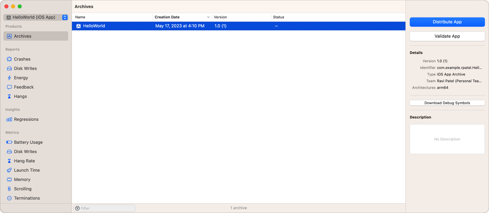
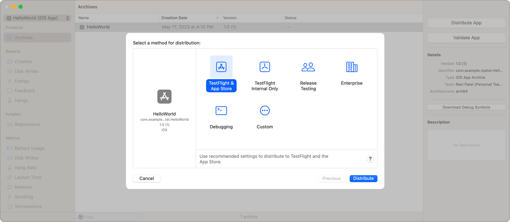
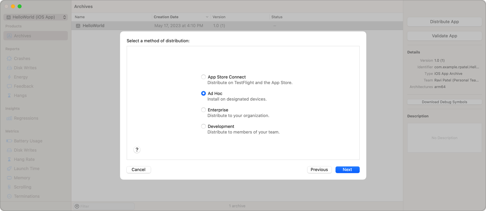
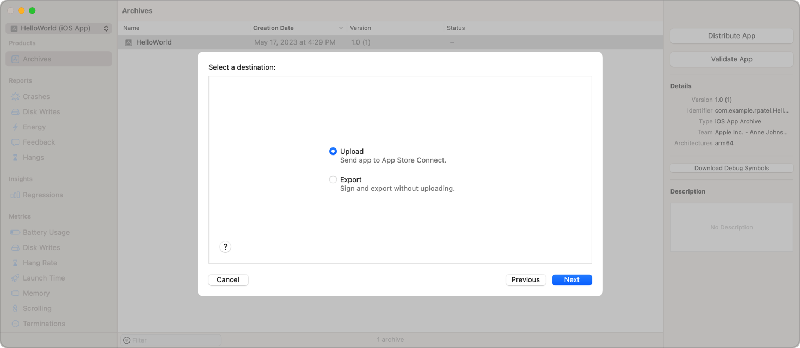
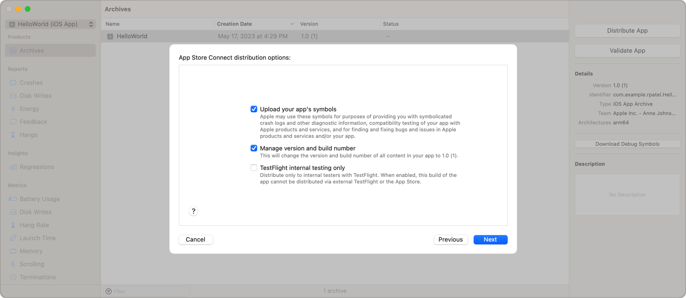
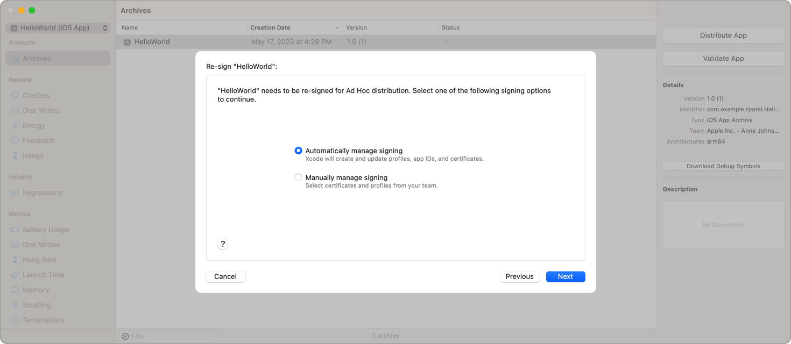
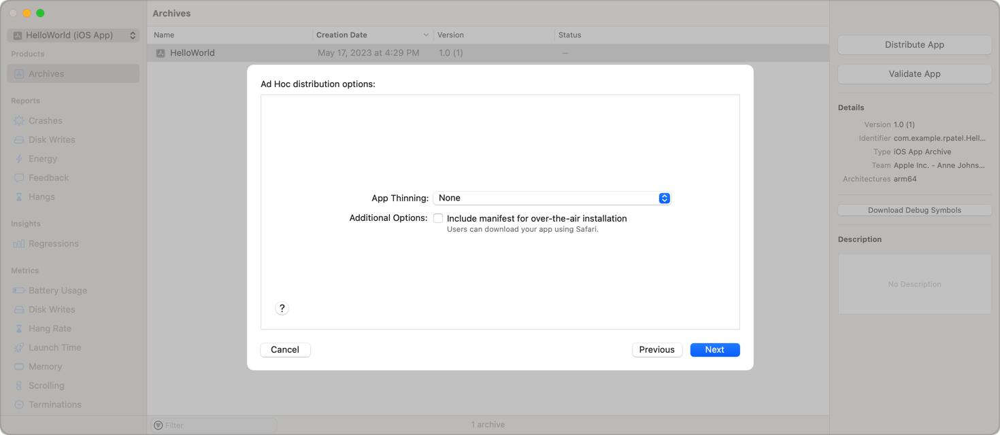
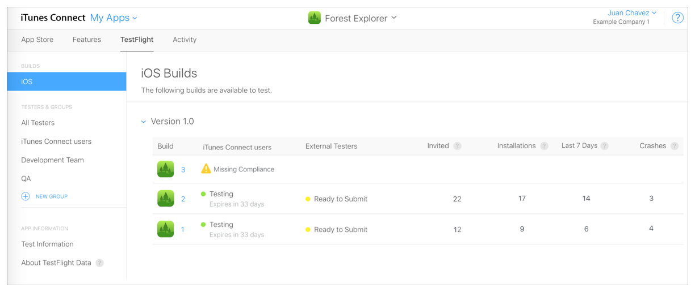
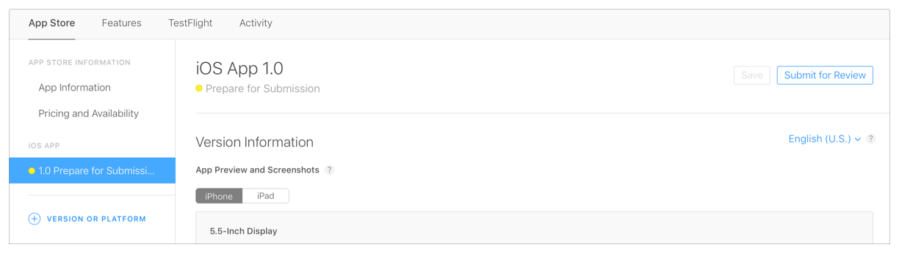

> Navigation: [Technologies](../technologies.md) · [Xcode](../xcode.md) · [Distribution](distribution.md)

# Distributing your app for beta testing and releases

Article

Release your app to beta testers and users.

## Overview

After you thoroughly test your app in Xcode, distribute it to beta testers or release it to users to run on their personal devices. Choose a distribution method based on your app’s platform and development stage, and whether you belong to the Apple Developer Program. Before you release your app to users, distribute your final build using one of the beta test methods.

If necessary, review [Preparing your app for distribution](preparing-your-app-for-distribution.md) to complete the configuration of your project, before following these distribution steps.

> [!note] Related sessions from WWDC23
> Session 10224: [Simplify distribution in Xcode and Xcode Cloud](https://developer.apple.com/videos/play/wwdc2023/10224)

### Join the Apple Developer Program

Distribution methods range from exporting your app for test devices to uploading it to App Store Connect. You can use TestFlight to distribute beta builds to testers and collect feedback. If you want to distribute your app to registered devices, to beta testers using TestFlight, or through the App Store, join the Apple Developer Program. After you join the Apple Developer Program, Apple creates an App Store Connect account for you and you can start uploading builds.

Joining the Apple Developer Program provides access to the distribution methods, as well as capabilities you can add to your app. A capability grants your app access to an app service provided by Apple, such as CloudKit, Game Center, or In-App Purchase. To learn more about capabilities, see [Adding capabilities to your app](adding-capabilities-to-your-app.md).

Xcode uses cloud-managed signing certificates to automatically code sign your app. These signing certificates are associated with your Apple Developer Account, you can manage access to these certificates in App Store Connect. For information on managing access to certificate resources for your team, see [Add and edit users](https://developer.apple.com/help/app-store-connect/manage-your-team/add-and-edit-users).

To learn more about enrolling in the program, see [Apple Developer Program](https://developer.apple.com/programs/).

### Combine multiplatform apps in a project or purchase

If you offer related apps on different platforms, combine them in one Xcode project or App Store purchase to make installation more convenient for users. To allow your customers to purchase related apps together from the App Store as a universal purchase or app bundle, see [Offering Universal Purchase](https://developer.apple.com/support/universal-purchase/).

### Create an archive of your app

To use any of the distribution methods, first create an archive of your app. An _archive_ is a build of your app, including debugging information, that Xcode stores in a bundle. Xcode repackages the archive’s contents based on the distribution configuration you choose for your distribution.

In the main window of your Xcode project, choose a scheme and a run destination to build for from the Scheme toolbar menu. Then, choose Product \> Archive to build the targets included in that scheme, for the class of device you select, and create an archive that appears in the Archives organizer.

You can open the Archives organizer directly by choosing Window \> Organizer. If you want to confirm your app is ready to submit to TestFlight or the App Store without submitting it yet, select your archive and then click Validate App. Xcode will perform a limited, automated initial validation of the app and provide feedback.

For a Mac app built with Mac Catalyst, create separate archives for the iPad and Mac version. When creating the archive for the Mac version, choose My Mac as the run destination.

> [!note] Note
> Earlier versions of Xcode didn’t allow you to build an archive with a simulator set as the run destination. In Xcode 15 and later, choosing to build an archive with a simulator as the run destination builds an archive with all the CPU architectures necessary to run on that class of device.

### Select a method for distribution

You can export the archive or upload it to App Store Connect. If you export the archive, you can distribute it outside of the App Store. Otherwise, upload the archive to App Store Connect to distribute it through TestFlight or the App Store.

From the Organizer window in Xcode, select Archives in the sidebar and click Distribute App.

Screenshot of the Archives organizer showing the Select a method for distribution dialog with the preconfigured TestFlight & App Store option selected.

Select one of the following options to distribute using recommended settings:

- **TestFlight & App Store** — Default settings to distribute through TestFlight and submit to the App Store. Use this option to update the build number of the content in your archive, perform automatic code signing, and upload your app with symbols.
- **TestFlight Internal Only** — Default settings to distribute through TestFlight and restrict access to your team. Use this option to prevent a development build of your app from being submitted to the App Store.
- **Release Testing** — Default settings to distribute a version to test before release. Use this option to perform automatic code signing similar to the App Store distribution option and export to install on devices your team registers with App Store Connect. This distribution method isn’t available for apps built for Mac.
- **Enterprise** — Default settings to distribute to members of your organization. Use this option if you’re a part of the [Apple Developer Enterprise Program](https://developer.apple.com/programs/enterprise). This distribution method isn’t available for apps built for Mac.
- **Direct Distribution** — Default settings to distribute a macOS app directly. Use this option to notarize a Developer ID app for direct distribution. This distribution method is only available for apps built for Mac.
- **Debugging** — Default settings to distribute a version for debugging. Use this option to export a version to install and debug on devices your team registers with App Store Connect. This enables sandbox testing environments for some [Capabilities](capabilities.md) that support them.

After selecting a distribution option, click the Distribute button. Xcode begins processing, packaging, and uploading. Click the link at the end to access the builds page for the app on App Store Connect or click the Export button to access the assets locally.

> [!note] Note
> Before you upload your app to the App Store for the first time, create an app record to register your app with App Store Connect. If you haven’t done this already, Xcode asks you for the information it needs to create this record for you. For more information, see [Create an app record](https://developer.apple.com/help/app-store-connect/create-an-app-record/add-a-new-app).

### Create a custom distribution

To begin a custom distribution, which allows you to configure your own settings, click the Custom option.

Select from the following distribution methods:

- **App Store Connect** — Distribute using TestFlight or through the App Store.
- **Ad Hoc** — Distribute to a limited number of devices you register in App Store Connect. For more information on distributing to devices you register, see [Distributing your app to registered devices](distributing-your-app-to-registered-devices.md).
- **Enterprise** — Distribute to members of your organization if you’re a part of the [Apple Developer Enterprise Program](https://developer.apple.com/programs/enterprise) and are ready to release your app to users in your organization.
- **Developer ID** — Distribute a macOS app outside the App Store that is notarized by Apple or signed with a Developer ID. This distribution method is only available for apps built for Mac.
- **Development** — Distribute to a limited number of devices you register in App Store Connect. For more information on distributing to devices you register, see [Distributing your app to registered devices](distributing-your-app-to-registered-devices.md).
- **Copy App** — Distribute a macOS app without code signing. This distribution method is only available for apps built for Mac.

If you choose App Store Connect or Developer ID as your distribution method, you select a destination option as well. You can choose to upload your build to the App Store, or Export your build locally to upload later.

When distributing your app on TestFlight or the App Store, choose how to manage symbols and build numbers:

Screenshot of the distribution flow showing App Store Connect distribution options with checkboxes to Upload you app’s symbols, Manage version and build numbers, and TestFlight internal testing only. The Upload you app’s symbols and Manage version and build numbers checkboxes are selected.

- **Strip Swift symbols** — Reduces the size of your app by stripping symbols from Swift standard libraries. This setting is only available if your project has embedded swift libraries.
- **Upload your app’s symbols** — Allows Apple to provide you with symbolicated crash logs and other diagnostic information. A symbolicated log replaces memory addresses in logs with human-readable function names and line numbers. The symbols can also be useful in compatibility testing of your app with Apple products and services.
- **Manage version and build number** — Allows Xcode to update the build number of all the content in your archive.
- **TestFlight internal testing only** — Prepares the app for distribution through TestFlight and restricts access to your team. Use this option to prevent a development build of your app from being submitted to the App Store.

When selecting a distribution method that involves code signing, select a method for code signing.

Screenshot of the distribution flow showing checkboxes for Automatic manage signing and Manually manage signing distribution. The Automatic manage signing checkbox is selected.

Choosing “Automatically manage signing” allows Xcode to manage signing for you. To manually sign your app, you use signing certificates. For information on sharing signing certificates, see [Synchronizing code signing identities with your developer account](sharing-your-teams-signing-certificates.md).

When packaging for self distribution using the Ad Hoc or Development option, choose whether to enable or disable App Thinning and configure on-demand resources settings. For more information about App Thinning and on-demand resources, see [Reducing your app’s size](reducing-your-app-s-size.md) and [Doing advanced optimization to further reduce your app’s size](doing-advanced-optimization-to-further-reduce-your-app-s-size.md).

Screenshot of the distribution flow showing the Ad Hoc distribution settings. The dialog includes the App Thinning pop-up menu with the option None chosen and Additional Options that includes a checkbox with the label Include manifest for over-the-air installation.

### Distribute a beta version

To distribute a beta version of your app to offer a preview of an upcoming release, choose a distribution method that aligns with your testing resources:

- Distribute a beta version of your app to internal and external testers using TestFlight. The TestFlight app allows invited users to install, beta test, provide feedback, and get updates of your app. Apple distributes the beta version for you, you manage the builds and users in App Store Connect. To learn more, see [TestFlight overview](https://developer.apple.com/help/app-store-connect/test-a-beta-version/overview-of-testflight).
- Distribute a beta version to registered devices in your developer account. Choose this option only if you can reserve a portion of your limited development devices for beta testing. To learn more, see [Distributing your app to registered devices](distributing-your-app-to-registered-devices.md).
- For macOS apps, distribute an Apple-notarized build to testers before you distribute the app through the App Store. To learn more, see [Notarizing macOS software before distribution](../security/notarizing-macos-software-before-distribution.md).

### Publish on the App Store

After beta testing your final build, submit it to App Review, then offer it on the App Store. For more information about the publishing process, see [Overview of publishing an app](https://developer.apple.com/help/app-store-connect/manage-your-apps-availability/overview-of-publishing-your-app).

Go to [App Review](https://developer.apple.com/app-store/review/) to review the App Store and Human Interface Guidelines. For platform specific guidance, see [Submit your apps today](https://developer.apple.com/app-store/submitting).

You may need to enter additional information in App Store Connect before you can submit your app to App Review. After your app is uploaded or released, you can’t change some of this metadata, so it’s important to choose your settings carefully. For more information about this metadata, go to [Required, localizable, and editable properties](https://developer.apple.com/help/app-store-connect/reference/required-localizable-and-editable-properties) in App Store Connect Help.

If you used TestFlight to distribute a beta version, and entered the additional information required by App Store for a release, just submit the last build that appears in App Store Connect to App Review.

If you didn’t distribute the final build using TestFlight, prepare your app for distribution and create an archive of your app. Validate the archive and fix any validation errors before continuing. Then, upload it to App Store Connect and wait for it to pass the App Store Connect validation tests.

To submit the build to App Review, go to [Submit for review](https://developer.apple.com/help/app-store-connect/manage-submissions-to-app-review/submit-for-review).

### Distribute outside of the App Store

For macOS apps, you can export a notarized app for distribution outside of the App Store, but you may first need to disable capabilities that require the Apple Developer Program membership first, then distribute the app yourself to users. Notarize all software that you distribute outside of the App Store. This includes system extensions and drivers. To learn more, see [Notarizing macOS software before distribution](../security/notarizing-macos-software-before-distribution.md).

### Distribute enterprise apps

There are also several options for distributing business, customized, or in-house apps as well. For details, see [Find the best way to reach your users](https://developer.apple.com/business/distribute/). If you join the [Apple Developer Enterprise Program](https://developer.apple.com/programs/enterprise/), see [Develop and distribute an enterprise app](https://help.apple.com/xcode/mac/current/#/devba5e7054d) for enterprise-specific Xcode steps to export your app.

### Review crash, diagnostic, and metrics reports

If you distribute your app using TestFlight or through the App Store, you can view crash and diagnostic reports that Apple generates for you in the organizer. You can also use the organizer to review feedback from beta testers. If you distribute your app through the App Store, you can view metrics reports in the organizer too. For more information, see [Acquiring crash reports and diagnostic logs](acquiring-crash-reports-and-diagnostic-logs.md) and [Viewing and responding to feedback from beta testers](viewing-and-responding-to-feedback.md). For more information about performance improvements, see [Improving your app’s performance](improving-your-app-s-performance.md) and [Analyzing the performance of your shipping app](analyzing-the-performance-of-your-shipping-app.md).

## See Also

### Distribution and release

- [Distributing your app to registered devices](distributing-your-app-to-registered-devices.md) — Register devices in your developer account and deploy your app to them for testing.
- [Packaging Mac software for distribution](packaging-mac-software-for-distribution.md) — Build a zip archive, disk image, or installer package for distributing your Mac software.
