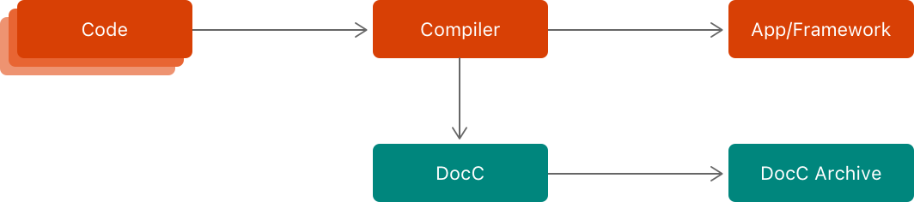
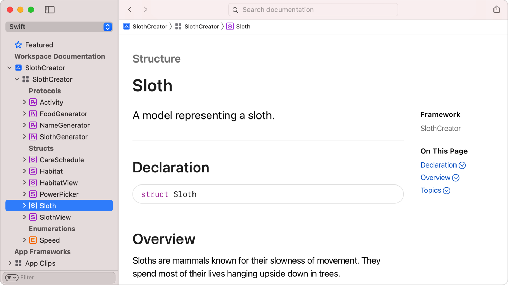
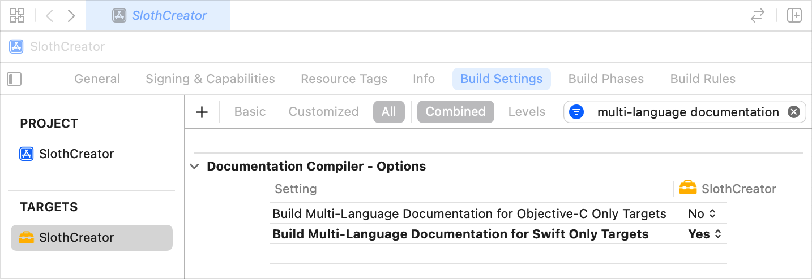
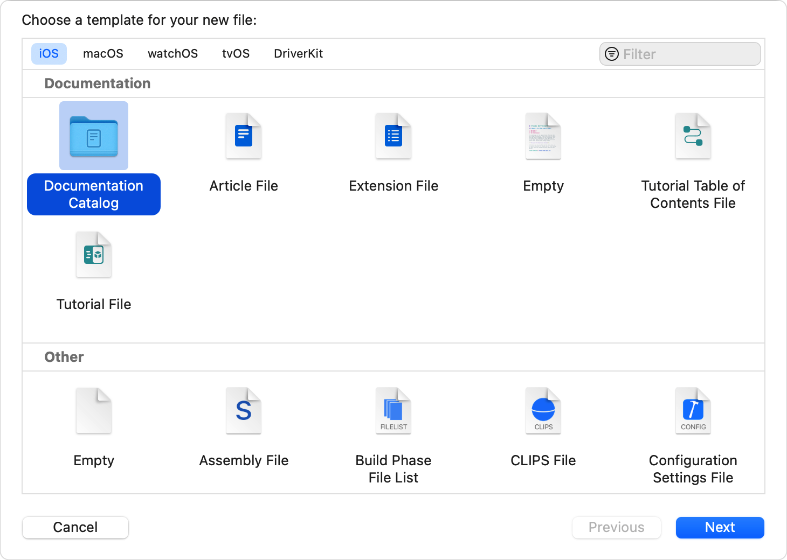
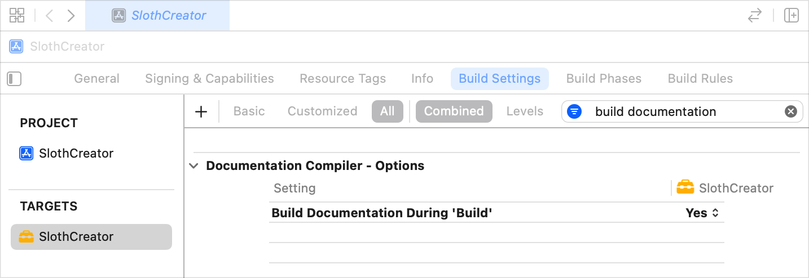

> Navigation: [Technologies](../technologies.md) · [Xcode](../xcode.md) · [Writing documentation](writing-documentation.md)

# Documenting apps, frameworks, and packages

Article

Create developer documentation from in-source comments, add articles with code snippets, and add tutorials for a guided learning experience.

## Overview

DocC, or _Documentation Compiler_, makes it easy to produce rich and engaging developer documentation for your apps, frameworks, and packages. The compiler builds documentation by combining in-source comments with extension files, articles, and other resources that live alongside your project in Xcode.

The compiler integrates directly with Xcode to enhance your existing workflow, including code completion, Quick Help, and more.

For a deeper understanding of DocC and how to use it to document frameworks and packages, please visit the documentation available at [Documenting a Swift Framework or Package Swift.org](https://www.swift.org/documentation/docc).

### Build simple documentation from source comments

For DocC to compile your documentation, build your project. Xcode stores supplementary information about public APIs for frameworks, and internal APIs for app targets, alongside the compiled artifacts. DocC consumes that information and compiles the documentation into a DocC Archive. This process repeats for every framework or package your target depends on.

A diagram showing how the compiler turns code into an app or framework and supplies information about its public APIs to the documentation compiler, which generates a DocC Archive using that information.

To build documentation for a project, choose Product \> Build Documentation. DocC compiles the documentation and opens it in Xcode’s documentation viewer.

### Build multi-language documentation

DocC takes information from the Swift compiler and the Objective-C compiler and combines it to form a single documentation archive that displays documentation for both languages. For targets that contain both Swift and Objective-C code, DocC automatically builds multi-language documentation. Targets written in a single language but intended to be used by both Swift and Objective-C code can opt in to multi-language documentation output. To enable this, do the following:

1. In Xcode, select your project in the Project navigator.
2. Select the target in the project editor.
3. Click the Build Settings tab.
4. Enter “multi-language documentation” in the search field to locate the
  “Build Multi-Language Documentation for Swift Only Targets” or “Build Multi-Language Documentation for Objective-C Only Targets” setting depending on the language in which you implemented the target.
5. Choose Yes from the setting’s pop-up button to enable the build setting.

A screenshot of Xcode that shows the Build Multi-Language Documentation for Swift Only Targets setting in an enabled state and the Build Multi-Language Documentation for Objective-C Only Targets setting in a disabled state.

> [!note] Note
> You can’t use the build setting with a Swift package.

### Configure a richer documentation experience

DocC combines the public API information from the Swift compiler and the Objective-C compiler with the contents of the documentation catalog to generate a much richer DocC Archive.

To add a documentation catalog to an existing project, follow these steps:

1. In Xcode, select your project or package in the Project navigator.
2. Choose File \> New \> File from Template.
3. Select the Documentation Catalog template in the Documentation section and click Next.
4. Enter a filename and click Create.

A screenshot of Xcode’s file template chooser with the Documentation Catalog template in a selected state in the Documentation section.

### Incorporate documentation into your build process

In addition to building documentation on demand by choosing Product \> Build Documentation, you can automatically compile documentation whenever you build a framework by enabling a build setting that DocC provides.

To enable the documentation compiler build setting, do the following:

1. In Xcode, select your project in the Project navigator.
2. Select the target in the project editor.
3. Click the Build Settings tab.
4. Enter “build documentation” in the search box to locate the Build Documentation during ‘Build’ setting.
5. Choose Yes from the setting’s pop-up button to enable the build setting.

> [!note] Note
> For existing projects, the build setting appears only after you add a documentation catalog. You can’t use the build setting with a Swift package.

DocC also integrates with `xcodebuild`, which means you can build documentation from the command line. This is useful if you want to incorporate documentation builds into a continuous integration process. For more information, see [Distributing documentation to other developers](distributing-documentation-to-other-developers.md).
