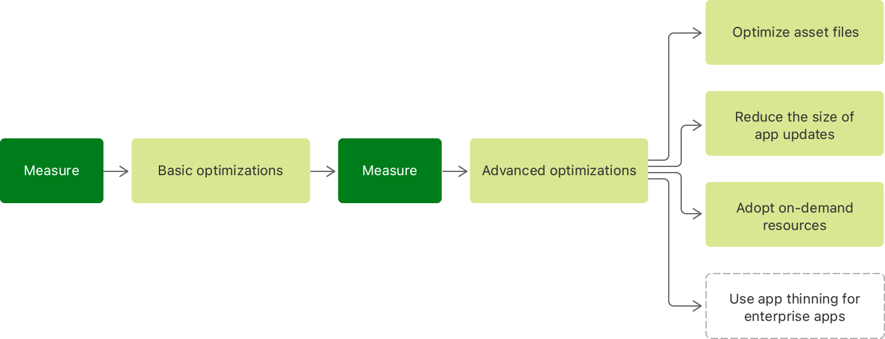

> Navigation: [Technologies](../technologies.md) · [Xcode](../xcode.md) · [Performance and metrics](performance-and-metrics.md) · [Reducing your app’s size](reducing-your-app-s-size.md)

# Doing advanced optimization to further reduce your app’s size

Article

Optimize your app’s asset files, adopt on-demand resources, and reduce the size of app updates.

## Overview

Following the basic optimizations described in [Doing basic optimization to reduce your app’s size](doing-basic-optimization-to-reduce-your-app-s-size.md) is a good way to decrease the size of your app. However, you can optimize your app’s size further to minimize its footprint on a device and provide a fast download, installation, and update experience.

Flow chart that shows how to further optimize the size of your app. Measure the app’s size and do basic optimizations. Then measure again and do advanced optimizations, including optimizing asset files, reducing the size of app updates, adopting on-demand resources, and using app thinning for enterprise apps.

### Optimize your app’s asset files

Assets often make up a large portion of an app. Consider the following optimizations:

**Use the most efficient image and video format possible.** Image and video assets are common contributors to large app sizes. Using a more efficient image file format is a good way to reduce your app’s size. For example, consider using the HEIF format for images, and the HEVC format for videos. If you’re using PNG files, consider using 8-bit instead of 32-bit PNGs. Doing so can decrease the image size to a quarter of the original size.

**Compress images.** For 32-bit images, using [Adobe Photoshop](https://www.adobe.com/photoshop)’s “Save for Web” feature can reduce the size of JPEG and PNG images considerably.

**Compress audio files.** As a general rule, compress audio using `AAC` or `MP3` codecs, and experiment with a reduced bit rate. Quite often, a 44.1 kHz sample rate isn’t necessary, and a lower bit rate clip won’t result in a perceptible drop in quality. Learn more about optimizing your audio assets by watching [Audio Development for Games](https://developer.apple.com/videos/wwdc/2011/?id=404).

### Reduce the size of app updates

Instead of always downloading the whole app when an update to the app is available, the App Store creates an _update package_. It compares one or more prior versions of your app to the new version and creates an optimized package. This package contains only the content that has changed between versions of your app, excluding any content that didn’t change.

This comparison looks at everything in the _application bundle_, including the application executable, storyboards, nibs, localizations, and other assets, like images.

Consider the following to reduce the size of your app’s update package:

- Don’t make unnecessary modifications to files. Compare the contents of the prior and new versions of your app with `diff` or another directory comparison tool, and verify that it doesn’t contain any unexpected changes.
- Store content that you expect to change in an update in separate files from content that you don’t expect to change.

> [!note] Note
> Don’t rely on the creation and modification dates of files in your application bundle. The operating system updates your app using the update package, and updates files only if their content changes. It doesn’t update files because of changes to metadata; for example, the creation and modification dates.

### Adopt on-demand resources

Analyze all of your app’s assets and determine which resources it uses infrequently. Group the infrequently used resources into _asset packs_. When you upload your app to App Store Connect, asset packs don’t become part of your app’s initial download or app updates. Instead, the app can download them separately as needed. See the [On-Demand Resources Guide](https://developer.apple.com/library/archive/documentation/FileManagement/Conceptual/On_Demand_Resources_Guide/index.html#//apple_ref/doc/uid/TP40015083) for more information.

If you can’t adopt on-demand resources, consider implementing a web service that provides them, and download them in the background as needed, using [URLSession](../foundation/urlsession.md). To learn more, see [Downloading files in the background](../foundation/downloading-files-in-the-background.md).

### Leverage app thinning

_App thinning_ is a technology that ensures that an app’s IPA file only contains resources and code that’s necessary to run the app on a particular device. Apps that are available in the App Store, and that you distribute to testers using TestFlight, already leverage app thinning. However, if you distribute an in-house enterprise app, or distribute your builds to testers without using TestFlight, you must enable app thinning when you export your app. To use app thinning:

1. Archive your app in Xcode.
2. Select the archived app in the organizer window, and click Distribute App.
3. Export your app using Xcode, and choose “All compatible device variants” for app thinning in the export sheet. If you support only a limited number of devices in your app, select the ones that apply.

To learn more about app thinning, see [Distribution Options](https://help.apple.com/xcode/mac/11.0/index.html?localePath=en.lproj#/devde46df08a) and watch [App Thinning in Xcode](https://developer.apple.com/videos/play/wwdc2015/404/).

## See Also

### Size optimization

- [Doing basic optimization to reduce your app’s size](doing-basic-optimization-to-reduce-your-app-s-size.md) — Adjust your project’s build settings, and use technologies like asset catalogs early in your app’s development life cycle.
