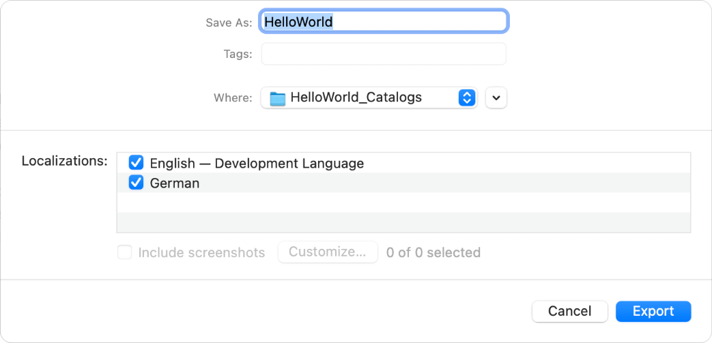

> Navigation: [Technologies](../technologies.md) · [Xcode](../xcode.md) · [Localization](localization.md)

# Exporting localizations

Article

Provide the localizable files from your project to localizers.

## Overview

Export localizations for the languages and regions you’re ready to support. You can export all the files that you need to localize from your Xcode project, or export the files for specific localizations. Optionally, add files to the exported folders to provide context, and then give the files to localizers.

### Export localizations using Xcode

In the Project navigator, select the project, then choose Product \> Export Localizations. In the dialog that appears, enter a folder name, choose a location, choose the localizations, and click Export.

> [!important] Important
> To include all localizable text in your export, enable the [Use Compiler to Extract Swift Strings](https://developer.apple.com/documentation/xcode/build-settings-reference#Use-Compiler-to-Extract-Swift-Strings) build setting for your project. This setting only impacts Swift strings. Objective-C string extraction works without any additional build settings.

If you generate screenshots when testing your localizations, provide context for localizers by clicking “Include screenshots” to include the localization-specific screenshots in the `Notes` folder of the exported files. To filter the screenshots, click Customize, deselect the screenshots you don’t want to include, and click Done.

Xcode creates an Xcode Localization Catalog (a folder with a `.xcloc` file extension) containing the localizable resources for each language and region. You can open and edit this file in Xcode, or use any third-party tool that supports this file type. Xcode manages the localizable strings in your app for you as follows:

- Extracts strings from the following file types: source code, storyboard, XIB, `.strings`, `.stringsdict`, and Siri intent definition. Adds the extracted strings to a standard XML Localization Interchange File Format (XLIFF) that’s familiar to localizers.
- Adds the correct `.stringsdict` plural variants for each exported language to the XLIFF file.
- Creates a strings file for the localizable properties in the information property list file.
- Copies all localizable resources into the `Source Contents` folder to provide context for localizers.

Xcode extracts strings that you pass to [Text](../swiftui/text.md) structures, the [NSLocalizedString](../foundation/nslocalizedstring.md) macro, and similar APIs in your code. For example, if you pass a string with a comment to the [NSLocalizedString](../foundation/nslocalizedstring.md) macro, Xcode includes the comment in the XLIFF file.

In addition, each localization folder in the catalog contains only the resources and assets that you mark as localizable. Prior to localization, the file is a copy of the development language file—a placeholder to provide context for the localizers.

### Add files to the Xcode Localization Catalog

Before you give the catalog to localizers, you can add additional files to the `Notes` folders to provide more context. An Xcode Localization Catalog folder contains:

| Item | Description |
|---|---|
| `contents.json` | A JSON file containing metadata about the catalog, such as the development region, the locale, the tool (Xcode) and its version number, and the catalog version number. |
| `Localized Contents` | A folder containing the localizable resources, including an XLIFF file containing the localizable strings. |
| `Notes` | A folder containing additional information for localizers, such as screenshots, movies, or text files. |
| `Source Contents` | A folder containing the assets to produce the content that provides context for localizers, such as user interface files and other resources. |

### Export localizations using commands

You can also export localization files with the `xcodebuild` command using the -`exportLocalizations` argument:

`xcodebuild -exportLocalizations -project <projectname> -localizationPath <dirpath> [[-exportLanguage <targetlanguage>] ...]`

To include the screenshots you generate while testing localizations, add the  `-includeScreenshots` argument to the above command.

## See Also

### Translation and adaptation

- [Creating screenshots of your app for localizers](creating-screenshots-of-your-app-for-localizers.md) — Share screenshots of your app with localizers to provide context for translation.
- [Editing XLIFF and string catalog files](editing-xliff-and-string-catalog-files.md) — Translate or adapt the localizable files for a language and region that you export from your project.
- [Importing localizations](importing-localizations.md) — Import the files that you translate or adapt for a language and region into your project.
- [Locking views in storyboard and XIB files](locking-views-in-storyboard-and-xib-files.md) — Prevent changes to your Interface Builder files while localizing human-facing strings.
