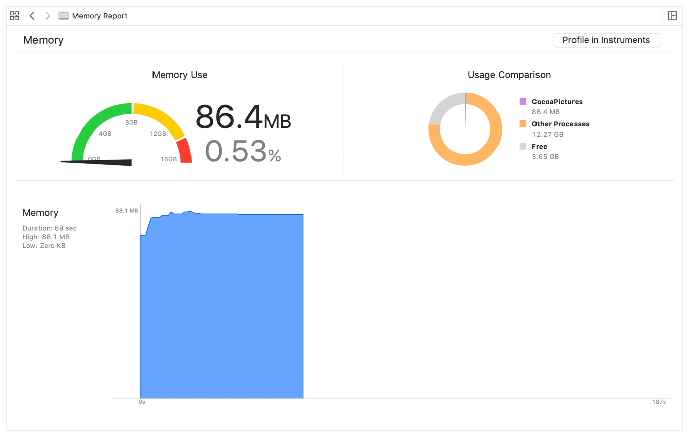
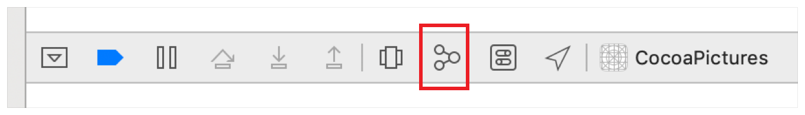
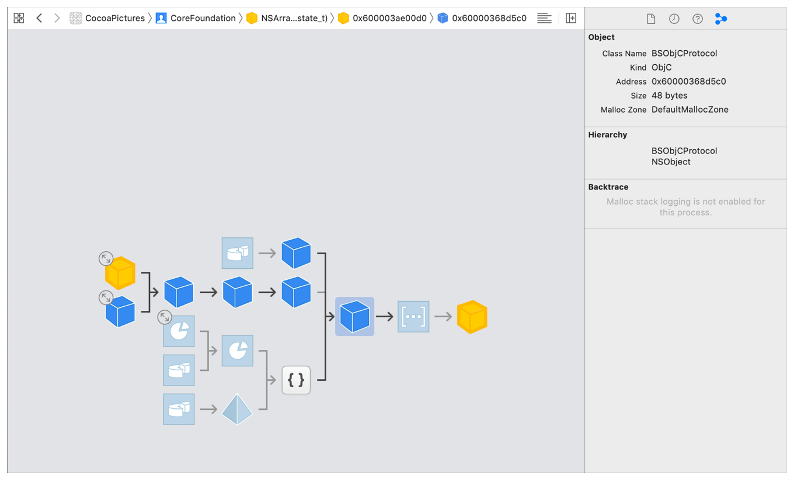

> Navigation: [Technologies](../technologies.md) · [Xcode](../xcode.md) · [Performance and metrics](performance-and-metrics.md) · [Reducing your app’s memory use](reducing-your-app-s-memory-use.md)

# Gathering information about memory use

Article

Identify memory-use inefficiencies by measuring and profiling your app.

## Overview

Xcode and Instruments provide multiple tools for observing and exploring memory use in an app.

### Review the memory report

While your app is running in Xcode, the memory report available from Xcode’s Debug navigator shows the app’s current memory use, along with the highest value seen. The yellow region of the memory gauge indicates memory use high enough to trigger a warning. The app risks termination by iOS if its memory use enters the red region.

Illustration showing Xcode’s Memory Report, available while debugging an app. The line graph tracks memory use over time.

> [!tip] Tip
> If iOS repeatedly terminates your app because it’s using too much memory, you can investigate its behavior in the simulator, where it can continue to run. When you run your app in the simulator, the memory gauge always stays in the green (safe) region because macOS doesn’t issue memory warnings or out-of-memory terminations. This behavior has advantages in diagnosing problems associated with too much memory use. But keep in mind that memory use in the green region of the gauge in the simulator doesn’t necessarily mean that your app’s memory use is within safe limits.

### Inspect the debug memory graph

You can generate a memory graph of the objects and allocations in your app by clicking the Debug Memory Graph button in Xcode’s debug area at the bottom of the workspace window.

The memory graph shows the memory regions your app is using and the size of each region. A node in the graph represents an object, a heap allocation, or a memory-mapped file. Connections between nodes, drawn as arrows, show where one memory region refers to another.

The memory graph shows where your app is using memory and how those uses are related. You can augment the graph with allocation stack traces, so that each region is associated with a call stack trace recorded at the point at which the region was allocated.

To turn on allocation stack traces, check the Malloc Stack box in the Diagnostics area of your scheme’s Run settings. With allocation stack traces enabled, the inspector for a node in the memory graph shows the stack trace recorded when that node was allocated. Use this information to associate memory allocations in the memory graph with functions and methods in your app’s source code.

To export memory graphs from Xcode, choose File \> Export Memory Graph. You can share exported memory graphs with team members or explore using command-line tools, including `vmmap` and `leaks`. For more information about the command-line tools, see WWDC 2018 session 416, [iOS Memory Deep Dive](https://developer.apple.com/videos/play/wwdc2018/416/).

### Profile your app using the Allocations instrument

The Allocations instrument tracks the size and number of all heap and anonymous virtual memory (VM) allocations and organizes them by category. Use the Allocations instrument’s timeline to investigate how the total amount of memory that your app has allocated increases and decreases as you use the app’s interface. Use the statistics view to see what categories of allocations are being made, how many allocations have been made in each category, and the sizes of those allocations. Click the arrow next to a category name to see the individual allocations made in that category, along with the time at which the memory was allocated and the code responsible for the allocation.

The Generations view in the Allocations instrument is useful for investigating memory use for a particular feature of your app. Launch your app, and prepare to use the feature under investigation—for example, by navigating to the view with a particular control. Next, click the Mark Generation button in the Allocations instrument. Activate the feature in your app, and click Mark Generation again. Instruments organizes memory allocations by generation, separated at the times when you clicked Mark Generation. You can isolate memory allocations that occurred during the time that you were using the feature. Not all allocations recorded during this time are associated with the feature you’re studying, but many unrelated allocations that didn’t occur between the generation marks are removed from consideration.

## See Also

### Related Documentation

- [Identifying high-memory use with jetsam event reports](identifying-high-memory-use-with-jetsam-event-reports.md) — Discover why the operating system terminated your app when available memory was low.

### Tasks

- [Making changes to reduce memory use](making-changes-to-reduce-memory-use.md) — Decrease your app’s use of memory by addressing common causes of excessive use.
- [Preventing memory-use regressions](preventing-memory-use-regressions.md) — Measure the memory that your app’s features use, and detect increases by using XCTest performance tests.
- [Responding to low-memory warnings](responding-to-low-memory-warnings.md) — Detect when your app is using excessive memory, and bring memory use under control.
