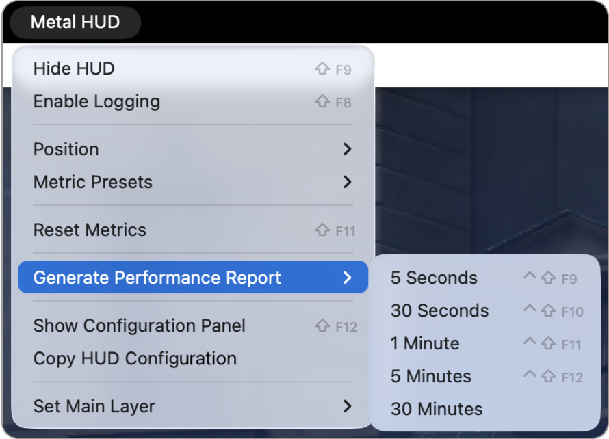
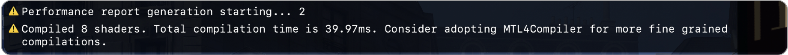
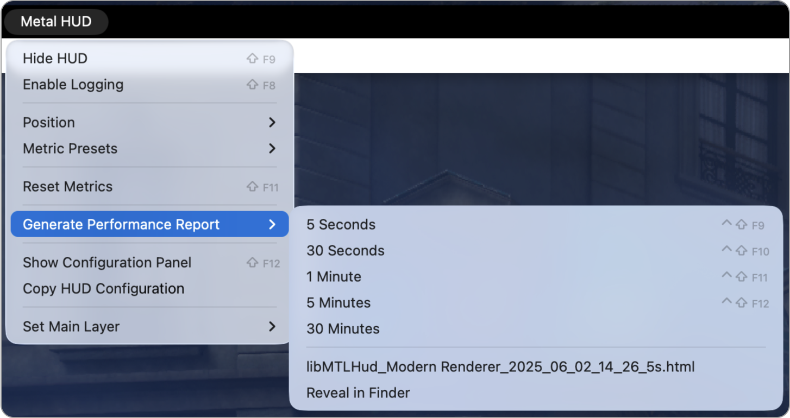
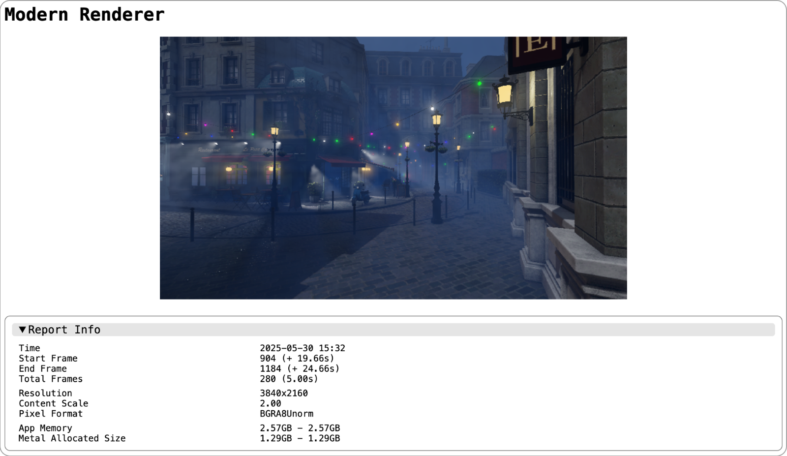

> Navigation: [Technologies](../technologies.md) · [Xcode](../xcode.md) · [Debugging](debugging.md) · [Metal developer workflows](metal-developer-workflows.md)

# Generating performance reports with the Metal Performance HUD

<sub>Article</sub>

Record your app’s performance using the heads-up display.

## Overview

With the Metal Performance HUD, you can generate performance reports for a specified duration to analyze your app’s performance over that interval. When report generation begins, the system resets all existing metrics, and the HUD automatically enables the performance insights feature. You can also enable other optional HUD features, such as Encoder GPU Time Tracking (see [Understand encoder GPU time tracking](monitoring-your-metal-apps-graphics-performance.md#Understand-encoder-GPU-time-tracking)), to add more metrics to the report.

### Generate performance reports

You can trigger performance report generation from the global menu, where you select the desired duration. Report durations can range from 5 seconds to 30 minutes.



There’s a 3-second delay before the Metal Performance HUD resets all metrics, enables performance insights, and starts data collection.



After the duration elapses, the HUD saves the report to your app’s temporary folder. The system also lists reports in the menu and the insights configuration panel, with options to reveal the report in the Finder or open it directly.



You can also specify a path to save the performance report to by using the `MTL_HUD_REPORT_URL` environment variable.

```
export MTL_HUD_REPORT_URL=<path>
```



### Analyze and interpret the performance reports

Each performance report contains a list of collapsable sections. The complete list is below:

- **Report info** — Details basic metadata about the report, such as the duration of data collection, the start and end frames, the total number of frames collected, and memory usage at the beginning and end of the collection period.
- **Frame interval distribution** — Contains a frame interval distribution table and frame rate statistics, such as 99% high and 1% low.
- **Performance insights** — Details performance insights if the HUD detects them during data collection. Certain insights also add additional tables, such as a frame encoding table if the HUD detects frequent render target changes.
- **Top labeled command buffers and encoders** — Contains a table of most GPU-intensive command buffers and encoders with a label.
- **Metrics** — Contains a table of performance metrics reported by the HUD, including the average, minimum, and maximum values.
- **Frame timing** — Contains a table of the CPU and GPU times of all command buffers and encoders for the last frame of the report.
- **Frame encoding** — Contains a table of the CPU encoding sequence for the last frame of the report. Color attachments are color-coded to help you find patterns and opportunities to merge render passes.
- **Shader compilation** — Contains a table of the shaders compiled and backend compilation time for the duration of the report, as well as an additional table containing all shaders compiled since the app launch.

## See Also

### Runtime diagnostics

- [Inspecting live resources at runtime](inspecting-live-resources-at-runtime.md) — Validate your resources by viewing the contents of your textures and buffers while debugging your Metal app.
- [Validating your app’s Metal API usage](validating-your-apps-metal-api-usage.md) — Catch runtime issues in your Metal app using API Validation.
- [Validating your app’s Metal shader usage](validating-your-apps-metal-shader-usage.md) — Catch common shader runtime issues using Shader Validation.
- [Monitoring your Metal app’s graphics performance](monitoring-your-metal-apps-graphics-performance.md) — Catch performance issues using the Metal Performance HUD while your app runs.
- [Customizing the Metal Performance HUD](customizing-metal-performance-hud.md) — Modify the appearance of your Metal heads-up display to monitor your graphics performance.
- [Understanding the Metal Performance HUD metrics](understanding-metal-performance-hud-metrics.md) — Learn what each of the metrics reported by the heads-up display indicates.
- [Gaining performance insights with the Metal Performance HUD](gaining-performance-insights-with-metal-performance-hud.md) — Catch potential performance issues while your app runs using the Metal heads-up display.
