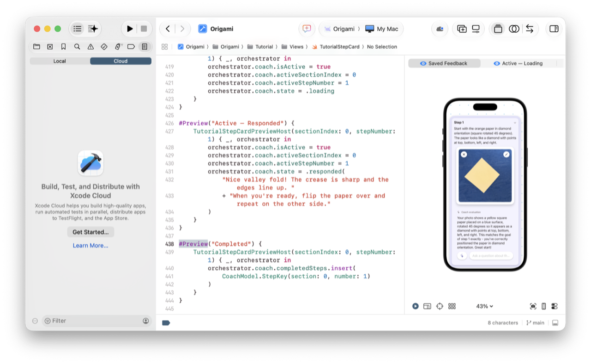
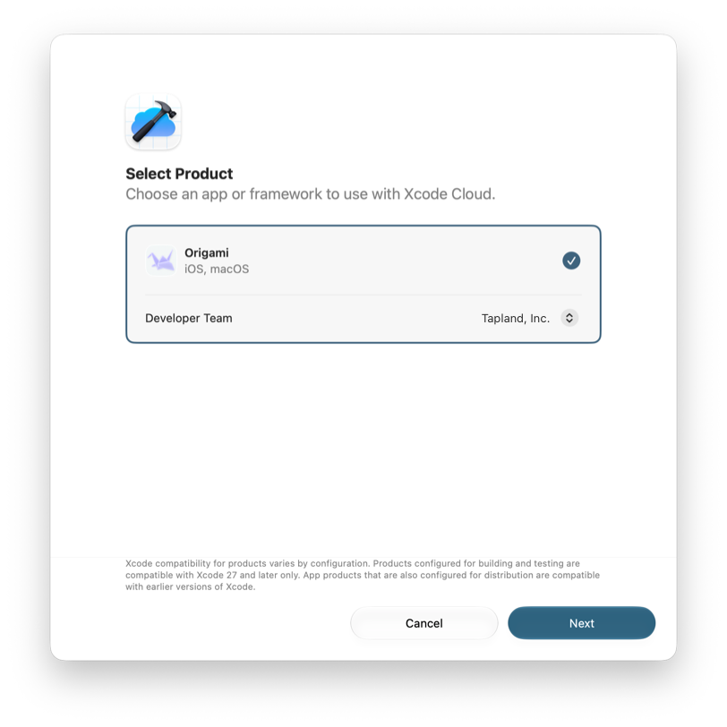
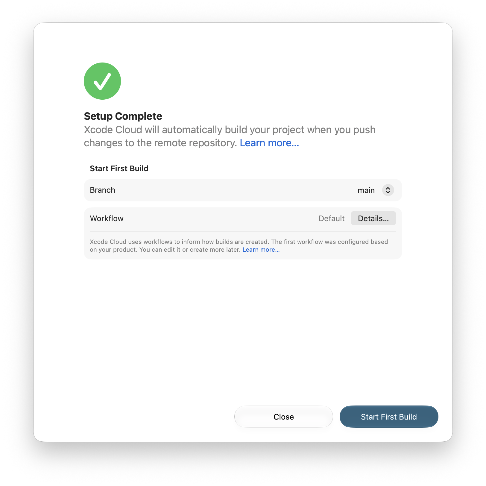
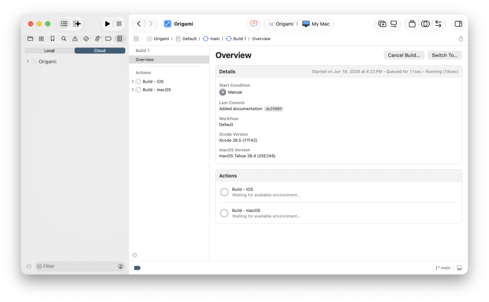

> Navigation: [Technologies](../technologies.md) · [Xcode](../xcode.md) · [Xcode Cloud](xcode-cloud.md)

# Getting started with Xcode Cloud

Article

Use Xcode Cloud to build and test your app in the cloud during development.

## Overview

Xcode Cloud is a continuous integration and delivery (CI/CD) system built into Xcode to create apps and frameworks for Apple platforms.

Xcode Cloud builds and tests your app in the cloud in parallel across multiple devices and operating system versions as you write code and iterate quickly on new features during development, and later during distribution. Xcode Cloud helps catch regressions, bugs, and performance issues as you commit your changes.

To add your project to Xcode Cloud, you:

1. Select your app or framework.
2. Connect your remote repository to Xcode Cloud.
3. Start your first build.
4. View the status in the Report navigator.

After adding your project to Xcode Cloud, you can customize your configuration as needed for your specific development and distribution needs. For more information, see [Setting up your project to use Xcode Cloud](setting-up-your-project-to-use-xcode-cloud.md) and [Configuring your first Xcode Cloud workflow](configuring-your-first-xcode-cloud-workflow.md).

Later, to start collecting feedback from people on your beta builds, see [Distributing your Xcode Cloud builds through TestFlight](distributing-your-xcode-cloud-builds-through-testflight.md).

## Before you begin

Before you start using Xcode Cloud, you need to:

- Join the Apple Developer Program.
- Add your account to Xcode in Apple Accounts settings.
- Assign your project to a team to create your provisioning profile.
- Have admin access to a remote source code repository.
- Push your latest project changes to the remote repository.

For information on the Apple Developer Program, see [Become a member](https://developer.apple.com/programs/enroll/).

## Configure Xcode Cloud for your project

To use Xcode Cloud with your project:

1. Open your project in Xcode.
2. In the Report navigator, click the Cloud tab.
3. Click the Get Started button that appears below.

A screenshot of the project window showing the Cloud tab selected in the Report navigator on the left and information about Xcode Cloud and a Get Started button below.

> [!note] Note
> If you don’t have a remote repository, Xcode offers to create one for you.

## Select a product in your project

In the Select Product sheet that appears, find your app or framework:

1. Select your app or framework from the list of products that Xcode detects.
2. If necessary, select the team for the app or framework.
3. Click Next.

## Connect your source code repository

In the Connect Source Code Repository sheet, click Connect next to your repository to grant Xcode Cloud access.

1. In the browser window that appears, sign in to your App Store Connect account if necessary.
2. Follow the instructions that appear to authorize Xcode Cloud access to your remote repository.
3. Click Continue in Xcode when you’re done.
4. In Xcode, click Next to add your project’s remote repository to Xcode Cloud.

> [!note] Note
> Xcode Cloud only fetches your code when it starts builds on ephemeral virtual machines. After the builds complete, Xcode Cloud deletes your files and never stores your code.

## Review the workflow and start your first build

In the Setup Complete sheet, Xcode shows you a default workflow that:

- Starts a build on every change to your `main` branch.
- Uses the latest macOS and Xcode versions.
- Archives your app or framework.

A screenshot of the Setup Complete sheet showing the Details button in the Workflow row and the Start First Build button in the lower-right corner.

Use this basic workflow at first and customize it later. To edit the workflow, click Details in the Workflow row under Start First Build and make your changes in the sheet that appears. For more information on choosing start conditions, see [Configuring start conditions](configuring-start-conditions.md).

To begin using Xcode Cloud, click Start First Build.

> [!note] Note
> Xcode stores metadata about the product in the `xcshareddata/xcodecloud/manifest.json` file in your project bundle. Push changes to this file to your remote repository so your team has access to the product in Xcode.

## View the progress of your build

In the Report navigator, you can watch the build run. In the Cloud pane, expand the product and click the workflow. Xcode shows the workflow details on the right.

A screenshot of the Report navigator showing the Cloud pane on the left and the build details for the workflow on the right.

If you encounter build issues, see [Resolving common configuration and build issues](resolving-common-configuration-and-build-issues.md).

## Build another target in the same workspace

In the Cloud pane of the Report navigator, choose Create Workflow from the More pop-up menu in the lower-left corner of the navigator (Integrate \> Create Workflow). In the Select Product sheet, choose the target and click Next. In the Setup Complete sheet, choose the target branch from the Branch pop-up menu and click Start First Build. Xcode adds a workflow to build the target to the Cloud pane.

## See Also

### Essentials

- [Distributing your Xcode Cloud builds through TestFlight](distributing-your-xcode-cloud-builds-through-testflight.md) — Create a TestFlight distribution workflow for internal testers.
- [About continuous integration and delivery with Xcode Cloud](about-continuous-integration-and-delivery-with-xcode-cloud.md) — Learn how continuous integration and delivery with Xcode Cloud helps you create high-quality apps and frameworks.
- [Setting up your project to use Xcode Cloud](setting-up-your-project-to-use-xcode-cloud.md) — Review account, project, and source control requirements before configuring your project or workspace to use Xcode Cloud.
- [Configuring your first Xcode Cloud workflow](configuring-your-first-xcode-cloud-workflow.md) — Set up your project or workspace to use Xcode Cloud and adopt continuous integration and delivery.
