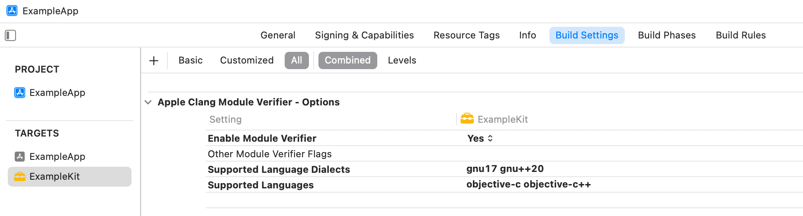
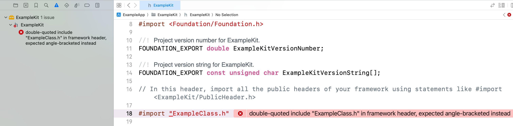

> Navigation: [Technologies](../technologies.md) · [Xcode](../xcode.md) · [Build system](build-system.md)

# Identifying and addressing framework module issues

Article

Detect and fix common problems found in framework modules with the module verifier.

## Overview

When you create a framework containing Objective-C, Objective-C++, C, or C++ code that you distribute to customers, clients, or other developers, it’s often challenging and time-consuming to find problems in your framework that don’t appear at build time.

In Xcode version 14.3 or later, enable the module verifier in your Xcode project’s build settings so that you can identify and address problems with your framework module before you distribute it.

Some examples of these problems include:

- Missing header references in your umbrella header
- Using quoted includes instead of angle-bracketed includes
- Using `@import` syntax in your public and private headers
- Incorrect target conditionals
- Imports inside of `extern "C"` language linkage specification
- Non-modular headers in your umbrella header
- References to private headers from public headers

When you enable the module verifier, it finds module problems in your code and displays errors for them in Xcode’s Issue navigator, just like compiler errors or warnings.

### Enable the module verifier build setting

In your Xcode project, select your framework’s target, then select the Build Settings tab. Scroll down to the Apple Clang Module Verifier section. For new projects created in Xcode 14.3 or later, the Enable Module Verifier setting defaults to Yes. For projects you created in earlier versions of Xcode, change the setting to Yes.

Then, check the values for Supported Languages and Supported Language Dialects, and update them to match your project’s requirements. View Quick Help for each setting to find valid values.

For more information about configuring build settings, see [Configuring the build settings of a target](configuring-the-build-settings-of-a-target.md).

### Build your project and identify issues

In Xcode, build your project, then show the Issue navigator to see issues in your project. Module verifier issues show up as errors in the Issue navigator.

Xcode Issue navigator that shows a highlighted module verifier issue and the corresponding line highlighted in the header file.

Review the issues, then click on an issue to highlight it in your source code.

### Address common issues

Identify each issue you find by matching it with an example error message in the following table. Then, use the error resolution examples to help you address the issue in your code.

| Error message | Error resolution |
|---|---|
| umbrella header for module ‘ExampleModule’ does not include header ‘MyObject.h’ | Add missing headers to your umbrella header. Include the missing header like so: `#import <ExampleModule/MyObject.h>`. |
| double-quoted include “MyObject.h” in framework header, expected angle-bracketed instead | Replace quoted includes with angle-bracketed includes. Change `#import "MyObject.h"` to `#import <ExampleModule/MyObject.h>`. |
| use of ‘`@import`’ in framework header is discouraged, including this header requires `-fmodules` | Avoid the use of semantic import syntax in your public and private headers. Change `@import Foundation;` to `#import <Foundation/Foundation.h>`. |
| ‘`TARGET_OS_IPHONE`’ is not defined, evaluates to 0 | Fix target conditionals. Add an include statement to your header that uses the target conditional: `#include <TargetConditionals.h>`. If that doesn’t fix the issue, check that the target conditional you use is defined in `TargetConditionals.h`. |
| import of C++ module ‘ExampleFramework.ExampleSource’ appears within extern “C” language linkage specification, _or_ extern “C” language linkage specification begins here | Avoid including imports inside of `extern "C"` language linkage specification. Move the include statement outside of the `extern "C"` scope. Don’t use the `[extern_c]` attribute in the module map. |
| include of non-modular header inside framework module ‘ExampleModule’ | Remove the include statement from your header. The header you are trying to include is not modular so you can’t include it in your framework module. If possible, make that code modular so that you can include it in your framework module. |
| public framework header includes private framework header ‘ExampleModule/MyObject_Private.h’ | Avoid including references to private headers from public headers. Either make the private header public, or remove the private header include from the public header. |

## See Also

### Build settings

- [Configuring the build settings of a target](configuring-the-build-settings-of-a-target.md) — Specify the options you use to compile, link, and produce a product from a target, and identify settings inherited from your project or the system.
- [Adding a build configuration file to your project](adding-a-build-configuration-file-to-your-project.md) — Specify your project’s build settings in plain-text files, and supply different settings for debug and release builds.
- [Build settings reference](build-settings-reference.md) — A detailed list of individual Xcode build settings that control or change the way a target is built.
- [Understanding build product layout changes in Xcode](understanding-build-product-layout-changes.md)
