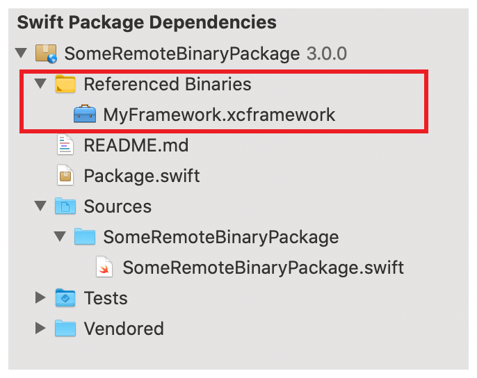

> Navigation: [Technologies](../technologies.md) · [Xcode](../xcode.md) · [Swift packages](swift-packages.md)

# Identifying binary dependencies

Article

Find out if a package dependency references a binary and verify the binary’s authenticity.

## Overview

When you add a source-based package dependency to your app, you can inspect the source code, contribute bug fixes, and recompile the source code if needed. However, a package author may have chosen to distribute their code in binary form. For example, a company may prefer to distribute binaries instead of source files to protect intellectual property. In general, taking on a dependency always requires careful consideration because you’re adding code to your app; even more so if you’re adding a binary dependency. As a result, it’s important you know how to identify a binary dependency.

### Review binary dependencies

Carefully consider whether you want to add a binary dependency, because doing so comes with drawbacks. For example, a binary dependency is less portable because it can only support platforms that its included binaries support, and binary dependencies are only available for Apple platforms. If you have a choice between a source-based dependency and a binary dependency, use the source-based dependency if it provides the same functionality.

### Identify a binary dependency

To find out whether a package dependency is a binary dependency or if a source-based package depends on one:

1. Open your app’s project in Xcode and ensure that the Project navigator is visible.
2. Expand Swift Package Dependencies and an individual package dependency.
3. Look for a folder called Referenced Binaries. If it exists, the package dependency distributes a binary or has a binary dependency.
4. To further inspect the referenced binary, Control-click the XCFramework bundle inside the Referenced Binaries folder, and open it in Finder.

The following image shows an app’s expanded Swift package dependencies, including a package dependency called SomeRemoteBinaryPackage that distributes a binary.

> [!note] Note
> To help verify a binary dependency’s origin, its author must create a [checksum](../packagedescription/target/checksum.md) and include it in the package manifest. When Xcode resolves or updates package dependencies, it doesn’t allow binary dependencies to change the checksum without also changing the version.

## See Also

### Package dependencies

- [Adding package dependencies to your app](adding-package-dependencies-to-your-app.md) — Integrate package dependencies to share code between projects, or leverage code from other developers.
- [Editing a package dependency as a local package](editing-a-package-dependency-as-a-local-package.md) — Override a package dependency and edit its content by adding it as a local package.
