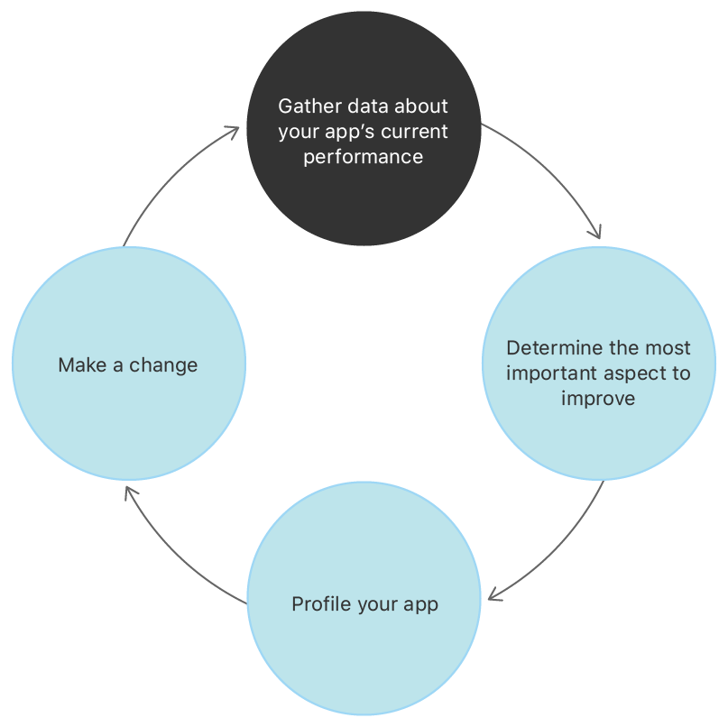

> Navigation: [Technologies](../technologies.md) · [Xcode](../xcode.md) · [Performance and metrics](performance-and-metrics.md)

# Improving your app’s performance

Article

Model, measure, and boost the performance of your app by using a continuous-improvement cycle.

## Overview

People using your app expect it to perform well. An app that takes a long time to launch, or responds slowly to input, may appear as if it isn’t working or is sluggish. An app that makes a lot of large network requests may increase a person’s data charges and drain the device battery. Similarly, an app that consumes a lot of disk space leaves a person’s device with less space for other content or apps. Any of these behaviors can frustrate people and lead them to uninstall your app.

Plan and implement performance improvements by approaching the problem scientifically:

1. Gather information about the problems your users are experiencing.
2. Measure your app’s behavior to find the causes of the problems.
3. Plan one change to improve the situation.
4. Implement the change.
5. Observe whether the app’s performance improves.

These activities form a cycle of continuous improvement, as the following illustration shows:

An illustration that shows performance improvement work as a cycle where you gather data about your app’s current performance, determine the most important aspect to improve, profile your app, make a change, and return to gathering data.

Minimizing resource use benefits your users and improves their perceptions of your app. Here are some specific benefits:

- Decreasing app launch time improves the user experience, and reduces the chances of the iOS watchdog timer terminating the app.
- Decreasing overall memory use reduces the likelihood of iOS freeing your app’s memory in the background, and improves responsiveness when a user switches back to your app.
- Reducing disk writes speeds up your app’s overall performance, makes it more responsive, and reduces wear on users’ device storage.
- Decreasing hang rate and hang duration improves your users’ perception of your app’s performance and responsiveness.
- Reducing battery consumption and the use of power-hungry device features makes your app more reliable, and helps ensure that the rest of a person’s device is available when needed.
- Maintaining low disk space usage allows a person to install and use more apps, and to keep more content on their device. For example, store content that your app can regenerate in the [cachesDirectory](../foundation/url/cachesdirectory.md) so that the system can purge it when needed. Doing so speeds up app and system upgrades, and reduces the iCloud storage space the system requires to create an iCloud backup of the device. For more information, see [Optimizing Your App’s Data for iCloud Backup](../foundation/optimizing-your-app-s-data-for-icloud-backup.md).

Even when your measurements and observations show no pressing performance problems, it’s a good idea to run through the performance-improvement cycle and do preventive work to keep your app’s performance from regressing.

### Gather data about your app’s current performance

To thoroughly understand your app’s performance, combine information from multiple sources:

- Use the [Xcode Organizer](https://developer.apple.com/videos/play/wwdc2020/10076) to view metrics for launch time, user-interface responsiveness, writes to storage, memory use, and energy use, as well as diagnostic reports for disk writes, crashes, and energy. The Organizer lets you break down measurements by device model, app version, and user percentile. For more information, see [Analyzing the performance of your shipping app](analyzing-the-performance-of-your-shipping-app.md).
- Use [MetricKit](../metrickit.md) to gather metrics and record them in your own tools. These metrics are in the form of histograms that record the frequency of observed values over a day. MetricKit goes beyond the metrics in the Metrics organizer to include average pixel luminance, cellular network conditions, and durations associated with custom `OSSignpost` events in your app.
- Get feedback from [TestFlight](https://developer.apple.com/testflight/) testers about their experiences with beta versions of your app. Fill out the Test Information page for your beta version, and request that testers provide feedback about the performance of your app. Include an email address so that testers can report their findings.
- Investigate feedback from your users about their experiences with released versions of your app. Invite users to send their feedback through email or a dedicated interface within your app. Ask them about their experiences using the app — both what works well and any problems they encounter.

### Determine the most important aspect to improve

Use the information from your observations and your understanding of your app’s purpose and expected use patterns to spot the greatest opportunities for improvement. Some performance issues are independent of the type of app under investigation. An app that takes a long time to launch, or is unresponsive to users’ attempts to manipulate the interface, results in users feeling they have no control over the app.

The largest value for a metric you see in the Metrics organizer or in MetricKit may not indicate the most important issue to address if that value represents expected app usage. For example, energy use associated with background-audio playing is probably not a problem for a podcast player, which users expect to play in the background. However, it would be surprising to see that metric dominate if your app is a game that has no background component to its gameplay.

Seeing that value dominate the metric reports can indicate that efficiency savings are possible, but the most impactful changes may be in the use of auxiliary services that don’t impact the app’s main features. The podcast player might infrequently need to use coarse-grained location services to recommend local-interest podcasts to the listener, but the high-energy consumption associated with the frequent tracking of the user’s precise location may be a sign that a change is necessary.

### Profile your app

Use [Instruments](https://help.apple.com/instruments/mac/current/) to profile your app with a profiling template that’s relevant to the metric you’re considering:

- Unresponsiveness and hangs: Use the [Time Profiler](https://help.apple.com/instruments/mac/current/#/dev44b2b437) template.
- Memory issues: Use the [Allocations](https://help.apple.com/instruments/mac/10.0/#/dev7b8f6eb6) and [Leaks](https://help.apple.com/instruments/mac/current/#/dev022f987b) templates.
- Power-consumption issues: Use the [Energy Log](https://help.apple.com/instruments/mac/current/#/deva0db8947) template.
- I/O issues: Use the [File Activity](https://help.apple.com/instruments/mac/current/#/dev6983c7c4) template.
- Network-related issues: Use the [Network template](https://help.apple.com/instruments/mac/10.0/#/dev209edacf).

You get higher-fidelity measurements by profiling on a device instead of the simulator. If the information you gather shows that your app performs poorly on a particular class or model of device, profile on that device.

Find the code that’s causing the performance problem, and create a plan for improving it. Keep in mind that your change may not be localized to a particular line or even function, and you may need to make significant architectural changes to your app. For example, to mitigate a hang that results from synchronously downloading network resources, introduce background operations to handle the networking (see [Downloading files in the background](../foundation/downloading-files-in-the-background.md)), and perform a UI update on the main thread when the downloads are complete.

### Make the next change

Implement the change you plan as a result of your investigation. Create an _after_ profile in Instruments that you can compare with the _before_ profile to ensure your change results in an improvement. Consider writing a performance test in [XCTest](../xctest.md) to protect against future regressions in performance, and to serve as a record that the problem existed and you fixed it.

### Compare the changed behavior with your original data

After you change your app to address the most important performance issue you observe, confirm that the change has the desired effect and that the level of improvement is sufficient. Use the graphs of performance metrics for each version of your app in Xcode’s Metrics organizer to see whether the change results in an improvement or a regression.

Finally, decide whether the metric you’re working on is still the most important to address, or whether the data points to another metric for the next iteration of the performance improvement cycle.

### Additional resources

The following articles, Xcode Help topics, and WWDC session videos contain more information about using Xcode and Instruments for measuring and improving app performance:

#### Performance tools and techniques

- [Diagnose Performance Issues With the Xcode Organizer](https://developer.apple.com/videos/play/wwdc2020/10076/)
- [Eliminate Animation Hitches With XCTest](https://developer.apple.com/videos/play/wwdc2020/10077)
- [Instruments Help](https://help.apple.com/instruments/mac/current)
- [Logging](../os/logging.md)
- [Performance on iOS and watchOS](https://developer.apple.com/videos/play/wwdc2015/230/)
- [Practical Approaches to Great App Performance](https://developer.apple.com/videos/play/wwdc2018/407/)
- [Profile your app’s performance](https://help.apple.com/instruments/mac/current/#/dev44b2b437)
- [Visual Debugging with Xcode](https://developer.apple.com/videos/play/wwdc2016/410/)
- [What’s New in MetricKit](https://developer.apple.com/videos/play/wwdc2020/10081)
- [Writing and running performance tests](writing-and-running-performance-tests.md)

#### Energy consumption

- [Achieving All-day Battery Life](https://developer.apple.com/videos/play/wwdc2015/707/)
- [Debugging Energy Issues](https://developer.apple.com/videos/play/wwdc2015/708/)
- [Energy Efficiency and the User Experience](https://developer.apple.com/library/archive/documentation/Performance/Conceptual/power_efficiency_guidelines_osx/index.html#//apple_ref/doc/uid/TP40013929-CH15)
- [Energy Efficiency Guide for iOS Apps](https://developer.apple.com/library/archive/documentation/Performance/Conceptual/EnergyGuide-iOS/index.html#//apple_ref/doc/uid/TP40015243)
- [Energy Efficiency Guide for Mac Apps](https://developer.apple.com/library/archive/releasenotes/MacOSX/WhatsNewInOSX/Articles/MacOSX10_11.html#//apple_ref/doc/uid/TP40016227-SW14)
- [Identify Trends With the Power and Performance API](https://developer.apple.com/videos/play/wwdc2020/10057)
- [Monitor a running app using debug gauges](https://help.apple.com/xcode/mac/current/index.html?localePath=en.lproj#/dev94c128b7b)
- [Monitor your app’s energy usage](https://help.apple.com/xcode/mac/current/index.html?localePath=en.lproj#/devf7f7c5fcd)
- [Profile your app’s energy use](https://help.apple.com/instruments/mac/current/#/dev7b8f6eb6)
- [What’s New in Energy Debugging](https://developer.apple.com/videos/play/wwdc2018/228/)
- [Writing Energy Efficient Apps](https://developer.apple.com/videos/play/wwdc2017/238/)
- [Xcode Energy Organizer](https://help.apple.com/xcode/mac/current/index.html?localePath=en.lproj#/dev36a5a9141)

## See Also

### Related Documentation

- [Reducing your app’s memory use](reducing-your-app-s-memory-use.md) — Improve your app’s performance by analyzing memory-use metrics and making changes to maximize memory efficiency.
- [Reducing your app’s launch time](reducing-your-app-s-launch-time.md) — Create a more responsive experience with your app by minimizing time spent in startup.
- [Reducing disk writes](reducing-disk-writes.md) — Improve your app’s responsiveness by optimizing how it writes data to permanent storage.

### Essentials

- [Profiling apps using Instruments](../tutorials/instruments.md) — Use Instruments to analyze the performance, resource usage, and behavior of your apps. Learn how to improve responsiveness, reduce memory usage, and analyze complex behavior over time.
- [Analyzing the performance of your shipping app](analyzing-the-performance-of-your-shipping-app.md) — View power and performance metrics for apps you distribute through the App Store.
- [Creating a performance plan for your visionOS app](../visionos/creating-a-performance-plan-for-visionos-app.md) — Identify your app’s performance and power goals and create a plan to measure and assess them.
