> Navigation: [Technologies](../technologies.md) · [Xcode](../xcode.md) · [Debugging](debugging.md) · [Metal debugger](metal-debugger.md)

# Inspecting buffers

Article

Confirm your buffer formats by examining buffer content.

## Overview

In the Metal debugger, you can validate that the content in your buffer is correct by examining it with the Buffer viewer. The Buffer viewer automatically formats the buffer content based on the current context, for example, by using the currently bound pipeline state. You can also manually configure the formatting, which may be necessary in some cases, such as when there’s no currently bound pipeline state. After adjusting the formatting, you can copy or export any values that you might need for later.

### Navigate your buffer

The Buffer viewer displays the contents of your buffer in a large table. If you open your buffer in the Bound Resources viewer for a particular draw command or compute dispatch, Xcode automatically lays out the contents to match any parameter it’s bound to in your shader. For more information, see [Inspecting the bound resources for a command](inspecting-the-bound-resources-for-a-command.md).

For example, imagine a vertex shader that takes a `float3` position and a `float3` normal as input, and outputs a `float4` position and a `float3` normal. If you open the geometry in the Bound Resources viewer, Xcode shows a column for each parameter in the table.

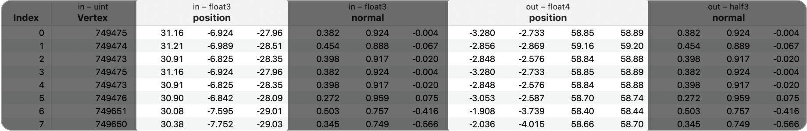

In the screenshot above, the `in – float3` position column shows three float values, whereas the `out – float4` position column shows four float values.

### Change the layout and initial offset

You can change the way that the Buffer viewer lays out your buffer content using the controls at the bottom. To change the column parameter type, click the Element Type drop-down. To change the number of elements per row, click the Number of Elements per Row drop-down to its right.

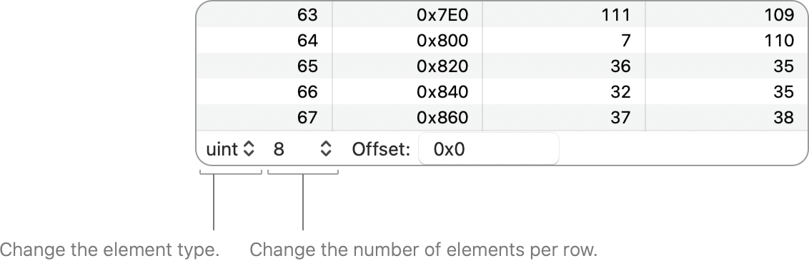

A screenshot of the layout controls in the Buffer viewer, consisting of the Element Type drop-down and the Number of Elements per Row drop-down.

For example, if `ushort` is the element type, with `4` elements per row, the Buffer viewer displays the content with four columns of type `ushort`.

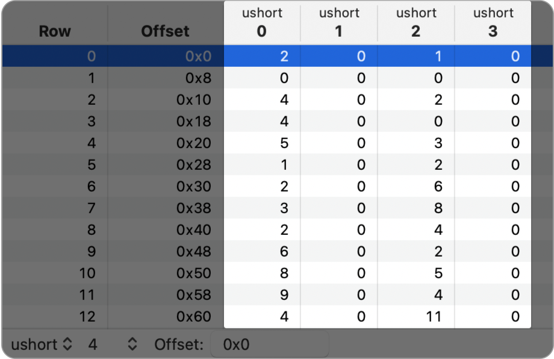

You can also adjust the initial offset in the buffer by changing the Offset field at the bottom. For example, in the screenshot below, changing the offset to `0x10`, Row 0 becomes `[4 0 2 0]` instead of `[2 0 1 0]`.

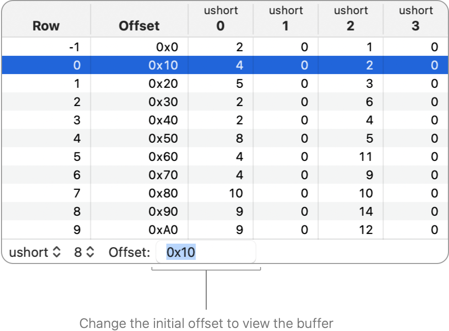

### Create a custom layout

You can create your own custom layout by clicking the Element Type drop-down and choosing Custom Layout \> Show Custom Layout Editor.

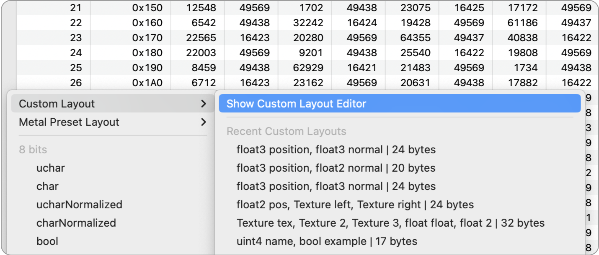

1. Type the raw type (such as `float3`) in the Layout field for the first column and press Return.
2. Type a name for your first column and press Return.
3. Repeat this for all of the columns in your custom layout.
4. Xcode automatically calculates the row stride, but you can also configure it manually.

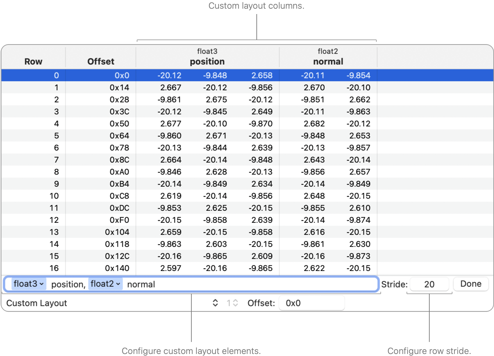

The custom layout editor also supports resource types to help you visualize resources in argument buffers.

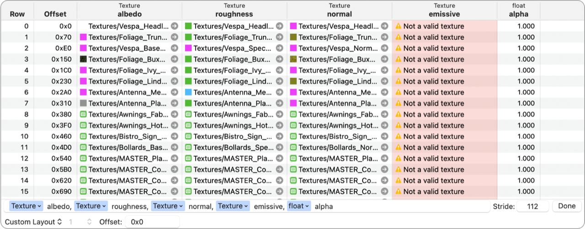

When you finish editing the buffer content with your custom layout, click Done. You can access custom layouts from the Element Type drop-down menu, just below Custom Layout \> Recent Custom Layouts.

### Configure columns

You can configure the Buffer viewer to display only the information you need. Position your pointer over a column header and Control-click. The context menu provides the following options:

- Visible: Toggles the column visibility.
- Pinned: Pins the column to the left side of the table, keeping it visible even when scrolling horizontally.
- Hide Other Columns: Hides all columns except the selected column and any pinned columns.
- View Value As: Casts the value to a different format of the same size, such as casting a float to an unsigned integer.

Additionally, you can configure any column’s options from the context menu, using the filter field to filter through their names.

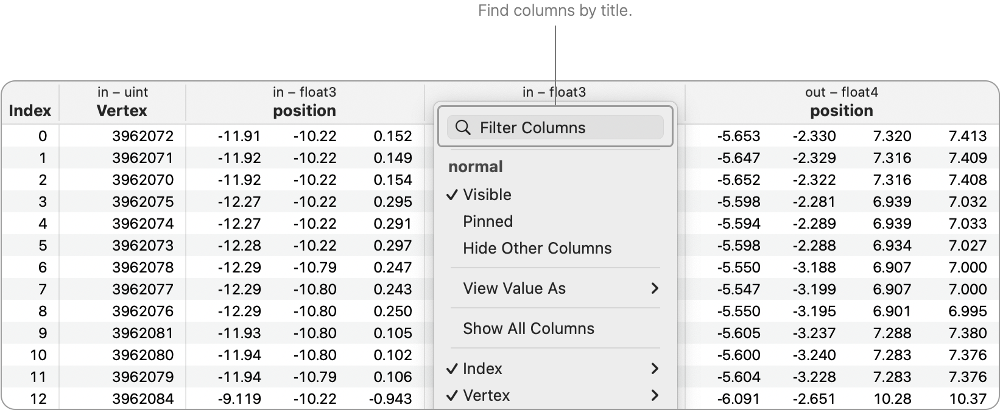

If you hide any columns, you can restore your configuration by selecting Show All Columns from the context menu.

### Search for specific text and values

You can search for values by using the search functionality. Press Command-F to open the search bar. The search bar uses a token system to format your search, and different options appear for different input types.

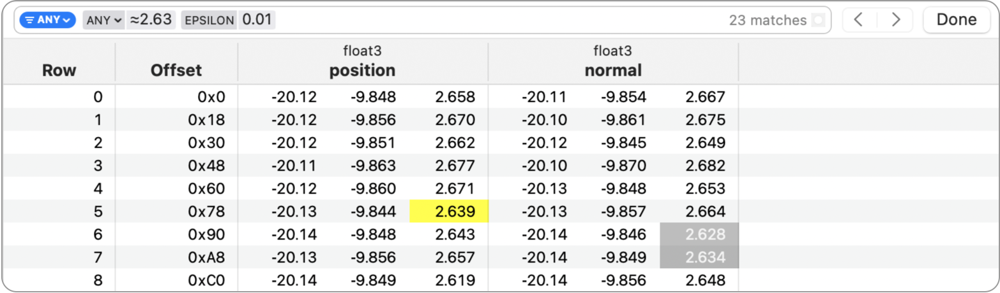

If you specify a floating-point number with an Equal or Not Equal comparison type, you get an additional token to set up the epsilon value for the comparison (defaults to 0.001). If you specify a decimal or a hexadecimal number, only the exact number appears with a highlight in the results.

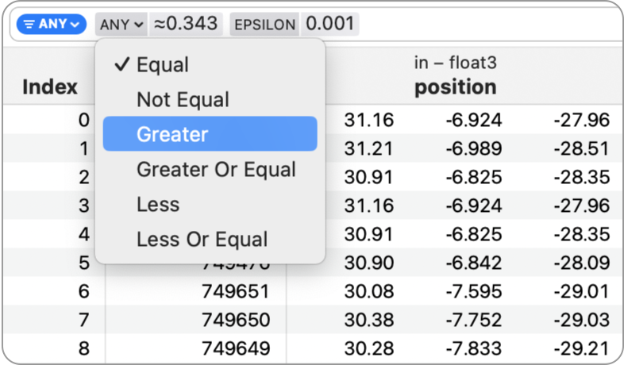

Additionally, if you specify the GPU base address of a resource, or the GPU base address value of an argument buffer (with or without the offset), it appears with a highlight in the results.

You can also search for text, such as resource names, errors, and invalid numerical values (nan, inf, -inf).

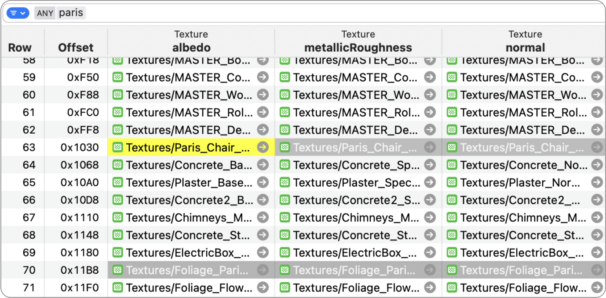

### Export your buffer content

You can copy the buffer contents either by selecting full rows or individual cells in the table, and then choosing Edit \> Copy. The system uses the current layout format to copy the values, including visibility and any type cast override.

You can also export the contents of the entire buffer by choosing Editor \> Export Buffer. Then you can save it either as raw data or as a CSV file.

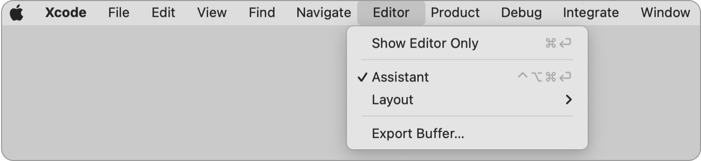

Alternatively, you can export the buffer by Control-clicking it in the Bound Resources viewer and choosing Export. For more information, see [Inspecting the bound resources for a command](inspecting-the-bound-resources-for-a-command.md).

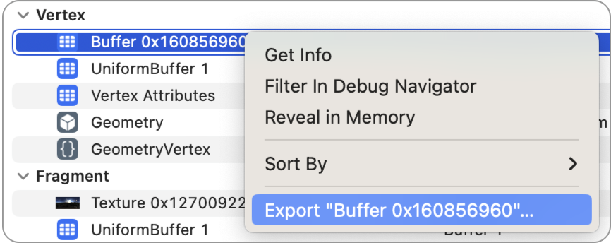

A screenshot of the context menu for a buffer resource in the the Bound Resources viewer. The Export Buffer menu item is highlighted.

## See Also

### Metal resource inspection

- [Inspecting acceleration structures](inspecting-acceleration-structures.md) — Reveal ray intersection bottlenecks by examining your acceleration structures.
- [Inspecting pipeline states](inspecting-pipeline-states.md) — Determine how your render and compute passes behave by examining their properties.
- [Inspecting sampler states](inspecting-sampler-states.md) — Verify your sampler state configurations by examining their properties.
- [Inspecting shaders](inspecting-shaders.md) — Improve your app’s shader performance by examining and editing your shaders.
- [Inspecting textures](inspecting-textures.md) — Discover issues in your textures by examining their content.
