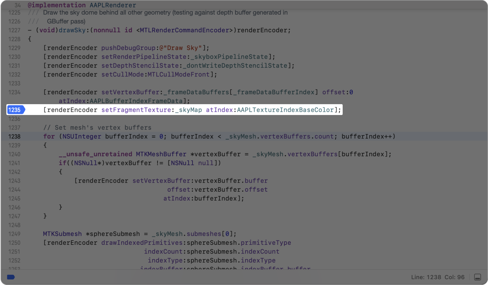
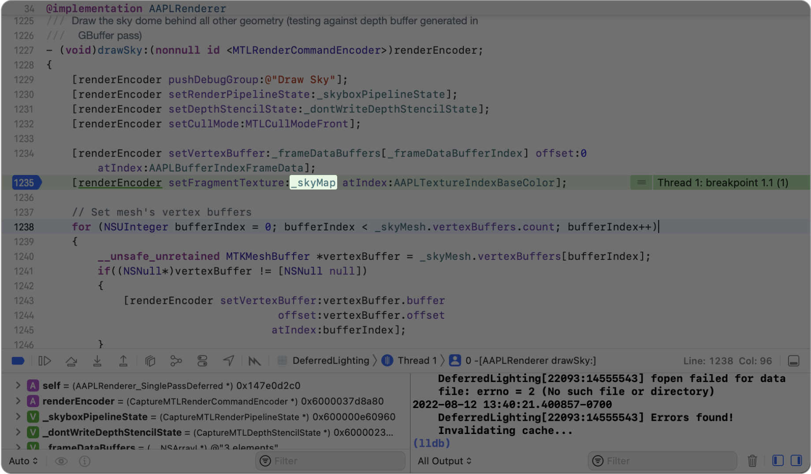
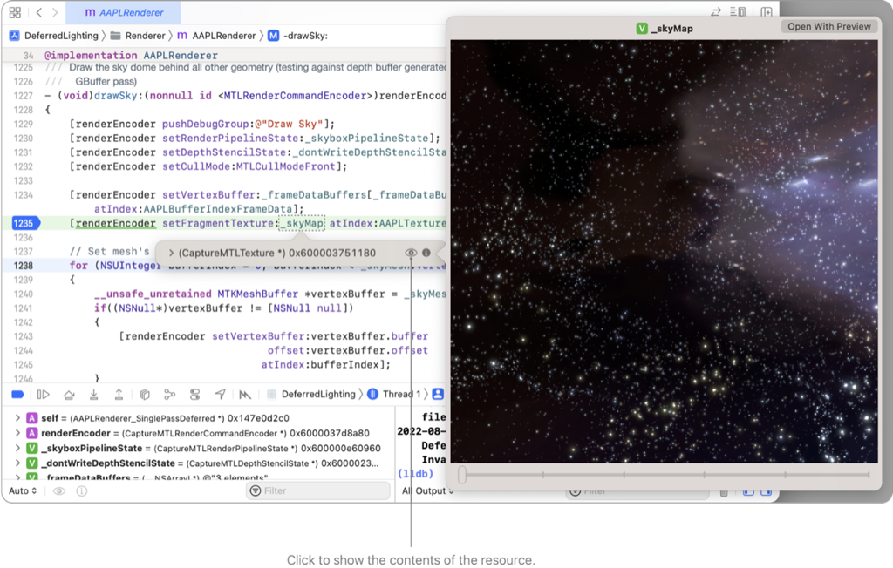

> Navigation: [Technologies](../technologies.md) · [Xcode](../xcode.md) · [Debugging](debugging.md) · [Metal developer workflows](metal-developer-workflows.md)

# Inspecting live resources at runtime

Article

Validate your resources by viewing the contents of your textures and buffers while debugging your Metal app.

## Overview

You can preview contents of textures and buffers while debugging your app in Xcode by pausing on a breakpoint, inspecting a variable that references the resource, and then clicking the Preview button. This is one quick way to validate that your resources have the correct contents while debugging at runtime.

> [!important] Important
> If you disable GPU Frame Capture, you can’t inspect resource content while your app is running. See [Capturing a Metal workload in Xcode](capturing-a-metal-workload-in-xcode.md) to learn how to reenable it.

### Inspect your textures and buffers

First, pause the app inside a scope that contains a variable referencing the resource. You can achieve this by setting a breakpoint on a line that references the resource. To set a breakpoint, click the line number to the left of the source editor. The example below shows a breakpoint for the line where `_skyMap` is bound to the render encoder:

Then, when yor app pauses at the breakpoint, move the pointer over the variable referencing the resource to reveal the Value inspector.

A screenshot of the source editor, breaking at a line of code with a breakpoint. The variable underscore sky map is highlighted.

Finally, click the Preview button to show the contents of the resource.

If the resource is a texture and has multiple slices, like the sky map above, you can drag the slider at the bottom of the Preview popover to see each slice. If the resource has any unexpected values, you can investigate further with the Metal debugger (see [Investigating visual artifacts](investigating-visual-artifacts.md)).

## See Also

### Runtime diagnostics

- [Validating your app’s Metal API usage](validating-your-apps-metal-api-usage.md) — Catch runtime issues in your Metal app using API Validation.
- [Validating your app’s Metal shader usage](validating-your-apps-metal-shader-usage.md) — Catch common shader runtime issues using Shader Validation.
- [Monitoring your Metal app’s graphics performance](monitoring-your-metal-apps-graphics-performance.md) — Catch performance issues using the Metal Performance HUD while your app runs.
- [Customizing the Metal Performance HUD](customizing-metal-performance-hud.md) — Modify the appearance of your Metal heads-up display to monitor your graphics performance.
- [Understanding the Metal Performance HUD metrics](understanding-metal-performance-hud-metrics.md) — Learn what each of the metrics reported by the heads-up display indicates.
- [Gaining performance insights with the Metal Performance HUD](gaining-performance-insights-with-metal-performance-hud.md) — Catch potential performance issues while your app runs using the Metal heads-up display.
- [Generating performance reports with the Metal Performance HUD](generating-performance-reports-with-metal-performance-hud.md) — Record your app’s performance using the heads-up display.
