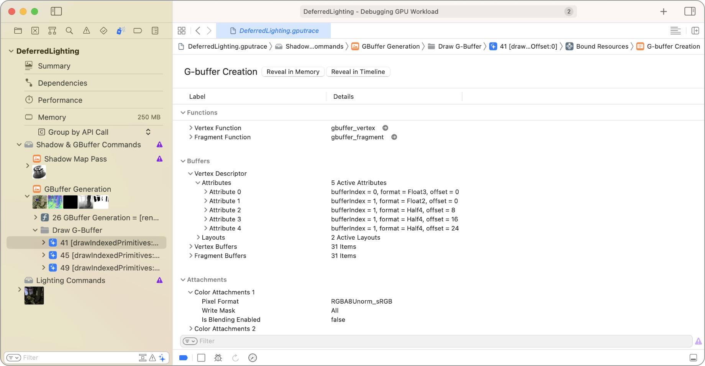
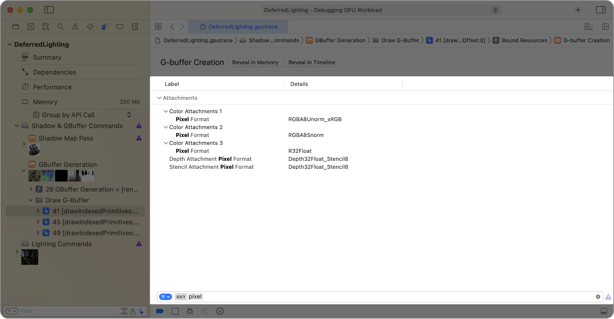

> Navigation: [Technologies](../technologies.md) · [Xcode](../xcode.md) · [Debugging](debugging.md) · [Metal debugger](metal-debugger.md)

# Inspecting pipeline states

Article

Determine how your render and compute passes behave by examining their properties.

## Overview

The Metal debugger allows you to inspect a pipeline state with the Pipeline State viewer. Double-click a pipeline state to open it and view its associated properties in a table.

In the screenshot above, the name of the pipeline state, G-buffer Creation, appears above the table. To the right of the name, you can click the Reveal in Memory button or the Reveal in Timeline button to open the Memory viewer or the Performance timeline, respectively, which both highlight the pipeline state.

The table displays the properties of your pipeline state in a logical hierarchy. Click the disclosure controls on the left to expand the groups to view more information. Using the table, you can quickly inspect the properties of [MTLRenderPipelineState](../metal/mtlrenderpipelinestate.md) or [MTLComputePipelineState](../metal/mtlcomputepipelinestate.md).

### Limit your scope with filters

Use the filter field at the bottom of the Pipeline State viewer to adjust the filtering criteria by typing filter terms into it. Then the table displays the related pipeline state properties that match the filter terms, and highlights the matches.

A screenshot of the Pipeline State viewer filtering for the term pixel. The list displays the matching properties hierarchically.

When there are two or more filter terms, you can click the filter button to choose whether to match any or all of the terms.

## See Also

### Metal resource inspection

- [Inspecting acceleration structures](inspecting-acceleration-structures.md) — Reveal ray intersection bottlenecks by examining your acceleration structures.
- [Inspecting buffers](inspecting-buffers.md) — Confirm your buffer formats by examining buffer content.
- [Inspecting sampler states](inspecting-sampler-states.md) — Verify your sampler state configurations by examining their properties.
- [Inspecting shaders](inspecting-shaders.md) — Improve your app’s shader performance by examining and editing your shaders.
- [Inspecting textures](inspecting-textures.md) — Discover issues in your textures by examining their content.
