> Navigation: [Technologies](../technologies.md) · [Xcode](../xcode.md) · [Debugging](debugging.md) · [Metal debugger](metal-debugger.md)

# Inspecting sampler states

Article

Verify your sampler state configurations by examining their properties.

## Overview

The Metal debugger allows you to inspect a sampler state with the Sampler State viewer. After opening a sampler state, you can view its associated properties and preview the sampling behavior. For more information, see [Inspecting the bound resources for a command](inspecting-the-bound-resources-for-a-command.md) or [Analyzing memory usage](analyzing-memory-usage.md).

### Navigate your sampler state

The Sampler State viewer shows the properties of your sampler state on the left (as configured by [MTLSamplerDescriptor](../metal/mtlsamplerdescriptor.md)) and a preview on the right. The preview illustrates how pixels in a texture appear when using your sampler state.

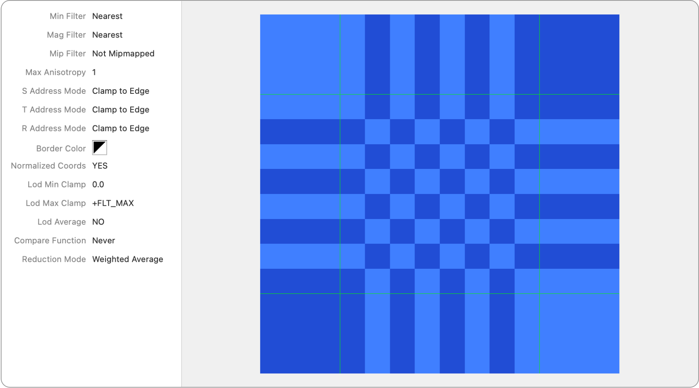

A screenshot of the Sampler State viewer displaying a sampler state configured with nearest filtering and clamp-to-edge address mode.

The square region in the center of the preview corresponds to UV coordinates within the range of `0.0` to `1.0`.

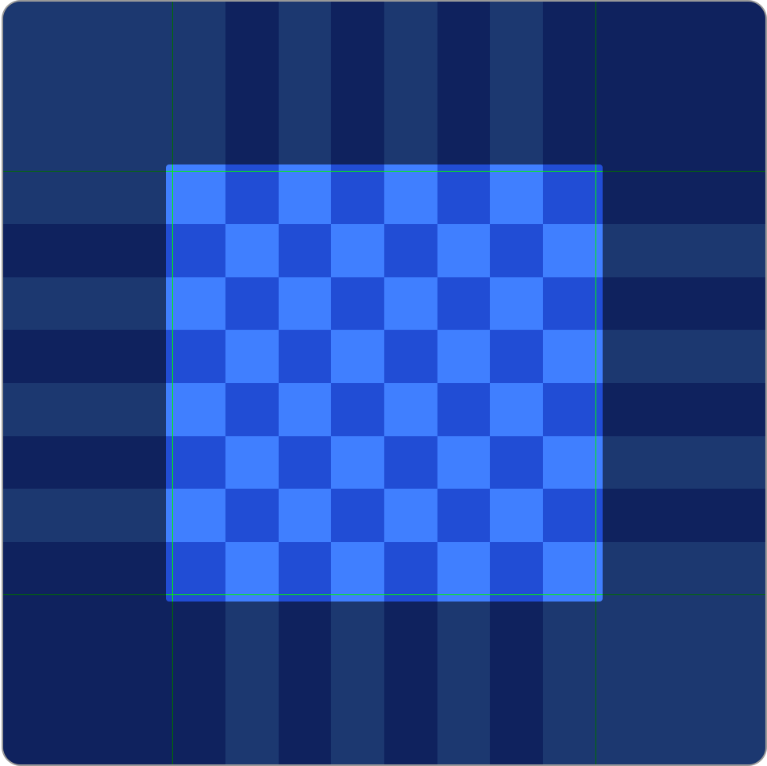

A screenshot of the Sampler State viewer displaying a sampler state configured with nearest filtering and clamp-to-edge address mode. The region in bounds is highlighted.

You can use the preview to quickly verify the configuration for your sampler state. For example, if you want a texture to mirror, but it’s drawing a constant value instead, you can check the sampler state. In the screenshot below, the sampler state is configured to clamp to a border color that’s opaque black, rather than using mirror repeat as the address mode:

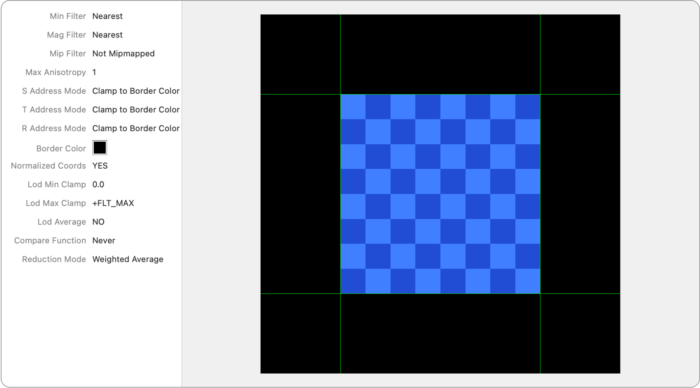

A screenshot of the Sampler State viewer displaying a sampler state configured with nearest filtering and clamp-to-border address mode. The border color is opaque black.

### Try various combinations

The properties you configure when creating a sampler state determine how a texture looks when sampling it. The properties related to filtering control how pixels combine when the sample footprint is either larger or smaller than a pixel, or when it’s between mipmap levels. The address mode determines the texture coordinate at each pixel when a read falls outside the bounds of a texture. You can try using different combinations of filtering and addressing modes until you achieve your desired look.

| Properties | Preview |
|---|---|
| [MTLSamplerMinMagFilter.nearest](../metal/mtlsamplerminmagfilter/nearest.md), [MTLSamplerAddressMode.clampToEdge](../metal/mtlsampleraddressmode/clamptoedge.md) | 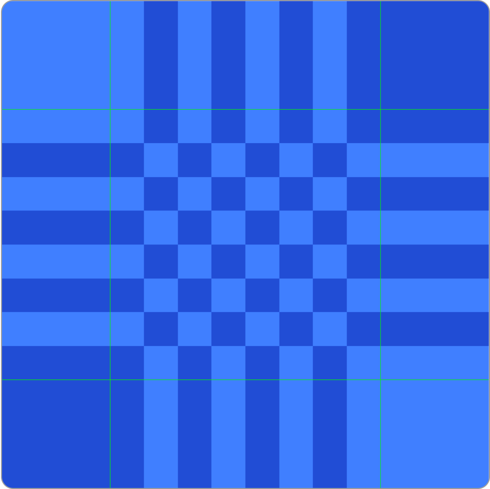  A screenshot of the Sampler State viewer displaying a sampler state configured with nearest filtering and clamp-to-edge address mode. |
| [MTLSamplerMinMagFilter.nearest](../metal/mtlsamplerminmagfilter/nearest.md), [MTLSamplerAddressMode.mirrorClampToEdge](../metal/mtlsampleraddressmode/mirrorclamptoedge.md) | 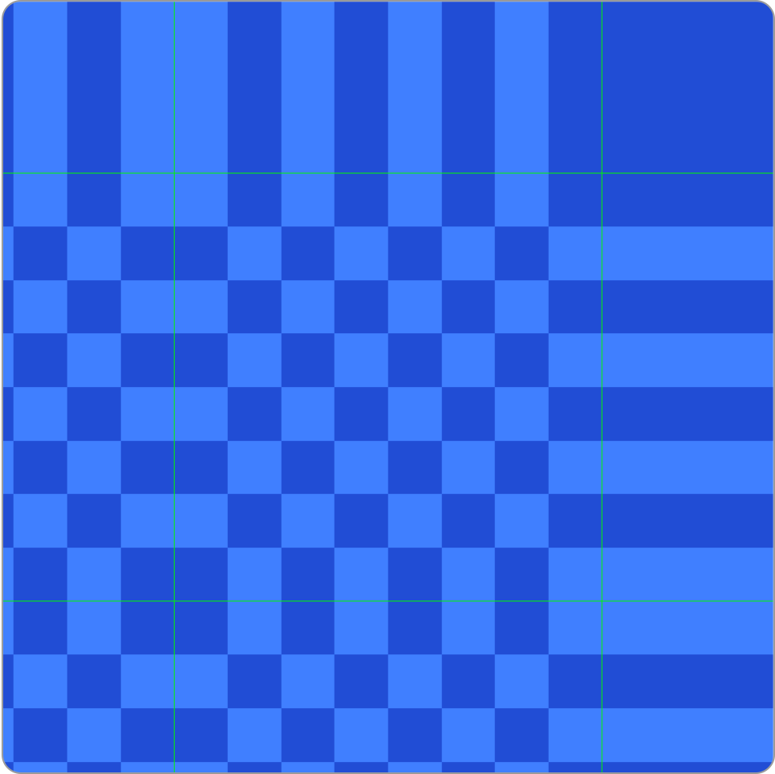  A screenshot of the Sampler State viewer displaying a sampler state configured with nearest filtering and mirror-clamp-to-edge address mode. |
| [MTLSamplerMinMagFilter.nearest](../metal/mtlsamplerminmagfilter/nearest.md), [MTLSamplerAddressMode.repeat](../metal/mtlsampleraddressmode/repeat.md) | 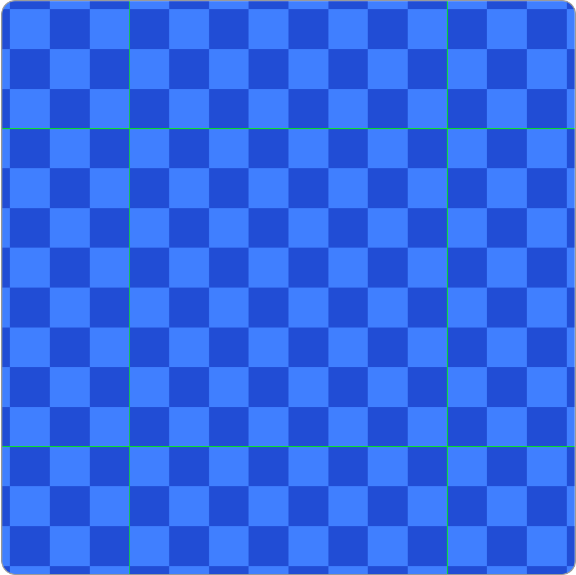  A screenshot of the Sampler State viewer displaying a sampler state configured with nearest filtering and repeat address mode. |
| [MTLSamplerMinMagFilter.nearest](../metal/mtlsamplerminmagfilter/nearest.md), [MTLSamplerAddressMode.mirrorRepeat](../metal/mtlsampleraddressmode/mirrorrepeat.md) | 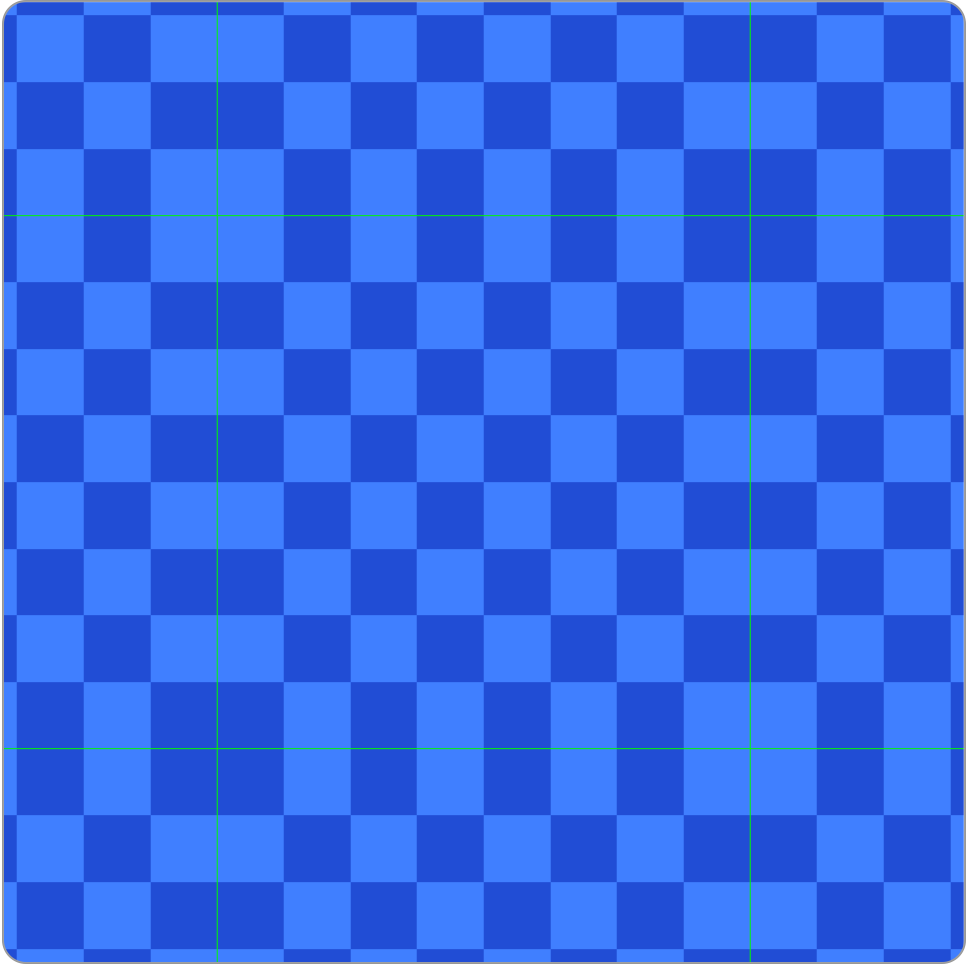  A screenshot of the Sampler State viewer displaying a sampler state configured with nearest filtering and mirror-repeat address mode. |
| [MTLSamplerMinMagFilter.nearest](../metal/mtlsamplerminmagfilter/nearest.md), [MTLSamplerAddressMode.clampToZero](../metal/mtlsampleraddressmode/clamptozero.md) | 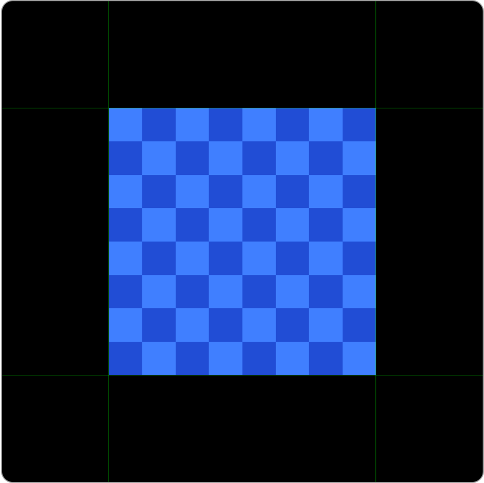  A screenshot of the Sampler State viewer displaying a sampler state configured with nearest filtering and clamp-to-zero address mode. |
| [MTLSamplerMinMagFilter.nearest](../metal/mtlsamplerminmagfilter/nearest.md), [MTLSamplerAddressMode.clampToBorderColor](../metal/mtlsampleraddressmode/clamptobordercolor.md), [MTLSamplerBorderColor.opaqueBlack](../metal/mtlsamplerbordercolor/opaqueblack.md) |   A screenshot of the Sampler State viewer displaying a sampler state configured with nearest filtering and clamp-to-border address mode. The border color is opaque black. |
| [MTLSamplerMinMagFilter.nearest](../metal/mtlsamplerminmagfilter/nearest.md), [MTLSamplerAddressMode.clampToBorderColor](../metal/mtlsampleraddressmode/clamptobordercolor.md), [MTLSamplerBorderColor.opaqueWhite](../metal/mtlsamplerbordercolor/opaquewhite.md) | 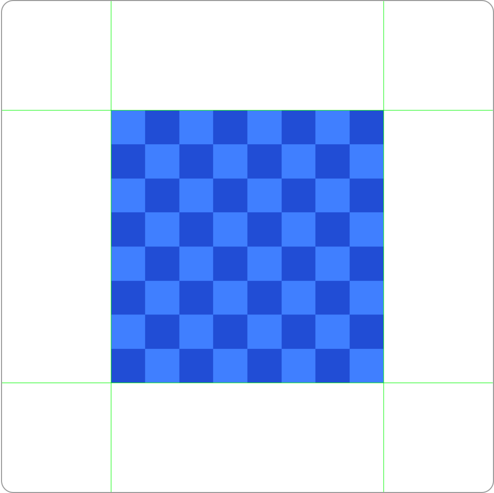  A screenshot of the Sampler State viewer displaying a sampler state configured with nearest filtering and clamp-to-border address mode. The border color is opaque white. |
| [MTLSamplerMinMagFilter.nearest](../metal/mtlsamplerminmagfilter/nearest.md), [MTLSamplerAddressMode.clampToBorderColor](../metal/mtlsampleraddressmode/clamptobordercolor.md), [MTLSamplerBorderColor.transparentBlack](../metal/mtlsamplerbordercolor/transparentblack.md) | 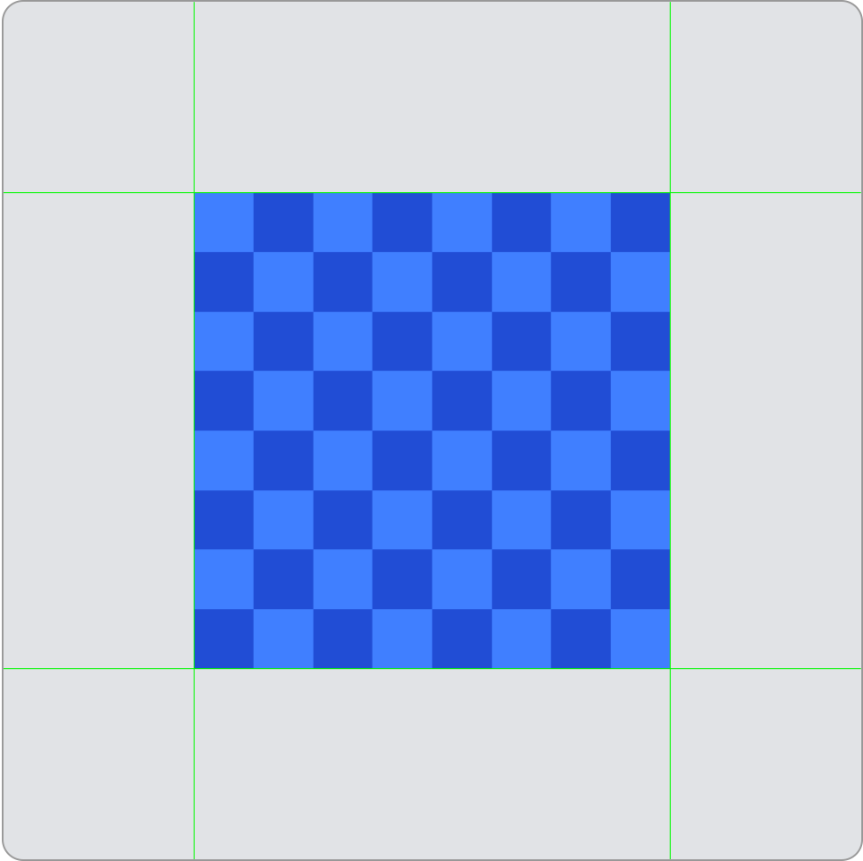  A screenshot of the Sampler State viewer displaying a sampler state configured with nearest filtering and clamp-to-border address mode. The border color is transparent black. |
| [MTLSamplerMinMagFilter.linear](../metal/mtlsamplerminmagfilter/linear.md), [MTLSamplerAddressMode.clampToEdge](../metal/mtlsampleraddressmode/clamptoedge.md) | 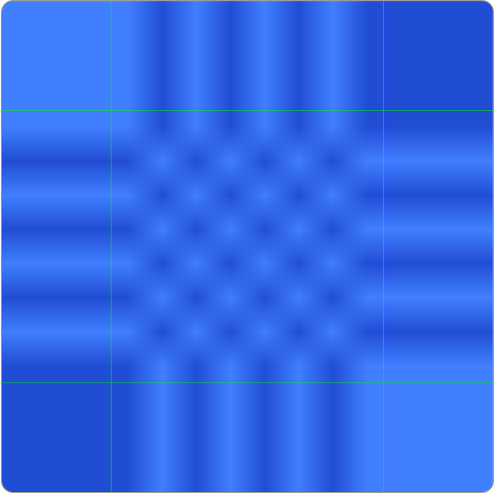  A screenshot of the Sampler State viewer displaying a sampler state configured with linear filtering and clamp-to-edge address mode. |
| [MTLSamplerMinMagFilter.linear](../metal/mtlsamplerminmagfilter/linear.md), [MTLSamplerAddressMode.clampToEdge](../metal/mtlsampleraddressmode/clamptoedge.md) | 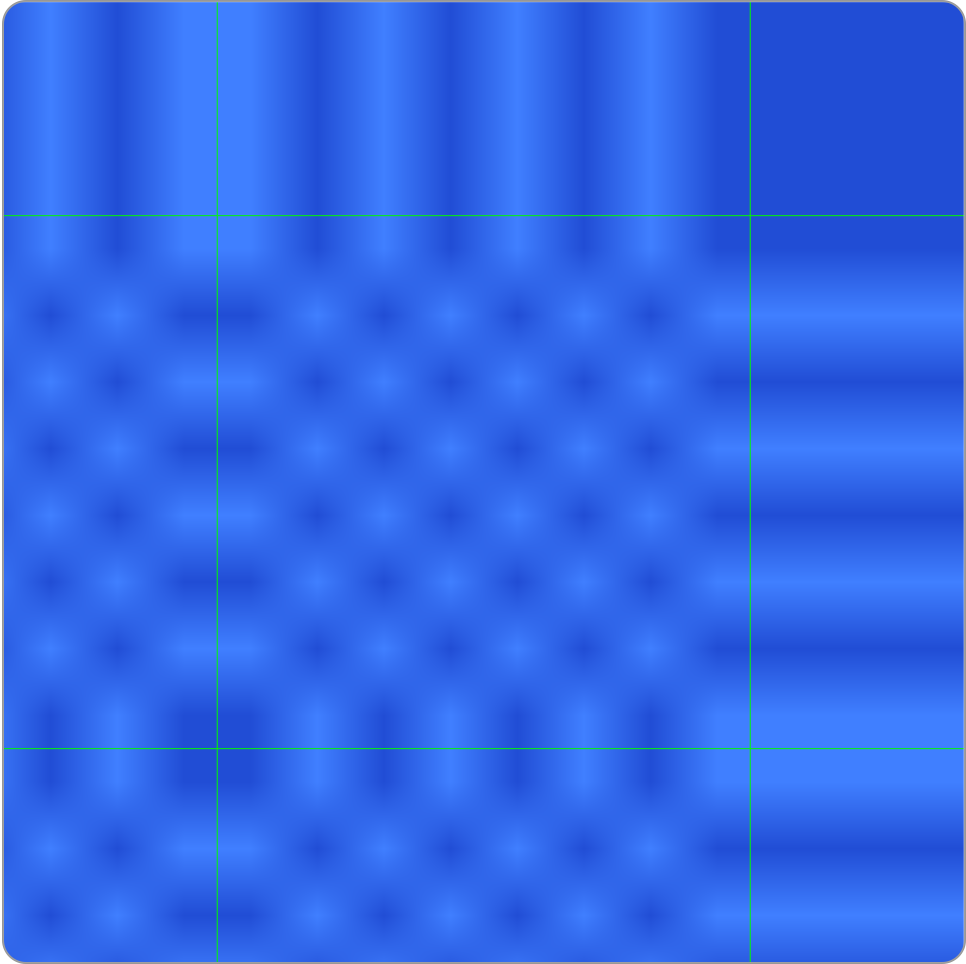  A screenshot of the Sampler State viewer displaying a sampler state configured with linear filtering and mirror-clamp-to-edge address mode. |
| [MTLSamplerMinMagFilter.linear](../metal/mtlsamplerminmagfilter/linear.md), [MTLSamplerAddressMode.repeat](../metal/mtlsampleraddressmode/repeat.md) | 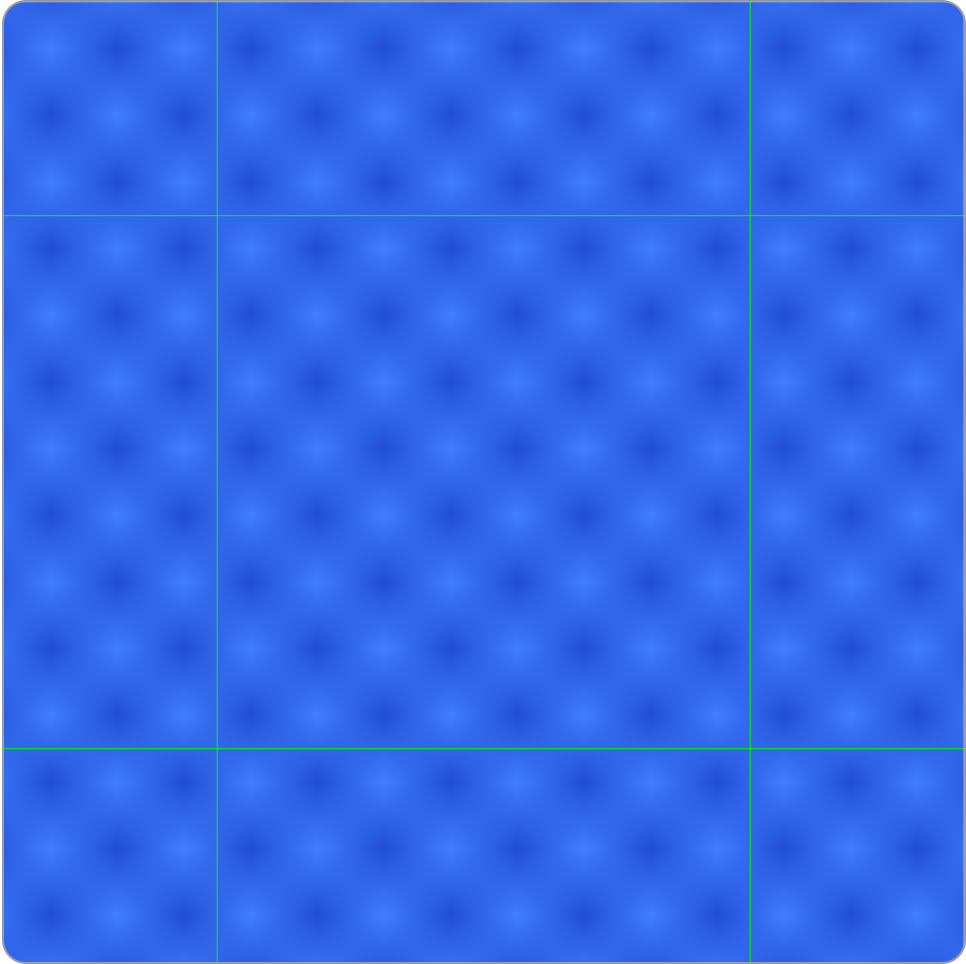  A screenshot of the Sampler State viewer displaying a sampler state configured with linear filtering and repeat address mode. |
| [MTLSamplerMinMagFilter.linear](../metal/mtlsamplerminmagfilter/linear.md), [MTLSamplerAddressMode.mirrorRepeat](../metal/mtlsampleraddressmode/mirrorrepeat.md) | 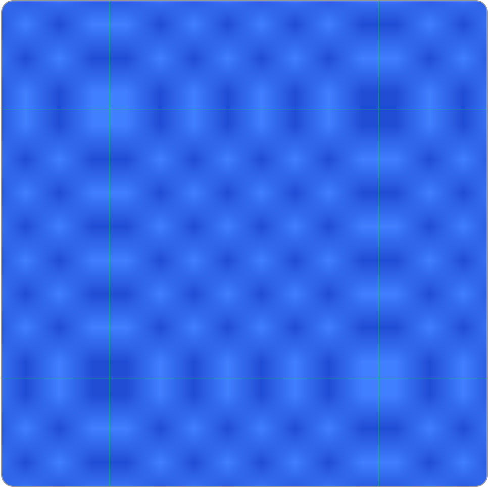  A screenshot of the Sampler State viewer displaying a sampler state configured with linear filtering and mirror-repeat address mode. |
| [MTLSamplerMinMagFilter.linear](../metal/mtlsamplerminmagfilter/linear.md), [MTLSamplerAddressMode.clampToZero](../metal/mtlsampleraddressmode/clamptozero.md) | 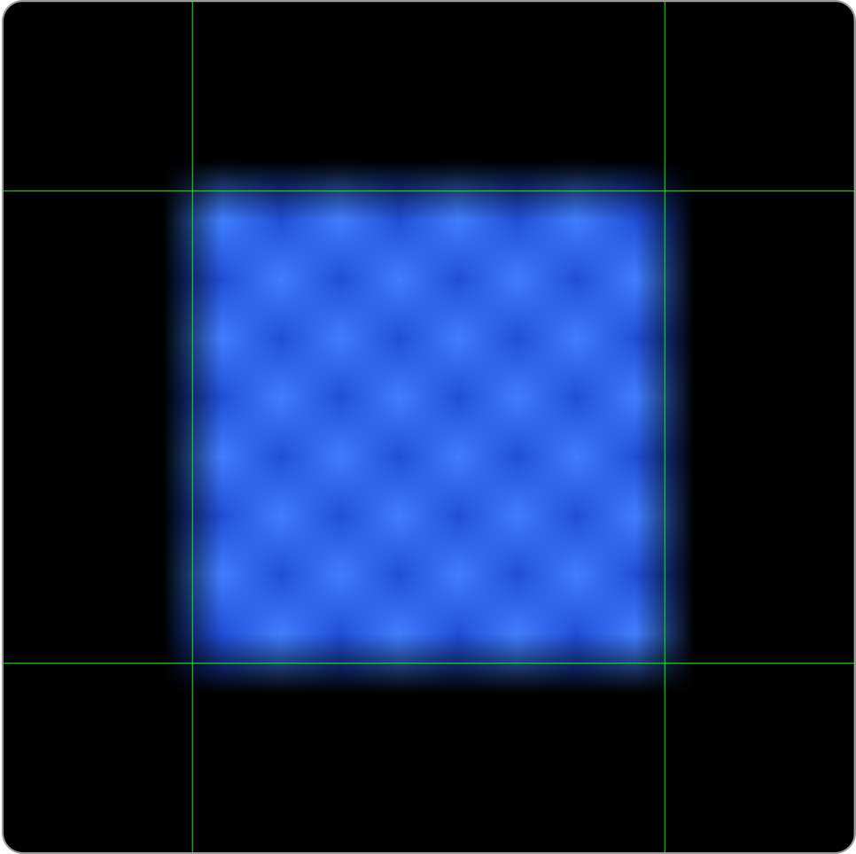  A screenshot of the Sampler State viewer displaying a sampler state configured with linear filtering and clamp-to-zero address mode. |
| [MTLSamplerMinMagFilter.linear](../metal/mtlsamplerminmagfilter/linear.md), [MTLSamplerAddressMode.clampToBorderColor](../metal/mtlsampleraddressmode/clamptobordercolor.md), [MTLSamplerBorderColor.opaqueBlack](../metal/mtlsamplerbordercolor/opaqueblack.md) |   A screenshot of the Sampler State viewer displaying a sampler state configured with linear filtering and clamp-to-border address mode. The border color is opaque black. |
| [MTLSamplerMinMagFilter.linear](../metal/mtlsamplerminmagfilter/linear.md), [MTLSamplerAddressMode.clampToBorderColor](../metal/mtlsampleraddressmode/clamptobordercolor.md), [MTLSamplerBorderColor.opaqueWhite](../metal/mtlsamplerbordercolor/opaquewhite.md) | 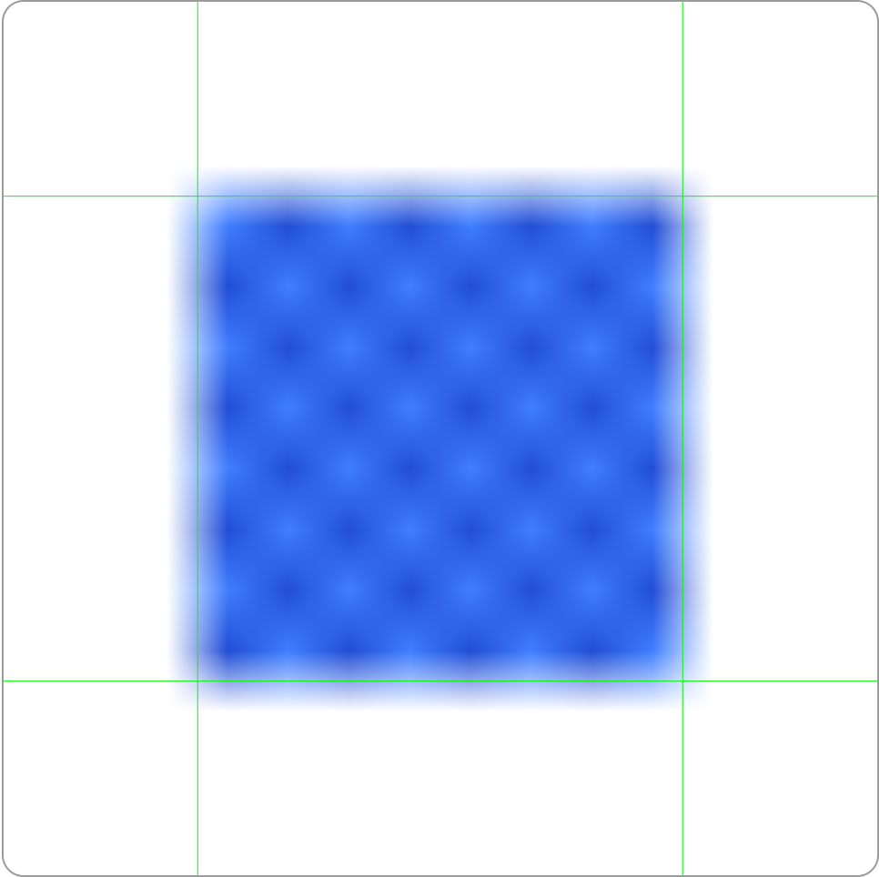  A screenshot of the Sampler State viewer displaying a sampler state configured with linear filtering and clamp-to-border address mode. The border color is opaque white. |
| [MTLSamplerMinMagFilter.linear](../metal/mtlsamplerminmagfilter/linear.md), [MTLSamplerAddressMode.clampToBorderColor](../metal/mtlsampleraddressmode/clamptobordercolor.md), [MTLSamplerBorderColor.transparentBlack](../metal/mtlsamplerbordercolor/transparentblack.md) | 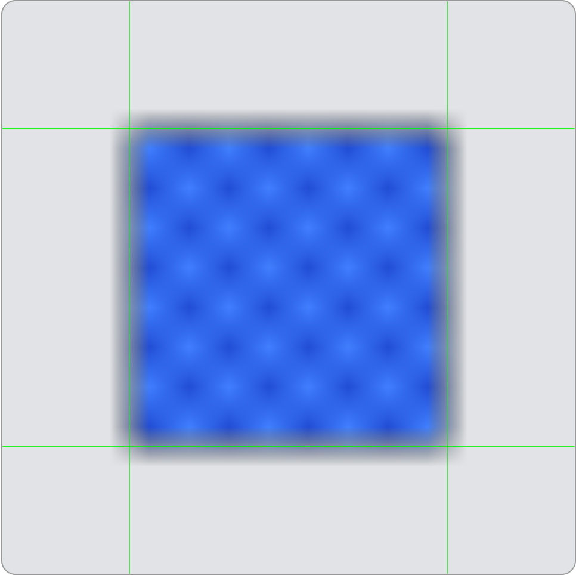  A screenshot of the Sampler State viewer displaying a sampler state configured with linear filtering and clamp-to-border address mode. The border color is transparent black. |

## See Also

### Metal resource inspection

- [Inspecting acceleration structures](inspecting-acceleration-structures.md) — Reveal ray intersection bottlenecks by examining your acceleration structures.
- [Inspecting buffers](inspecting-buffers.md) — Confirm your buffer formats by examining buffer content.
- [Inspecting pipeline states](inspecting-pipeline-states.md) — Determine how your render and compute passes behave by examining their properties.
- [Inspecting shaders](inspecting-shaders.md) — Improve your app’s shader performance by examining and editing your shaders.
- [Inspecting textures](inspecting-textures.md) — Discover issues in your textures by examining their content.
