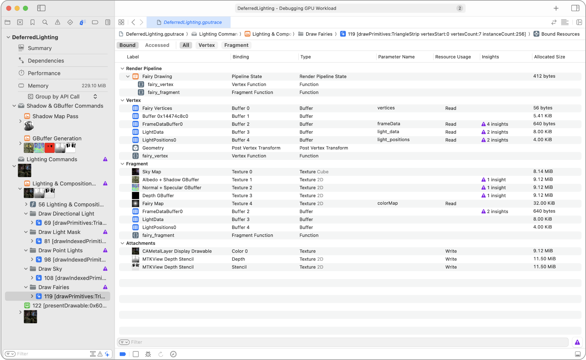
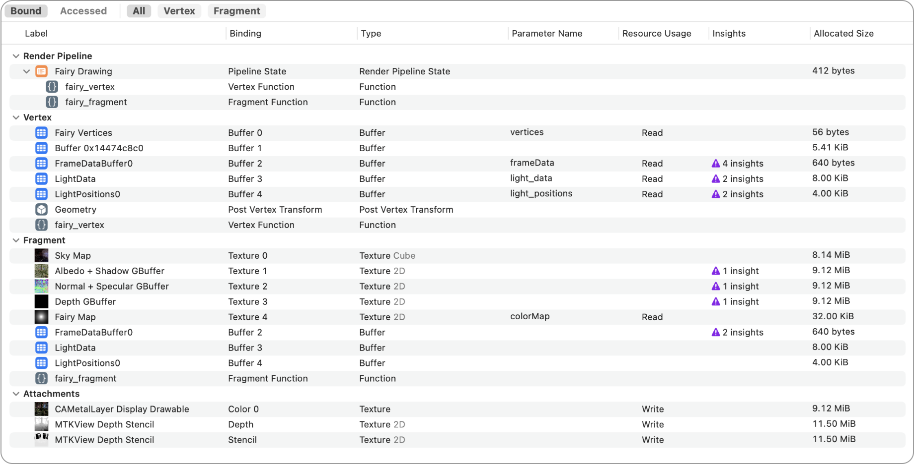
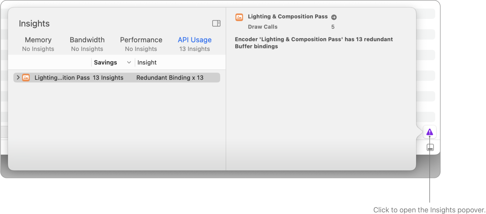
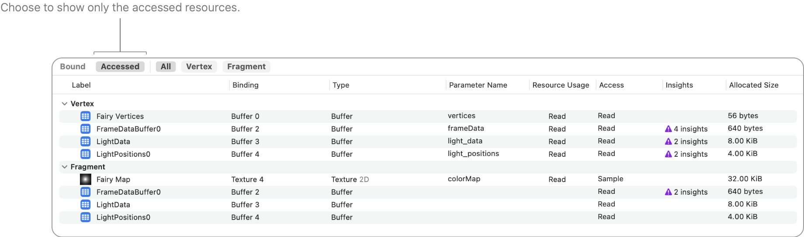

> Navigation: [Technologies](../technologies.md) · [Xcode](../xcode.md) · [Debugging](debugging.md) · [Metal debugger](metal-debugger.md)

# Inspecting the bound resources for a command

Article

Discover issues by examining the bound resources at any point in an encoder.

## Overview

Metal’s render and compute encoders allow you to set pipeline states, bind resources, specify parameters, and encode GPU commands. The Bound Resources viewer helps you determine the bound resources at any point in an encoder.

### Inspect bound resources

The Bound Resources viewer displays the current set of bound resources in the encoder. You can double-click a resource row to further inspect that resource.

For a render pass, the Bound Resources viewer groups the resources in the following sections:

- **Render Pipeline:** The specified render pipeline state.
- **Execute Indirect:** The indirect command buffer (ICB) that the command executes from.
- **Vertex/Object/Mesh/Tile/Fragment Stage:** The resources in the corresponding stage. In addition, it includes the shader function. For the vertex and the mesh stage, it also includes the index buffer and output geometry.
- **Attachments:** The attachment textures.
- **Indirect:** The used indirect resources and those from the same heap. To use a resource, call [useResource(_:usage:stages:)](<../metal/mtlrendercommandencoder/useresource(__usage_stages_).md>) or [useHeap(_:stages:)](<../metal/mtlrendercommandencoder/useheap(__stages_).md>).

For a compute pass, the Bound Resources viewer groups the resources in the following sections:

- **Compute Pipeline:** The specified compute pipeline state.
- **Execute Indirect:** The indirect command buffer (ICB) that the command executes from.
- **Compute:** The resources in the compute pass.
- **Indirect:** The used indirect resources and those from the same heap. To use a resource, call [useResource(_:usage:)](<../metal/mtlcomputecommandencoder/useresource(__usage_).md>), [useResources(_:usage:)](<../metal/mtlcomputecommandencoder/useresources(__usage_).md>), [useHeap(_:)](<../metal/mtlcomputecommandencoder/useheap(__).md>), or [useHeaps(_:)](<../metal/mtlcomputecommandencoder/useheaps(__).md>).

The Bound Resources viewer includes the following information for all resource types:

| Column | Property | Description |
|---|---|---|
| Label | [label](../metal/mtlresource/label.md) | The label you set when creating the resource. Use this information to identify specific resources in your app. To learn how to name your resources, see [Naming resources and commands](naming-resources-and-commands.md). |
| Type |  | An attribute to identify the location of the argument in the shader: buffer, texture, sampler, or threadgroup buffer index. |
| Allocated Size | [allocatedSize](../metal/mtlresource/allocatedsize.md) | The actual allocated memory size for the resource. |
| Parameter Name |  | The name of the variable in the shader that binds to the resource. |
| Resource Usage |  | An indicator of whether the shader can read from or write to the resource. |
| Access |  | An indicator of whether the shader actually accesses the resource in the draw command or compute dispatch. |
| Insights |  | Possible problems or optimizations that might improve resource usage. |
| Shader Stages |  | The shader stages that use the resource (see [MTLRenderStages](../metal/mtlrenderstages.md)). |

For textures, you can add the following columns:

| Column | Property | Description |
|---|---|---|
| Pixel Format | [pixelFormat](../metal/mtltexture/pixelformat.md) | The Metal pixel format you choose when creating the texture. |
| Type | [textureType](../metal/mtltexture/texturetype.md) | The texture’s subtype. |
| Width | [width](../metal/mtltexture/width.md) | The width, in pixels, of the texture’s base mipmap. |
| Height | [height](../metal/mtltexture/height.md) | The height, in pixels, of the texture’s base mipmap. |
| Depth | [depth](../metal/mtltexture/depth.md) | The depth, in pixels, of the texture’s base mipmap. |
| Slice | [slice](../metal/mtlrenderpassattachmentdescriptor/slice.md) | The slice of the texture for the render pass attachment. |
| Level | [level](../metal/mtlrenderpassattachmentdescriptor/level.md) | The mipmap level of the texture for the render pass attachment. |
| Depth Plane | [depthPlane](../metal/mtlrenderpassattachmentdescriptor/depthplane.md) | The depth plane of the texture for the render pass attachment. |
| Array Length | [arrayLength](../metal/mtltexture/arraylength.md) | The number of slices in the texture array. |
| Mipmap Count | [mipmapLevelCount](../metal/mtltexture/mipmaplevelcount.md) | The number of mipmap levels that the texture stores. |
| Sample Count | [sampleCount](../metal/mtltexture/samplecount.md) | The number of samples that each pixel stores. |
| Usage | [usage](../metal/mtltexture/usage.md) | Flags that indicate the actions a shader or app can perform on the texture. The more restricted the list, the more optimizations Metal can apply to the texture. |

For buffers, you can add the following columns:

| Column | Property | Description |
|---|---|---|
| Length | [length](../metal/mtlbuffer/length.md) | The logical length, in bytes, of the buffer. |
| Offset |  | The location where the data begins, in bytes, from the start of the buffer. |

For functions, you can add the Library column to show the library that the app uses to create the function.

### Improve your Metal workload with Insights

Click the Insights button in the bottom right corner to open a popover of recommendations for the bound resources.

### Inspect resources that the shaders access

The shaders don’t necessarily access every bound resource in a draw command or compute dispatch. This is very common in bindless workflows where shaders access only a small set of resources from a large heap. The Bound Resources viewer provides a top-level filter for resources that the shaders actually access.

To apply the filter, click the Accessed button above the table to view only the accessed resources.

### Limit your scope with filters

Use the filter field at the bottom of the Bound Resources viewer to adjust the filtering criteria by typing filter terms into it. The table shows the related resources that match the filter terms.

You can also click the filter button to add filters for specific kinds of resources or for the used indirect resources.

When there are two or more filter terms, you can click the filter button to choose whether to match any or all of the terms. For any filter term, you can click it to choose to include or exclude resources that match the term.

## See Also

### Metal command analysis

- [Inspecting the geometry of a draw command](inspecting-the-geometry-of-a-draw-command.md) — Find problems in your app’s vertex, object, or mesh function by examining the current geometry.
- [Inspecting the attachments of a draw command](inspecting-the-attachments-of-a-draw-command.md) — Discover attachment issues by inspecting individual pixels and samples.
- [Debugging the shaders within a draw command or compute dispatch](debugging-the-shaders-within-a-draw-command-or-compute-dispatch.md) — Identify and fix problematic shaders in your app using the shader debugger.
- [Analyzing draw command and compute dispatch performance with GPU counters](analyzing-draw-command-and-compute-dispatch-performance-with-gpu-counters.md) — Identify issues within your frame capture by examining performance counters.
- [Analyzing draw command and compute dispatch performance with pipeline statistics](analyzing-draw-command-and-compute-dispatch-performance-with-pipeline-statistics.md) — Identify issues within your frame capture by examining pipeline statistics.
