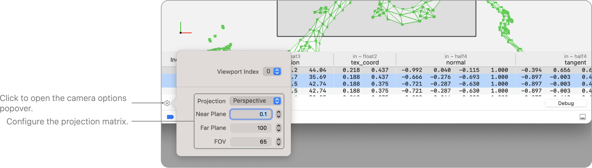
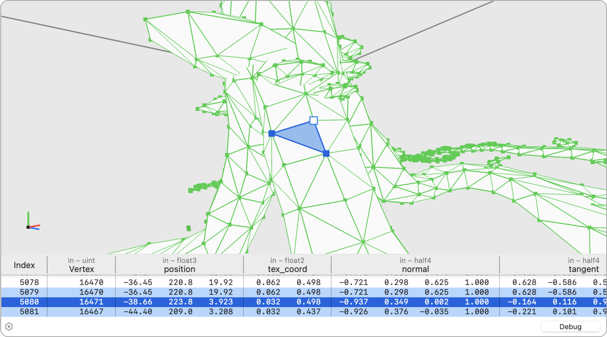
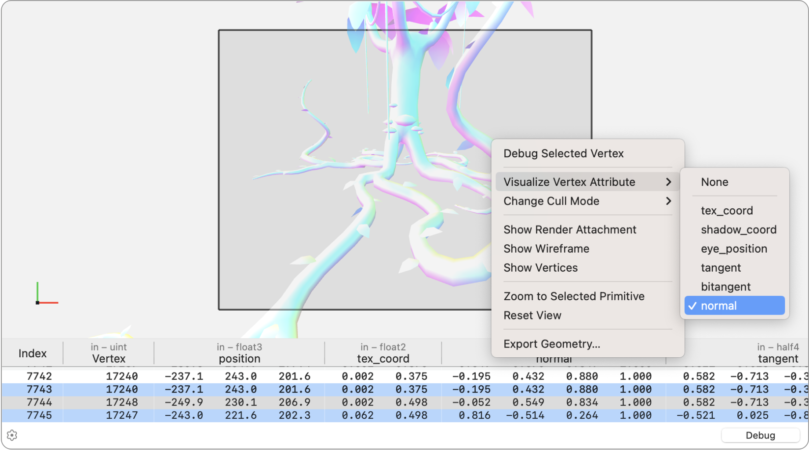
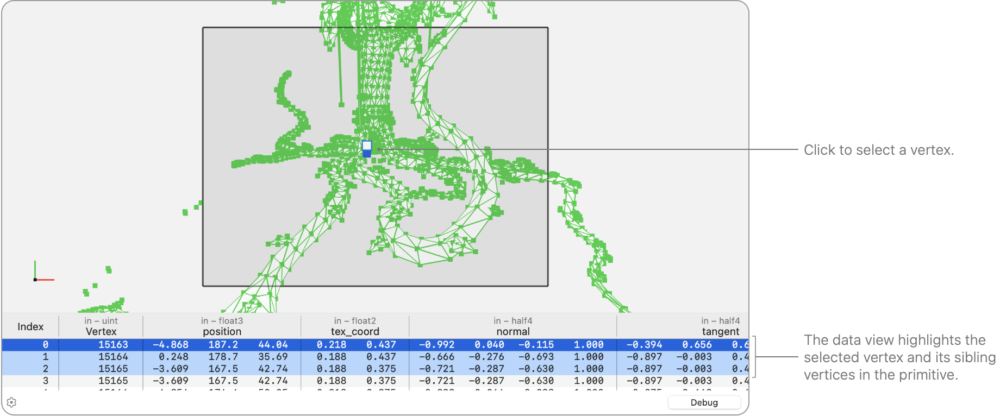
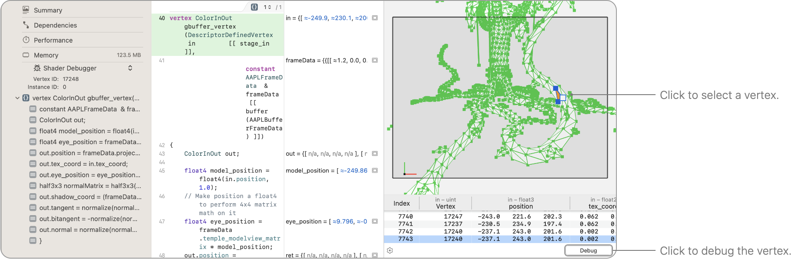

> Navigation: [Technologies](../technologies.md) · [Xcode](../xcode.md) · [Debugging](debugging.md) · [Metal debugger](metal-debugger.md)

# Inspecting the geometry of a draw command

Article

Find problems in your app’s vertex, object, or mesh function by examining the current geometry.

## Overview

After opening a geometry, you can view the wireframe using the Geometry viewer. First, click the Camera Properties button and configure the perspective matrix. Then, using mouse and trackpad gestures, you can view the geometry at different angles to check for issues. You can also Control-click in the scene view to enable visualization of different vertex attributes. When you click an individual primitive to select it, Xcode displays the values of its corresponding vertices in the data view. In addition, you can inspect a selected primitive in the shader debugger, make changes to your shader, and see the updated results live. For more information, see [Inspecting the bound resources for a command](inspecting-the-bound-resources-for-a-command.md).

### Change the projection matrix

The Geometry viewer shows you the output geometry from your vertex or mesh shader stage. To restore your geometry from clip-space to view-space, by default, the Geometry viewer applies an inverse-projection using a perspective matrix with a near value of `0.1`, a far value of `100`, and an FOV of `65º`. However, if you’re using a different projection matrix, your geometry may look squished or stretched.

To solve this, you can click the Options button on the bottom left in the control bar and customize the projection matrix to match the one you use in the vertex shader.

### View your geometry from different angles

You can navigate around your geometry in the scene view using mouse and trackpad gestures. This enables you to zoom in at a specific area to check for erroneous geometry, or find extraneous geometry that may initially be out of sight.

A screenshot of the Geometry viewer displaying the geometry in the scene view and listing the vertices in the table. The selected vertex and its siblings are highlighted in the scene view and in the table.

### Visualize your vertex attributes

Occasionally, you might have an issue in an attribute of your geometry. In that case, the Geometry viewer can color your geometry using the attribute to make it easier to find any incorrect values. To do this, Control-click in the scene view, choose Visualize Vertex Attribute, and then select the attribute you want to display.

A screenshot of the context menu for the scene view with the Visualize Vertex Attribute menu item highlighted and the Normal Values submenu selected.

> [!tip] Tip
> You can also Control-click to disable Show Wireframe and Show Vertices to make the attribute visualization easier to see.

### Inspect vertex values

When you discover a misplaced or misshaped primitive, it’s possible that the issue lies in the data you’re passing into the vertex, object, or mesh shader. Check the data view at the bottom to ensure the input and output of your shader is correct. To see all of the attributes for a specific primitive, click the primitive in the scene view to select it, and then Xcode highlights the primitive’s vertices in the data view.

If your shader has multiple outputs, refer to the additional columns to the right of the output position. You can rearrange or hide columns to make it easier to compare values.

A screenshot of the Geometry viewer displaying the geometry in the scene view and listing the vertices in the table. The selected vertex and its siblings are highlighted in the scene view and in the table.

### Debug your geometry

Some of the geometry may be misplaced or have values that are incorrect. To determine whether the issue comes from the shader code, you can debug your vertex, object, or mesh shader using the shader debugger. In the scene view, select a misplaced or misshaped primitive and click Debug.

A screenshot of the Metal debugger showing the Shader editor and the Geometry viewer side by side. A vertex is highlighted in the Geometry viewer, and the Debug button in the control bar is highlighted.

The shader displays in Xcode’s main editor. To discover the cause of the problem, step through each line of code and inspect each variable’s values in the right pane until you spot any anomaly. For more information on debugging shaders, see [Debugging the shaders within a draw command or compute dispatch](debugging-the-shaders-within-a-draw-command-or-compute-dispatch.md).

## See Also

### Metal command analysis

- [Inspecting the bound resources for a command](inspecting-the-bound-resources-for-a-command.md) — Discover issues by examining the bound resources at any point in an encoder.
- [Inspecting the attachments of a draw command](inspecting-the-attachments-of-a-draw-command.md) — Discover attachment issues by inspecting individual pixels and samples.
- [Debugging the shaders within a draw command or compute dispatch](debugging-the-shaders-within-a-draw-command-or-compute-dispatch.md) — Identify and fix problematic shaders in your app using the shader debugger.
- [Analyzing draw command and compute dispatch performance with GPU counters](analyzing-draw-command-and-compute-dispatch-performance-with-gpu-counters.md) — Identify issues within your frame capture by examining performance counters.
- [Analyzing draw command and compute dispatch performance with pipeline statistics](analyzing-draw-command-and-compute-dispatch-performance-with-pipeline-statistics.md) — Identify issues within your frame capture by examining pipeline statistics.
