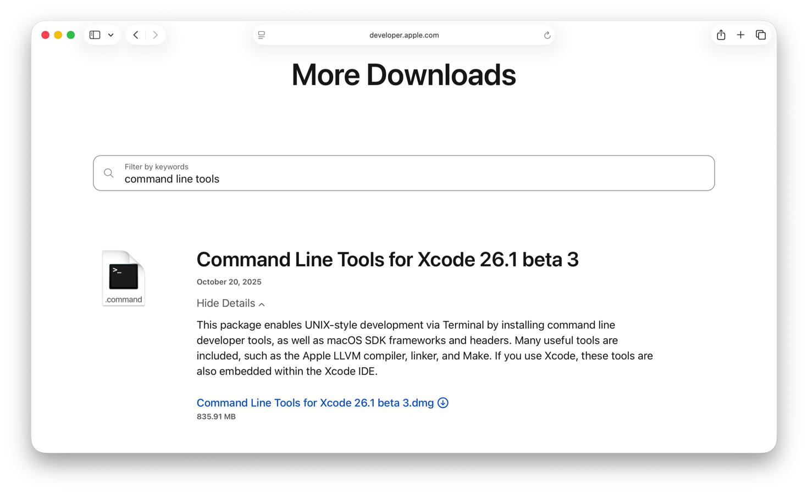

> Navigation: [Technologies](../technologies.md) · [Xcode](../xcode.md) · [Command-line tools](command-line-tools.md)

# Installing the command-line tools

<sub>Article</sub>

Install command-line tools for Xcode using an installer package or the Terminal app.

## Overview

Xcode comes bundled with command-line tools such as `clang`, `notarytool`, `xcodebuild`, and `xcrun`. If you install Xcode on your Mac, then you don’t need to install the command-line tools separately.

Apple offers the Command Line Tools for Xcode package as an alternative to a full Xcode installation. This package is useful for installing the command-line tools if you work outside of Xcode or use UNIX-style commands to build your apps. The package contains the same macOS SDK, man pages, and toolchain binaries that ship with Xcode. You can download a specific version of the package or install its latest version for your Mac from the command line. The system installs the package at the following path: `/Library/Developer/CommandLineTools`.

> [!important] Important
> Commands such as `xcodebuild` and `xctrace` only ship with Xcode, and aren’t in the Command Line Tools for Xcode package. For more information, see [Xcode command-line tool reference](xcode-command-line-tool-reference.md).

### Choose the Command Line Tools for Xcode package version

Before you install the Command Line Tools for Xcode package, review the [Xcode Releases](https://developer.apple.com/support/xcode) table to determine which version of the command-line tools you can install and use for development on your macOS computer. You can only install one version of the package on your Mac at a time.

### Download and install the Command Line Tools for Xcode package

The [More Downloads page](https://developer.apple.com/download/all/?q=command%20line%20tools) of the [Apple Developer website](https://developer.apple.com/) lists all downloadable versions of the Command Line Tools for Xcode package. To install the command-line tools, sign in with your Apple ID, and search for the package you want to use for development. Then download and install it on your Mac. For example, the following image shows the “Command Line Tools for Xcode 26.1 beta” package: 

<sub>A screenshot of the Apple Developer website, showing the More Downloads page, filtered by Command Line Tools for Xcode 26.1.</sub>

### Install the Command Line Tools package in Terminal

You can download and install the Command Line Tools for Xcode package from the command line, using the `xcode-select` command. In Terminal, enter `xcode-select` with the `--install` option, like in the following example:

```
% xcode-select --install 
xcode-select: note: install requested for command line developer tools
```

In the system dialog that appears, click Install and then agree to the Command Line Tools License Agreement. After the installation finishes, click Done.

> [!note] Note
> On a fresh install of macOS, invoking any command in Xcode or the command-line tools package (such as `git`) from the command line prompts you to download and install the Command Line Tools for Xcode package.

### Check the version of the installed Command Line Tools for Xcode package

After you install the Command Line Tools for Xcode package, verify that its version matches the one you intend to use. To check the version of the Command Line Tools for Xcode package, run the `pkgutil` command with the `--pkg-info` option in Terminal:

```
% pkgutil --pkg-info=com.apple.pkg.CLTools_Executables
```

For example, the following command lists the “Command Line Tools for Xcode 26.1 beta” package:

```
% pkgutil --pkg-info=com.apple.pkg.CLTools_Executables
package-id: com.apple.pkg.CLTools_Executables
version: 26.1.0.0.1.1760670222
volume: /
location: /
install-time: 1761350460
```

You can find the entire list of command-line tools the package includes at `/Library/Developer/CommandLineTools/usr/bin`.

### Keep the Command Line Tools for Xcode package up to date

To update the Command Line Tools for Xcode package, install the latest release for the current macOS. The update replaces the old version of the package.

To install new releases of the package, use [Software Update](https://support.apple.com/en-us/108382) in System Settings or the [softwareupdate](x-man-page://softwareupdate) command. Software Update and the command find and display updates of the package that are compatible with your macOS.

> [!note] Note
> After a macOS upgrade, check for new releases of the command-line tool package using Software Update or the [`softwareupdate`](x-man-page://softwareupdate) command. The version of the installed package may be incompatible with the new macOS.

### Uninstall the Command Line Tools for Xcode package

To remove the package from your Mac, run the `sudo rm` command with the `-rf` option in Terminal:

```
% sudo rm -rf /Library/Developer/CommandLineTools
```

> [!note] Note
> The `sudo` command requires administrator privileges. Enter your administrator password when the system prompts you.

After removing the package, you’ll continue to receive new releases of the package in Software Update on your Mac. Delete the package receipt to opt out of software updates for the package.

To delete the package receipt, run the `sudo pkgutil` command with the `--forget` option in Terminal:

```
% sudo pkgutil --forget com.apple.dt.commandlinetools
```

If the task succeeds, `pkgutil` prints the following message:

```
% sudo pkgutil --forget com.apple.dt.commandlinetools
No receipt for 'com.apple.dt.commandlinetools' found at '/'.
```

## See Also

### Essentials

- [Configuring command-line tools settings](configuring-command-line-tools-settings.md) — Select the version of Xcode you want to use for command-line tools, in either Xcode settings or Terminal.
- [Xcode command-line tool reference](xcode-command-line-tool-reference.md) — Use command-line tools that require you to install Xcode and set the app as the active developer directory.
