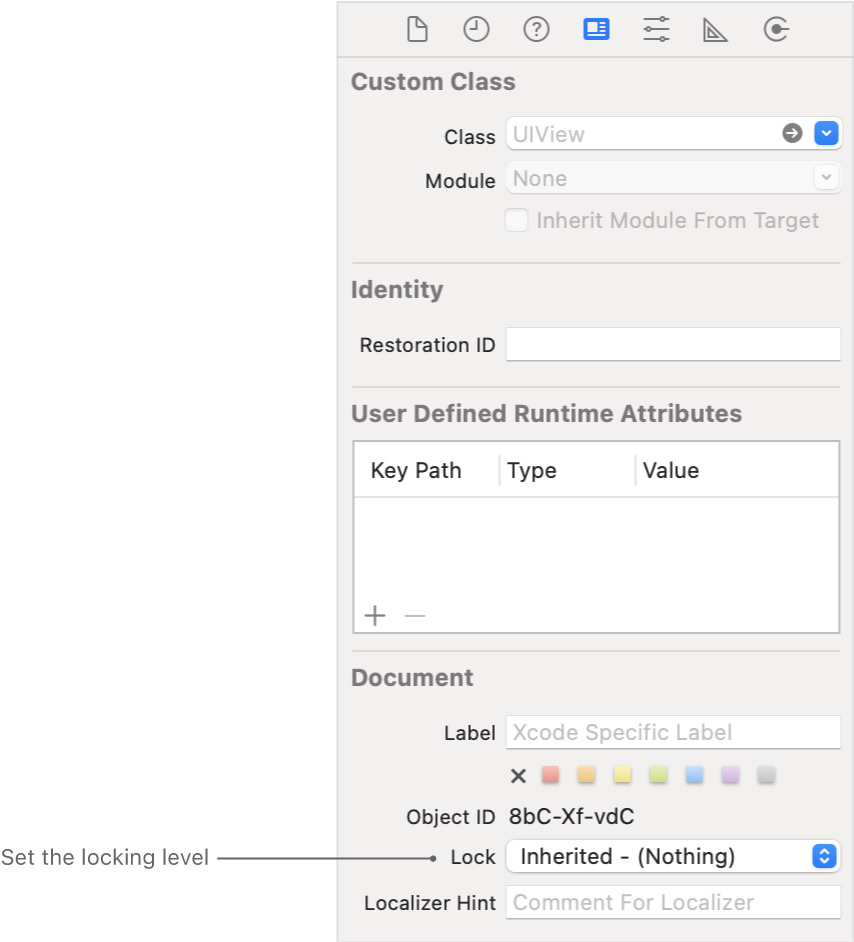

> Navigation: [Technologies](../technologies.md) · [Xcode](../xcode.md) · [Localization](localization.md)

# Locking views in storyboard and XIB files

Article

Prevent changes to your Interface Builder files while localizing human-facing strings.

## Overview

Before you export localizations, optionally lock the views in your storyboard and XIB files so you don’t inadvertently change localizable properties while you’re waiting for translations. Use this feature if you want to continue developing your app and avoid conflicts when importing localizations later. You can choose a locking level that controls the set of editable properties for each view.

### Lock views

You can set the locking level for a single view or for the entire user interface file. By default, views inherit their lock attribute from their parent view, and top-level views inherit their lock attribute from the user interface file. If you set a view’s lock attribute, it sets the lock attribute for all its descendant views.

To lock a single view, select the user interface file (files with a `.storyboard` or `.xib` filename extension) in the Project navigator, then select the view in Interface Builder. In the Identity inspector, choose a locking level from the Lock pop-up menu under Document:

- **Inherited - ([locking level])** — Use the parent view’s locking level.
- **Nothing** — Don’t lock any properties (make all properties editable).
- **All Properties** — Lock all properties.
- **Localizable Properties** — Lock localizable properties, such as user-facing text and size.
- **Non-localizable Properties** — Lock non-localizable properties (make user-facing text and size properties editable).

For example, choose Localizable Properties while waiting for translations from localizers. If you import localizations and don’t want to make other changes inadvertently, choose Non-localizable Properties.

To lock all views, select the user interface file in the Project navigator, then choose a locking level from the Editor \> Localization Locking menu.

### Unlock views

To unlock all views after you import localizations, select the user interface file in the Project navigator, then choose Editor \> Localization Locking \> Reset Locking Controls. To prevent any edits in a user interface file that would impact localized strings files, choose Editor \> Localization Locking \> Reset Locking Controls and then choose Editor \> Localization Locking \> Localizable Properties.

## See Also

### Translation and adaptation

- [Creating screenshots of your app for localizers](creating-screenshots-of-your-app-for-localizers.md) — Share screenshots of your app with localizers to provide context for translation.
- [Exporting localizations](exporting-localizations.md) — Provide the localizable files from your project to localizers.
- [Editing XLIFF and string catalog files](editing-xliff-and-string-catalog-files.md) — Translate or adapt the localizable files for a language and region that you export from your project.
- [Importing localizations](importing-localizations.md) — Import the files that you translate or adapt for a language and region into your project.
