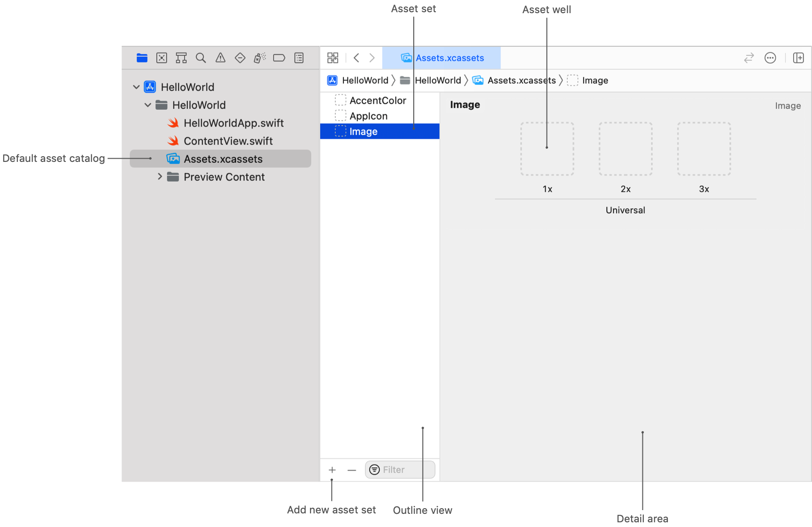

> Navigation: [Technologies](../technologies.md) · [Xcode](../xcode.md) · [Asset management](asset-management.md)

# Managing assets with asset catalogs

Article

Add, organize, and edit sets of assets in your Xcode project using asset catalogs.

## Overview

Asset catalogs help you quickly organize and manage your app’s resources. In an asset catalog, each _asset set_ represents one resource — like an image, color, or data file — that your app loads at runtime. An asset set contains one or more variations of that resource for different device characteristics, for example, platform, screen size, resolution, appearance, and language. When you refer to a resource in code, the system determines the appropriate variation to display at runtime based on the characteristics of the current device.

### Create a new asset set

When you create your project from a template, it automatically includes an asset catalog with the name `Assets.xcassets`, which appears in the Project navigator. This default asset catalog contains empty asset sets for an app accent color and an app icon. You can add additional asset sets to this default asset catalog.

To import assets into your project, first, create a new asset set in your asset catalog.

1. In the Project navigator, select the asset catalog.
2. Click the Add button (+) at the bottom of the outline view.
3. In the pop-up menu, choose the type of asset set to create.

The new, empty asset set appears in the outline view and opens in the detail area.

Screenshot of the default asset catalog in Xcode. The outline view, which appears on the left, shows three asset sets — accent color, app icon, and image. The image set is selected, shows three empty image wells with the labels 1x, 2x, and 3x in the detail area on the right.

To use a single multilayer Icon Composer file that supports [Liquid Glass](../technologyoverviews/liquid-glass.md) instead of an icon asset set, see [Creating your app icon using Icon Composer](creating-your-app-icon-using-icon-composer.md).

### Add a new asset

Next, add your resource to the empty asset set. With the new asset set selected in the outline view, drag the asset you want to import from the Finder to a well in the detail area.

Screenshot of an asset catalog in Xcode. An image set with the name Image contains a single picture of oranges in the 1x well in the detail area.

Asset sets contain one or more _wells_ that let you specify variations of your asset for different device characteristics. Each well has a label that describes the specific set of characteristics that apply to it. If you want to provide more variations of your asset, drag each asset file to the corresponding well. You can show additional wells by selecting more options in the Attributes inspector.

### Create a new asset catalog

If you want to create additional asset catalogs to organize larger sets of app resources, you can create an asset catalog manually.

1. Choose File \> New \> File from Template.
2. Choose Resource \> Asset Catalog, and click Next.
3. Give the asset catalog a name, choose a location, and click Create.

The new asset catalog appears in the Project navigator and opens in the editor area.
