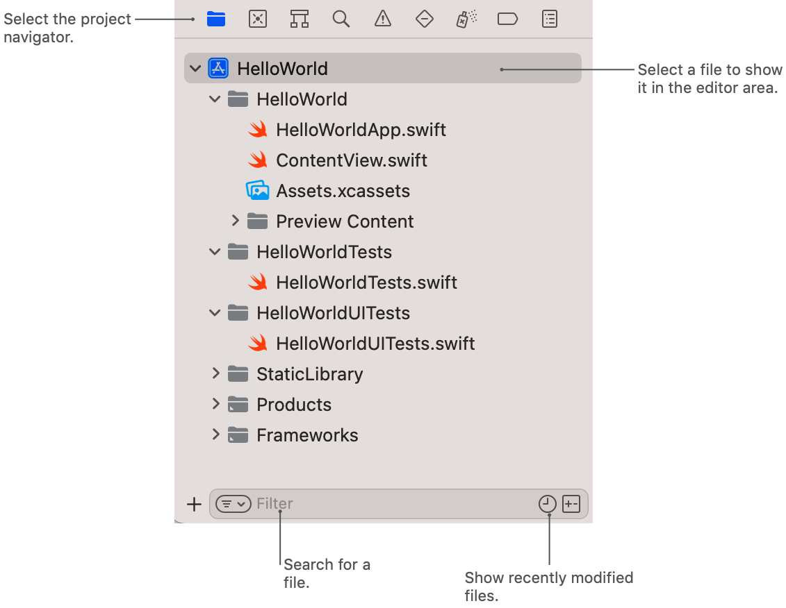
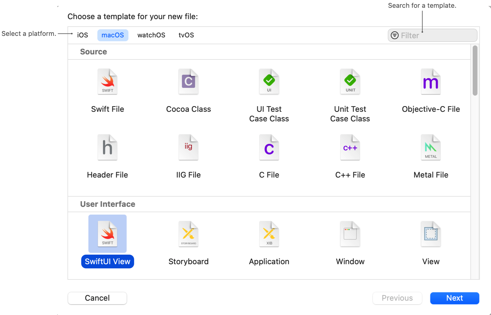
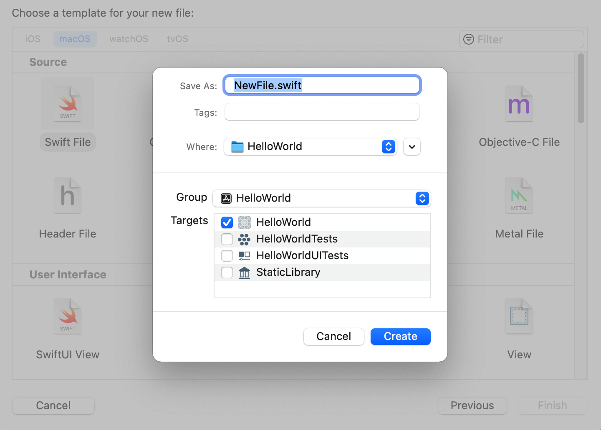

> Navigation: [Technologies](../technologies.md) · [Xcode](../xcode.md) · [Projects and workspaces](projects-and-workspaces.md)

# Managing files and folders in your Xcode project

Article

Add new or existing files to your project, and use groups to organize the files and folders in the Project navigator.

## Overview

The Project navigator displays your project’s files and lets you open, add, delete, and rearrange those files. To open the Project navigator, at the top of your project window’s navigator area, click the icon that resembles a file folder.

When you select a file in the navigator, the inspector pane displays information about the file, and the editor area displays the contents of the file. The appearance of the editor area changes based on the type of file you select. For example, a source code file displays the source editor, and a property-list file displays the property-list editor.

To locate files based on keywords or other criteria, use the filter bar at the bottom of the navigator area:

- To search for files, enter keywords in the filter bar’s text field.
- To show only recently modified files, click the Recent Files icon.
- To show only files with a changed source-control status, click the Source Control icon.

### Add new files to a project

Xcode provides templates for the common types of files you might want to add to your project, such as Swift files or playgrounds. In the Project navigator, select the folder or group where you want to add a file and perform one of the following actions:

1. Click the Add button (+) in the filter bar and choose File from the pop-up menu.
2. Choose New \> File.
3. Control-click and select New File.

In the new file sheet, select a template for your new file. Xcode organizes templates by type to make them easier to find. You can also use the filter control to search for templates by name. After you select a template, click Next.

Some templates require you to specify additional information for the new file. For example, the Cocoa Touch template asks you to specify information about the class you’re creating, including the parent class name. Xcode uses this information to populate the file with some initial content.

The final step is to save your file to the file system. When Xcode prompts you for the file’s location, it also asks you to specify group and target information. The group indicates where in your project to place the file, and Xcode selects a default group based on contextual information. Xcode also selects a default target. Make any relevant changes to the target and group values and click Create to create the file.

### Add existing files and folders to a project

Xcode offers several ways to add existing files and folders to your project. You can:

- Drag the files from the Finder into the Project navigator.
- Click the Add button in the Project navigator’s filter bar, and choose Add Files to “_projectName_”.
- Choose File \> Add Files to “_projectName_”.

Xcode prompts you to select the files and folders to add and configure how you want to add them to your project. If the file you’re adding requires a target, select at least one target. Then, select one of the following options from the Action picker:

- **Copy files to destination** — Copies all files and folders to the project folder before adding them to the Project navigator. Use this option to work on a copy of the files, instead of the original versions.
- **Move files to destination** — Moves all files and folders to the project folder from the original source. Use this option to work on the original files and remove them from their original location on disk.
- **Reference files in place** — Leaves the files in their original location on disk, and adds a reference to them from your project. Use this option when you want to store files separately, outside of your Xcode project but you still want to be able to use them in your project.

Next from the Group picker, choose how you want to group folders:

- **Create groups** — Creates a group structure in your project that matches the structure of the selected files and folders on disk. Xcode creates a group in the Project navigator for each folder you add, and it adds the contents of the folder to that group. Choose this option when you want the group structure in Xcode to differ from the directory structure on disk, or you want to reference files outside your project.
- **Create folders** — Displays the folders in the Project navigator, and either copies, moves, or references files depending on the selection you make in the Action picker. In the Project navigator, each added folder points to a folder in the file system. Choose this option when you want your Project navigator folders to match the file and directory structure on disk, and to minimize changes to your project file when you add or remove files.

When adding a local Swift Package’s folder to your project, perform the following additional steps:

- Place the package in a Packages group to make it easier to track. To create a new group in the project navgator, select File \> New \> Group. Drag the package from the Finder into the group.
- Add the package to the linked libraries build phase in your project settings. In the Project Editor, Select Build Phases and expand Link Binary With Libraries. Click the plus (+) button and select the package from your workspace.

For more information about managing Swift packages, see [Swift packages](swift-packages.md).

> [!note] Note
> To use RealityKit content that you create using Reality Composer Pro, you can add its folder to your Xcode project and link against the Swift Package it contains. For more information about Reality Composer Pro, see [Composing interactive 3D content with RealityKit and Reality Composer Pro](../realitykit/composing-interactive-3d-content-with-realitykit-and-reality-composer-pro.md).

### Organize project files in the navigator

Most new projects contain some structure to organize the project’s content — for example, to separate source files from generated products. You can create additional groups and folders to organize your content and make it easier to navigate large projects.

- A folder is a file-system directory that you reference from your project. Xcode includes the contents of the folder in your project.
- A group is a collection of resources in your project. By default, Xcode maps each group to a folder in your project directory, but you can also create groups without an underlying file-system folder. You might use groups without folders if you want to manage files in your project without changing the underlying organization of the files on disk.

In the Project navigator, create and modify groups using direct interaction or menu commands:

- **Create a new group backed by a folder** — Select an item and choose File \> New \> Group, or Control-click the item and select New Group from the contextual menu.
- **Create a group and move items to it** — Select the items and choose File \> New \> Group from Selection, or Control-click the selected items and select New Group from Selection.
- **Create a new folder** — Select the item and choose File \> New \> Folder, or Control-click the selected item and select New Folder.
- **Create a new folder and move items to it** — Select the items and choose File \> New \> Folder from Selection, or Control-click the selected items and select New Folder from Selection
- **Rename a file or group** — Double-click the file or group, and enter the new name.
- **Change a group’s associated folder** — Select the group and choose View \> Inspectors \> Show File Inspector. Drag the new folder from the Finder to the old folder name under Location in the File inspector.
- **Create a new group without a folder** — Control-click the item, then press and hold the Option key and select New Group without Folder from the contextual menu.
- **Create a group without a folder and move items to it** — Control-click the item, then press and hold the Option key and select New Group from Selection without Folder from the contextual menu.

> [!important] Important
> If a group is associated with a folder, Xcode performs all rename, delete, move, and copy operations on the folder in the file system. For projects under source control, Xcode uses the source-control system to perform the operations and track the changes. If you move files between groups in the same Git repository, Xcode moves the files in the file system. If the files are in different repositories, Xcode copies the files into the folder in the new repository.

### Delete files and folders

To delete a file or folder from your project, select it and press the Delete key, or select Edit \> Delete. Xcode prompts you to choose how to delete any selected items.

- **Move to Trash** — This option removes files and folders from your project and the file system. Choose this option when you no longer need the information in the files.
- **Remove Reference** — This option removes files and folders only from your project. Xcode doesn’t remove them from the file system.

### Convert groups to folders

There are several benefits to using folders instead of groups when organizing your Xcode project files. Folders have a much smaller representation in the project file, which can result in fewer merge conflicts because when you add or remove files to the project you don’t modify the project file. Additionally, your Xcode project file automatically updates as you make changes to the file system.

To convert a group into a folder using the Convert to Folder option within the Project navigator:

1. Select one or more groups in your Project navigator.
2. Control-click the selected group(s) and select Convert to Folder.

Xcode checks to see if the groups in your Xcode project match the underlying files and directories on disk. If they do, Xcode converts each group into a folder. If the groups and underlying directory structures don’t match, Xcode displays a dialog with a Show Details button. Click the Show Details button to see a list of the files and directories Xcode couldn’t convert.

To convert the files Xcode displays in Show Details, make the file and directory structure in Xcode match what Finder displays on disk. Either modify the file and group structure in Xcode to match the file and directory structure in Finder, or modify the file and directory structure in Finder to match the contents of your groups in Xcode. Then select the groups, Control-click, and choose Convert to Folder again.

## See Also

### Files and workspaces

- [Managing multiple projects and their dependencies](managing-multiple-projects-and-their-dependencies.md) — Manage related projects in one place using a workspace, or configure build-time dependencies between different Xcode projects using cross-project references.
- [Downloading and installing additional Xcode components](downloading-and-installing-additional-xcode-components.md) — Add more simulated devices, optional features, and support for additional platforms.
