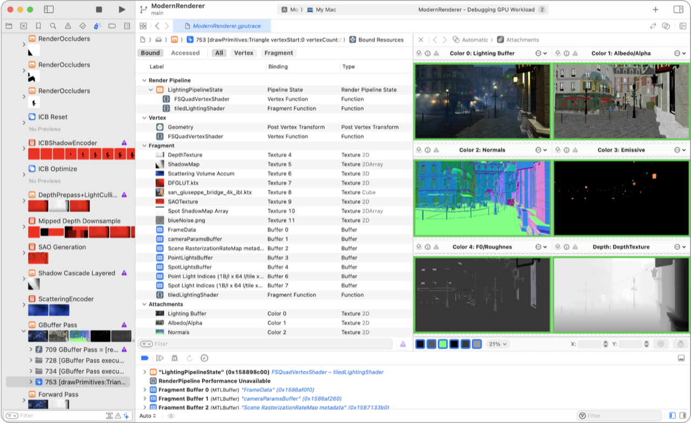

> Navigation: [Technologies](../technologies.md) · [Xcode](../xcode.md) · [Debugging](debugging.md)

# Metal debugger

Debug and profile your Metal workload with a GPU trace.

## Overview

The Metal debugger consists of a suite of tools for debugging and profiling your Metal app.

Unlike pausing at breakpoints during runtime, you can capture your Metal workload for multiple frames and then jump back and forth in time to explore the captured work. The Metal debugger enables you to explore the dependencies between passes, and offers insights for improving the performance of your app. You can also debug your shaders in draw commands and compute dispatches to fix sources of artifacts (see [Investigating visual artifacts](investigating-visual-artifacts.md)).

In addition, the Metal debugger displays your Metal workload on a profiling timeline and offers detailed statistics like performance counters and per-line shader profiling data. These tools can help you identify and eliminate performance bottlenecks in your app (see [Optimizing GPU performance](optimizing-gpu-performance.md)).

To investigate GPU traces from the command line, use `gpudebug`, an interactive terminal-based debugger. Because its interface is text-based and self-discoverable, AI agents can run it autonomously to navigate traces, inspect state, and fetch resources to diagnose rendering issues without human intervention. For more information, see [Investigating GPU issues with AI agents](investigating-gpu-issues-with-ai-agents.md).

For additional information about the Metal debugger, see the following video sessions:

- [Metal Shader Debugging and Profiling](https://developer.apple.com/videos/play/wwdc2018/608/)
- [Gain insights into your Metal app with Xcode 12](https://developer.apple.com/videos/play/wwdc2020/10605/)
- [Optimize Metal apps and games with GPU counters](https://developer.apple.com/videos/play/wwdc2020/10603/)
- [Discover Metal debugging, profiling, and asset creation tools](https://developer.apple.com/videos/play/wwdc2021/10157/)
- [Profile and optimize your game’s memory](https://developer.apple.com/videos/play/wwdc2022/10106/)

## Topics

### Essentials

- [Capturing a Metal workload in Xcode](capturing-a-metal-workload-in-xcode.md) — Analyze your app’s performance by configuring your project to use the Metal debugger.
- [Capturing a Metal workload programmatically](capturing-a-metal-workload-programmatically.md) — Analyze your app’s performance by invoking Metal’s frame capture.
- [Replaying a GPU trace file](replaying-a-gpu-trace-file.md) — Debug and profile your app’s performance using a GPU trace file in the Metal debugger.
- [Investigating visual artifacts](investigating-visual-artifacts.md) — Discover, diagnose, and fix visual artifacts in your app with the Metal debugger.
- [Optimizing GPU performance](optimizing-gpu-performance.md) — Find and address performance bottlenecks using the Metal debugger.
- [Debugging with interactive command-line tools](debugging-with-interactive-command-line-tools.md) — Investigate rendering issues in GPU traces without leaving the Terminal.
- [Investigating GPU issues with AI agents](investigating-gpu-issues-with-ai-agents.md) — Find the root cause of an issue in a large GPU trace by handing the trace to an AI agent for autonomous investigation.

### Metal workload analysis

- [Analyzing your Metal workload](analyzing-your-metal-workload.md) — Investigate your app’s workload, dependencies, performance, and memory impact using the Metal debugger.
- [Analyzing resource dependencies](analyzing-resource-dependencies.md) — Avoid unnecessary work in your Metal app by understanding the relationships between resources.
- [Analyzing memory usage](analyzing-memory-usage.md) — Manage your Metal app’s memory usage by inspecting its resources.
- [Analyzing Apple GPU performance using a visual timeline](analyzing-apple-gpu-performance-using-a-visual-timeline.md) — Locate performance issues using the Performance timeline.
- [Analyzing Apple GPU performance using counter statistics](analyzing-apple-gpu-performance-using-counter-statistics.md) — Optimize performance by examining counters for individual passes and commands.
- [Analyzing Apple GPU performance with performance heat maps](analyzing-apple-gpu-performance-using-performance-heatmaps-a17-m3.md) — Gain insights to SIMD group performance by inspecting source code execution.
- [Analyzing Apple GPU performance using the shader cost graph](analyzing-apple-gpu-performance-using-shader-cost-graph-a17-m3.md) — Discover potential shader performance issues by examining pipeline states.
- [Analyzing non-Apple GPU performance using counter statistics](analyzing-non-apple-gpu-performance-using-counter-statistics.md) — Optimize performance by examining counters for individual passes and commands.

### Metal resource inspection

- [Inspecting acceleration structures](inspecting-acceleration-structures.md) — Reveal ray intersection bottlenecks by examining your acceleration structures.
- [Inspecting buffers](inspecting-buffers.md) — Confirm your buffer formats by examining buffer content.
- [Inspecting pipeline states](inspecting-pipeline-states.md) — Determine how your render and compute passes behave by examining their properties.
- [Inspecting sampler states](inspecting-sampler-states.md) — Verify your sampler state configurations by examining their properties.
- [Inspecting shaders](inspecting-shaders.md) — Improve your app’s shader performance by examining and editing your shaders.
- [Inspecting textures](inspecting-textures.md) — Discover issues in your textures by examining their content.

### Metal command analysis

- [Inspecting the bound resources for a command](inspecting-the-bound-resources-for-a-command.md) — Discover issues by examining the bound resources at any point in an encoder.
- [Inspecting the geometry of a draw command](inspecting-the-geometry-of-a-draw-command.md) — Find problems in your app’s vertex, object, or mesh function by examining the current geometry.
- [Inspecting the attachments of a draw command](inspecting-the-attachments-of-a-draw-command.md) — Discover attachment issues by inspecting individual pixels and samples.
- [Debugging the shaders within a draw command or compute dispatch](debugging-the-shaders-within-a-draw-command-or-compute-dispatch.md) — Identify and fix problematic shaders in your app using the shader debugger.
- [Analyzing draw command and compute dispatch performance with GPU counters](analyzing-draw-command-and-compute-dispatch-performance-with-gpu-counters.md) — Identify issues within your frame capture by examining performance counters.
- [Analyzing draw command and compute dispatch performance with pipeline statistics](analyzing-draw-command-and-compute-dispatch-performance-with-pipeline-statistics.md) — Identify issues within your frame capture by examining pipeline statistics.

## See Also

### Graphics

- [Metal developer workflows](metal-developer-workflows.md) — Locate and fix issues related to your app’s use of the Metal API and GPU functions.
