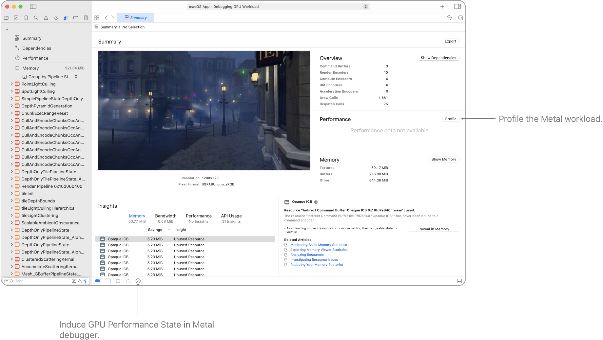
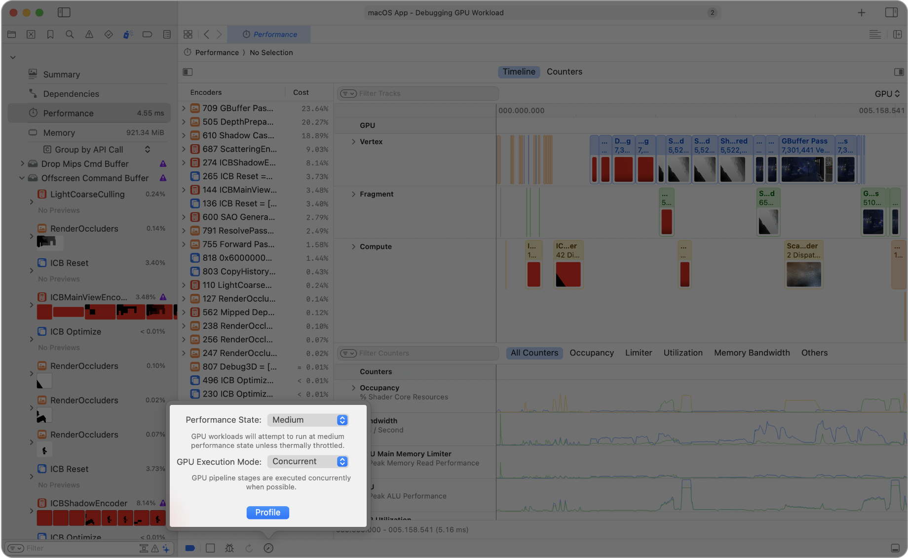
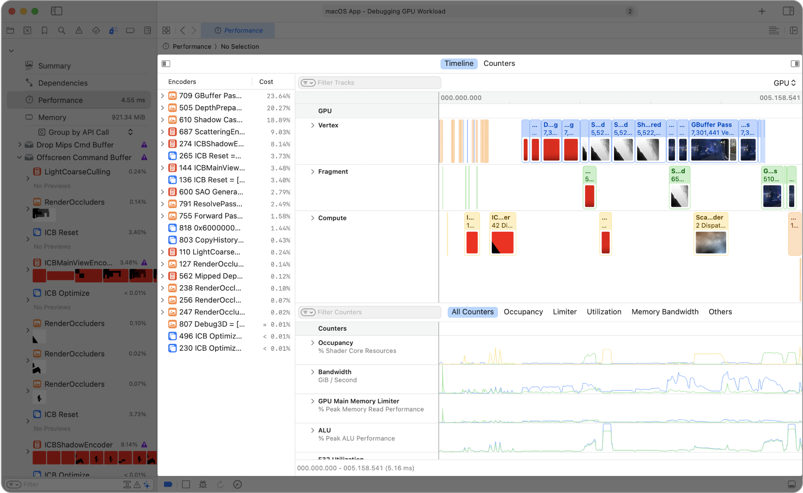
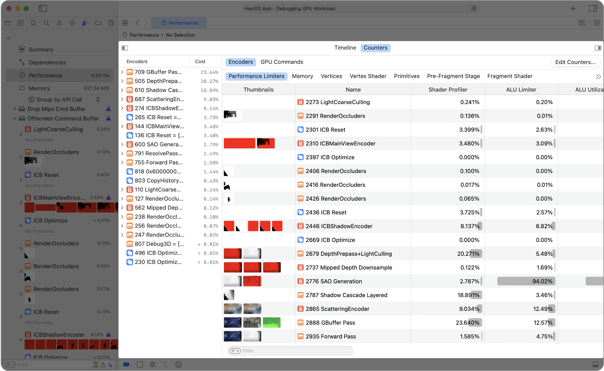
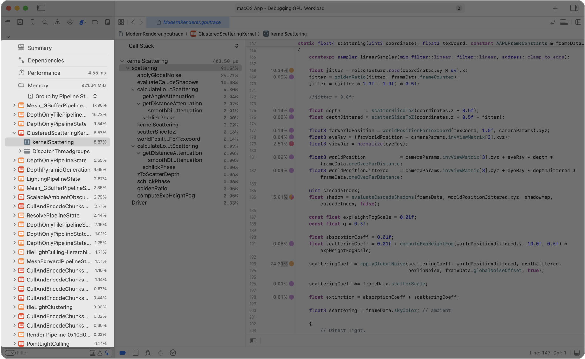
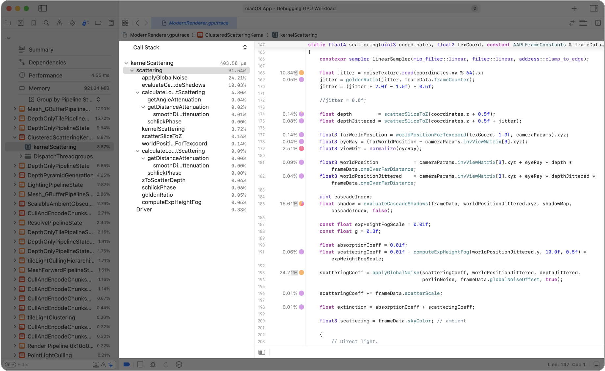
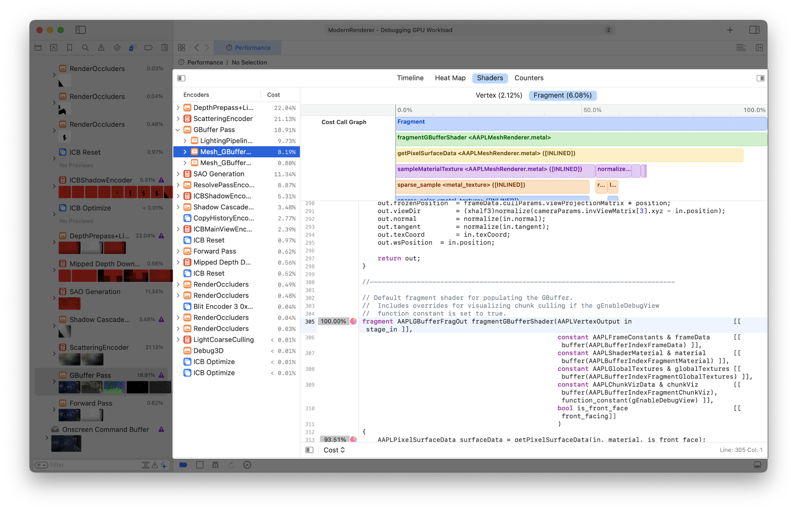
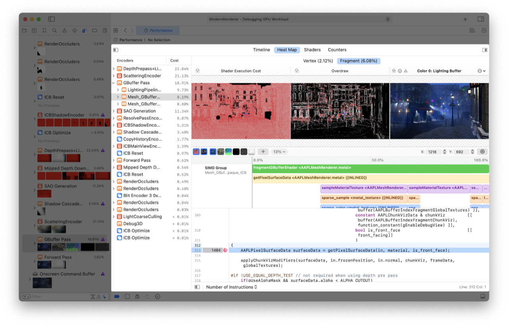
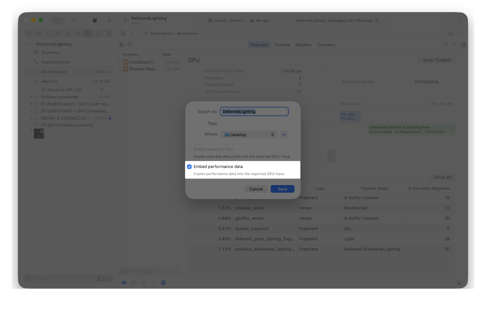

> Navigation: [Technologies](../technologies.md) · [Xcode](../xcode.md) · [Debugging](debugging.md) · [Metal debugger](metal-debugger.md)

# Optimizing GPU performance

Article

Find and address performance bottlenecks using the Metal debugger.

## Overview

Apple GPUs run vertex, fragment, and compute tasks in parallel whenever possible. The Metal debugger offers ways to inspect the passes running with overlap, which you can use to find bottlenecking tasks in GPU-bound workloads. In addition, the profiler measures performance statistics by sampling your shaders to reveal hot spots.

If you notice any performance issues while running your app, you can use the Metal debugger to find and investigate bottlenecks. First, configure your build to include shader source code (see [Building your project with embedded shader sources](building-your-project-with-embedded-shader-sources.md)). Then, take a frame capture of your app when you notice the visual artifact that you want to debug (see [Capturing a Metal workload in Xcode](capturing-a-metal-workload-in-xcode.md)).

### Gather performance data

When you enable the Profile after Replay option, the Metal debugger automatically begins gathering performance data after replaying the workload. Alternatively, you can click the Profile button on the Summary viewer to gather performance data.

A screenshot of the Metal debugger showing the Summary viewer. The Profile button and the button to induce GPU performance state are highlighted.

The performance state of the GPU is important when profiling because it affects how fast the system executes the workload. Factors that affect the performance state include thermals and system settings.

By default, the Metal debugger profiles the workload with the same GPU performance state at capture time, so the performance is typically similar to what you observe on the device. However, you can induce a specific GPU performance state as you make a profile in the Metal debugger by clicking the GPU Profiler button in the debug bar.

For more information on GPU performance state, see [Discover Metal debugging, profiling, and asset creation tools](https://developer.apple.com/videos/play/wwdc2021/10157/?time=476).

A screenshot of the Metal debugger’s Performance timeline that highlights the GPU Profiler popover, which has two menus for Performance State and GPU Execution Mode. The menus show Medium and Concurrent, respectively.

You can switch between different GPU Execution Modes, including Concurrent and Serial, by clicking the GPU Profiler button in the debug bar. By default, the Metal debugger profiles the workload in Concurrent mode. This allows the GPU to overlap the vertex, fragment, and compute tasks so they can finish as quickly as possible. In Serial mode, the Metal debugger forces each pass to run only after the previous pass finishes, which adds precision to the data report for each pass without overlap, but it doesn’t represent runtime performance.

### Find performance bottlenecks with the Performance timeline

The Performance timeline in the Metal debugger can help you find expensive tasks and performance bottlenecks in the captured workload. Open the Performance timeline by clicking the Performance button in the Debug navigator.

The Timeline navigator on the left side of the window lists all profiled passes, pipeline states, and GPU Commands with their shader profiler cost.

The top section has the Vertex, Fragment, and Compute GPU tracks, which display the beginning time and duration of individual passes running with overlap. Below the GPU tracks are the aggregated shader tracks that combine the individual shaders. You can view the timeline of individual shaders in a waterfall-like fashion by expanding the aggregated shader tracks.

The bottom section has a separate Counters timeline, which includes GPU counters such as Occupancy, Limiter, and Bandwidth. The counters can help you diagnose performance bottlenecks. You can focus on counter subsets by switching between different counter tabs. For more information, see [Analyzing Apple GPU performance using a visual timeline](analyzing-apple-gpu-performance-using-a-visual-timeline.md).

### Get detailed performance metrics for passes and draws

You can view performance counter statistics from your app’s passes or commands in the GPU trace. Open the Performance counters by clicking the Counters tab above the Performance timeline.

The Metal debugger derives the shader profiler time by tracing the shader instructions when running the workload with overlap. In a shader-bound workload, sorting the table by shader profiler time can point you to the overall most expensive pass or draw. In addition, the Metal debugger measures the detailed counters from each pass or command in isolation. You can also choose different sets of counters in the top bar for a more focused view. For more information, see [Analyzing Apple GPU performance using counter statistics](analyzing-apple-gpu-performance-using-counter-statistics.md).

### Group commands by pipeline states in the Debug navigator

For a different perspective in viewing the Metal commands, click the Outline popup menu in the Debug navigator and select Group by Pipeline State to view a list of pipeline states.

An Xcode screenshot of the Debug navigator showing all the pipeline states in the captured workload sorted from the most to the least expensive.

With profiling data, the Debug navigator displays the percentage of samples from shaders of each pipeline state when running the workload with overlap. In a shader-bound workload, this sorted list of pipeline states is helpful in identifying the most expensive pipeline state. Expanding a pipeline state allows you to find a list of commands that use that state.

You can also quickly view the shader source code and per-line profiling statistics by selecting a shader from a pipeline state in the list.

For more information on the Debug navigator, see [Analyzing your Metal workload](analyzing-your-metal-workload.md).

### Optimize shaders with per-line shader profiling statistics

After opening a shader, you can find the time breakdown for the shader in the pipeline state.

An Xcode screenshot of the Shader editor showing a call tree in the Debug navigator, and per-line shader profiling data next to the source code.

The left sidebar allows you to inspect the shader source files and profiling call tree. With the call tree, you can find performance hot spots by the weights of each frame.

In the gutter of the shader source code, you can find weights next to the lines of code. The pie chart to the right of each weight contains performance statistics to help you improve the shader code.

For example, when you observe an expensive line of code with a high percentage for memory sample, it may be taking time to read texture data. To reduce the shader time, if it’s less expensive to compute the value than reading it from a texture, you can modify the code to calculate it in the shader.

After making changes to the shader source code, click the Reload Shaders button in the debug bar to refresh the profiling statistics. You can verify whether the changes help with the overall performance by observing the new total GPU time and the tracks in the Performance timeline.

> [!important] Important
> Changes to your shader source code exist only within the Metal debugger. Your original shader source code doesn’t change. Make sure that you copy your changes to your original shader source code.

For more information on interpreting the per-line shader profiling statistics, see [Inspecting shaders](inspecting-shaders.md).

### Inspect shader performance with the shader cost graph

> [!important] Important
> The shader cost graph feature is available for iOS devices with A17 Pro or later, and Mac computers with M3 or later.

You can quickly find and triage expensive pipeline states and shaders by using the shader cost graph. Select a pipeline state in the Timeline navigator, and then click the Shaders tab.

You can inspect the percentage cost of the shader function calls with the flame graph in the top section, and select function calls to jump directly to the source code.

For more information, see [Analyzing Apple GPU performance using the shader cost graph](analyzing-apple-gpu-performance-using-shader-cost-graph-a17-m3.md).

### Understand SIMD group execution with the performance heat maps

> [!important] Important
> The performance heat maps feature is available for iOS devices with A17 Pro or later, and Mac computers with M3 or later.

You can quickly find and inspect the execution of your shader source code with the performance heat maps. Select an encoder, a pipeline state, or a GPU command in the Timeline navigator, and then click the Heat Maps tab.

The top section shows various heat maps graphing statistical information about GPU threads, such as the cost, the divergence, and the number of instructions.

The bottom section shows the shader execution history of GPU threads on a timeline, including function call stacks and thread states.

For more information, see [Analyzing Apple GPU performance with performance heat maps](analyzing-apple-gpu-performance-using-performance-heatmaps-a17-m3.md).

### Save the performance data to your development system

You can save your app’s Metal workload performance data as a GPU trace for later analysis by choosing File \> Export, and selecting the Embed performance data checkbox in the dialog. This allows you to view just the performance data instead of replaying the GPU trace on a device.

A screenshot of a Metal debugger save dialog in Xcode for a performance data-trace file. The dialog has the name Deferred Lighting in the Export as field and a single checkbox with the label, Embed performance data, which a person selected.

You can open the GPU trace on any Mac — not just your development system — because it doesn’t require a compatible device to replay the trace. Optionally, you can replay the GPU trace by selecting a compatible device.

For more information, see [Replaying a GPU trace file](replaying-a-gpu-trace-file.md).

## See Also

### Essentials

- [Capturing a Metal workload in Xcode](capturing-a-metal-workload-in-xcode.md) — Analyze your app’s performance by configuring your project to use the Metal debugger.
- [Capturing a Metal workload programmatically](capturing-a-metal-workload-programmatically.md) — Analyze your app’s performance by invoking Metal’s frame capture.
- [Replaying a GPU trace file](replaying-a-gpu-trace-file.md) — Debug and profile your app’s performance using a GPU trace file in the Metal debugger.
- [Investigating visual artifacts](investigating-visual-artifacts.md) — Discover, diagnose, and fix visual artifacts in your app with the Metal debugger.
- [Debugging with interactive command-line tools](debugging-with-interactive-command-line-tools.md) — Investigate rendering issues in GPU traces without leaving the Terminal.
- [Investigating GPU issues with AI agents](investigating-gpu-issues-with-ai-agents.md) — Find the root cause of an issue in a large GPU trace by handing the trace to an AI agent for autonomous investigation.
