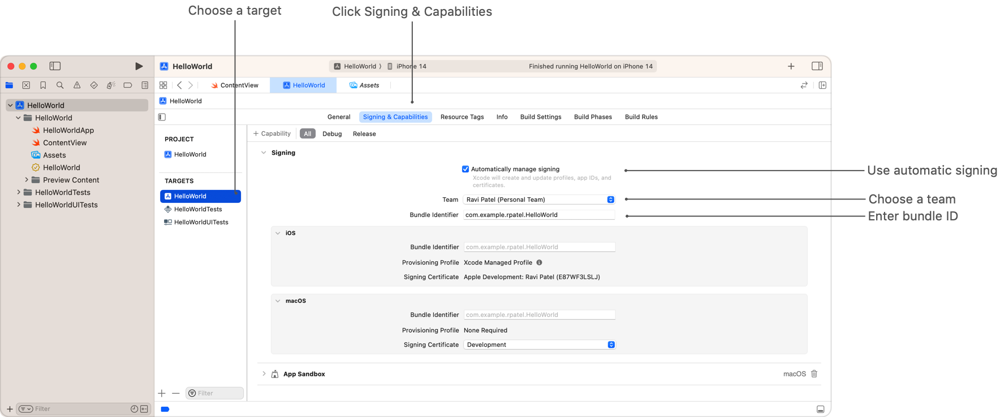
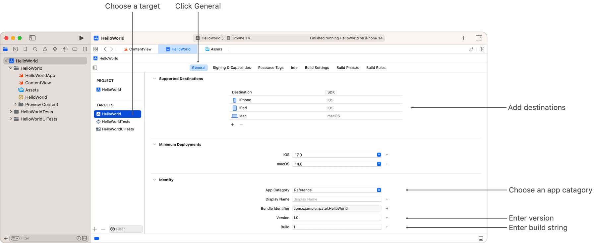
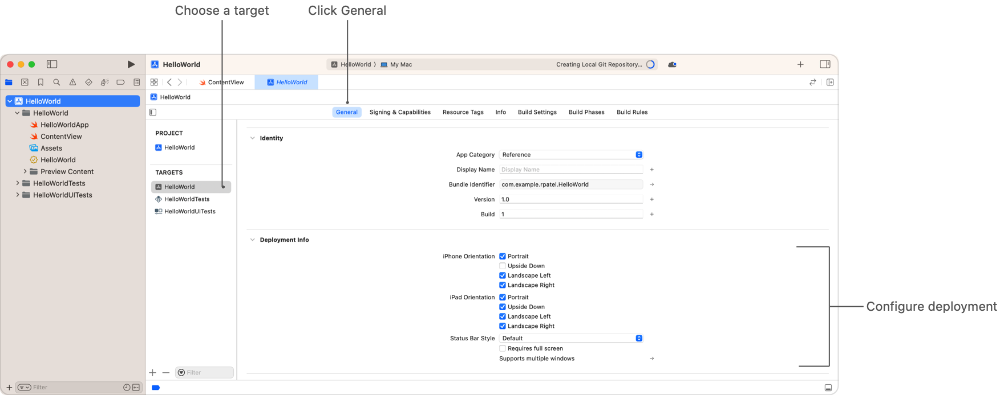

> Navigation: [Technologies](../technologies.md) · [Xcode](../xcode.md) · [Distribution](distribution.md)

# Preparing your app for distribution

Article

Configure the information property list and add icons before you distribute your app.

## Overview

Prepare your Xcode project for distribution before you upload a build to App Store Connect or export a build to distribute it outside of the App Store. Provide all the required information about your app—such as a unique bundle ID, build string, app icon, and launch screen. Choose the settings carefully because most of the information is not editable after you distribute a build through TestFlight or the App Store.

For additional information to enter in App Store Connect, see [Required, localizable, and editable properties](https://developer.apple.com/help/app-store-connect/reference/required-localizable-and-editable-properties/) and [App information](https://developer.apple.com/help/app-store-connect/reference/app-information) (which contains more details) in App Store Connect Help.

### Set the bundle ID

When you create your Xcode project from a template, the bundle ID ([CFBundleIdentifier](../bundleresources/information-property-list/cfbundleidentifier.md)), which uniquely identifies your app throughout the system, defaults to the organization ID appended to the app name that you enter in reverse-DNS format—for example, the bundle ID becomes `com.example.mycompany.HelloWorld`.

If your organization ID is unique across all developers and your app name is unique within your organization, your default bundle ID should also be unique. For example, use your organization’s domain name as the organization ID to ensure that the bundle ID is unique.

To distribute your app through TestFlight and the App Store, you [Create an app record](https://developer.apple.com/help/app-store-connect/create-an-app-record/add-a-new-app) in App Store Connect and enter a bundle ID that matches the one in your project. Add the bundle ID to your project in the project editor:

Screenshot showing the Signing section of the Signing & Capabilities pane expanded to reveal the “Automatically manage signing” checkbox above a pop-up menu for selecting your Team and text fields for entering your Bundle Identifier. There are sections below these controls for entering platform-specific settings which are currently collapsed. The image shows where you choose a target.

1. Choose the target.
2. Click the Signing & Capabilities pane.
3. Expand Signing.
4. Enter the bundle ID in the Bundle Identifier text field.

After you upload your first build to App Store Connect, you can’t change the bundle ID, so carefully choose the organization ID when you create the project, or edit the bundle ID afterward. You can edit the name of the app until you submit the app to App Review.

### Set multiple bundle IDs to offer independent platform versions

Multiplatform apps are built to use the same bundle ID for all platforms by default so you can offer the apps together on the App Store as a universal purchase (see [Offering Universal Purchase](https://developer.apple.com/support/universal-purchase/)).

To offer platform-specific versions of your app, create app records for each platform variant in App Store Connect and add a distinct bundle ID for each version. In the project editor, select the Signing & Capabilities pane and expand Signing. Under Signing, expand the region for each platform:

1. Enter a distinct bundle ID.
2. Configure signing settings.

If you have In-App Purchases or Subscriptions, re-create them for each app version in App Store Connect. For more information, see [Create consumable or non-consumable in-app purchases](https://developer.apple.com/help/app-store-connect/manage-in-app-purchases/create-consumable-or-non-consumable-in-app-purchases) and [Offer auto-renewable subscriptions](https://developer.apple.com/help/app-store-connect/manage-subscriptions/offer-auto-renewable-subscriptions) in App Store Connect Help.

### Assign the project to a team

If you haven’t already done so, assign the project to a team. For example, if you want to distribute your app using TestFlight or through the App Store, assign all of the targets in a project to a team that belongs to the [Apple Developer Program](https://developer.apple.com/programs/). When you upload or export your build, Xcode creates the necessary signing assets in the associated developer account.

In the project editor, select the Signing & Capabilities pane and choose a team from the Team pop-up menu.

### Set the supported destinations

Indicate which devices and platforms your app supports. In the project editor:

Screenshot showing the Supported Destinations and Identity sections of General pane expanded. The Supported Destinations section includes a table with an Add button (+) and Remove button (-). The Identity section includes an App Category pop-up menu above text fields for Display Name, Bundle Identifier, Version and Build. The image shows where you choose a target.

1. Choose the target.
2. Select the General pane.
3. Expand the Supported Destinations section.
4. Click the Add button (+), choose a device and platform. To remove a destination, select it and click the Remove button (-).

### Set the app category

Categories help customers discover your app on the App Store. In App Store Connect, you set the primary and secondary categories that you want your app to appear under in the App Store. For macOS apps, you also set a category for your app in your project.

Select a category that matches or closely relates to the primary category you set in App Store Connect:

1. Choose the target.
2. Select the General pane.
3. Expand the Identity section.
4. Choose a category from the App Category pop-up menu.

For guidance with choosing the most accurate and effective categories, see [Choosing a category](https://developer.apple.com/app-store/categories/).

### Set the version number and build string

The version number ([CFBundleShortVersionString](../bundleresources/information-property-list/cfbundleshortversionstring.md)) and build string ([CFBundleVersion](../bundleresources/information-property-list/cfbundleversion.md)) uniquely identify the build of your app throughout the system. The version number appears in the App Store. For apps distributed through TestFlight or the App Store, the Xcode Organizer displays crashes and field reports for each build of an app version. For macOS apps, the version number and build string can also appear in the About window, see [credits](../appkit/nsapplication/aboutpaneloptionkey/credits.md). The version number and build string are expected to be in the format [Major].[Minor].[Patch] where _Patch_ is a maintenance release, as in 10.14.1. Both keys are required by the App Store. For macOS apps, you must increment the build string before you distribute a new build.

Increment the version number when you create a new version of your app. For more information, see [Create a new app version](https://developer.apple.com/help/app-store-connect/update-your-app/create-a-new-version) in App Store Connect.

Xcode can update the build number when you upload a new archive to the App Store. To take advantage of this, use one of the preconfigured distribution methods from Xcode Organizer or enable the “Manage version and build number” setting from the App Store Connect distribution options for your Custom distribution method.

If you use a Custom distribution method and disable the “Manage version and build number” option, you need to manage the build string yourself and ensure that you increment this build string before archiving a build that you want to distribute. In the project editor, select the General pane, expand Identity, and set the version number and build string.

> [!note] Note
> Build strings for Mac apps must increment across all versions of your app. Build strings for apps built for other platforms can start back over at 1 for new versions.

### Edit deployment info settings

For iOS and iPadOS apps, choose the device orientations your app supports.

Screenshot showing the Deployment Info section of the General pane expanded to reveal checkboxes to configure the orientations you app supports and a link to configure support for multiple windows.

To configure your app to support multiple windows, click the arrow next to Supports multiple windows. For details, see [Specifying the scenes your app supports](../uikit/specifying-the-scenes-your-app-supports.md), and for sample code, see [Supporting multiple windows on iPad](../uikit/supporting-multiple-windows-on-ipad.md).

### Add an app icon and App Store icon

Add an icon to represent your app in various locations on a device and on the App Store. You can use either a single multilayer Icon Composer file that supports [Liquid Glass](../technologyoverviews/liquid-glass.md) or an icon asset catalog to represent your icon. If you use an asset catalog, the system applies a Liquid Glass effect to the icon for you.

To use an Icon Composer file, see [Creating your app icon using Icon Composer](creating-your-app-icon-using-icon-composer.md), and to use an asset catalog, see [Configuring your app icon using an asset catalog](configuring-your-app-icon.md).

For app icon design guidance, see [Human Interface Guidelines \> Foundations \> App icons](https://developer.apple.com/design/human-interface-guidelines/app-icons).

### Provide a launch screen

A _launch screen_, is a user interface file that appears immediately when your app launches, then is quickly replaced with your app’s first screen. For apps and platforms that use them, the launch screen simply enhances the user experience by providing something for people to view while your app launches.

Edit the `LaunchScreen.storyboard` file, which is included in your Xcode project when you create it from a template. Otherwise, you can add a launch screen file to an existing project, see [Managing files and folders in your Xcode project](managing-files-and-folders-in-your-xcode-project.md).

For information about designing a launch screen, read [Launching](https://developer.apple.com/design/human-interface-guidelines/patterns/launching) in Human Interface Guidelines.

### Provide usage descriptions to access protected resources

The first time your app attempts to access a protected resource, the system prompts for permission. It then generates a dialog that includes the name of your app and a _usage description_ that you provide. For example, the usage description for accessing location data might be “Your location is used to provide turn-by-turn directions to your destination.” If you grant permission, the system remembers and doesn’t prompt again for that resource. If you deny permission, the access to that resource and any further attempts fail.

You must provide usage descriptions in the [Information Property List](../bundleresources/information-property-list.md) for all protected resources your app accesses, such as a person‘s location, calendar, reminders, and contacts. Also provide usage descriptions for accessories, such as the camera and microphone.

To learn more, see [Requesting access to protected resources](../uikit/requesting-access-to-protected-resources.md).

### Configure App Sandbox and hardened runtime (macOS)

If you distribute your macOS app through the App Store, you must [enable App Sandbox](https://help.apple.com/xcode/mac/current/#/devbd04af149). If you notarize your macOS app to distribute it outside of the App Store, you must [enable hardened runtime](https://help.apple.com/xcode/mac/current/#/devf87a2ac8f) and, optionally, can also enable App Sandbox.

To learn more about hardened runtime, see [Hardened Runtime](../security/hardened-runtime.md). For information about notarization, see [Notarizing macOS software before distribution](../security/notarizing-macos-software-before-distribution.md).

### Set the copyright key (macOS)

For macOS apps, [set the copyright key](https://help.apple.com/xcode/mac/current/#/dev2ec588bbf) ([NSHumanReadableCopyright](../bundleresources/information-property-list/nshumanreadablecopyright.md)) in the information property list before you upload your app to App Store Connect.

In macOS, if you don’t pass a copyright string explicitly to the [orderFrontStandardAboutPanel(_:)](<../appkit/nsapplication/orderfrontstandardaboutpanel(__).md>) method that displays the About window, a localized version of the copyright key is displayed in the About window instead. For example, if you set the copyright key to `@2002-2019 My Company`, it appears at the bottom of the About window. You can localize the information property list for each language that you support.

### Add export compliance information

If you distribute your app outside the United States or Canada, your app is subject to U.S. export laws. If your app uses encryption, it is subject to U.S. export compliance requirements. You can bypass the questions that App Store Connect asks you every time you submit your app for review by providing export compliance information in the [Information Property List](../bundleresources/information-property-list.md).

To learn more, see [Complying with Encryption Export Regulations](../security/complying-with-encryption-export-regulations.md).

## See Also

### Essentials

- [Changing the bundle identifier](changing-the-bundle-identifier.md) — Modify your app’s bundle identifier and update it anywhere it appears.
