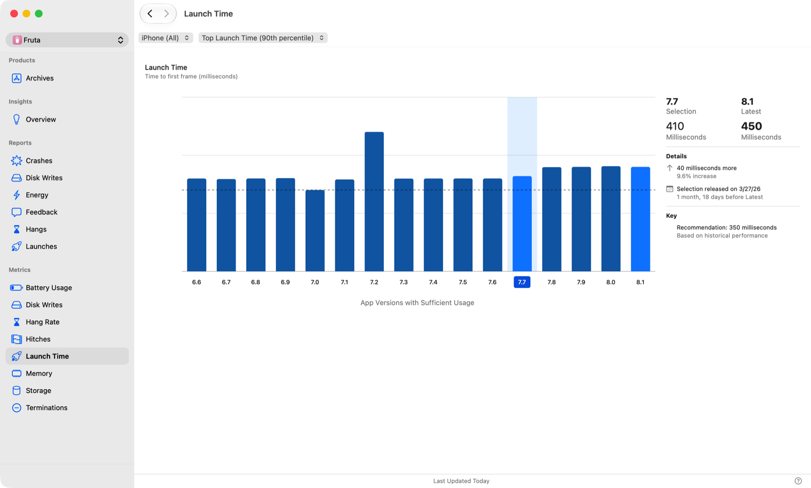
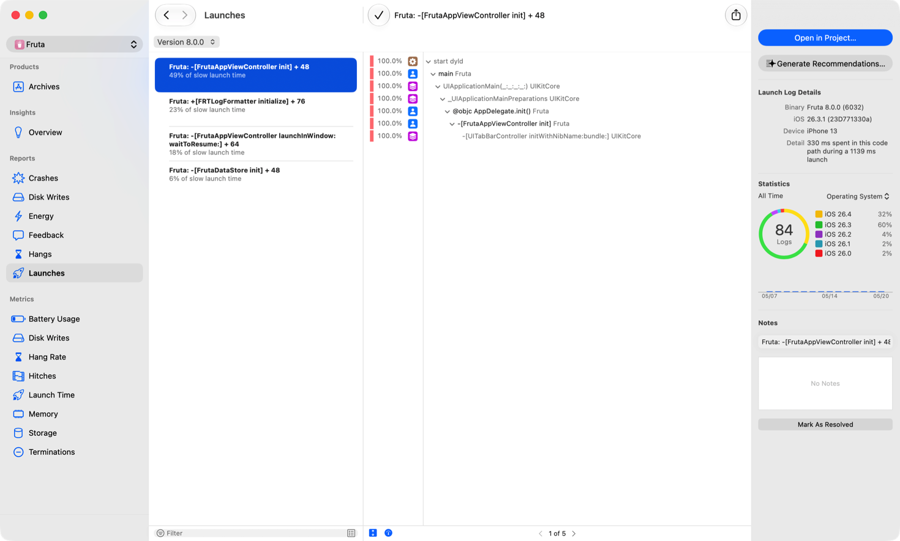
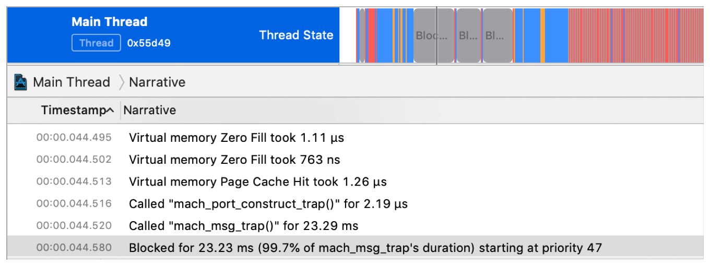
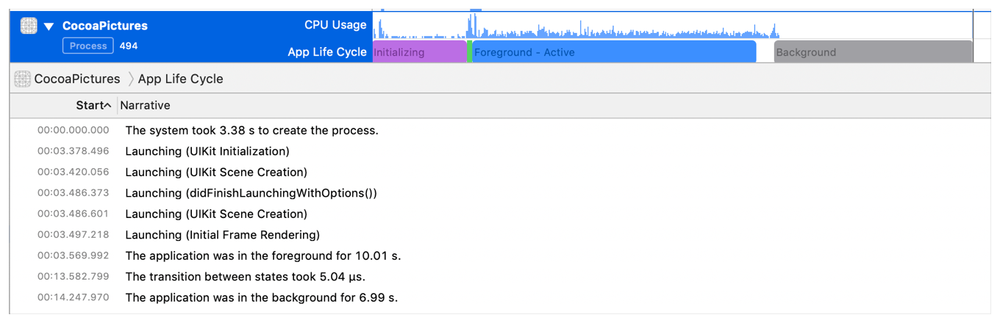
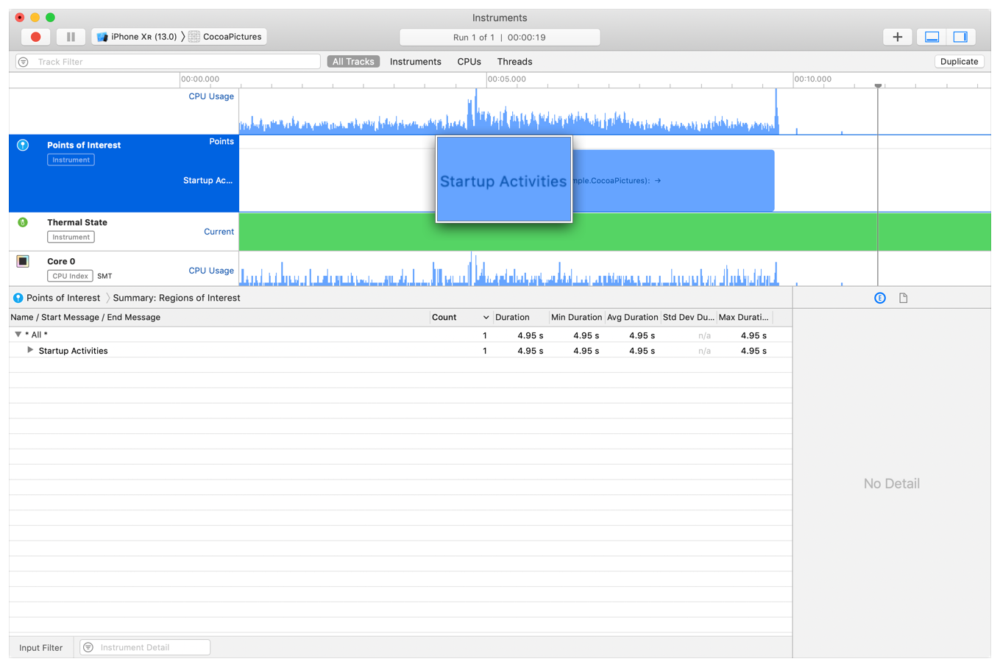

> Navigation: [Technologies](../technologies.md) · [Xcode](../xcode.md) · [Performance and metrics](performance-and-metrics.md)

# Reducing your app’s launch time

<sub>Article</sub>

Create a more responsive experience with your app by minimizing time spent in startup.

## Overview

A user’s first experience with an app is the wait while it launches. The OS indicates the app is launching with a splash screen on iOS and an icon bouncing in Dock on macOS. The app needs to be ready to help the user with a task as soon as possible. An app that takes too long to launch may frustrate the user, and on iOS, the watchdog will terminate it if it takes too long. Typically, users launch an app many times in a day if it’s part of their regular workflow, and a long launch time causes delays in performing a task.

When the user taps an app’s icon on their Home screen, iOS prepares the app for launch before handing control over to the app process. The app then runs code to get ready to draw its UI to the screen. Even after the app’s UI is visible, the app may still be preparing content or replacing an interstitial interface (for example, a loading spinner) with the final controls. Each of these steps contributes to the total perceived launch time of the app, and you can take steps to reduce their duration.

### Understand app activations

An _activation_ happens when a user clicks on your icon or otherwise goes back to your app.

On iOS, an activation can either be a launch or a resume. A _launch_ is when the process needs to start, and a resume is when your app already had a process alive, even if suspended. A _resume_ is generally much faster, and the work to optimize a launch and resume differs.

On macOS, the system will not terminate your process as part of normal use. An activation may require the system to bring in memory from the compressor, swap, and re-render.

### Understand cold and warm launch

Your app activation varies significantly depending on previous actions on the device.

For example, on iOS, if you swipe back to the home screen and immediately re-enter the app, that is the fastest activation possible. It’s also likely to be a resume. When the system determines that a launch is required, it is commonly referred to as a “warm launch.”

Conversely, if a user just played a memory-intensive game, and they then re-enter your app, for example, it may be significantly slower than your average activation. On iOS, your app typically was evicted from memory to allow the foreground application more memory. Frameworks and daemons that your app depends on to launch might also require re-launching and paging in from disk. This scenario, or a launch immediately after boot, is often referred to as a “cold launch.”

Think of warm and cold launches as a spectrum. In real use, your users will experience a range of performance based on the state of the device. This spectrum is why testing in a variety of conditions is essential to predicting your real world performance.

### Gather metrics about your app’s launch time

Variations in launching mean that understanding how your app is operating in the field can be challenging.

For iOS apps, use the Launch Time pane in the Xcode Organizer to view the number of milliseconds between the user tapping your icon and when your first screen is drawn, after the static splash screen. Use the filters to check launch times on different devices and for the typical (50th percentile) and longest (90th percentile) times. Compare the launch time of the current release with a previous one by clicking on the bar in the graph for the desired release.



<sub>Screenshot of the Launch Time metric pane in the Xcode Organizer. From left to right is the list of metrics and reports, the metric UI with a bar graph showing the launch time over the last 8 app versions, the selected version bar highlighted in the graph, and the comparison data for the selected and latest versions on the right side. </sub>

[MetricKit](../metrickit.md) reports the time to resume the application in addition to the launch time. [TimeToFirstDrawMetric](https://developer.apple.com/documentation/metrickit/timetofirstdrawmetric) and [ApplicationResumeTimeMetric](https://developer.apple.com/documentation/metrickit/applicationresumetimemetric) contain histograms of your launch and resume times for the previous day.

### Identify areas of launch time improvement

To determine which processes take up time when your iOS app launches, use the Launches pane in the Xcode Organizer. The report area displays an ordered list of the longest running functions that the system calls when your app starts in the same row as the percentage of the launch time the process takes.

Clicking a report in the Report List shows the function that ran along with its respective stack trace. The Inspector includes more details, specifically:

- iOS version
- Device model
- Total launch time for the log that includes this signature
- Number of received logs
- 14-day reporting trend

Prioritize reducing launch times by using the percent of time spent metric, as well as information on the operating system and the impacted device types. Identify the code responsible for the increase in app launch time by using the function signature for a specific report in the Report List and the corresponding stack trace. After updating the code and verifying the fix, mark the report as resolved.



<sub>Screenshot of the Launches pane in the Xcode Organizer. From left to right, the Report List which is a list of functions taking the most time to run as a percentage, the corresponding call stack for the function selected in the Report List, and launch log details and statistics including the 14-day reporting trend.</sub>

### Get coding assistant recommendations for launch time issues

After selecting a launch report, click Generate Recommendations in the Inspector to get assisted triage in Xcode. After selecting a workspace, Xcode opens your project and pastes the stack trace and launch-time contribution into the coding assistant to help you identify and fix the root cause of the launch time regression.

### Profile your app’s launch time

Once you know how long it takes your app to launch, you need to know why it takes that long. Profiling your app’s code is a way to gather the data you need about where your app spends its time. During the profiling process, [Instruments](https://help.apple.com/instruments/mac/current/#/dev7b09c84f5) gathers information about what methods your app called and how much time it spent executing them. Use this data to identify potential bottlenecks or issues in your code.

Profile your app in Instruments by using the App Launch template. During your launch, Instruments gathers a time profile and thread-state trace. Use the time profile to identify the code your app is running during launch. Use the thread-state trace to find times when threads are active or blocked, and discover the reasons that threads are blocked.

Profile your app’s launch time in different situations to see how these factors affect the experience. Here are some examples of different situations to test:

- Switch the device on, unlock it for the first time, and then launch your app.
- Force quit your app, and then launch it. The system will terminate your app process, and the system will perform a warm launch.
- If you open other apps and then launch yours, the system partially evicts your app and its dependencies This mirrors a common user workflow.
- Use a very large app — for example, one that works with many graphical resources or live camera input — and then launch your app. The system will likely terminate your app’s process
  terminated, which means the system needs to page in many of the app’s dependencies during your next launch.



UIKit draws views and handles user events on the main thread, so that thread must be available to draw the first frame when the app has finished launching. In the Instruments thread trace, time that the main thread spends running or preempted is time that it cannot draw views or respond to user input events.

For a different view of app launch, profile the app using the Time Profile template. The App Life Cycle timeline divides activity during app launch into process initialization, UIKit initialization, UIKit initial scene rendering, and initial frame rendering.



### Reduce dependencies on external frameworks and dynamic libraries

Before any of your code runs, the system must find and load your app’s executable and any libraries on which it depends.

The dynamic loader (`dyld`) loads the app’s executable file, and examines the Mach load commands in the executable to find frameworks and dynamic libraries that the app needs. It then loads each of the frameworks into memory, and resolves dynamic symbols in the executable to point to the appropriate addresses in the dynamic libraries.

Each additional third-party framework that your app loads adds to the launch time. Although `dyld` caches a lot of this work in a launch closure when the user installs the app, the size of the launch closure and the amount of work done after loading it still depend on the number and sizes of the libraries loaded. You can reduce your app’s launch time by limiting the number of 3rd party frameworks you embed. Frameworks that you import or add to your app’s Linked Frameworks and Libraries setting in the Target editor in Xcode count toward this number. Built-in frameworks, like CoreFoundation, have a much lower impact on launch, because they use shared memory with other processes that use the same framework.

### Use mergeable dynamic libraries

In Xcode 15 or later, you can use mergeable dynamic libraries to get app launch times similar to static linking in release builds, without losing dynamically linked build times in debug builds. Mergeable dynamic libraries include extra metadata so that Xcode can merge the library into another binary. For more information on mergable libraries, see [Configuring your project to use mergeable libraries](configuring-your-project-to-use-mergeable-libraries.md).

### Remove or reduce the static initializers in your code

Certain code in an app must run before iOS runs your app’s `main()` function, adding to the launch time. This code includes:

- C++ static constructors.
- Objective-C `+load` methods defined in classes or categories.
- Functions marked with the clang attribute `__attribute__((constructor))`.
- Any function linked into the `__DATA,__mod_init_func` section of an app or framework binary.

Where possible, move the code to a later stage of the app’s life cycle, after the app has finished launching but before the results of the work are needed. In Instruments, the dyld Activity instrument measures the time your app spends running static initializers and reports other useful metrics to help you speed up your app’s launch.

### Move expensive tasks out of your app delegate

Audit your initialization code to delay expensive work. The system calls methods of your app delegate during the launch cycle to give you time to perform required tasks. These methods execute synchronously on the main thread, and the launch cycle doesn’t finish until both methods return successfully. As a result, any expensive tasks you perform from the methods delay the completion of that launch cycle.

UIKit initializes an instance of your app delegate class (the class that conforms to the [UIApplicationDelegate](../uikit/uiapplicationdelegate.md) protocol) and sends it the [application(_:willFinishLaunchingWithOptions:)](<../uikit/uiapplicationdelegate/application(__willfinishlaunchingwithoptions_).md>) and [application(_:didFinishLaunchingWithOptions:)](<../uikit/uiapplicationdelegate/application(__didfinishlaunchingwithoptions_).md>) messages. UIKit sends these messages on the main thread, and time spent executing code in these methods increases your app’s launch time. Do only the work necessary to prepare your app’s initial display in these methods; defer other tasks to more appropriate times in the app’s life cycle.

Defer synchronization of the data model with a network service until the app is running, if it makes sense to show stale content to the user while the content is being refreshed. Move the synchronization to an asynchronous background queue. Register a background task to fetch updates from the network service, to reduce both the staleness of data on launch and the amount of work needed to bring it up to date.

Initialize nonview functionality, such as persistent storage and location services, on first use rather than on app launch. Retrieve only the data necessary to display your app’s initial view. Pay attention to whether your app is restoring state, and prepare the data needed to display the view that’s being restored. If no state is being restored, prepare only the default initial view. For example, a photo gallery app might show a collection of image thumbnails by default and let a user pick a photo to get a detailed view. If the app is launching with no restored state, it only needs to show a placeholder for a screenful of thumbnails and fill them in with real image thumbnails once the app has finished launching. It doesn’t need to load the full, detailed images until the user taps one of the thumbnails.

Initialize a restricted subset of the app’s behavior that’s known to be viable on initial launch. For example, a task manager app can let the user create a new task on launch, even if the app hasn’t yet retrieved all of the user’s existing tasks from its persistent storage or network service.

### Reduce the complexity of your initial views

Xcode Organizer and MetricKit both use the time to first frame as the measurement of launch time, including the time required to draw the views that are displayed on that first frame. You can only modify the view hierarchy on the main thread; therefore, a more complicated view hierarchy with more views takes longer to render than a simple hierarchy.

Reducing the complexity of your app’s initial view improves the load time, as does replacing custom views that override [draw(_:)](<../uikit/uiview/draw(__).md>) with standard views. Where you need custom drawing, pay attention to the rectangle passed to `draw(_:)` and only render parts of the view within that rectangle. Doing so avoids decoding images and computing colors, coordinates, and drawing commands in parts of the view that aren’t rendered to the screen.

### Track additional startup activities

The launch-time metric measures the time from the user tapping the app icon on their Home screen to the app drawing its first frame to the screen. Drawing the `default.png` or launch-screen storyboard happens during this time, and its appearance doesn’t end the launch-time counter.

If your app still has to run code after it has drawn its first frame, but before the user can begin using the app, that time doesn’t contribute to the launch-time metric. Extra startup activities still contribute to the user’s perception of the app’s responsiveness. For example, if your app renders a document after opening, the user will likely wait on the document to render and perceive it as part of your launch time, even though the system will end the launch measurement while you show a loading icon.

To track additional startup activities, create an [OSLog](../os/oslog.md) object in your app with the category [pointsOfInterest](../os/oslog/category/pointsofinterest.md). Use the `os_signpost` function to record the beginning and end of your app’s preparation tasks, as shown in the following example:

```swift
class ViewController: UIViewController {
    static let startupActivities:StaticString = "Startup Activities"
    let poiLog = OSLog(subsystem: "com.example.CocoaPictures", category: .pointsOfInterest)

    override func viewDidAppear() {
        super.viewDidAppear()
        os_signpost(.begin, log: self.poiLog, name: ViewController.startupActivities)
        // do work to prepare the view
        os_signpost(.end, log: self.poiLog, name: ViewController.startupActivities)
    }
}
```

In Instruments, Points of Interest displays the os_signposts in its timeline. You can use this information to correlate activity in your app with the app’s additional startup tasks.



<sub>Screenshot showing the Points of Interest instrument, with a timeline of regions beginning and ending during an app’s additional startup activities.</sub>

## See Also

### Responsiveness

- [Analyzing responsiveness issues in your shipping app](analyzing-responsiveness-issues-in-your-shipping-app.md) — Identify responsiveness issues your users encounter, and use the hang and hitch data in Xcode Organizer to determine which issues are most important to fix.
- [Improving app responsiveness](improving-app-responsiveness.md) — Create a user experience that feels responsive by removing hangs and hitches from your app.
- [Understanding user interface responsiveness](understanding-user-interface-responsiveness.md) — Make your app more responsive by examining the event-handling and rendering loop.
- [Understanding and improving SwiftUI performance](understanding-and-improving-swiftui-performance.md) — Identify and address long-running view updates, and reduce the frequency of updates.
- [Understanding hangs in your app](understanding-hangs-in-your-app.md) — Determine the cause for delays in user interactions by examining the main thread and the main run loop.
- [Understanding hitches in your app](understanding-hitches-in-your-app.md) — Determine the cause of interruptions in motion by examining the render loop.
- [Diagnosing performance issues early](diagnosing-performance-issues-early.md) — Diagnose potential performance issues in your app during development and testing with the Thread Performance Checker tool in Xcode.
- [Reducing terminations in your app](reduce-terminations-in-your-app.md) — Minimize how frequently the system stops your app by addressing common termination reasons.
