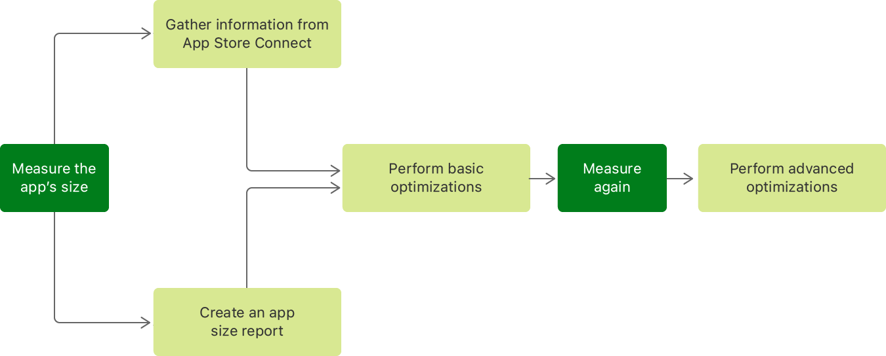

> Navigation: [Technologies](../technologies.md) · [Xcode](../xcode.md) · [Performance and metrics](performance-and-metrics.md)

# Reducing your app’s size

Measure your app’s size, optimize its assets and settings, and adopt technologies that help streamline installation over a mobile internet connection.

## Overview

Even when your users are in areas with good mobile network coverage, their download speeds can vary, or their data plan may limit the amount of available high-speed data. To ensure that app downloads don’t take a long time or result in additional costs to users, the App Store limits the size of the apps they can install over a mobile connection. If an app’s size exceeds the limit, users need to connect to a Wi-Fi network to install it. Keep your app well below the size limit to maximize your app’s possible install base and minimize installation time.

In addition to these issues, devices may have only limited storage available, making it even more important to be mindful about your app’s size. Consider measuring it as part of your development and testing process, and plan to optimize it as you develop it.

Before you start optimizing your app, you first need to measure its download and installation sizes. However, none of the binaries that you create for debugging or that you upload to the App Store from within Xcode are suitable for measuring your app’s size. For example, you can’t use any of the following binaries:

- The APP file (the app bundle)
- The XCARCHIVE bundle that you create when your archive your app
- The IPA file that you upload to App Store Connect

Those binaries contain resources and files that aren’t part of the bundles that your users download from the App Store; for example, DSYM files for crash reporting.

During development, the only way to get accurate download and installation sizes for your app is to create an app size report on your Mac. However, if your app is available through the App Store or the TestFlight app, App Store Connect provides the most accurate size information. It displays the size for each variant of your app and warns you if it exceeds the limit for downloading over a mobile internet connection.

Apps distributed for testing with TestFlight contain additional data that an App Store build doesn’t have, so the TestFlight build is larger. This additional data isn’t included in your app when you make it available in the App Store. However, when compared to the binary you uploaded, the final size of your app after it’s approved for the App Store may end up being slightly larger. This size increase can happen when the App Store performs additional processing on your app’s binaries, adding DRM to prevent app piracy and then re-compressing the binaries.

The following figure shows a common workflow for measuring your app’s size and performing optimizations.



To learn more about viewing the file sizes of a build in App Store Connect, see [View builds and metadata](https://developer.apple.com/help/app-store-connect/manage-builds/view-builds-and-metadata).

The following two sections describe how you can generate a size report with Xcode, and how you can automate its creation.

### Create the app size report

While App Store Connect provides the most accurate measurements of your app’s size, Xcode’s built-in reporting tools can create an app size report for you. It provides close estimates of your app’s download and installation sizes. To create an app size report:

1. Archive your app in Xcode.
2. Export your archived app as an Ad Hoc, Development, or Enterprise build.
3. In the sheet for setting the development distribution options, choose “All compatible device variants” for app thinning.
4. Sign your app and export it to your Mac.

This process creates a folder with your app’s artifacts:

- A _universal_ IPA file for older devices. This single IPA file contains assets and binaries for all variants of your app.
- _Thinned_ IPA files for each variant of your app. These files contain assets and binaries for only one variant.

The output folder for your exported app also contains the app size report: a file named `App Thinning Size Report.txt`. This report lists the compressed and uncompressed sizes for each of your app’s IPA files. The uncompressed size is equivalent to the size of the installed app on the device, and the compressed size is the download size of your app. The following shows the beginning of the app size report for a sample app:

```other
App Thinning Size Report for All Variants of ExampleApp

Variant: ExampleApp.ipa
Supported variant descriptors: [device: iPhone11,4, os-version: 12.0], [device: iPhone9,4, os-version: 12.0], [device: iPhone10,3, os-version: 12.0], [device: iPhone11,6, os-version: 12.0], [device: iPhone10,6, os-version: 12.0], [device: iPhone9,2, os-version: 12.0], [device: iPhone10,5, os-version: 12.0], [device: iPhone11,2, os-version: 12.0], and [device: iPhone10,2, os-version: 12.0]
App + On Demand Resources size: 6.7 MB compressed, 18.6 MB uncompressed
App size: 6.7 MB compressed, 18.6 MB uncompressed
On Demand Resources size: Zero KB compressed, Zero KB uncompressed

// Other Variants of Your App.
```

With the app size report you generate, you’re now ready to perform some basic optimizations, such as checking your binaries for unused assets, to reduce the size of your app. For more information, see [Doing basic optimization to reduce your app’s size](doing-basic-optimization-to-reduce-your-app-s-size.md).

### Automate the generation of the app size report

Instead of creating the app size report with Xcode, you may want to automate its generation in build scripts or continuous integration workflows. Run the following command to use `xcodebuild` to export your app for distribution and create an app thinning size report:

```other
xcodebuild -exportArchive -archivePath iOSApp.xcarchive -exportPath Release/MyApp -exportOptionsPlist OptionsPlist.plist
```

Replace all file names and paths as necessary. To create the app size report, provide `xcodebuild` with an export options property list. Be sure to include the `thinning` key, with `<thin-for-all-variants>` as the value.

> [!important] Important
> Be sure to escape the angle brackets for the value in your export options property list.

To learn more about using `xcodebuild`, see [Building from the Command Line with Xcode FAQ](https://developer.apple.com/library/archive/technotes/tn2339/_index.html#//apple_ref/doc/uid/DTS40014588).

## Topics

### Size optimization

- [Doing basic optimization to reduce your app’s size](doing-basic-optimization-to-reduce-your-app-s-size.md) — Adjust your project’s build settings, and use technologies like asset catalogs early in your app’s development life cycle.
- [Doing advanced optimization to further reduce your app’s size](doing-advanced-optimization-to-further-reduce-your-app-s-size.md) — Optimize your app’s asset files, adopt on-demand resources, and reduce the size of app updates.

## See Also

### Memory and size

- [Reducing your app’s memory use](reducing-your-app-s-memory-use.md) — Improve your app’s performance by analyzing memory-use metrics and making changes to maximize memory efficiency.
