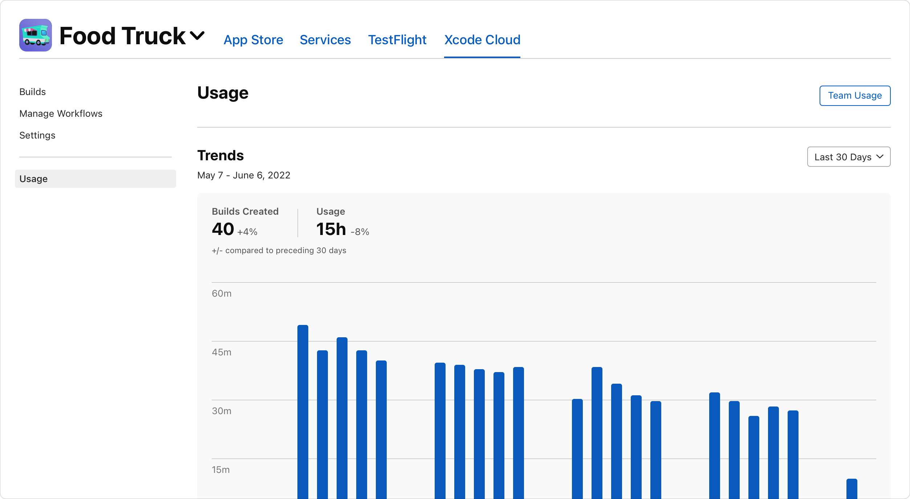

> Navigation: [Technologies](../technologies.md) · [Xcode](../xcode.md) · [Xcode Cloud](xcode-cloud.md)

# Reviewing Xcode Cloud usage data

Article

Access Xcode Cloud usage information to understand how you and your team use Xcode Cloud.

## Overview

Xcode Cloud parallelizes tasks to build and verify your app and uses Apple infrastructure to build, test, and distribute your app to create a continuous integration and delivery (CI/CD) process that helps you create a high-quality app. Because Xcode Cloud performs build steps and actions in parallel to give you faster results, the time it takes to complete a build and the usage time Xcode Cloud reports are different. Depending on the subscription plan you choose, you have a certain amount of Xcode Cloud usage at your disposal. This makes it important to review your Xcode Cloud usage for yourself and your team.

To learn more about available Xcode Cloud subscription plans, see [Get started with Xcode Cloud](http://developer.apple.com/xcode-cloud/get-started).

### Access usage information and purchase subscription plans in the Apple Developer app

The Apple Developer app allows you to access Xcode Cloud usage information for your team and offers functionality to purchase additional usage time. To view your team’s usage, go to Account, then navigate to the Xcode Cloud section. If you have the Account Holder role and your team uses Xcode Cloud, use the app to purchase a subscription plan that offers additional Xcode Cloud usage time.

### Access more detailed usage data in App Store Connect

App Store Connect allows you to access Xcode Cloud usage information. It shows usage trends and allows you to access detailed usage information for your team and each individual app — for example, the number of created builds and the build duration. Additionally, export usage information as a `.csv` file — for example, to create custom reports.

After logging into [App Store Connect](https://appstoreconnect.apple.com):

- Go to Users and Access, then navigate to the Xcode Cloud tab to view your team’s overall Xcode Cloud usage.
- Select an app, and navigate to the app’s Xcode Cloud tab to view Xcode Cloud usage for the app.

> [!note] Note
> Every team member with access to App Store Connect can view usage data for the team but they can only view usage information for apps they have access to.

The following screenshot shows the usage dashboard for the Food Truck sample code app from [Food Truck: Building a SwiftUI multiplatform app](../swiftui/food-truck-building-a-swiftui-multiplatform-app.md). It displays the number of builds and the usage for 30 days — including trends.

A screenshot of the App Store Connect website. It displays the usage dashboard for the Food Truck app. It shows usage trend information for 30 days, including the number of builds and the usage.
