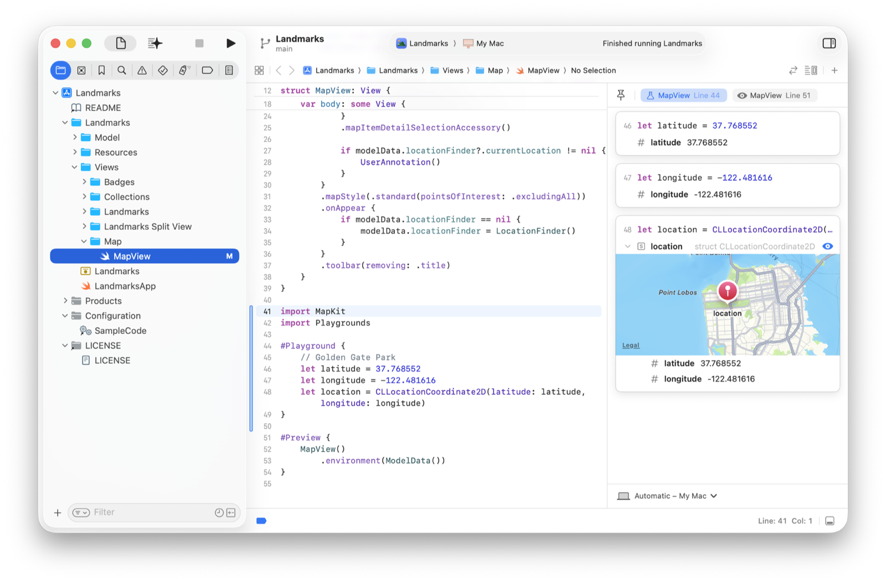
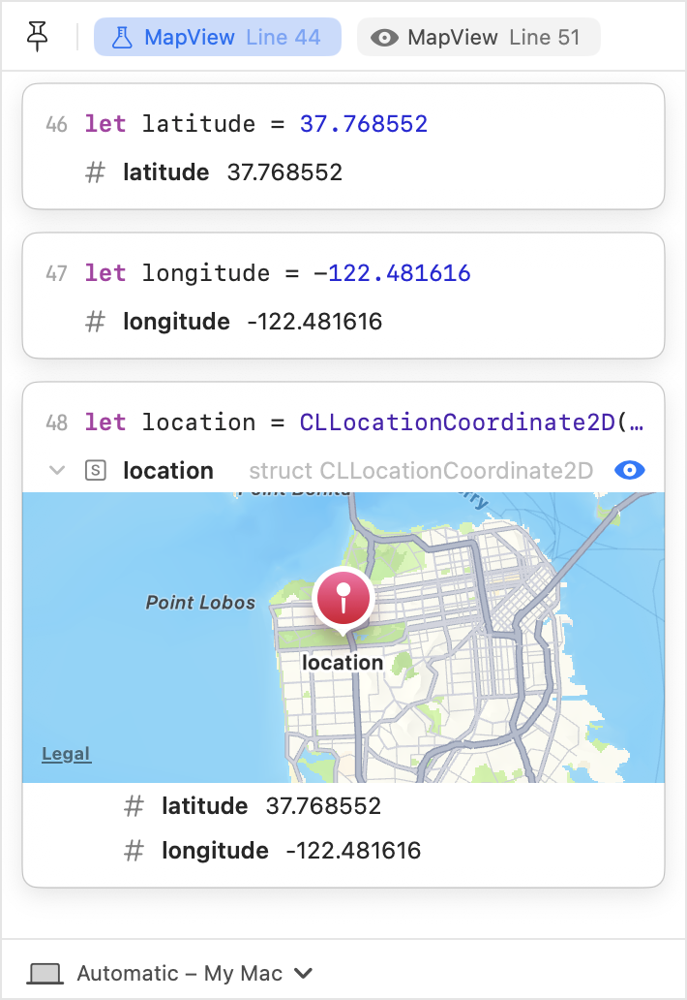
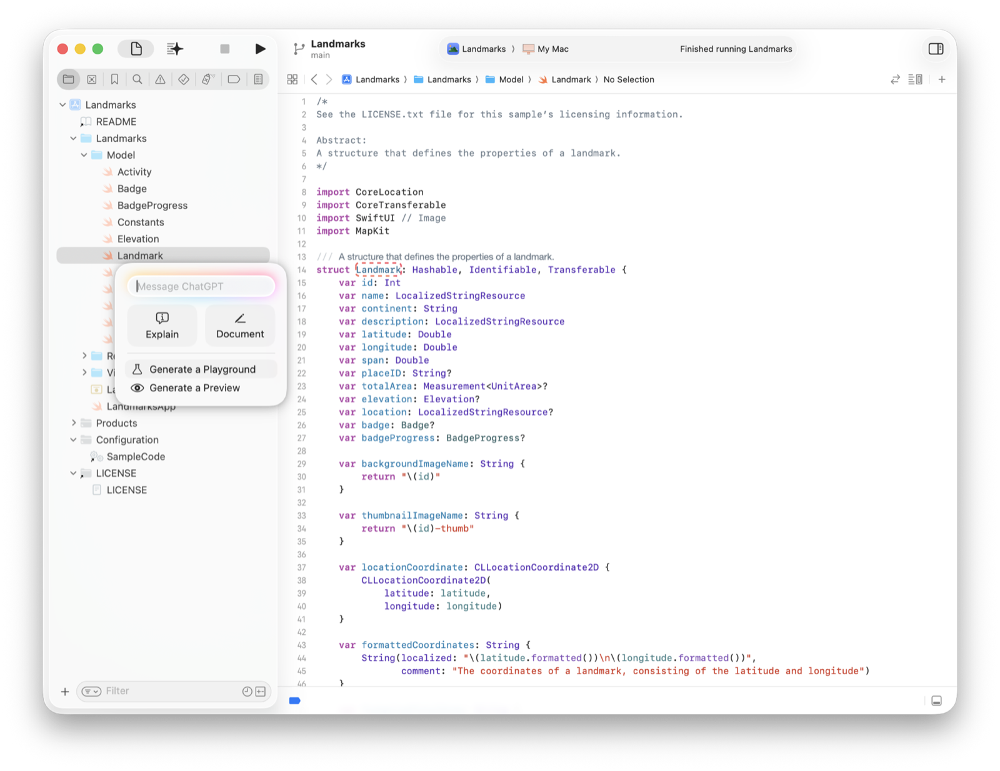

> Navigation: [Technologies](../technologies.md) · [Xcode](../xcode.md) · [Source editor](source-editor.md)

# Running code snippets using the playground macro

<sub>Article</sub>

Add playgrounds to your code that run and display results in the canvas.

## Overview

You can explore and experiment with your code using playgrounds that you add directly to your Swift files. Xcode immediately shows the results of running the playgrounds in the canvas. Xcode can also generate playgrounds for you about symbols or selections in your code.



<sub>A screenshot showing the Project navigator on the left, a SwiftUI file open in the source editor in the middle containing a playground and a preview, and the canvas on the right showing the results of the playground.</sub>

> [!tip] Tip
> Previews that you add to SwiftUI files also appear in the canvas. For information on adding previews, see [Previewing your app’s interface in Xcode](previewing-your-apps-interface-in-xcode.md).

### Add playgrounds to your Swift files

You can add one or more playgrounds to a Swift file. First, import the Playgrounds framework in your Swift file. Then wrap the code snippet that you want to run in the `#Playground` macro, for example:

```swift
import MapKit
import Playgrounds

#Playground {
    // Golden Gate Park
    let latitude = 37.768552
    let longitude = -122.481616
    let location = CLLocationCoordinate2D(latitude: latitude, longitude: longitude)
}
```

If the canvas isn’t open, choose Editor \> Canvas to display the canvas. Then click the Resume button to run the playground and see the results in the canvas.

### View the results in the canvas

In the canvas, use the controls under each line of code to see the details. For example, click the disclosure triangle under a variable name to show or hide its value.

If a line of code contains a viewable object — such as an image, color, or location — Xcode displays it in the canvas. To collapse the view, toggle the eye button to off. For example, if a line of code prints a value, Xcode displays that value. If a line of code sets a [CLLocationCoordinate2D](../corelocation/cllocationcoordinate2d.md) variable, Xcode displays the location on a map.



<sub>A screenshot of the canvas showing a viewable CLLocationCoordinate2D variable displayed on a map with the disclosure triangle under the variable name open and the eye button on.</sub>

### Navigate between multiple playgrounds and previews

If you add multiple playgrounds, you can switch between them, and any previews that you add to the same file, using the tabs that appear at the top of the canvas. When you click a tab, Xcode runs that playground or preview and shows the results in the canvas. Playground tabs have a beaker icon and previews have an eye icon in front of the name.

### Generate playgrounds from your code

To quickly add a playground, let the coding assistant generate one for you from a selection in your code.

In the source editor, select a symbol and click the coding assistant icon that appears, or Control-click a symbol and choose Show Coding Tools \> Show Coding Tools from the pop-up menu. In the coding tools popover that appears, click Generate a Playground to add a playground.



<sub>A screenshot that shows the Project navigator in the sidebar, a Swift file opened in the source editor with a symbol highlighted and the Generate a Playground button selected in the Show Coding Tools popover.</sub>

Xcode shows the results of the playground, and for SwiftUI files, the previews, in the canvas area. If the canvas isn’t open, choose Editor \> Canvas to show it, then click Resume.

The coding tools communicate with the same large language model to generate the playground that the coding assistant uses to write code. For more information, see [Writing code with intelligence in Xcode](writing-code-with-intelligence-in-xcode.md).

## See Also

### Source file creation, organization, and editing

- [Editing source files in Xcode](editing-source-files-in-xcode.md) — Use features of the source editor to help you write, navigate, document, and understand code more quickly.
- [Using coding intelligence in the source editor](using-coding-intelligence-in-the-source-editor.md) — Submit prompts in the same place you want to make changes to your code.
