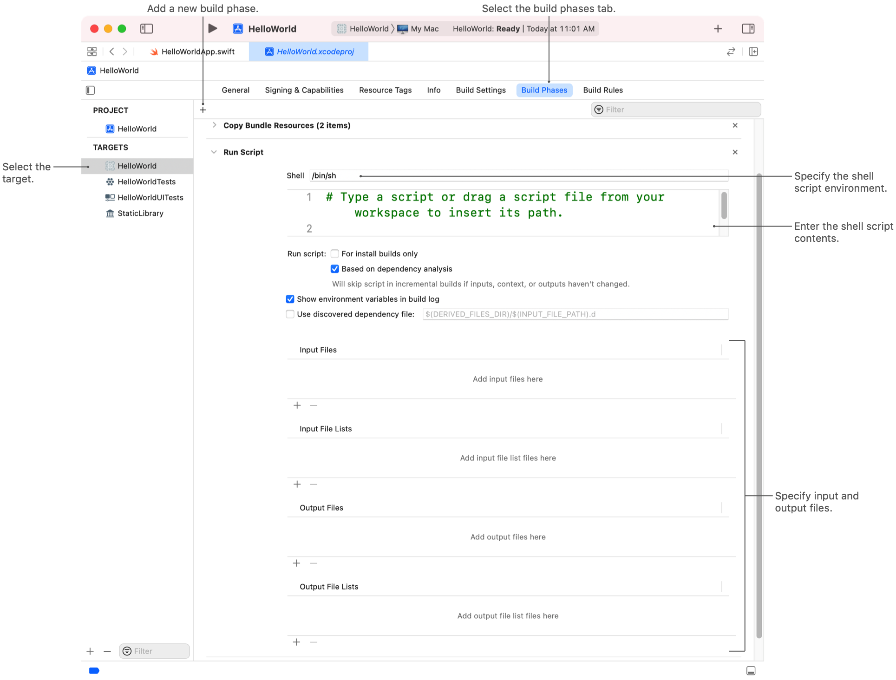

> Navigation: [Technologies](../technologies.md) · [Xcode](../xcode.md) · [Build system](build-system.md)

# Running custom scripts during a build

<sub>Article</sub>

Execute custom shell scripts during the build process, and run tools or other commands that your project requires.

## Overview

Xcode provides many tools for turning code and resources into finished products, but sometimes you need to run custom tools for your products. For example, you might package some of your resources into an optimized format for faster runtime access. For these tasks, you use custom shell scripts to execute the code and tools you need during the build process.

> [!note] Note
> If your script compiles or converts one or more input files to a different format, considering creating a build rule for your files instead. For more information, see [Creating build rules for custom file types](creating-build-rules-for-custom-file-types.md).

### Add a run script build phase to your target

To execute a custom script at build time, add a Run Script build phase to your target. This build phase runs separately from the target’s other build phases, such as the compilation and link build phases. You may add multiple script-related build phases to your target to execute scripts at different stages of the build.

To add a Run Script build phase to a target:

1. In the Project navigator, select your project.
2. Select the target you want to modify.
3. Click the Build Phases tab.
4. Click the Add button (+), then choose “New Run Script Phase” from the pop-up menu.
5. Click the disclosure triangle for the newly added Run Script phase.
6. In the Shell text field, enter your script code.



If you have an existing shell script file, drag it onto the Shell text field to copy the script there. You may use any of the available shell environments to execute your script, and you can change the execution shell by changing the shell command above your script code.

> [!note] Note
> To rename a script phase, double-click the Run Script title to edit it.

### Specify the input and output files for your script

The Run Script build phase provides a place to enter any input and output files for your script. Use input and output files to customize your script’s behavior and to help the build system understand when to execute your script. Input files contain data you want the script to process. For example, you might pass one or more image files to the script. Output files contain any data generated by the script.

Specify input and output files in one of two ways:

- Specify individual files as path strings. Typically, you use path strings only when you know the input or output files in advance and you’re sure they won’t change.
- Specify files in a file list, which is a text file with an `.xcfilelist` filename extension. File lists make it easier to edit the set of files, and are particularly useful if you change the list of files frequently or want to annotate the list with comments.

To add files or file lists to your script, click the Add button in the appropriate section of your Run Script build phase. For each entry, specify the path to the file or file list, which can include build variables. For example, the string `$(PROJECT_DIR)/myFileList` specifies a file list in the root directory of the current project.

If you periodically change the set of input or output files, specify them using a file list. A file list contains a list of path strings separated by newline characters. Each path string represents a single input or output file for the script. Path strings can include build variables such as `$(PROJECT_DIR)`.

> [!note] Note
> Xcode requires the set of input and output files your script accesses so it can inform the build process. This ensures correctness by running scripts and other concurrently-executing build tasks in the right order, and optimizes build times by running your script only when necessary. If you don’t specify the files, Xcode runs your script every time you build the target and it might introduce incorrect build behaviors. For more information, see [Improving the speed of incremental builds](improving-the-speed-of-incremental-builds.md).

### Access script-related files from environment variables

Xcode configures the execution environment for your script and gives your script access to the same build settings and environment variables as the target. Xcode also creates the following environment variables specifically for your script.

| Variable | Description |
|---|---|
| `SCRIPT_INPUT_FILE_COUNT` | The total number of files available as inputs to the script. |
| `SCRIPT_INPUT_FILE_[#]` | Environment variables that contain the paths to the script’s input files. Xcode creates an environment variable for each input file, starting with `SCRIPT_INPUT_FILE_0` and increasing the number value sequentially for each subsequent file. |
| `SCRIPT_INPUT_FILE_LIST_COUNT` | The total number of file lists available as inputs to the script. |
| `SCRIPT_INPUT_FILE_LIST_[#]` | Environment variables that contain the paths to the script’s input file lists. Xcode creates an environment variable for each input file list, starting with `SCRIPT_INPUT_FILE_LIST_0` and increasing the number value sequentially for each subsequent file list. |
| `SCRIPT_OUTPUT_FILE_COUNT` | The total number of files described as script outputs. |
| `SCRIPT_OUTPUT_FILE_[#]` | Environment variables that contain the paths to the script’s output files. Xcode creates an environment variable for each output file, starting with `SCRIPT_OUTPUT_FILE_0` and increasing the number value sequentially for each subsequent file. |
| `SCRIPT_OUTPUT_FILE_LIST_COUNT` | The total number of file lists described as script outputs. |
| `SCRIPT_OUTPUT_FILE_LIST_[#]` | Environment variables that contain the paths to the script’s output file lists. Xcode creates an environment variable for each output file list, starting with `SCRIPT_OUTPUT_FILE_LIST_0` and increasing the number value sequentially for each subsequent file list. |

Use the build settings and script-specific environment variables to customize your script’s behavior. For example, you might write your script’s output files to the directory in the `BUILT_PRODUCTS_DIR` build setting. For a complete list of build settings, see [Build settings reference](build-settings-reference.md).

### Log errors and warnings from your script

During your script’s execution, you can report errors, warnings, and general notes to the Xcode build system. Use these messages to diagnose problems or track your script’s progress. To write messages, use the echo command and format your message as follows:

```
[filename]:[linenumber]: error | warning | note : [message]
```

If the `error:`, `warning:`, or `note:` string is present, Xcode adds your message to the build logs. If the issue occurs in a specific file, include the filename as an absolute path. If the issue occurs at a specific line in the file, include the line number as well. The filename and line number are optional.

Some example errors and warnings include:

```
echo "error: An expected input file was missing."
echo "warning: Skipping a file of an unknown type."
```

### Trigger a build failure

When your script fails and recovery isn’t possible, return a nonzero exit code from your script. Xcode treats a nonzero exit value as a build failure, and adds appropriate information to the logs.

The following example logs an error message to standard out and triggers a build failure.

```
echo "error: A fatal error occurred in the script."
exit 1
```

## See Also

### Build customization

- [Customizing the build schemes for a project](customizing-the-build-schemes-for-a-project.md) — Specify which targets to build, and customize the settings Xcode uses to build, run, test, and profile those targets.
- [Customizing the build phases of a target](customizing-the-build-phases-of-a-target.md) — Specify the tasks to perform during a build, including the source files to compile, the scripts to run, and the resources to include in the final product.
- [Creating build rules for custom file types](creating-build-rules-for-custom-file-types.md) — Tell Xcode how to build your project’s custom file types, and provide dependency information to optimize the build process for each file.
- [Running code on a specific platform or OS version](running-code-on-a-specific-version.md) — Add conditional compilation markers around code that requires a particular family of devices or minimum operating system version to run.
