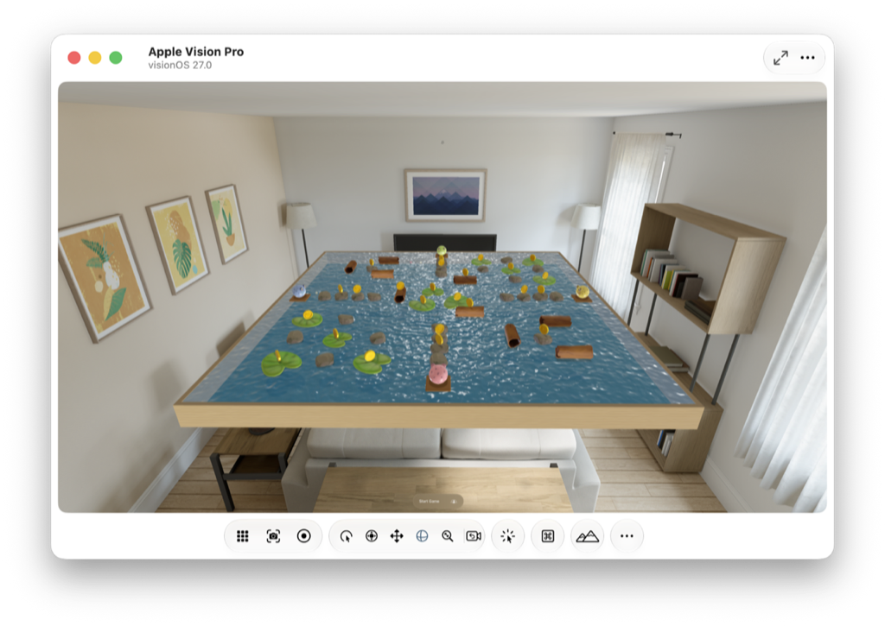

> Navigation: [Technologies](../technologies.md) · [Xcode](../xcode.md) · [Device Hub](device-hub.md)

# Running your app on simulated or physical devices

Article

Launch your app on a simulated iOS, iPadOS, tvOS, visionOS, or watchOS device, or on a physical device paired with your Mac.

## Overview

To test your app, build and run it on a simulated or physical device. Use simulated devices to debug your app on a variety of hardware that you might not have access to. Be aware that simulators run within Device Hub on your Mac and don’t replicate the performance or features of a physical device. To verify that your app runs exactly as intended, run it on one or more physical devices.

## Select a build scheme and run destination

Before you build and run your app, select a build scheme that includes the target for your app in Xcode. A _scheme_ is a collection of project details and settings that tell Xcode how to build and run a product from your project. In the toolbar, choose a scheme from the pop-up menu on the left of the run-destination.

Then choose a simulated or physical device from the run destination pop-up menu. Xcode populates the run destination menu with a list of available devices, including simulators for common hardware and the latest operating systems, based on the scheme that you select. For example, if the scheme contains a watchOS app, Xcode shows only watchOS simulated and physical devices as available run destinations.

If you don’t have platform support installed for your target, you can’t build and run your app on a device. To install platform support, click the Get button that appears next to the `Any [Platform] Device` run destination. Alternatively, manage your downloads later in Components settings (see [Downloading and installing additional Xcode components](downloading-and-installing-additional-xcode-components.md)).

To learn more about schemes, see [Customizing the build schemes for a project](customizing-the-build-schemes-for-a-project.md).

> [!important] Important
> When running apps in a simulator in Device Hub, some hardware-specific features might not be available. Frameworks that provide access to device-specific features also provide API to tell you when those features are available. Call those APIs and handle the case where a feature isn’t available. To test the feature itself, run your code on a physical device.

## Run the app

To build and run the app on the selected simulated or physical device, click the Run button in the toolbar or choose Product \> Run. View the status of the build in the activity area of the toolbar.

If the build is successful, Xcode runs the app and opens a debugging session in the debug area. Use the controls in the debug area to step through your code, inspect variables, and interact with the debugger. To run the app without the debugger, turn off the Debug executable option in the Info tab of the scheme editor.

If you choose a simulator as a run destination, Device Hub opens a compact window by default that shows your app on a device screen where you can interact with it using your Mac.

If you choose a physical device, Xcode runs the app on the device. To interact with your app using both the device and Device Hub, select the device in the sidebar and click View Screen in the canvas area.

For more information on interacting with different device types in Device Hub, see  [Interacting with your app in Device Hub](interacting-with-your-app-in-device-hub.md) and [Configuring the environment of a simulated device](configuring-the-environment-of-a-simulated-device.md).

If the build is unsuccessful, click the indicators in the activity area to read the error or warning messages in the Issue navigator. Alternatively, choose View \> Navigators \> Issues, or press Command-5, to view the messages.

When you’re done testing your app in Device Hub, click the Stop button in the Xcode toolbar.

## Create provisioning profiles for physical devices

If you choose a physical device as the run destination, perform a few additional steps to create a development provisioning profile in Xcode:

- In Xcode \> Settings \> Apple Accounts, sign in with your Apple Developer Program or personal Apple Account.
- In the Signing & Capabilities pane of the project editor, assign your project to a team.
- In the toolbar of the project editor, choose the physical device as the run destination.

With the default “Automatically manage signing” option enabled under Signing on the Signing & Capabilities pane, Xcode registers the device and creates the development provisioning profile for you. Otherwise, click the Register button under Signing if it appears.

> [!note] Note
> You don’t need to configure a Mac device to run your macOS apps unless you add capabilities that require provisioning. Similarly, to run the macOS version of an iPad app, choose My Mac as the device.

For more information on developer accounts, see [Choosing a Membership](https://developer.apple.com/support/compare-memberships/).

## See Also

### Essentials

- [Managing your simulated and physical devices in Device Hub](managing-your-simulated-and-physical-devices-in-device-hub.md) — Add custom simulators and pair physical devices with your Mac so you can choose them as run destinations in Xcode.
- [Enabling Developer Mode on a device](enabling-developer-mode-on-a-device.md) — Grant or deny permission for locally installed apps to run in iOS, iPadOS, watchOS, and visionOS.
