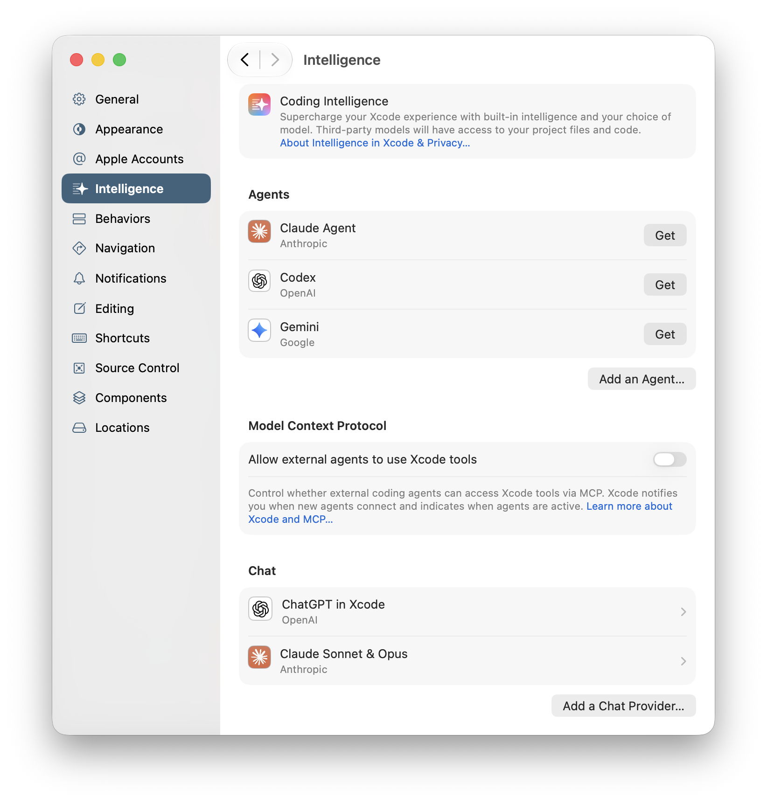
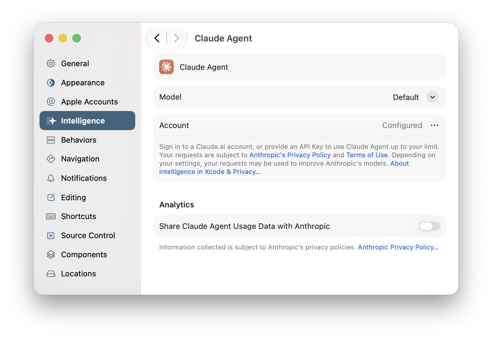
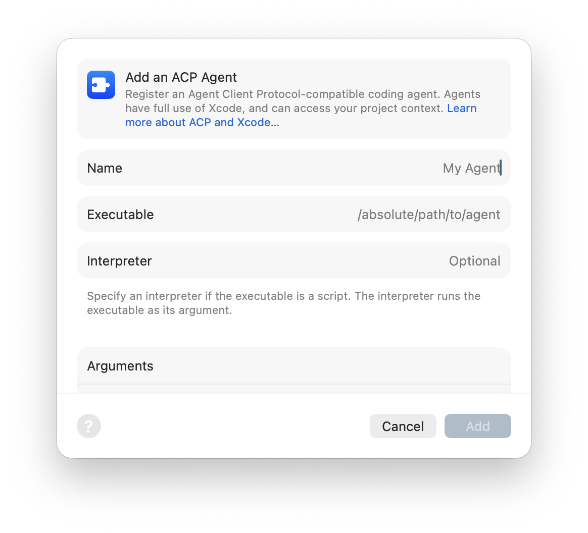

> Navigation: [Technologies](../technologies.md) · [Xcode](../xcode.md) · [Coding intelligence](coding-intelligence.md)

# Setting up coding intelligence

Article

Enable intelligence tools that you want to use in Xcode.

## Overview

To use coding intelligence in Xcode, go to the Intelligence settings and turn on the agent and chat products that you want to use. Choose Xcode \> Settings and select Intelligence in the sidebar. Where available, you can turn on Claude or ChatGPT in Xcode. You can also use coding tools from other providers.

A screenshot of the Intelligence settings showing the About Intelligence in Xcode and Privacy link, and the Agents, Model Context Protocol, and Chat setting sections.

After you enable an agent or chat provider in the Intelligence settings, you can enter prompts in the coding assistant. When you enter prompts, the agent or model that you set up in the Intelligence settings may access your project files and other information when processing your requests. For more information about sharing your project files with agents and models, click “About Intelligence in Xcode & Privacy…” in the Intelligence settings.

Help agents reach your goals faster with additional guidance and tools that you and Xcode provide. You control which commands, tools, and skills agents use to perform tasks on your behalf. For more information, see [Extending and customizing agents](extending-and-customizing-agents.md).

To give agents that you use outside of Xcode access to your project and Xcode capabilities, see [Giving external agents access to Xcode](giving-external-agents-access-to-xcode.md).

## Enable agents

When you choose an agent in the coding assistant, it automatically has access to Xcode capabilities, such as building and testing your app. To enable an agent:

1. In Intelligence settings, click Get next to the agent you want to enable under Agents.
2. In the dialog that appears, click Install.

If you have an account, sign in:

1. In the agent settings, click the More button (…) in the Account row.
2. In the next sheets, and in the browser window if one appears, follow the instructions to sign in and enter your credentials.

For more information about an agent, click the privacy policy and terms of use links that appear at the bottom of the agent settings.

To enable an agent that doesn’t appear in Intelligence settings and supports the Agent Client Protocol (ACP), click Add an Agent under Agents, enter information in the next sheet, and click Add.

After you download agents, Xcode automatically updates the downloads if possible. To manage agent downloads, see [Downloading and installing additional Xcode components](downloading-and-installing-additional-xcode-components.md).

## Enable ChatGPT in Xcode

To use ChatGPT in Xcode (with or without an account):

1. In Intelligence settings, click Turn On in the ChatGPT in Xcode row under Chat.
2. In the dialogs that appear, click Next, and then click Turn On ChatGPT.

To sign in to a free ChatGPT account, or a paid account with higher limits:

1. In ChatGPT in Xcode settings, toggle ChatGPT in Xcode on.
2. In the ChatGPT row, click Sign In, and in the next dialog, click Sign In again.
3. In the browser window that appears, follow the instructions to enter your credentials.

To upgrade your free ChatGPT account to a paid account, click Upgrade to ChatGPT Plus at the bottom of the ChatGPT in Xcode settings.

For some models, you can choose the level of reasoning that the model uses while producing a response. In the transcript pane of the conversation with the model, select the level of reasoning in the Reasoning pop-up menu that appears at the bottom of the message text field.

For more information about OpenAI products, click “OpenAI Terms of Use…” at the bottom of the ChatGPT in Xcode settings.

To turn off ChatGPT in Xcode, toggle ChatGPT in Xcode off in the ChatGPT in Xcode settings.

## Enable Claude Sonnet & Opus

To use Claude Sonnet & Opus:

1. In Intelligence settings, click Claude Sonnet & Opus under Chat.
2. In the Claude row, click Sign In.
3. In the browser window that appears, follow the instructions to enter your credentials.

For more information about Anthropic products, click “Anthropic Terms of Use…” at the bottom of the Claude settings.

## Use another chat provider

To use another chat provider, click the Add a Chat Provider button under Chat. To add a provider that’s hosted on the internet, select Internet Hosted, enter the URL and other details, and click Add in the dialog that appears. To add a provider that’s hosted locally on your Mac, select Locally Hosted and enter a port and optional description instead.

If you add another provider, it needs to support the Chat Completions API. In addition, Xcode expects the provider to support these endpoints that list models and perform completions:

- `{Model provider URL}/v1/models`
- `{Model provider URL}/v1/chat/completions`

## Configure managed devices

To turn off the coding assistant for managed devices, set the `CodingAssistantAllowExternalIntegrations` key to `false` in a mobile device management (MDM) profile. For more information, see [Device management restrictions for Mac computers](https://support.apple.com/guide/deployment/restrictions-for-mac-depba790e53/web).

## See Also

### Essentials

- [Writing code with intelligence in Xcode](writing-code-with-intelligence-in-xcode.md) — Start conversations with an agent or model in Xcode to generate code, navigate unfamiliar codebases, and fix or refactor existing code.
- [Using coding intelligence in the source editor](using-coding-intelligence-in-the-source-editor.md) — Submit prompts in the same place you want to make changes to your code.
