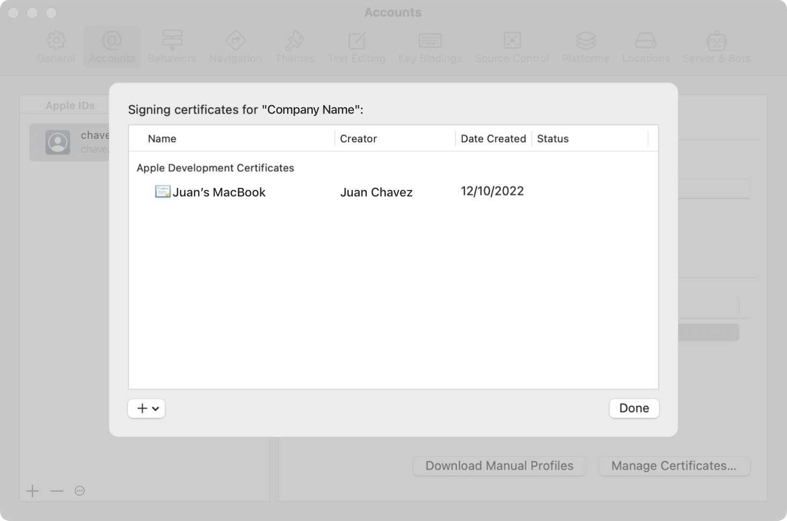
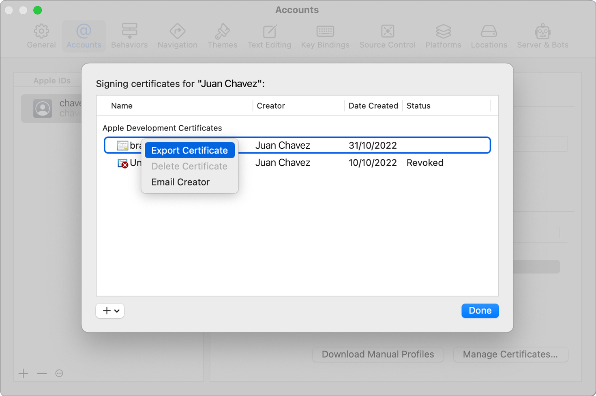
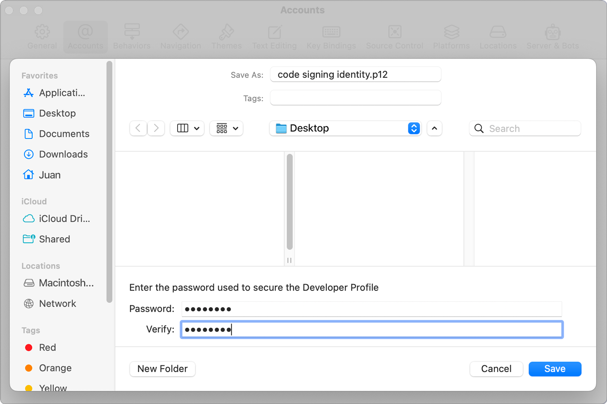

> Navigation: [Technologies](../technologies.md) · [Xcode](../xcode.md) · [Distribution](distribution.md)

# Synchronizing code signing identities with your developer account

Article

Ensure you and other team members can sign your organization’s code and installer packages in Xcode.

## Overview

Signing your app assures people that the app comes from your organization. For many common workflows, Xcode automatically manages certificates and code signing identities. If you need to manage code signing identities yourself — for example, to integrate with an external build system — use Xcode Settings to create code signing identities and distribution signing identities, share them with other team members, and keep your local identities synchronized with your developer account. For creating, managing, and revoking certificates in your developer account, see [Developer Account Help](https://developer.apple.com/help/account/).

## Create a new code signing identity

If you need to generate a code signing identity for a particular purpose — for example to integrate with an external build system — use Xcode to create it by doing the following:

1. Open Xcode.
2. Choose Xcode \> Settings.
3. In the toolbar, click Accounts.
4. Select your Apple Account from the list of accounts.
5. Select the team to create the code signing identity for from the list of your Apple Account teams.
6. Click Manage Certificates.
7. In the lower-left corner of the signing certificates sheet, click the Add button (+) and choose the certificate type from the pop-up menu.
8. Click Done.

## Export your signing identity to share with a team member

Export an identity when another member of your team needs to use the identity and cannot generate one in Xcode. For example, if your team manually manages signing identities, export a distribution signing identity to share with the team member who distributes your team’s apps. Xcode automatically creates and shares cloud-managed certificates among your team, so you don’t need to manually export cloud-managed certificates. For more information about cloud-managed certificates, see [Cloud-managed certificates](https://developer.apple.com/help/account/create-certificates/cloud-managed-certificates).

Anybody who gets access to the exported signing identity and learns (or guesses) the password can distribute signed software that appears to users and the operating system to come from your Apple Developer account. Use a strong password for exported signing identities, verify the identity of people you share the exported identity with, and use different channels to share the exported identity and the password. For example, it is better to email the exported identity and have a FaceTime call with your team member to disclose the password, than to send an email containing the password with the exported identity in an attachment.

For more information on using and protecting code signing identities for the Apple Developer Program, see [Certificates](https://developer.apple.com/support/certificates/).

To export a signing identity as a password-protected PKCS#12 file:

1. Open Xcode.
2. Choose Xcode \> Settings.
3. In the toolbar, click Accounts.
4. Select your Apple Account from the list of accounts.
5. Select the team from the list of your Apple Account teams.
6. Click Manage Certificates.
7. In the signing certificates sheet, Control-click the certificate corresponding to the signing identity that you want to export and choose Export Certificate from the pop-up menu. 

  A screenshot of the certificate management panel in Xcode. A certificate is selected, and “Export Certificate” is chosen in the contextual menu.
8. In the sheet that appears, choose the location to save the PKCS#12 file. 
9. Enter a file name, and a password to protect the identity’s private key.
10. Click Save.

## Recover a missing private key from another team member

If you have a certificate but not the corresponding private key, you can’t use that certificate for code signing or generating other digital signatures. You must have the complete digital identity to sign code and other digital objects.

If you need to obtain the private key from another team member for a certificate stored in the Xcode certificate manager, Control-click on the certificate and choose Email Creator. This opens a new email message to the person who created the digital identity. That person can then follow the steps in the previous section to send you a PKCS#12 file that contains the code signing identity.

After your team member sends you the exported code signing identity, import it into your keychain:

1. Double-click the `.p12` file.
2. Enter the password for the file when prompted by Keychain Access.

Keychain Access imports the code signing identity into your login keychain.

## Delete a revoked certificate

Control-click the certificate that you want to delete in the certificates management panel, and choose “Delete Certificate”. Xcode prompts you for confirmation, and removes the certificate and corresponding private key from your keychain.

You can only delete certificates that you or a team member revoke in your developer account. For more information on revoking certificates, see [Revoke a certificate](https://developer.apple.com/help/account/create-certificates/revoke-a-certificate).

## See Also

### Code signing

- [Creating distribution-signed code for macOS](creating-distribution-signed-code-for-the-mac.md) — Sign Mac code for distribution using either Xcode or command-line tools.
- [Using the latest code signature format](using-the-latest-code-signature-format.md) — Update legacy app code signatures so your app runs on current OS releases.
- [Notarizing macOS software before distribution](../security/notarizing-macos-software-before-distribution.md) — Give users even more confidence in your macOS software by submitting it to Apple for notarization.
- [Signing a daemon with a restricted entitlement](signing-a-daemon-with-a-restricted-entitlement.md) — Wrap a daemon in an app-like structure to use an entitlement thatʼs authorized by a provisioning profile.
- [TN3125: Inside Code Signing: Provisioning Profiles](../technotes/tn3125-inside-code-signing-provisioning-profiles.md) — Learn how provisioning profiles enable third-party code to run on Apple platforms.
