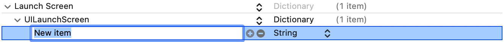
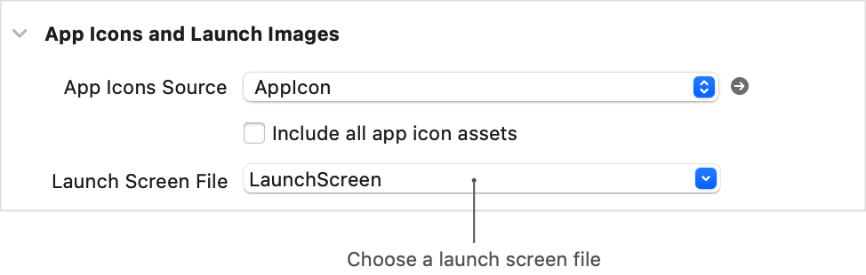

> Navigation: [Technologies](../technologies.md) · [Xcode](../xcode.md) · [Asset management](asset-management.md)

# Specifying your app’s launch screen

Article

Make your iOS app launch experience faster and more responsive by customizing a launch screen.

## Overview

Every iOS app must provide a _launch screen_, a screen that displays while your app launches. The launch screen appears instantly when your app starts up and is quickly replaced with the app’s first screen.

You create a launch screen for your app in your Xcode project in one of two ways:

- Information property list
- User interface file

To make the app launch experience as seamless as possible, create a launch screen with basic views that closely resemble the first screen of your app.
For guidelines about designing a launch screen, see [Launching](https://developer.apple.com/design/human-interface-guidelines/patterns/launching/) in the [Human Interface Guidelines](https://developer.apple.com/design/human-interface-guidelines/guidelines/overview).

### Configure a launch screen in an information property list

For apps with simple user interfaces, using the information property list in your app provides a quick and straightforward method to configure your launch screen.

1. In the settings for your target, select the Info tab.
2. In the Custom iOS Target Properties section, expand the Launch Screen key.
3. Click the Add button (+), type in `UILaunchScreen`, and press Return to add the launch screen key to the property list. If the `UILaunchScreen` key is already present, you can skip this step.
4. Select the `UILaunchScreen` key, click the Add button, and add additional keys to specify configuration options for your launch screen.

Screenshot of the information property list section named Launch Screen. The UILaunchScreen key is nested under Launch Screen. A new row is nested under UILaunchScreen to indicate where to add additional keys.

Define the appearance of the launch screen by specifying a combination of launch screen options from the possible keys in [UILaunchScreen](../bundleresources/information-property-list/uilaunchscreen.md).

### Configure a launch screen storyboard

Alternatively, you can configure your launch screen in a user interface file, a file with a `.storyboard` file extension. A launch screen storyboard contains basic UIKit views, and uses size classes and Auto Layout constraints to support different device sizes and resolutions.

Follow these guidelines when creating a launch screen storyboard:

- Use only UIKit classes.
- Use a single root view that’s a [UIView](../uikit/uiview.md) or [UIViewController](../uikit/uiviewcontroller.md) object.
- Don’t make any connections to your code, for example, don’t add actions or outlets.
- Don’t use deprecated views such as `UIWebView`.
- Don’t use any custom classes.
- Don’t use runtime attributes.

If you create your iOS app from a storyboard template, Xcode adds a default launch screen file, called `LaunchScreen.storyboard`, to your project. Edit `LaunchScreen.storyboard` to configure your launch screen.

If your project doesn’t contain a default launch screen file, add a launch screen file and set the launch screen file for the target in the project editor.

1. Choose File \> New \> File from Template.
2. Under User Interface, select Launch Screen, and click Next.
3. Give the launch screen file a name, choose a location, select the target that you want to add the file to, and click Create.
4. In the settings for your target, select the General tab and find the “App Icons and Launch Screen” section.
5. From the Launch Screen File pop-up menu, choose the new launch screen file.

Screenshot of target settings with the General tab selected. The App Icons and Launch Screen section shows a field with the name Launch Screen File that lists the name of the launch screen storyboard file to use.

## See Also

### App icons and launch screen

- [Creating your app icon using Icon Composer](creating-your-app-icon-using-icon-composer.md) — Use Icon Composer to stylize your app icon for different platforms and appearances.
- [Configuring your app to use alternate app icons](configuring-your-app-to-use-alternate-app-icons.md) — Add alternate app icons to your app, and let people choose which icon to display.
- [Configuring your app icon using an asset catalog](configuring-your-app-icon.md) — Add app icon variations to an asset catalog that represents your app in places such as the App Store, the Home Screen, Settings, and search results.
