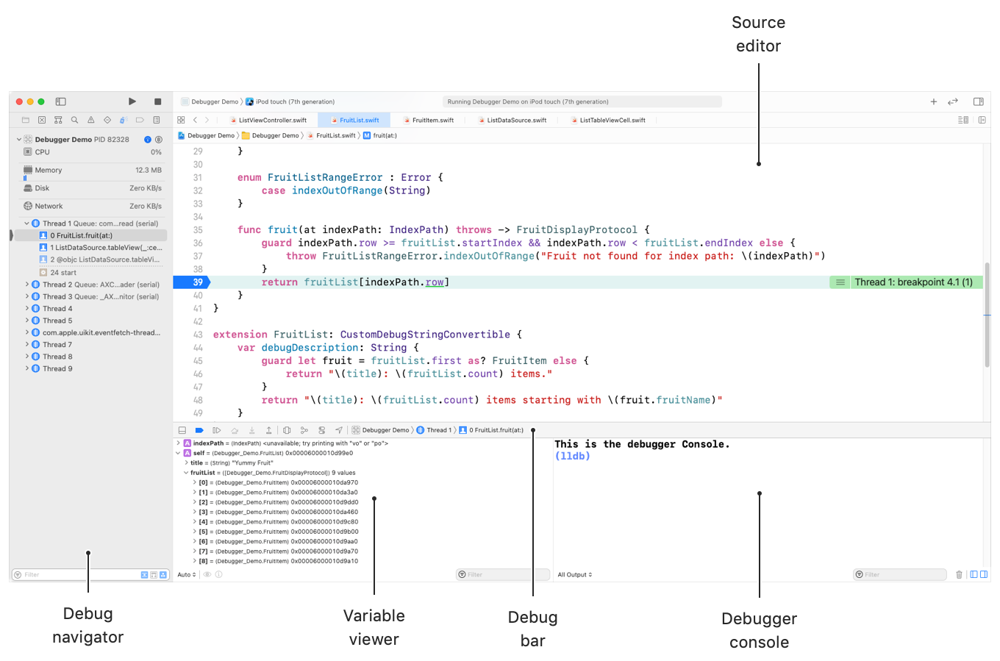
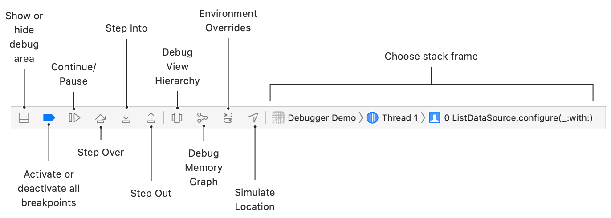
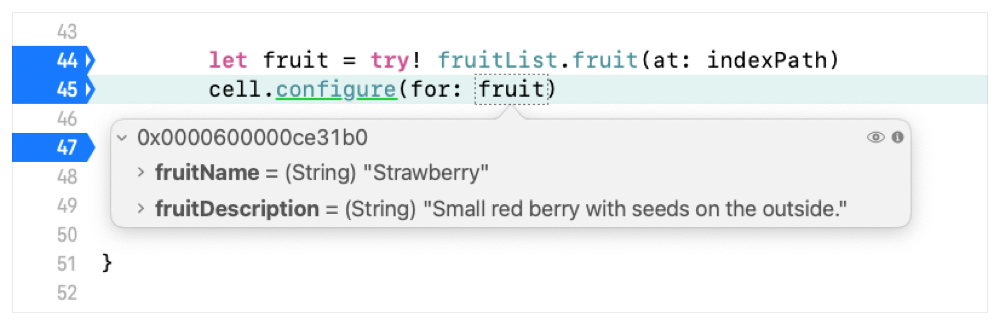
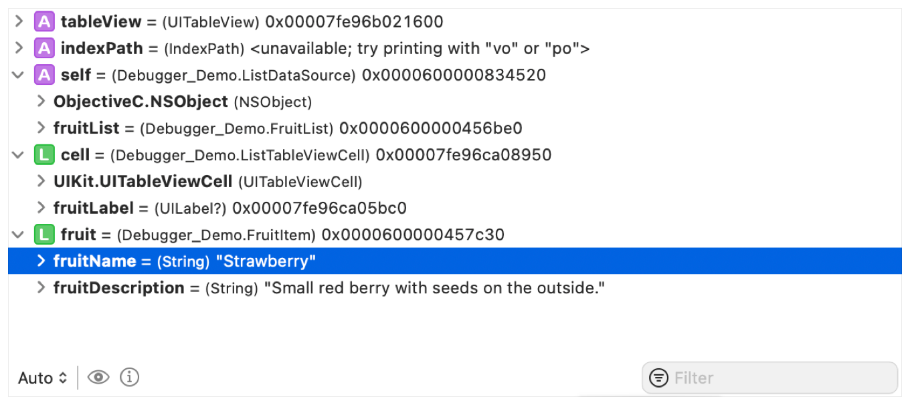
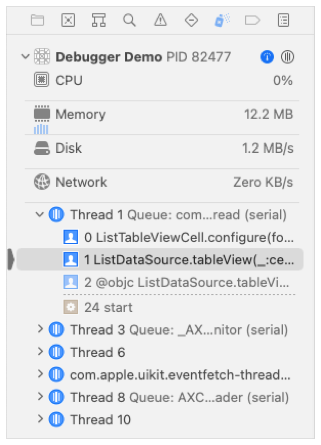

> Navigation: [Technologies](../technologies.md) · [Xcode](../xcode.md) · [Debugging](debugging.md)

# Stepping through code and inspecting variables to isolate bugs

<sub>Article</sub>

Find the cause of your bugs by watching variables change as you step through your source code in the debugger.

## Overview

If the root cause of a bug isn’t immediately obvious when inspecting your source code, watching your variables change as you step through the code helps you isolate where the bug is occurring so you can investigate the possible cause for it.

The Xcode debugger provides several methods to step through your code and inspect variables. You can precisely control execution of your code from a breakpoint, stepping into and out of called functions as necessary to determine where your bug occurs. You can monitor variables while stepping through code, or pause execution to inspect them more closely.

Start your investigation at a breakpoint when your app is in a known good state before the bug occurs, at a point where you think the bug may be about to happen.

### Step through code in the debugger

When you run your app, the debugger pauses at the first breakpoint it encounters, and, by default, updates the display to show the Debug navigator, the source editor, the debug bar, the variable viewer, and the console.



<sub>Xcode paused on a breakpoint in an app, showing the debug navigator, source code editor with breakpoint highlighted, variable viewer, and debugger console.</sub>

Customize what Xcode displays when running your app in the debugger by choosing Xcode \> Settings \> Behaviors and selecting options under Running.

Use the buttons in the debug bar to control the execution of your app.



<sub>Xcode debugger toolbar, showing the show or hide debug area button, activate or deactivate all breakpoints button, continue button, step into button, step out button, debug view hierarchy button, debug memory graph button, environment overrides button, simulate location button, and choose stack frame area.</sub>

- Continue normal execution from the paused position until the app stops at the next breakpoint with the Continue button.
- Pause the app without setting a breakpoint using the Pause button. The Continue button changes to the Pause button when the app is running.
- Execute the next instruction in the same function with the Step Over button.
- Execute the next instruction using the Step Into button. If the next instruction is inside another method or function, the debugger jumps to that function and continues executing it each time you click the Step Into button.
- Click the Step Out button to skip the rest of the function and return to the next instruction in the calling function or method after using Step Into.

As you step through your app, inspect variables relevant to your bug and watch for unexpected values.

### See variable values in code and the variable viewer

When your app pauses at a breakpoint, hover over a variable in your source code to view its current value. If the variable is an image or other type that isn’t expressible as text, click the Quick Look button at the upper-right to see a preview of the variable. Click the Print Description button to print a description of the object in the console.



<sub>Xcode displaying the debugger paused on a line of code, showing hover window with variable details for the fruit variable.</sub>

The variable viewer lists the variables available in the current execution context. Select the scope of variables to view from the selector at the bottom left of the viewer: automatic, local, or all variables, registers, globals, and statics. Use the filter field to find variables matching a pattern.



Each variable shows a brief summary of the variable’s type, value, and pointer location, if applicable. The variable viewer generates the summary it shows with the lldb command `frame variable`. If the summary for a variable isn’t available or only shows a memory pointer, see the [Evaluate expressions in the console](stepping-through-code-and-inspecting-variables-to-isolate-bugs.md#Evaluate-expressions-in-the-console) section below for more ways to inspect the variable.

Click the disclosure triangles to explore instance variables for classes and structures, or internals for other data types. Select a variable and click the Quick Look button to see a preview of the variable, click the Print Description button to print a description of the object in the console.

### See the call stack and navigate related code

When the debugger pauses at a breakpoint, it shows the current active threads and the current call stack in the Debug navigator, and highlights the breakpoint. The call stack represents the relationships of function or method calls that result in the current breakpoint.



Select a line in the call stack if you suspect that your bug is in a calling function. The calling function might change an instance variable incorrectly, or may be passing an incorrect value in a parameter. The debugger shows the source code for that point and the related variables in the variable viewer, if the source code is available in the project. Otherwise, the debugger shows the assembly code for the selected line. Inspect the variables at this point for unexpected values.

Select a thread to expand or collapse the view of the call stack for that thread. Select a line in the call stack for the thread to see the source and variables.

### Evaluate expressions in the console

To see more information than the summary of a variable shows in the variables viewer, or to change the value of a variable in the middle of a debugging session, use the console to interact with the debugger directly.

Print the value of a variable in the current stack frame using `frame variable`, or the shortened alias `v`.

```other
(lldb) v self.fruitList.title
(String) self.fruitList.title = "Healthy Fruit”
(lldb) v self.listData[0]
(String) [0] = “Banana"
```

The frame variable command returns only what is currently in memory and doesn’t evaluate expressions, so it returns an error if you attempt to print something more. For example, it won’t print a function or method call, an `@Published` variable, or a calculated variable.

```other
(lldb) v fruitList.fruit(at: indexPath)
error: no variable named 'fruitList' found in this frame
error: no variable named 'indexPath)' found in this frame
(lldb) v self.fruitList.calculatedFruitCount
error: "calculatedFruitCount" is not a member of "(Debugger_Demo.FruitList) self.fruitList”
```

Evaluate an expression and print the result in the console with the `expression` command, or the aliases `expr` or `p.`

```other
(lldb) p self.fruitList.calculatedFruitCount
(Int) $R18 = 9
(lldb) p fruitList.fruit(at: indexPath)
(Debugger_Demo.FruitItem) $R20 = 0x00006000013dcc90 (fruitName = "Strawberry", fruitDescription = "Small red berry with seeds on the outside.”)
(lldb) expr fruit.fruitName
(String) $R14 = "Strawberry"
(lldb) p fruit.fruitName == "Peach"
(Bool) $R16 = false
```

The `p` command compiles code to evaluate the expression, so it handles function calls and calculated variables. Use the references that `p` provides as parts of other expressions.

```other
(lldb) p fruit.fruitName
(String) $R2 = "Banana"
(lldb) p fruit.fruitName
(String) $R6 = "Strawberry"
(lldb) p $R2 + ", " + $R6
(String) $R8 = "Banana, Strawberry"
```

For some classes, using `p` may display only a memory pointer location, or may show a fully expanded view of all the attributes of the class, which can be a lot of unnecessary information. In those cases, use `po`, an alias for `expression —object-description`. This version also compiles code to evaluate the expression, but it prints an object description for the result, which you can customize for your objects.

```other
(lldb) po cell
<Debugger_Demo.ListTableViewCell: 0x7fca3450e520; baseClass = UITableViewCell; frame = (0 28; 414 43.5); clipsToBounds = YES; layer = <CALayer: 0x600001d3ed40>>
(lldb) po fruitList
Yummy Fruit: 9 items starting with Banana
```

> [!tip] Tip
> Customize what the debugger shows for your objects by adding a debug description. In Swift, implement the `CustomDebugStringProtocol` for your object. For Objective-C objects that extend `NSObject`, override `debugDescription`.

Change the value of a variable in memory while you are debugging with either `p` or `po.`

```other
(lldb) po fruitList.title = "Tasty Fruit"
0 elements

(lldb) po fruitList
Tasty Fruit: 9 items starting with Banana
```

When you print an item that you declare using a protocol, `p` and `po` print an error because they don’t perform iterative dynamic type resolution. Use `v` to print variables when `p` or `po` print an error.

```other
(lldb) po fruitItem.fruitName
error: <EXPR>:3:11: error: value of type 'FruitDisplayProtocol' has no member 'fruitName'
fruitItem.fruitName
~~~~~~~~~ ^~~~~~~~~

(lldb) v fruitItem.fruitName
(String) fruitItem.fruitName = "Apple"
```

## See Also

### Breakpoints and variables

- [Setting breakpoints to pause your running app](setting-breakpoints-to-pause-your-running-app.md) — Specify where your app pauses when running the debugger to investigate bugs.
