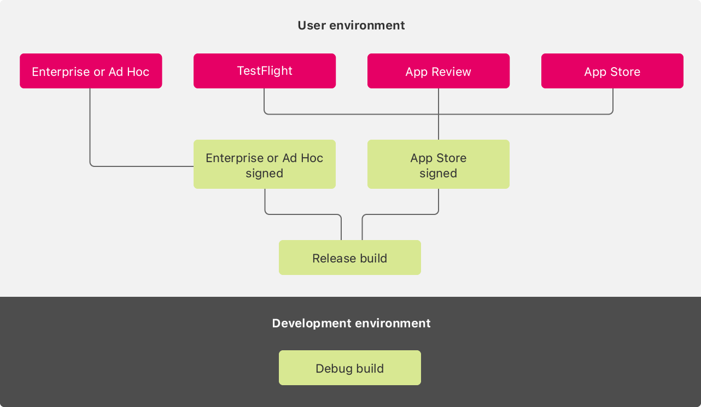
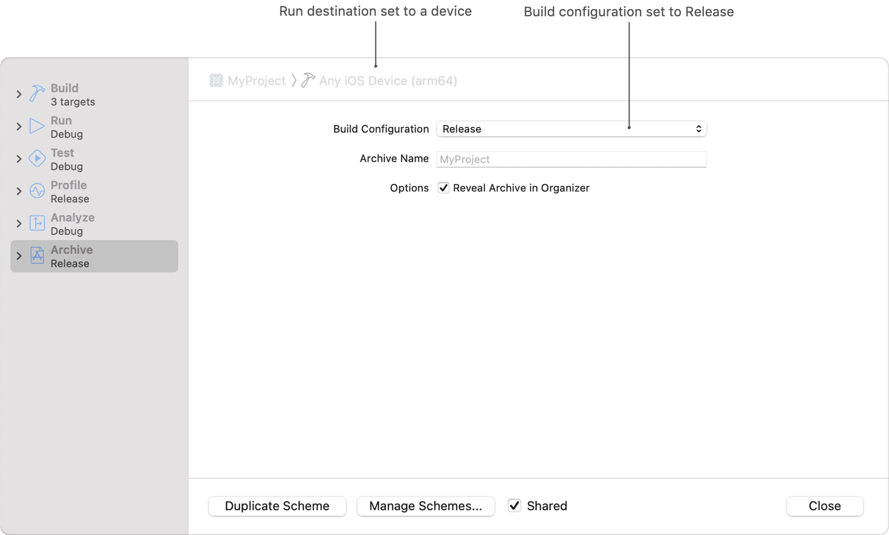
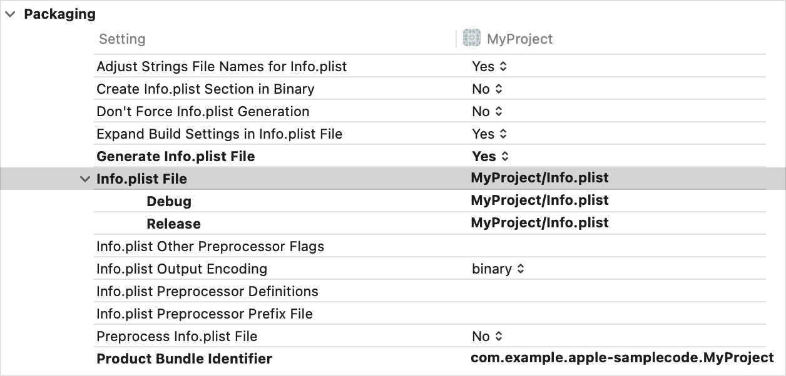
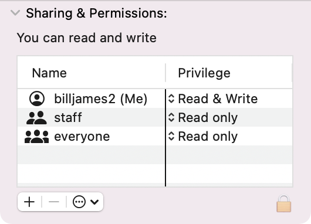
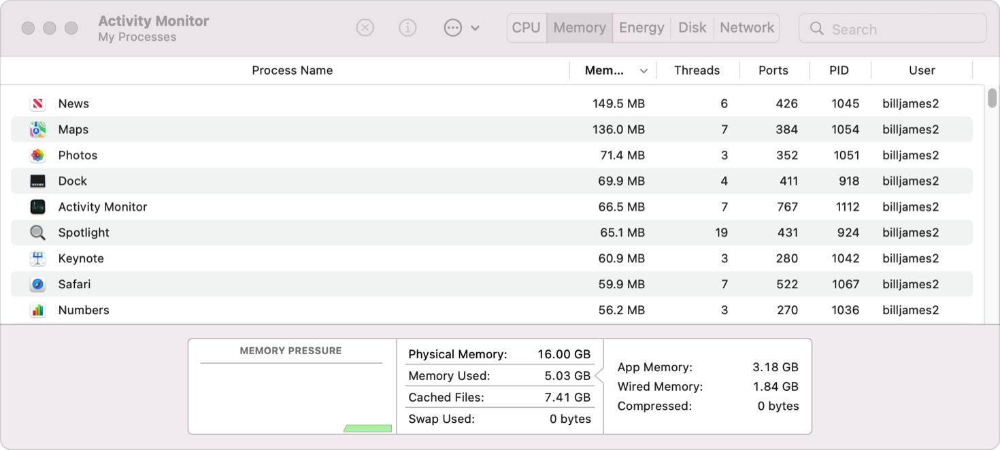

> Navigation: [Technologies](../technologies.md) · [Xcode](../xcode.md) · [Distribution](distribution.md)

# Testing a release build

<sub>Article</sub>

Run your app in simulated user environments to discover and identify deployment errors.

## Overview

To ensure your app works in deployment, test your release build in a variety of conditions before submitting the app or app update for review, or distributing to Enterprise users. To catch commonly occurring errors or edge-case situations that might not occur during development, consider the differences between development-environment debug builds and user-environment release builds, shown below.



<sub>Diagram that compares the two environments apps run in: development versus user. At bottom, a box titled Development environment contains a node labeled Debug build. At top, a box titled User environment contains a flow chart that begins with a node titled Release build. Two nodes flow from the root node: the left node is titled Enterprise or Ad Hoc signed, and the right node is App Store signed. One node flows from the left node, titled Enterprise or Ad Hoc. Three nodes flow from the right node; the left node reads, TestFlight. The middle node reads, App Review. The right node reads, App Store.</sub>

An app may behave differently on a particular user’s device for a variety of reasons. Different devices and operating system versions offer varying software features, and app updates involve data migrations, keychain access, or defaults data that’s not present in a fresh app installation. Disabled features, frame throttling, or other delays may result with limited device power, system memory, or network availability. Xcode allows development and release build settings to diverge, and disables watchdog timeouts.

### Create an Xcode archive

To test the exact conditions your app user’s experience, create a release build. In your Xcode project’s scheme editor, set the run destination to a device and adjust the archive task to the Release configuration.



<sub>Screenshot of the Xcode project’s scheme editor. At left, the navigation list reflects the Archive task selected. At right, the detail pane shows the run destination set to the generic “Any iOS Device” setting. The build configuration selection menu reflects the chosen Release option. </sub>

Then, choose the Archive option in Xcode’s Product menu. After the archive builds, the Organizer displays. For more on creating an app archive, see [Distributing your app for beta testing and releases](distributing-your-app-for-beta-testing-and-releases.md).

Xcode saves app archives on disk so you can refer to a particular build later, for example, to submit the build to App Review after the app passes beta tests. The archives’ distribution workflow offers several ways to test the app:

- **TestFlight** — TestFlight automates app distribution and submission to reduce the chances of submitting the wrong build to App Review. To distribute an app archive through TestFlight, choose the archive pane’s App Store Connect option. For more on TestFlight, see [Distributing your app for beta testing and releases](distributing-your-app-for-beta-testing-and-releases.md).
- **Ad Hoc** — To distribute your app to testers manually, for example, by emailing them an .ipa file, choose the archive pane’s Ad Hoc option. For more information, see [Distributing your app to registered devices](distributing-your-app-to-registered-devices.md).
- **Enterprise** — Enterprise distribution is similar to Ad Hoc distribution except that you choose the Enterprise option from the Archive pane. Xcode looks for a different code signing identity for Enterprise app distribution that contains a valid Enterprise distribution certificate.
- **Development** — The development distribution method signs the release build with your development credentials. This option enables testing if you lack access to team distribution identities. The debugger can attach to a development-signed release build, but be aware that it can mask watchdog timeouts.

For all distribution methods except TestFlight, choose the following options to enhance your chances of discovering a bug that manifests only in the release build:

- Set App Thinning to “All compatible device variants”.

You can access an app archive after distribution to debug a user-reported error. If the issue didn’t surface in beta tests, refer to crash logs and app logging to track down the cause; see [Diagnosing issues using crash reports and device logs](diagnosing-issues-using-crash-reports-and-device-logs.md). To attempt to reproduce the issue, check the build version in the crash log (see the Version field in [Examining the fields in a crash report](examining-the-fields-in-a-crash-report.md)), and test a release build from an app archive with a matching version.

### Compare build configuration settings

The Xcode project’s Build Settings support different values based on the active build configuration. The default build configurations are Debug and Release, which the project scheme maps to the Run task and Archive task, respectively. Since the archive task creates the release build, the release build can behave differently than the build that developers run in the debugger as it relates to build settings.

By default, most build settings match across the two configurations. To check for differences, inspect the target’s build settings thoroughly. When a setting varies across configurations, Xcode displays `<Multiple values>`. To see each value, expand the setting’s disclosure triangle.



<sub>Screenshot of an Xcode project’s build settings. The Packaging section is expanded to show a selected setting titled Info.plist File. The Info.plist File build setting is expanded to show two child settings. The upper child setting is titled Debug, with a value of “MyApp/Info.plist”. The lower child setting is titled Release, with a value of “MyApp/Info-Release.plist”.</sub>

To ensure the app’s behavior differs across build configurations as intended, take a moment to consider the full implications of each difference, per setting. In the figure above, the app defines a different `Info.plist` for the release build.

### Disconnect the debugger

When Xcode launches an app, it enables a debugger that creates some differences from what users experience:

- The Xcode debugger disables watchdog terminations, which can prevent testers from observing a hang issue while running the app in Xcode. The easiest way to check for watchdog terminations is to disconnect the device from the development machine and launch the app from the home screen. For more on watchdog terminations, see [Addressing watchdog terminations](addressing-watchdog-terminations.md).
- Xcode’s debugger prevents apps from being suspended, so launch your app from the home screen to test background processes. For example, NSURLSession implements a background session, but when the app runs in the Xcode debugger, the background session never runs.

### Test a fresh install and app update

Xcode optimizes app building and installation during development by updating apps incrementally. Subsequently, as your app’s code changes during development, obsolete stored data created by a prior build may linger unless you purge the prior installation completely. Even though the app may no longer create the obsolete data, access to it may cause the app to behave differently during testing than what users experience. To prevent this transient dependency, remove the app during development to ensure that Xcode installs a fresh build. When you remove the app, choose to also remove the app’s prior data.

There are two exceptions:

- The system preserves App Group data on the device as long as the app in the group is installed. To remove potentially obsolete test data from an App Group container, remove all apps that share the group.
- The system preserves an app’s keychain data on the device even after you delete the app. To clear the keychain, use [SecItemDelete(_:)](<../security/secitemdelete(__).md>). If you create a separate utility that removes keychain data, the utility and the app need to share the same application identifier.

If the release build updates a previous version of your app, some users may have the prior version on their device. When your app update aims to support data created by the prior version, test the app update to prevent any regressions. For example, if the updated app changes a file format, or migrates prior data (for example, with Core Data migration; see [Migrating your data model automatically](../coredata/migrating-your-data-model-automatically.md)), test the app-update scenario to ensure that the new app properly handles prior app data.

### Run the app on various devices and OS versions

An error may surface only on a particular device, OS version, or a particular combination of the two. To ensure a consistent user experience, test on a wide array of devices and OS versions your app supports.

When diagnosing user-reported issues, pay attention to the user’s device and OS version. See `Hardware Model` and `OS Version` in [Examining the fields in a crash report](examining-the-fields-in-a-crash-report.md). To reproduce a user-reported issue, maintain a robust suite of test devices that vary in device model and OS version. Although it’s possible to run a release build in the Simulator, consider the Simulator a separate device that users don’t use. As such, always test release builds on an actual device.

> [!tip] Tip
> Raising your app’s deployment target reduces the number of combinations of device model and OS version to test. If testing all combinations is unmanageable, you can shrink the number of devices your app supports — and thus, the number of devices to test — by raising the deployment target.

### Check file system access

On macOS, users can have different levels of file system access depending on their user account privilege. One way to test the difference that a user’s account privilege makes in your app is to run the app as a guest user. The file system privileges of a guest user falls under the `everyone` category in Finder’s Get Info pane. By default, the file system access level for `everyone` differs from the default admin access level.



<sub>Screenshot of a file’s Get Info pane. The Sharing & Permission section is expanded to reveal a table with two columns: Name and Privilege. The table contains three rows of data. The top row reflects the name “johnas (Me)”, with a privilege of “Read & Write”. The middle row reflects the name “staff”, with a privilege of “Read only”. The bottom row reflects the name “everyone”, with a privilege of “Read only”.</sub>

### Ensure network compatibility

Debug builds typically run in an isolated network during development, whereas release builds access varying networks that service your app’s users. Your app can exhibit a problem in one particular network and not another, for example, due to network congestion or network type, such as IPv6 versus IPv4.

- If developers and beta testers run the app in an IPv4 network, be sure to also test an IPv6 connection to catch any potential issues related to DNS64 or NAT64.
- To simulate slow or unreliable internet connections on iOS, you can use the Network Link Conditioner. Enable this feature with the Settings app \> Developer \> Network Link Conditioner option.
- To debug high-level HTTP issues, run your release build with an HTTP debugging proxy; see [Choosing a Network Debugging Tool](../network/choosing-a-network-debugging-tool.md). For low-level issues, like a TCP connection or DNS failure, examine network-level activity for causes; see [Recording a Packet Trace](../network/recording-a-packet-trace.md).
- To debug lost network connections, ensure that network connections reach their destination with no breakdowns along the way by reviewing your server-side logs. For private networks, consider potential blockages due to firewall configuration, network proxies, or load balancers.

Some network errors are unavoidable, for example, during server or network downtime. Ensure that your app provides clear user instructions on what to do when the network doesn’t function as expected.

### Enable battery-saving modes

Devices can behave differently based on battery level, the amount of time passed since fully charged, or whether the device battery is charging. For example, Core Location enables an app to request a desired accuracy ([desiredAccuracy](../corelocation/cllocationmanager/desiredaccuracy.md)) but it may perform less accurately than your app requests depending on the device battery level. Alternatively, if a concurrent app or system process requests a high accuracy, Core Location might provide a higher accuracy than requested, which may consume the device battery faster. To observe an app error that might result from a lower battery level, or lower Core Location accuracy than your app expects, test under either battery-saving modes:

- On macOS, run the app on a Macbook unplugged from the power source.
- On iOS or iPadOS, enable Low Power Mode in Settings \> Battery.

To ensure the device is in Low Power Mode, check that the battery indicator is yellow.

### Minimize memory use

A user’s device may have less memory available at runtime than testers do either because of varying hardware specifications or the amount of apps the device runs concurrently. To simulate an array of user environments, testers need to vary the amount of memory available to your app. One way to limit available memory is to open other apps. On macOS, you can observe memory statistics using Activity Monitor. The difference between the Physical Memory and Memory Used values equals the system’s available memory.



<sub>Screenshot of the Activity Monitor app. At center, a list displays the running processes and their memory usage. At bottom, a statistics pane aggregates metrics, such as Physical Memory and Memory Used, in gigabytes. </sub> Apps that crash due to memory depletion generate a different kind of crash report, called a jetsam event report. To check for and analyze jetsam events, see [Identifying high-memory use with jetsam event reports](identifying-high-memory-use-with-jetsam-event-reports.md).

The volatile nature of memory availability makes it difficult to judge the likelihood of a jetsam event in your app. A good strategy to guard against runtime memory depletion is to proactively minimize your app’s memory requirements using Instruments or MetricKit. For more information, see [Reducing your app’s memory use](reducing-your-app-s-memory-use.md).

### Support user-defined input

Because of the wide the range of variation in user-supplied data, apps that support opening users’ files need to anticipate uncommon scenarios, like corrupt or excessively large data. To ensure a good user experience, test bad and unsupported files.

For example, if your app loads user-defined images, test loading a very large image. Today’s common image formats compress pixel data, but most systems can only display uncompressed data. Loading an image from file can require orders more space in RAM than the file’s size on disk. You can calculate the number of bytes an image requires in RAM using the formula: _W x H x 4_ bytes/pixel. A JPG with 4K resolution (3840 x 2160 pixels) is around 1.5 megabytes on disk. To calculate the size in memory, multiply the image dimensions to obtain the number of pixels, and multiply by 4 bytes per pixel.

_3840 x 2160 * 4 B = 33,177,600 B_

Divide by 1024^2 to convert to megabytes.

_33,177,600 B / 1024^2 B/MB = 31.64 MB_

To calculate the percentage larger the image is in memory, divide the in-memory size (31.64 MB) by the on-disk size (1.5 MB).

_31.64 MB / 1.5 MB = 21.1 times larger in memory_

To guard against files of unsupported file size, enforce a size limit by refusing to open files past a certain resolution you define.

As another example, if your app loads user Contacts, test extreme cases to maximize test coverage. For example, your app needs to test a large number of contacts, no contacts, and a contact that contains very little data (or no) data.

### Test languages and regions

Test your app in every language and region that your app supports. To view your app’s localizations, see [Adding support for languages and regions](https://developer.apple.com/documentation/xcode/adding-support-for-languages-and-regions).

If your app processes dates or times, ensure your app handles all of the possible date formats in every language and region that it supports. The Region user preference setting determines the format of the dates that the OS provides to your app. When a user changes their Region, the system changes the format of every [NSDate](../foundation/nsdate.md) it supplies your app.

Test with a 12-hour region, a 24-hour region, a 12-hour region that’s overridden to use 24-hour, and a 24-hour region that’s overridden to use 12 hours. Also, test with a Gregorian and non-Gregorian calendar (such as lunar or lunisolar), as well as regions that use Latin and non-Latin digits (such as Arabic). To set the region or calendar on a device:

- On iOS, use Settings \> General \> Language & Region.
- On macOS, use System Settings \> General \> Language & Region.

To learn more about testing languages and regions, see [Testing localizations when running your app](https://developer.apple.com/documentation/xcode/testing-localizations-when-running-your-app).

### Isolate persistent issues

For issues that continue to surface in only the release build, open an Apple Developer Technical Support (DTS) case by submitting a [Technical Support Incident](https://developer.apple.com/support/technical/). To facilitate review of the issue, provide DTS with:

- Details about the problem and the steps you followed to reproduce or resolve the error
- For crashes, a log that contains human-readable function references; see [Acquiring crash reports and diagnostic logs](acquiring-crash-reports-and-diagnostic-logs.md)
- The build UUID of the app archive you’re testing

To retrieve the archived app’s build UUID, run the Terminal command:

```bash
% dwarfdump -u /Path/To/YourApp.xcarchive/Products/Applications/YourApp.app/YourApp
```

## See Also

### Testing

- [Testing a beta OS](testing-a-beta-os.md) — Manage unintended differences in your app by testing beta operating-system (OS) releases.
